# Industry 4.0 의 중심, BigData

<div align='right'><font size=2 color='gray'>Data Processing Based Python @ <font color='blue'><a href='https://www.facebook.com/jskim.kr'>FB / jskim.kr</a></font>, [김진수](bigpycraft@gmail.com)</font></div>
<hr>

# MatplotLib : Visualizing Data

> 데이터 시각화의 목적
- 데이터 탐색(exploration)
- 데이터 전달(communication)

### <font color='brown'> matplotlib 불러오기 </font>
> 
- %matplotlib notebook
- %matplotlib inline

### <font color='brown'>%matplotlib notebook 모드로 그래프 작성</font>


```python
import matplotlib.pyplot as plt

%matplotlib notebook
```


```python
data_list = [ 0, 1, 2, 3, 4, 5, 6, 7, 8, 9,
             10, 9, 8, 7, 6, 5, 4, 3, 2, 1, 0]
```


```python
plt.figure
plt.plot(data_list)
plt.show()
```


    <IPython.core.display.Javascript object>


<img src="data:image/png;base64,iVBORw0KGgoAAAANSUhEUgAAAoAAAAHgCAYAAAA10dzkAAAgAElEQVR4XuzdB3RUdfr/8U86LQm9F+m9dwJBV6miFFGwiwVpAnFXXdf1p7vrrq67a+giqNgVBRSVbiMQQHqX3lvoSSCk53/ugPtHljKZ78xkZu57ztlz9hzvc+/3vu4z8eM8c+cGiRcCCCCAAAIIIICArQSCbHW2nCwCCCCAAAIIIICACIA0AQIIIIAAAgggYDMBAqDNLjiniwACCCCAAAIIEADpAQQQQAABBBBAwGYCBECbXXBOFwEEEEAAAQQQIADSAwgggAACCCCAgM0ECIA2u+CcLgIIIIAAAgggQACkBxBAAAEEEEAAAZsJEABtdsE5XQQQQAABBBBAgABIDyCAAAIIIIAAAjYTIADa7IJzuggggAACCCCAAAGQHkAAAQQQQAABBGwmQAC02QXndBFAAAEEEEAAAQIgPYAAAggggAACCNhMgABoswvO6SKAAAIIIIAAAgRAegABBBBAAAEEELCZAAHQZhec00UAAQQQQAABBAiA9AACCCCAAAIIIGAzAQKgzS44p4sAAggggAACCBAA6QEEEEAAAQQQQMBmAgRAm11wThcBBBBAAAEEECAA0gMIIIAAAggggIDNBAiANrvgnC4CCCCAAAIIIEAApAcQQAABBBBAAAGbCRAAbXbBOV0EEEAAAQQQQIAASA8ggAACCCCAAAI2EyAA2uyCc7oIIIAAAggggAABkB5AAAEEEEAAAQRsJkAAtNkF53QRQAABBBBAAAECID2AAAIIIIAAAgjYTIAAaLMLzukigAACCCCAAAIEQHoAAQQQQAABBBCwmQAB0GYXnNNFAAEEEEAAAQQIgPQAAggggAACCCBgMwECoM0uOKeLAAIIIIAAAggQAOkBBBBAAAEEEEDAZgIEQJtdcE4XAQQQQAABBBAgANIDCCCAAAIIIICAzQQIgDa74JwuAggggAACCCBAAKQHEEAAAQQQQAABmwkQAG12wTldBBBAAAEEEECAAEgPIIAAAggggAACNhMgANrsgnO6CCCAAAIIIIAAAZAeQAABBBBAAAEEbCZAALTZBed0EUAAAQQQQAABAiA9gAACCCCAAAII2EyAAGizC87pIoAAAggggAACBEB6AAEEEEAAAQQQsJkAAdBmF5zTRQABBBBAAAEECID0AAIIIIAAAgggYDMBAqDNLjiniwACCCCAAAIIEADpAQQQQAABBBBAwGYCBECbXXBOFwEEEEAAAQQQIADSAwgggAACCCCAgM0ECIA2u+CcLgIIIIAAAgggQACkBxBAAAEEEEAAAZsJEADNLrjlV1FSqtluqEYAAQQQQAABLwtESjoiKc/Lx/WJwxEAzS5DJUmHzHZBNQIIIIAAAggUkEBlSYcL6NgFelgCoBl/lKTkgwcPKirK+r+8EEAAAQQQQMDXBVJSUlSlShVrmdGSUnx9vZ5YHwHQTNURAJOTkwmAZo5UI4AAAggg4DUBKwBGR1vZjwDoNfQAOxABMMAuKKeDAAIIIBD4AgRAiU8AzfqcAGjmRzUCCCCAAAJeFyAAEgBNm44AaCpIPQIIIIAAAl4WIAASAE1bjgBoKkg9AggggAACXhYgABIATVuOAGgqSD0CCCCAAAJeFiAAEgBNW44AaCpIPQIIIIAAAl4WIAASAE1bjgBoKkg9AggggAACXhYgABIATVuOAGgqSD0CCCCAAAJeFiAAEgBNW44AaCpIPQIIIIAAAl4WIAAGdgCMlfSMpJaSKkjqK+mry3rM+g3ElyQNllRC0s+Shkvako8+JADmA4tNEUAAAQQQ8AUBAmBgB8AekmIkrZU08yoB8DlJL0h6RNIOSX+WZIXGupJSnWxQAqCTUGyGAAIIIICArwgQAAM7AF7eZ3lXBEDr078jksZI+uelDSMkJUmyguFbTjYpAdBJKDZDAAEEEEDAVwQIgPYNgDUk7ZbUQtK6yxpytqSzkh6+RpNaIdH636+vSEmHkpOTFRVlZUFeCCAQKAIfrtjvOJUH21ULlFPiPBBA4JIAAdC+AbCDpERJlS59Evjrm2KKJOuvfbdrvEtevvS9wd/8YwIgf1MQCCyBeZuOaujH1rdHpMkPtFD3RtbXiHkhgECgCBAACYAVJR29rKGnSqoiqfs1mpxPAAPl3c95IHANgVPnMtQ1PkGnzmc6tihVNFwL42JVqtjlH/7DhwAC/ixAALRvAHR1BHxlv/MdQH/+C8DaEbiKwPCP12rOpqOqVz5SeXnS9qRU3d6kgibeZ31jhBcCCASCAAHQvgHw15tA4iW9fqmZwyUd5yaQQHhrcw4IuCbw7cYjGvHJOoUGB+mr4daPCEi9JyYqJzdPE+5rrl5NrKEBLwQQ8HcBAmBgB8BikmpdalLrRo+nJf0o6bSkA5eC3vOSBknaKelPkm7mZ2D8/W3N+hFwTeBEqjX6XawzaVkaeWttPd2ljmNHbyzcrnE/7FLJS6Pg0oyCXQOmCgEfEiAABnYAtMKcFfiufL1/6bf/fv0h6Cev+CHozfnoUUbA+cBiUwR8VSAvL09DPlqjBVuSVL9ClGYPj1F4aLBjuZnZubpzwlJtO5aqHo3Ka9L9LRQUZP354IUAAv4qQAAM7ADojb4kAHpDmWMg4GGB2esPa9Rn6x2j369HdFSDir/9WactR5LVe0KisnPzNO7e5rqzKaNgD18Sdo+ARwUIgARA0wYjAJoKUo9AAQscT0lXl/gEJV/Icox9rfHv1V5jv9up+O92qHiRMMddwWUjCxXwyjk8Agi4KkAAJAC62ju/1hEATQWpR6AABazR7xMfrNZ3vxxXo0pR+nJYjMJCLo5+r3xl5eSqz8REbTmSoi4NymnKgy0ZBRfgtePQCJgIEAAJgCb9Y9USAE0FqUegAAVmrT2kpz/foLCQIH3zVEfVK3/9J/psO5aiO8YvVVZOnuIHNFXf5pULcPUcGgEEXBUgABIAXe0dPgE0laMegQIWSLJGv28sVkp6tp7pVlfDb/n1RwOuv7AJP+zUvxfuUHThi6PgclGMggv4UnJ4BPItQAAkAOa7aa4o4BNAU0HqESgAAWv0+9j7q/XDtuNqUjlas4Z2UOg1Rr9XLi87J1d9Jy3TpsPJurVeWb39cCtGwQVwDTkkAiYCBEACoEn/WLUEQFNB6hEoAIEvVh/UMzM2KjwkWHNGdlTtcpH5WsWOpFT1GrdUmTm5+vfdTdW/JaPgfAGyMQIFLEAAJACatiAB0FSQegS8LHA0+YK6vpGg1IxsPde9nobeXNOlFUz6aZden79dkYVCHaPgCtGFXdoPRQgg4H0BAiAB0LTrCICmgtQj4EUBa/T78LRVSthxQs2qFNeMIe2dHv1euUxrFHzX5OXacPCsOtcpo/cGtWYU7MVryaEQMBEgABIATfrHqiUAmgpSj4AXBaavOqDnZm5yPOVj7shOqlXWemKk669dx1PV0xoFZ+fq9bua6J7WVVzfGZUIIOA1AQIgAdC02QiApoLUI+AlgcNnL6hbfILOZWTrhZ719URsDbcceUrCbv1j7jZFRoRqflysKhVnFOwWWHaCgAcFCIAEQNP2IgCaClKPgBcErNHvg++s1NJdJ9WyWgl9/mR7hQS753m+Obl5unvyMq09cFadapfWB4+2YRTshWvKIRAwESAAEgBN+seqJQCaClKPgBcEPv55v174crMiQoM1b1Qn1ShjNvq9csm7T5xTz7FLlJGdq3/0baz72lb1wllxCAQQcFWAAEgAdLV3fq0jAJoKUo+AhwUOnk5T9zEJOp+Zoxd7NdBjHat75IhvL9mjV+b8oqLhIZo/OlZVShbxyHHYKQIImAsQAAmApl1EADQVpB4BDwrk5ubpgXd+1rLdp9TmppL6bHA7Bbtp9Hvlsq1R8MApy7Vq3xl1qFlKHz3W1mPH8iAZu0bAFgIEQAKgaaMTAE0FqUfAgwIfLt+nF2dvUaGwYM0fFaubShf14NGkfSfPq/vYBKVn5epvfRrpwXbVPHo8do4AAq4JEAAJgK51zv+vIgCaClKPgIcEDpxKU7cxCbqQlaOX72igR2I8M/q9cvnTEvfqL99sVRFrFDwqVlVLMQr20CVmtwi4LEAAJAC63DyXCgmApoLUI+ABAWv0O3DqCq3ce1ptq5fUp094bvR75fIL8tgeoGSXCASkAAGQAGja2ARAU0HqEfCAQEF/Cmd9+miNgtMyvfvpowco2SUCASlAACQAmjY2AdBUkHoE3Czwm+/h9W6oB9vf5OYjOLe7D5bv0//N3qLCYSGOn57x9PcPnVsVWyGAgCVAACQAmr4TCICmgtQj4EYB607cAW8t1+r9BX8nrjUKvv/tn7V8zym1vqmEpg9uz13BbrzW7AoBEwECIAHQpH+sWgKgqSD1CLhRwNd+i89bv0HoRkJ2hYAtBAiABEDTRicAmgpSj4CbBHz1aRyefgqJm/jYDQK2EiAAEgBNG54AaCpIPQJuEPDl5/Fe/hziFlWL64shHdz2HGI30LELBGwpQAAkAJo2PgHQVJB6BNwgMCVht/4xd5uKRYRqQVysKhUv7Ia9um8Xh85Yj6NbonMZ2XqhZ309EVvDfTtnTwggkG8BAiABMN9Nc0UBAdBUkHoEDAV2HU9Vz3FLlZmdq3/e1VgDWlc13KNnyj9beUB/nLVJ4aHBmjuyk2qVLeaZA7FXBBC4oQABkAB4wya5wQYEQFNB6hEwEMjOydVdk5drw8Gz6lynjN4b1FpBQUEGe/RcqTUKfnjaKiXsOKGmVYpr5pD2Cg0J9twB2TMCCFxTgABIADR9exAATQWpR8BAYNJPu/T6/O2KLBSqhXGxqhDtW6PfK0/taPIFdY1PUGp6tp7rXk9Db65pcPaUIoCAqwIEQAKgq73zax0B0FSQegRcFNiRlKpe1ug3J1f/6t9Ed7eq4uKevFv2+eqDenbGRoWHBGvOyI6qXS7SuwvgaAggwA9BiwBo+jYgAJoKUo+ACwJZObnqN2mZNh1O1u/qldU7D7fy2dHvladnjYIffW+Vftx+Qk0qR2vW0A6Mgl3oAUoQMBHgE0ACoEn/WLUEQFNB6hFwQWDCDzv174U7FFUoVIue7qxyUYVc2EvBlRxLTlfX+MVKSc/WM93qavgttQpuMRwZARsKEAAJgKZtTwA0FaQegXwK/HI0RXdOWKqsnDzFD2iqvs0r53MPvrH5rLWH9PTnGxQWEqRvnuqoeuWtPye8EEDAGwIEQAKgaZ8RAE0FqUcgHwLW6LfPxERtOZKi2+qX09SHWvrN6PfK07RGwU98sFrf/XJcDStG6avhMQrjruB8dAObIuC6AAGQAOh691ysJACaClKPQD4Exn63U/Hf7VDxImGOu37LRvrX6PfKUz2ekq4u8QlKvpClp7vU0chba+dDg00RQMBVAQIgAdDV3vm1jgBoKkg9Ak4KbDmSrN4TEpWdm6exA5upd7NKTlb69maz1x/WqM/WKzQ4SLNHxKhhxWjfXjCrQyAABAiABEDTNiYAmgpSj4ATAtZTPqzv/W07lqruDcvrzQda+O3o98rTtUbBQz5aowVbklS/QpRmD49xPC2EFwIIeE6AAEgANO0uAqCpIPUIOCHwxsLtGvfDLpUsGu4Y/ZYuFuFElf9sciI1w3FX8Jm0LMcY2BoH80IAAc8JEAAJgKbdRQA0FaQegRsIbD6crN4TE5WTm6cJ9zVXryYVA9Lsmw1H9NSn6xyjYOuGkEaVGAUH5IXmpHxCgABIADRtRAKgqSD1CFxHICM7R3eOT9T2pFTd3riCJt7fImC9rFHw8E/Wau6mY6pXPtLxfcCI0JCAPV9ODIGCFCAAEgBN+48AaCpIPQLXEfjXgm2a+ONulbo0+i0VYKPfK0/91DlrFJygU+czNeKWWvpDt7r0BwIIeECAAEgANG0rAqCpIPUIXENgw8Gz6jspUbl50pv3t1CPxhVsYTVv01EN/XitQoKDHI+Ja1qluC3Om5NEwJsCBEACoGm/EQBNBalH4CoC6Vk56jV+qXYdP6c7m1bUuHub28rJ+i6g9Z3A2mWLOZ4SUiiMUbCtGoCT9bgAAZAAaNpkBEBTQeoRuIrAa/O2afLi3Y67fRfFxapE0XBbOZ0+n+m4K/jkuUwNvbmmnutez1bnz8ki4GkBAiAB0LTHCICmgtQjcIXA2gNn1P/NZY7R75QHW6prw/K2NJq/+Zjj9wGDg6SZQzuoedUStnTgpBHwhAABkABo2lcEQFNB6hG4TMAa/fYct0R7TpxX3+aVFD+gma19Rn+2Tl+tP6KaZYpqzshOjIJt3Q2cvDsFCIAEQNN+IgCaClKPwGUCf5+zVVOX7FXZyAjHDz4XL2Kv0e+VzXA2LdPxrGDrh6IHx9bQn3rWp18QQMANAgRAAqBpGxEATQWpR+CSwJr9p9V/8nLl5UnvPNxKt9Yvh42k77Ym6fEPVisoSJoxpL1aViuJCwIIGAoQAAmAhi0kAqCpIPUISLqQeXH0u/fked3VorL+c09TXC4TePrz9Zq19rCqly6quSM7qXA4dwXTIAiYCBAACYAm/WPVEgBNBalHQNJfv9mqdxP3qlyUNfrtrOjCYbhcJpCclqWuYxYrKSVDj3Wsrhd7NcAHAQQMBAiABECD9nGUEgBNBam3vcDPe05p4NQVjtHvtEGtdUvdsrY3uRrAj9uOa9B7qxyj4OmD26tNdUbBNAoCrgoQAAmArvbOr3UEQFNB6m0tkJaZre5jlujA6TQNaFVF/+zfxNYeNzr5Z2ds0OerD6laqSKaN6qTioSH3qiEf44AAlcRIAASAE3fGARAU0HqbS3w8tdb9N6yfaoYXUjz42IVVYjR7/UaIiU9S93iE3Q0OV2PdLhJL9/Z0Nb9w8kj4KoAAZAA6Grv8AmgqRz1thdYvvuU7p26wuHwwaNtFFunjO1NnAFYvOOEHn53pWPTzwa3U7sapZwpYxsEELhMgABIADR9Q/AJoKkg9bYUOJ+RrW5jEnTozAXd26aqXu3X2JYOrp7087M26tOVB1WlZGHNHxWrohGMgl21pM6eAgRAAqBp5xMATQWpt6XAn7/apI9WHFCl4oW1IC5WxQgw+eqD1PQsx3cnD5+9oAfbVdPf+jTKVz0bI2B3AQIgAdD0PUAANBWk3nYCibtO6v63f3ac98ePt1VMrdK2M3DHCS/deVIPvHPR8ZPH26oDju5gZR82ESAAEgBNW50AaCpIva0E+OTKvZebT1Ld68ne7CNAALR3ALS+NPOypPsllZd0VNJ7kl6RlOvk24AA6CQUmyFgCTw/a5M+XXmA7665qR0u/y7lfW2r6h99+S6lm2jZTYALEADtHQBfkBQn6WFJWyS1kjRN0p8ljXWy9wmATkKxGQIJO07ooUt3r376RDu1r8ndq+7oimW7T+q+qRdHwdxN7Q5R9mEHAQKgvQPgt5KSJD12WbPPlJQm6UEn3wAEQCeh2MzeAvx+nWev/0uzN+v95fv5PUXPMrP3ABIgANo7AP5R0hBJXSXtkGQ9fX6hpNGSPnWyzwmATkKxmb0FnpuxUdNXH+QJFh5qg8ufqDKwdRW9dhdPVPEQNbsNEAECoL0DYJCkf0h6TlKOpBBJ1lj41ev0d4Qk63+/viIlHUpOTlZUlJUFeSGAwJUCP24/rkHTeIatpztj5d7TGjBlOc9U9jQ0+w8IAQKgvQPgQEn/kvTMpe8ANpM0RtLTkt6/RodbN428dOU/IwAGxN8DTsIDAslpWeo6ZrGSUjL0aEx1/d8dDTxwFHb5q8BfvtmiaYn7VD6qkOP3FaML82g9ugOBqwkQAO0dAA9Kek3SxMuaw7oB5AFJ9a7xluETQP6WIJAPgd9/vkEz1x5S9dJFNXdkJxUOtz5o5+UpgQuZOeoxNkH7TqWpf8vK+vfd1jdbeCGAwJUCBEB7B8BTl+74ffOyxnhe0iBJdZx8u/AdQCeh2Mx+At//kqTH3l+toCBpxpD2almtpP0QCuCMV+87rbvfujgKfveRVvpdvXIFsAoOiYBvCxAA7R0Ard/8u03Sk5dGwM0lTZH07qXvBTrTvQRAZ5TYxnYCZ9My1TU+QcdTMzQ4tob+1LO+7QwK8oT/Pmerpi7Zq7KREVoU11nRRRgFF+T14Ni+J0AAtHcAtG7g+JukvpLKSjpy6e7fv0rKdLJdCYBOQrGZvQTipq/Xl+sOq0aZi6PfQmGMfr3ZAelZOeo5bon2nDivfs0r6Y0B1leceSGAwK8CBEB7B0B3vBMIgO5QZB8BJbBwyzEN/nCNgq3R79AOalG1RECdn7+czNoDZ9T/zWXKzZOmPtRKXRowCvaXa8c6PS9AACQAmnYZAdBUkPqAEjhzPlNd4hN08lyGhnSuqT/2uNb9VAF12j57Mq/O+0VvLd6jMpERWjg6ViWKhvvsWlkYAt4UIAASAE37jQBoKkh9QAmM/HSdvt5wRLXLFtM3T3Vk9FvAV9caBfcav1S7jp9T72YVNXag9VVnXgggQAAkAJq+CwiApoLUB4zAvE1HNfTjtQoJDtKsoR3UtErxgDk3fz6R9QfPqt+kRMcoePIDLdS9UQV/Ph3WjoBbBAiABEDTRiIAmgpSHxACp85lOO76PXU+U8NvqalnujH69aUL+/r8bZr0026VLhauhXGdVZJRsC9dHtZSAAIEQAKgadsRAE0FqQ8IgeGfrNWcjUdVt1ykvn4qRhGh3PXrSxc2IztHd4xfqh1J59SrSQVNuK+FLy2PtSDgdQECIAHQtOkIgKaC1Pu9wLcbj2jEJ+sco9/Zw2PUqFK0359TIJ7ApkPJ6jMpUTm5eZp4Xwvd3oRRcCBeZ87JOQECIAHQuU659lYEQFNB6v1a4ESqNfpdrDNpWRr5u1p6umtdvz6fQF/8fxZu1/gfdjlGwAvjYlW6mPV0S14I2E+AAEgANO16AqCpIPV+K5CXl6ehH63V/C3HVK98pL4e0VHhocF+ez52WHhmdq7unLBU246lqkej8pp0fwsFWc/q44WAzQQIgARA05YnAJoKUu+3AtbPvVg/+xJqjX5HxKhhRUa//nAxNx9OVp+JicrOzdP4e5vrjqYV/WHZrBEBtwoQAAmApg1FADQVpN4vBY6npjvu+j2blqW42+po1G21/fI87LroMd/t0Jjvdqp4kTDHKLhsZCG7UnDeNhUgABIATVufAGgqSL3fCVijX+tRb4u2JqlhxSh9NTxGYSGMfv3pQmbl5Kr3hERtPZrieETclAdbMgr2pwvIWo0FCIAEQNMmIgCaClLvdwJfrjukuOkbFBYS5PjeX/0K1tuAl78JbD2Sot4TlyorJ09jBjRTn+aV/O0UWC8CLgsQAAmALjfPpUICoKkg9X4lkJRycfSbfCFLf+haRyN+x+jXry7gFYsd//1O/WfRDkUXDtMiaxQcxSjYn68na3degABIAHS+W66+JQHQVJB6vxGwRr+Pv79a3287rsaVovXlsA4KZfTrN9fvagu1RsH9Ji3TpsPJuq1+WU19qBWjYL++oizeWQECIAHQ2V651nYEQFNB6v1GYMaaQ/rDFxsUHhKsb0d2VJ1ykX6zdhZ6bYHtx1IdTwnJzMnVf+5uqrtaVoYLgYAXIAASAE2bnABoKki9XwgcS05Xl/jFSk3P1rPd62rYzbX8Yt0s0jmBiT/u0r8WbFdkoVAtiuus8tGMgp2TYyt/FSAAEgBNe5cAaCpIvc8LWKPfQe+t0k/bT6hpleKaOaQ9o1+fv2r5W2B2Tq7uenOZNhxK1i11y+jdR1ozCs4fIVv7mQABkABo2rIEQFNB6n1e4PNVB/XszI2Op3zMHdlRtcoy+vX5i+bCAncmpep2axScnavX+zfRPa2quLAXShDwDwECIAHQtFMJgKaC1Pu0wOGzF9Q9PkGpGdl6vkc9Pdm5pk+vl8WZCUxevFuvzdumyIhQLYiLVcXihc12SDUCPipAACQAmrYmAdBUkHqfFbBGvw+9u1JLdp5U86rFNWNIB4UE89xYn71gblhYTm6e+k9epnUHziq2Thm9P4hRsBtY2YUPChAACYCmbUkANBWk3mcFPl15QM/P2qQIa/Q7qpNqlinms2tlYe4T2H3inHqOXaKM7Fy91q+xBrap6r6dsycEfESAAEgANG1FAqCpIPU+KXDoTJq6xSfofGaO/nx7fT3eqYZPrpNFeUbg7SV79MqcX1QsIlTzR3dS5RJFPHMg9opAAQkQAAmApq1HADQVpN7nBHJz8/TAOz9r2e5TalWthKY/2Z7Rr89dJc8uyBoFD3hruVbvP6OYWqX00WNtuSvYs+Ts3csCBEACoGnLEQBNBan3OYEPV+zXi19tVqGwYM0bFavqpYv63BpZkOcF9lij4HFLlJ6Vq1f6NNID7ap5/qAcAQEvCRAACYCmrUYANBWk3qcEDp5OU7cxCUrLzNFLdzTQoJjqPrU+FuNdgXeX7tVfv92qIuEhWjA6VlVKMgr27hXgaJ4SIAASAE17iwBoKki9zwhYo9/73l6hFXtOq031kvrsiXYK5q5fn7k+BbEQqycGTlmhlftOq32NUvr48bb0REFcCI7pdgECIAHQtKkIgKaC1PuMwPvL9umlr7eocNjFT3uqluLTHp+5OAW4kP2nzqv7mCW6kJWjv9zZUA93uKkAV8OhEXCPAAGQAGjaSQRAU0HqfUKAf8n7xGXw2UVc/h8H1l3B1UrxvVCfvVgszCkBAiAB0KlGuc5GBEBTQeoLXIAxX4FfAp9fAF8P8PlLxALzKUAAJADms2X+Z3MCoKkg9QUu8OsX/YuGh2g+X/Qv8OvhqwvgBiFfvTKsyxUBAiAB0JW+ubyGAGgqSH2BCvBTHwXK73cH5yeC/O6SseBrCBAACYCmbw4CoKkg9QUmYP3Y7z1vLdea/WfUsVZpffhYG37st8Cuhn8c2BoFP/juz0rcxY+E+8cVY5XXEiAAEgBN3x0EQFNB6gtMYGrCHv19Lo/7KrAL4KcH5jGBfnrhWPZvBAiABEDTtwQB0FSQ+h81AykAACAASURBVAIR2HX8nG4ft0QZ2bl6rV9jDWxTtUDWwUH9U+DTlQf0/KxNiggN1txRnVSzTDH/PBFWbVsBAiAB0LT5CYCmgtR7XcAa/d715jKtP3hWsXXK6P1BrRn9ev0q+PcB8/Ly9NC7K7Vk50k1r1pcM4Z04HnR/n1Jbbd6AiAB0LTpCYCmgtR7XWDy4t16bd42RUaEauHTsaoQXdjra+CA/i9w5OwFdYtPUGpGtp7vUU9Pdq7p/yfFGdhGgABIADRtdgKgqSD1XhXYmZSq28ctVWZOrl7v30T3tKri1eNzsMAS+HzVQT07c6PCQ4M156mOql0uMrBOkLMJWAECIAHQtLkJgKaC1HtNIDsnV/3eXKaNh5J1S90yevcRRr9eww/QA1mj4EHvrdJP20+oaeVozRzaQaEhwQF6tpxWIAkQAAmApv1MADQVpN5rAhN/3KV/LdiuqEKhWhjXWeWjC3nt2BwocAWOJaerS/xipaZn69nudTXs5lqBe7KcWcAIEAAJgKbNTAA0FaTeKwLbjqXojvFLlZWTpzfuaap+LSp75bgcxB4CM9cc0u+/2KDwkGB981RH1S3PKNgeV95/z5IASAA07V4CoKkg9R4XyMrJVd9Jidp8OEW31S+rqQ+14q5fj6vb6wDWKPjx91fr+23H1bhStGYN66AwRsH2agI/O1sCIAHQtGUJgKaC1HtcYNz3O/XGoh2KLhymRXGxKhvF6Nfj6DY8QFJKurrGJyj5QpZ+36WOnrq1tg0VOGV/ESAAEgBNe5UAaCpIvUcFth5J0Z0Tlio7N09jBzZT72aVPHo8dm5vga/WHdbo6esVFhKkr0d0VP0K1p9IXgj4ngABkABo2pUEQFNB6j0mkJmdqz4TE7X1aIq6NSynyQ+0ZPTrMW12bAlYo+AnP1yjhVuT1KBClGaPiGEUTGv4pAABkABo2pgEQFNB6j0mEL9oh8Z+v1MlioQ57votExnhsWOxYwR+FTiRmqGu8Yt1Ji1Lo2+rrdG31QEHAZ8TIAASAE2bkgBoKki9RwQ2H052fPpnjX7H39tcdzSt6JHjsFMEribw9YYjGvnpOoUGB+mr4TFqVCkaKAR8SoAASAA0bUgCoKkg9W4XyMjOUe8Jidp2LFU9G5fXxPtaMPp1uzI7vJ6ANQoe9vFazdt8TPXKRzq+D2g9LYQXAr4iQAAkAJr2IgHQVJB6twv8e8F2Tfhxl0oVDdfCuFiVKsbo1+3I7PCGAifPWaPgBJ0+n6mnfldLv+9a94Y1bICAtwQIgARA014jAJoKUu9WgY2HzqrvpGXKyc3Tm/e3UI/GFdy6f3aGQH4E5mw8quGfrFWINQoeFqPGlRkF58ePbT0nQAAkAJp2FwHQVJB6twlYo99e45Zq5/Fzju/8Wd/944VAQQuM+GStvt14VHXKFXM8JSQiNKSgl8TxERABkABo+jYgAJoKUu82gX/O36Y3f9qt0sWs0W9nlSwa7rZ9syMEXBWwRsDWXcEnz2Vq2M019Wz3eq7uijoE3CZAACQAmjYTAdBUkHq3CKw7cEZ3vblMuXly/N5f90bl3bJfdoKAOwTmbz6mIR+tUXCQNGtYjJpVKe6O3bIPBFwWIAASAF1unkuFBEBTQeqNBdKzcnT7uCXafeK8+jSrqDEDGf0ao7IDtwuM+mydZq8/opplimrOyE4qFMYo2O3I7NBpAQIgAdDpZrnGhgRAU0HqjQVenfuL3krY4/ihZ+tZv8WLMPo1RmUHbhc4Y42CxyTI+qHoJzvX0PM96rv9GOwQAWcFCIAEQGd75VrbEQBNBak3Eliz/7T6T16uvDzp7Yda6bYG5Yz2RzECnhRYtDVJT3yw2jEK/mJIB7WsVsKTh2PfCFxTgABIADR9exAATQWpd1ngQmaOeo5bor0nz6tfi0p6455mLu+LQgS8JfD09PWate6wapQuqrmjGAV7y53j/FaAAEgArCTpn5J6SCosaYekxyStcfLNQgB0EorN3C/wt2+36p2le1UuKkILR3dWdJEw9x+EPSLgZoHktCx1iV+s46kZerxjdf25VwM3H4HdIXBjAQKgvQOgNXtYJ+lHSW9KOi6ppqR9knbfuH0cWxAAnYRiM/cKrNx7WgOmXBz9TnuktW6pV9a9B2BvCHhQ4IdtSXr0vdUKCpI+f7K9Wt9U0oNHY9cI/K8AAdDeAfA1STGSOhm8OQiABniUuiaQlpmtnmOXaN+pNN3TqrJe79/UtR1RhUABCjzzxQZ9seaQbipVRPNGxapwOHcFF+DlsN2hCYD2DoBbJS2QVFlSZ0mHJU2SNDUf7wQCYD6w2NQ9Ai9/vUXvLdunCtGFtCAuVlGFGP26R5a9eFMg+UKWuo9J0NHkdA2KuUkv3dHQm4fnWDYXIADaOwCmX+r/NyR9IamNpDGSnpT0wTXeGxGSrP/9+oqUdCg5OVlRUVYW5IWAZwVW7DmlgVNWOA7y/qNt1LlOGc8ekL0j4EGBxTtO6OF3VzqO8NngdmpXo5QHj8auEfj/AgRAewfATEmrJXW47E0xTlJrSe2v8UZ5WdJLV/4zAiB/VrwhcD4jW93HJujg6Qsa2LqKXruriTcOyzEQ8KjAH2du1GerDqpqySKaP7qTioSHevR47BwBS4AAaO8AuF/SIkmPX/Z2GCrpz5Ksu4Ov9uITQP52FJjA/83erA+W71el4oUd/6KMZPRbYNeCA7tPIDU9S93iE3QkOV0Pt6+mv/Ru5L6dsycEriFAALR3APxEUpUrbgKJl9T2ik8Fr/cG4juA/HnxisCyXSd139s/O4710WNt1bF2aa8cl4Mg4A2BpTtP6oF3Lvb3J0+0VYea9Lc33O18DAKgvQOgNepddmmk+/ml7wBaN4AMlvSxk28MAqCTUGzmusC5jGzHJySHz17QA+2q6pU+jV3fGZUI+KjAC19u0sc/H1DlEtYn3LEqFsEo2EcvVUAsiwBo7wBoNXEvSa9Kqi1pryTrhhDuAg6It3fgnMSfvtykTy79i3HB6FgV5V+MgXNxOZP/Clz+Hzr3t62qv/flP3RoD88JEAAJgKbdxSeApoLUX1dgyc4TevCdi3dJMhqjWQJdgK86BPoV9p3zIwASAE27kQBoKkj9NQX4cjzNYUcBbnay41X3/jkTAAmApl1HADQVpP6aAvw8Bs1hRwHr5456jF2iA6fTdG+bKnq1Hz93ZMc+8PQ5EwAJgKY9RgA0FaT+qgI/bT+uR6atcvyz6YPbqS0/kEun2EiAHzy30cUuoFMlABIATVuPAGgqSP3/CFiPyLLu+j2WwiOyaA/7CvDIQ/tee2+cOQGQAGjaZwRAU0Hq/0fgmS826Is1h3RTqSKaNypWhcNDUELAdgJpmdnqOXaJ9p1K0z2tKuv1/k1tZ8AJe06AAEgANO0uAqCpIPW/EfhhW5IefW+1goKkL55sr1Y3lUQIAdsKrNp3Wve8tVx5edK0R1rrlnplbWvBibtXgABIADTtKAKgqSD1/xVITstSl/jFOp6aoSc6VdcLtzdABwHbC7zy7Va9vXSvykVFaOHozoouEmZ7EwDMBQiABEDTLiIAmgpS/1+Bp6ev16x1h1WjTFHNHdlJhcIY/dIeCKRn5ThGwXtOnle/FpX0xj3NQEHAWIAASAA0bSICoKkg9Q6BRVuT9MQHqxUcJM0Y2kEtqpZABgEELgms2X9Gd09eptw86e2HWum2BuWwQcBIgABIADRqIEkEQFNB6nXmfKa6jknQidQMPdm5hp7vUR8VBBC4QuDVub/orYQ9KhMZoUVxsSpeJBwjBFwWIAASAF1unkuFBEBTQeo16rN1mr3+iGqVLaZvn+rI6JeeQOAqAtYo+PZxS7T7xHn1aVZRYwY2xwkBlwUIgARAl5uHAGhKR70lMH/zUQ35aK1j9DtrWIyaVSkODAIIXENg/cGz6jcp0TEKnvxAS3VvVB4rBFwSIAASAF1qnMuK+ATQVNDG9aet0W/8Yp08l6lhN9fUs93r2ViDU0fAOYF/zt+mN3/ardLFwrUwrrNKFmUU7JwcW10uQAAkAJq+IwiApoI2rh/xyVp9u/Go6pQrpm+e6qiIUO76tXE7cOpOCmRk5+iO8Uu1I+mc7mhaUePvZRTsJB2bXSZAACQAmr4hCICmgjatn7PxqIZ/slYhwUH6aliMGleOtqkEp41A/gU2HjqrvpOWKSc3T5Pub6GejSvkfydU2FqAAEgANH0DEABNBW1Yf/JchrrGJ8gaAY/8XS093bWuDRU4ZQTMBP6zcLvG/7DLMQJeGBer0sUizHZIta0ECIAEQNOGJwCaCtqsPi8vT8M+Xqt5m4+pXvlIfT2io8JDg22mwOkiYC6QmZ2rOycs1bZjqerRqLzjk8Ag6xmKvBBwQoAASAB0ok2uuwkB0FTQZvVfbziikZ+uU6g1+h0eo0aVGP3arAU4XTcKbD6crD4TE5Wdm+f4LqD1nUBeCDgjQAAkADrTJ9fbhgBoKmij+uOp6Y7R79m0LI2+rbZG31bHRmfPqSLgGYH4RTs09vudKlEkzHFXsPVD0bwQuJEAAZAAeKMeudE/JwDeSIh/7hCwRr+DP1zjeORbgwpRmj0iRmEhjH5pDwRMBaxRsPUp4NajKerWsJzj9wEZBZuqBn49AZAAaNrlBEBTQZvUf7XusEZPX6+wkCDH9/7qV7BahxcCCLhDYOuRFMf3Aa1R8NiBzdS7WSV37JZ9BLAAAZAAaNreBEBTQRvUH09JV5f4BCVfyNLvu9TRU7fWtsFZc4oIeFdg3Pc79caiHYouHOZ4VnDZqELeXQBH8ysBAiAB0LRhCYCmggFeb41+n/hgtb775bgaV4rWrGEdGP0G+DXn9ApGICsnV30nJWrz4RTdVr+spj7UilFwwVwKvzgqAZAAaNqoBEBTwQCvn7nmkH7/xQaFhwQ7nvZRt3xkgJ8xp4dAwQlsP5aqXuOXKCsnT2/c01T9WlQuuMVwZJ8WIAASAE0blABoKhjA9ceSrdHvYqWmZ+vZ7nU17OZaAXy2nBoCviEw8cdd+teC7YoqFOq4K7h8NKNg37gyvrUKAiAB0LQjCYCmggFab41+B723Sj9tP6GmVYpr5pD2CuWu3wC92pyWLwlk5+TqrjeXacOhZN1St4zefaQ1o2BfukA+shYCIAHQtBUJgKaCAVr/+aqDenbmRsdTPuY81VG1yzH6DdBLzWn5oMDOpFTdPm6pMnNy9Xr/JrqnVRUfXCVLKkgBAiAB0LT/CICmggFYf+TsBXWLT1BqRrb+2KOehnSuGYBnySkh4NsCkxfv1mvztikyIlQLn45VhejCvr1gVudVAQIgAdC04QiApoIBVm+Nfh96d6WW7Dyp5lWLa8aQDgoJ5vmkAXaZOR0/EMjJzVP/ycu07sBZxdYpo/cHMQr2g8vmtSUSAAmAps1GADQVDLD6T1ce0POzNikiNFhzR3VSzTLFAuwMOR0E/Edg1/Fz6jluiaynhbzWr7EGtqnqP4tnpR4VIAASAE0bjABoKhhA9YfOpDlGv+czc/Tn2+vr8U41AujsOBUE/FNgasIe/X3uLyoWEaoFcbGqVJxRsH9eSfeumgBIADTtKAKgqWCA1Fuj3wfe+VmJu06pVbUSmv5ke0a/AXJtOQ3/FrBGwfe8tVxr9p9Rx1ql9eFjbbgr2L8vqVtWTwAkAJo2EgHQVDBA6j9asV9//mqzCoUFa96oWFUvXTRAzozTQMD/BfacuDgKTs/K1d/7NtL9bav5/0lxBkYCBEACoFEDSSIAmgoGQP3B02nqNiZBaZk5+r9eDfRox+oBcFacAgKBJfDO0r3627dbVSQ8RAtGx6pKySKBdYKcTb4ECIAEwHw1zFU2JgCaCvp5fW5unu57e4VW7DmtNjeV1GeD2ymYu379/Kqy/EAUsN6rA6es0Mp9p9W+Ril9/Hhb3quBeKGdPCcCIAHQyVa55mYEQFNBP69/f9k+vfT1FhUOC9H80Z1UrRSjXz+/pCw/gAX2nTyvHmOX6EJWjv7au6Eean9TAJ8tp3Y9AQIgAdD0HUIANBX04/r9p86r+xj+ZeLHl5Cl21Dg8v9os0bBVUsxCrZhG4gASAA07XsCoKmgn9ZfPk5qV6OkPnmc0a+fXkqWbTOB33xto3pJffYE712btYDjdAmABEDTvicAmgr6af27S/fqr3yh3E+vHsu2u8CBU2nqPvbijVsv3dFAg2K4cctuPUEAJACa9jwB0FTQD+v3Or5HlOD4SYlX+jTSA+34SQk/vIws2eYCH67Yrxf56SbbdgEBkABo2vwEQFNBP6u3flR2wFvLtZoflfWzK8dyEfitgDUKfvBdfrzdrn1BACQAmvY+AdBU0M/q316yR6/MufhYKeuu38ol+AK5n11ClovAfwV4fKN9m4EASAA07X4CoKmgH9VbD5a/fdwSZWTn6tV+jXUvD5b3o6vHUhG4usAnPx/Qn77cpIjQYM0d1Uk1yxSDygYCBEACoGmbEwBNBf2k3hr99p+8TOsOnFWn2qX1waM8T9RPLh3LROC6AtZzvB96d6WW7DypFlWL64shHXiOtw16hgBIADRtcwKgqaCf1L+1eLdenbdNkRGhWhAXq4rFC/vJylkmAgjcSODI2QvqFp+g1Ixs/alnPQ2OrXmjEv65nwsQAAmApi1MADQV9IP6nUmpun38UmVm5+r1u5rontZV/GDVLBEBBPIjMH3VAT03c5PCrVHwyI6qVTYyP+Vs62cCBEACoGnLEgBNBX28PjsnV3e9uUwbDiXr5rplNO2R1goKCvLxVbM8BBDIr4A1Cn5k2iot3nFCTasU18wh7RUaEpzf3bC9nwgQAAmApq1KADQV9PH6iT/u0r8WbFdkoVAtiuus8tGFfHzFLA8BBFwVOJp8QV2tUXB6tp7tXlfDbq7l6q6o83EBAiAB0LRFCYCmgj5cv/1Yqu6wRr85ufrP3U11V8vKPrxaloYAAu4QmLHmkP7wxQaFhwTr25EdVacco2B3uPraPgiABEDTniQAmgr6aH1WTq76TVqmTYeTdWu9snr74VaMfn30WrEsBNwpYI2CH3t/tX7YdlyNK0Vr1rAOCmMU7E5in9gXAZAAaNqIBEBTQR+tH//9Tv1n0Q5FFw7TwrhYlYti9Oujl4plIeB2gaSUdHV5Y7FS0rP1h651NOJ3td1+DHZYsAIEQAKgaQcSAE0FfbB+65EU9Z64VFk5eRozoJn6NK/kg6tkSQgg4EmBL9cdUtz0DQoLCdLXIzqqfgXrzz2vQBEgABIATXuZAGgq6GP11ui394REbT2aoq4NyumtB1sy+vWxa8RyEPCGgDUKHvzhGi3amqSGFaP01fAYRsHegPfSMQiABEDTViMAmgr6WP2Y73ZozHc7VbzIxdFv2UhGvz52iVgOAl4TOJ6a7rgr+GxaluJuq6NRtzEK9hq+hw9EACQAmrYYAdBU0IfqNx9OVp+JicrOzdO4e5vrzqYVfWh1LAUBBApCYPb6wxr12XqFBgdp9ogYNawYXRDL4JhuFiAAEgBNW4oAaCroI/XWUz7unLBU246lqkej8pp0fwtGvz5ybVgGAgUpYI2Ch360VvO3HFO98pGO7wNaTwvh5d8CBEACoGkHEwBNBX2k/j8Lt2v8D7tUsmi4Y/RbuliEj6yMZSCAQEELnDyX4RgFnz6fqZG/q6Wnu9Yt6CVxfEMBAiAB8PIWel7SPySNlTTayd4iADoJ5cubbTqUrD6TEpWTm6eJ97XQ7U0q+PJyWRsCCBSAwLcbj2jEJ+sUYo2Ch8eoUSVGwQVwGdx2SAIgAfDXZmot6XNJKZJ+JAC67T3m8zvKyM5xPO1jR9I5R/CzAiAvBBBA4GoCwz9eqzmbjqpuuUh9/VSMIkJDgPJTAQIgAdBq3WKS1koaJunPktYTAP30He3Csl+fv02Tftqt0sWs0W9nxwiYFwIIIHA1gVOXRsGnzmdq+C019Uy3ekD5qQABkABote77kk5LipP00w0CoPXFsMu/HGY9JPJQcnKyoqL4kVB/+zuw/uBZ9ZuUqNw8afIDLdW9UXl/OwXWiwACXhaYt+mohn68VsFB0pfDYtS0SnEvr4DDuUOAAEgAHHjpU79WktKdCIAvS3rpyuYjALrj7ejdfaRn5ajX+KXadfyc4+derJ994YUAAgg4I/DUp+v0zYYjql22mL55qqMKhTEKdsbNl7YhANo7AFaRtFpSV0kbLjUmnwD60jvUg2t5dd4vemvxHsfdvoviYlWC0a8Htdk1AoElcOZ8prrEJ8i6O3hI55r6Yw9Gwf52hQmA9g6AfSR9KSnnssa1/jMuT1LupVHv5f/sav3NXcD+9q6XtGb/Gd09eZlj9DvlwZbq2pDRrx9eRpaMQIEKLNxyzPGoOGsUPGNoB7WoWqJA18PB8ydAALR3ALS+v1ftipaZJmmbpH9K2uxEOxEAnUDypU2s0W/PsUu05+R59WteSW8MaOZLy2MtCCDgRwJx09fry3WHVaNMUc0d2YlRsB9dOwKgvQPg1Vr1RiPgK2sIgH70hreW+sq3W/X20r0qG2mNfjsrukiYn50By0UAAV8ROJt2cRR8IjVDT3Sqrhdub+ArS2MdNxAgABIAr2wRAmAA/9lYve+07n5rufLypHcebqVb65cL4LPl1BBAwBsC321N0uMfrFaQNQoe0l4tq5X0xmE5hqEAAZAAaNhC4hNAU0Ev1V/IzFGPsQnadypN/VtW1r/vbuqlI3MYBBAIdIHff75BM9ceUvXSF0fBhcO5K9jXrzkBkABo2qMEQFNBL9X/5Zstmpa4T+WjCmlBXKyiCzP69RI9h0Eg4AWSL2Spa/xiJaVk6NGY6vq/OxgF+/pFJwASAE17lABoKuiF+p/3nNKAKSscR3pvUGvdXLesF47KIRBAwE4CP24/rkHTVjlGwdMHt1eb6oyCffn6EwAJgKb9SQA0FfRwfVpmtrqPWaIDp9M0oFUV/bN/Ew8fkd0jgIBdBZ6dsUGfrz6kaqWKaN6oTioSHmpXCp8/bwIgAdC0SQmApoIern9p9ma9v3y/KkYX0vy4WEUVYvTrYXJ2j4BtBVLSs9QtPkFHk9P1SIeb9PKdDW1r4esnTgAkAJr2KAHQVNCD9ct2n9R9U392HOHDx9qoU+0yHjwau0YAAQSkhB0n9NC7Kx0Unz7RTu1rloLFBwUIgARA07YkAJoKeqj+XIY1+k3QoTMXdF/bqvpH38YeOhK7RQABBH4r8PysTfp05QFVLlFYC0bHqmgEo2Bf6xECIAHQtCcJgKaCHqp/4ctN+vjnA6pUvLDjrt9i/AH2kDS7RQCBKwWs/wC1RsGHz17QA+2q6pU+/Aeor3UJAZAAaNqTBEBTQQ/UL915Ug+8c3H0+8njbdWhVmkPHIVdIoAAAtcWSNx1Uve/ffHv0MePt1UMf4d8ql0IgARA04YkAJoKurk+NT3Lcdev9V/eD7arpr/1aeTmI7A7BBBAwDmBP3+1SR+tuDiJmD+6kyK5Cc05OC9sRQAkAJq2GQHQVNDN9c/P2qhPVx5UlZKFNX8U371xMy+7QwCBfAict0bBl76LfG+bqnq1H6PgfPB5dFMCIAHQtMEIgKaCbqxfvOOEHr50991ng9upXQ3uvnMjL7tCAAEXBJbvPqV7p178IfoPHm2j2Dr8GoELjG4vIQASAE2bigBoKuimen5/y02Q7AYBBNwu8PLXW/Tesn38HqnbZV3fIQGQAOh691ysJACaCrqpnl/gdxMku0EAAbcLWE8k6jF2ifaf4olEbsd1cYcEQAKgi63z3zICoKmgG+p/3HZcg97jGZxuoGQXCCDgIYGVe09rwJTlysuTpg1qrVt4JrmHpJ3bLQGQAOhcp1x7KwKgqaBhfXJalrqOWayklAw91rG6XuzVwHCPlCOAAAKeEfjrN1v1buJelYuK0MLRnRVdhEdTekb6xnslABIAb9wl19+CAGgqaFj/9OfrNWvtYdUoXVRzRnZS4fAQwz1SjgACCHhG4EJmjnqOW6K9J8/rrhaV9Z97mnrmQOz1hgIEQALgDZvkBhsQAE0FDeq/25qkxz9YreAg6YshHdSyWgmDvVGKAAIIeF5gzf7T6j/54ij4nYdb6db65Tx/UI7wPwIEQAKg6duCAGgq6GL92bRMdYlP0InUDA2OraE/9azv4p4oQwABBLwr8Pc5WzV1yV6VjYzQwrhYFS8S7t0FcDQRAAmApm8DAqCpoIv1oz9bp6/WH1HNMhdHv4XCGP26SEkZAgh4WSA96+IoeM+J8+rbvJLiBzTz8go4HAGQAGj6LiAAmgq6UL9gyzE9+eEax+h35tAOal6V0a8LjJQggEABCqw9cEb931ym3DxpyoMt1bVh+QJcjf0OTQAkAJp2PQHQVDCf9afPZ6pr/GKdPJepoTfX1HPd6+VzD2yOAAII+IbAa/O2afLi3SpdLEKL4mJVoiijYG9dGQIgAdC01wiApoL5rH/q03X6ZsMR1SlXTN881VERoYx+80nI5ggg4CMC1ij4jvFLtfP4Od3ZtKLG3dvcR1YW+MsgABIATbucAGgqmI/6uZuOatjHaxUSHKQvh3VQk8rF81HNpggggIDvCWw4eFb93lymnNw8vXl/C/VoXMH3FhmAKyIAEgBN25oAaCroZP3JcxnqGp8gawQ84pZa+kO3uk5WshkCCCDg2wL/WrBNE3/crVJFwx13BZcqFuHbCw6A1REACYCmbUwANBV0sn7Yx2s0d9Mx1SsfqdkjYhj9OunGZggg4PsCGdk5unN8orYnper2xhU08f4Wvr9oP18hAZAAaNrCBEBTQSfqv914RCM+WafQ4CB9NTxGjSpFO1HFJggggID/CGw+nKzeExMdo+AJ9zVXryYV/WfxfrhSAiAB0LRtCYCmgjeot37o2brr90xalkbdWltxXep4+IjsHgEEECgYgTcW7dC473eqRJEwLYzrrDKRjII9dSUIgARA094iZaz+NwAAIABJREFUAJoKXqc+Ly9PQz5aowVbklS/QpRmD49ReGiwB4/IrhFAAIGCE8jMznV8CvjL0RR1a1hOkx9oqaCgoIJbUAAfmQBIADRtbwKgqeB16mevP6xRn613jH6/HtFRDSpa3LwQQACBwBXYciRZvSckKjs3T2MHNlPvZpUC92QL8MwIgARA0/YjAJoKXqP+eEq641m/yRey9HSXOhp5a20PHYndIoAAAr4lMPa7nYr/boeKO0bBsSobWci3FhgAqyEAEgBN25gAaCp4lXpr9PvEB6v13S/H1ahSlL4cFqOwEEa/HqBmlwgg4IMCWTm56jMxUVuOpKhLg3KOR8UxCnbvhSIAEgBNO4oAaCp4lfpZaw/p6c83KCwkSN8+1Ul1y0d64CjsEgEEEPBdgW3HUhxPCcnKyVP8gKbq27yy7y7WD1dGACQAmrYtAdBU8Ir6Y8npjrt+U9Kz9Uy3uhp+Sy03H4HdIYAAAv4hMOGHnfr3wh2KKhSqRU93VrkoRsHuunIEQAKgaS8RAE0FL6u3Rr+PvrdKP24/oSaVozVraAeFMvp1ozC7QgABfxLIzslV30nLtOlwsn5Xr6zeebgVo2A3XUACIAHQtJUIgKaCl9V/sfqgnpmxUeEhwZozsqNql2P060ZedoUAAn4osCMpVb3GLVVmTq7+fXdT9W/JKNgdl5EASAA07SMCoKngpfqjyRfU9Y0EpWZk64896mlI55pu2jO7QQABBPxb4M2fduuf87cpslCo467gCtGF/fuEfGD1BEACoGkbEgBNBSVZo9+Hp61Swo4TalaluGYO7aCQYH781A207AIBBAJAwBoF3zV5uTYcPKvOdcrovUGtGQUbXlcCIAHQsIVEADQVlPTZygP646xNjqd8zB3ZSbXKFnPDXtkFAgggEDgCu46nqqc1Cs7O1T/vaqwBrasGzskVwJkQAAmApm1HADQUPHz2grrFJ+hcRrZe6FlfT8TWMNwj5QgggEBgCkxJ2K1/zN2myIhQzY+LVaXijIJdvdIEQAKgq73zax0B0EDQGv0++M5KLd11Ui2rldDnT7Zn9GvgSSkCCAS2QE5unu6evExrD5xVp9ql9cGjbRgFu3jJCYAEQBdb579lBEADwY9/3q8XvtysQmEXR781yjD6NeCkFAEEbCCw58Q59Ri7RBnZufpH38a6ry2jYFcuOwGQAOhK31xeQwB0UfDg6TR1G5OgtMwcvdirgR7rWN3FPVGGAAII2Evg7SV79MqcX1Q0PETzR8eqSski9gJww9kSAAmApm1EAHRBMDc3T/e//bOW7zmlNjeV1GeD2ymYu35dkKQEAQTsKGCNggdOWa5V+86oQ81S+uixtvwNzWcjEAAJgPlsmf/ZnADoguCHy/fpxdlbVDgsRPNGddJNpYu6sBdKEEAAAfsK7Dt5Xt3HJig9K1d/69NID7arZl8MF86cAEgAdKFtflNCAMyn4IFTF0e/F7Jy9Jc7G+rhDjflcw9sjgACCCBgCbyXuFcvf7NVRaxR8KhYVS3FKNjZziAAEgCd7ZVrbUcAzIegNfodOHWFVu49rXY1SuqTxxn95oOPTRFAAIHfCFh/U++dukI/7z2tttVL6tMn+JvqbIsQAAmAzvYKAdBUStK0xL36C/+16gZJdoEAAghcFLCmKtYo2Lqh7uU7GuiRGG6oc6Y3CIAEQGf65Hrb8Amgk4J8X8VJKDZDAAEE8inA96rzCSaJAEgAzH/X/LaCAOiEoHXH2oC3lmv1/jOKqVVKHz7KHWtOsLEJAggg4JSANQp+4J2ftWz3KbW+qYSmD27PXcE3kCMAEgCdenNdZyMCoBOCl/9m1YK4WFUuwReVnWBjEwQQQMBpAeu3VbuPSdB5flvVKTMCIAHQqUYhALrOtPvEOfXkV+tdB6QSAQQQcFLg16crRYQGO35ii6crXRuOAEgAdPJtdc3N+ATwOoI8t9K0vahHAAEEnBe4/PnqLaoW1xdDOvB89WvwEQAJgM6/s66+JQHwOoJTEnbrH3O3KTIiVNbot2Lxwqbe1COAAAIIXEfg8NkL6hafoHMZ2XqhZ309EVsDr6sIEAAJgKZvDALgNQR3HU9Vz3FLlZmdq9fvaqJ7WlcxtaYeAQQQQMAJgemrDui5mZsUHhqsuSM7qVbZYk5U2WsTAiAB0LTjCYBXEczOydVdk5drw8GzurluGU17pLWCgoJMralHAAEEEHBCwBoFPzJtlRbvOKGmVYpr5pD2Cg0JdqLSPpsQAAmApt1OALyK4KSfdun1+dsVWShUC+NiVSGa0a9po1GPAAII5EfgaPIFdY1PUGp6tp7rXk9Db66Zn/KA35YASAB8XlI/SfUkXZC0TNJzkrY72f0EwCugdiSlqpc1+s3J1b/vbqr+LSs7SclmCCCAAALuFPhi9UE9M2OjwkOCNWdkR9UuF+nO3fv1vgiABMD5kj6TtEpSqKS/S2osqYGk8050NwHwMqSsnFz1m7RMmw4n69Z6ZfX2w60Y/TrRRGyCAAIIeELAGgU/9v5q/bDtuJpUjtasoR0YBV+CJgASAK98z5WRdFxSZ0kJTrwhCYCXIU34Yaf+vXCHoguHOUa/5aIKOUHIJggggAACnhJISklXlzcWKyU9W890q6vht9Ty1KH8ar8EQALglQ1rvTN2XvoUcPNVujlCkvW/X1/W5+mHkpOTFRVlZUH7vn45mqI7JyxVVk6e4gc0Vd/mjH7t2w2cOQII+JLArLWH9PTnGxQWEqRvnuqoeuXt/e8r69oQAAmAl79HrdtUZ0sqIanTNd68L0t66cp/ZvcAaI1++0xM1JYjKerSoJymPNiS0a8v/fVnLQggYGsBaxT8xAdr9N0vSWpYMUpfDY9RmM3vCiYAEgAv/6MwUdLtkjpan+pd468FnwBeBWbsdzsV/90OFS9ycfRbNpLRr63/bcPJI4CAzwkcT0133BV8Ni1LT3epo5G31va5NXpzQQRAAuCv/TZeUh9JsZL25qMJbf8dwC1HktV7QqKyc/M07t7murNpxXzwsSkCCCCAgLcEZq8/rFGfrVdocJBmj4hRw4rR3jq0zx2HAEgAtMa+VvjrK+nmS9//y0+j2joAWk/5sL73t+1Yqro3LK83H2jB6Dc/3cO2CCCAgBcFrFHwkI/WaMGWJNWvEKXZw2McTwux44sASACcJOk+Sb2v+O2/5Eu/C3ij94WtA+AbC7dr3A+7VLJouGP0W7rY5ffH3IiOf44AAggg4G2BE6kZ6hq/WGfSshxjYGscbMcXAZAAmHeNxh8k6T0n3hS2DYCbDyer98RE5eTmaeJ9LXR7kwpOcLEJAggggEBBC3y78YhGfLLOMQq2bghpVMl+o2ACIAHQ9H1oywCYkZ2jO8cnantSqiP4WQGQFwIIIICA/wgM/3it5mw6qnrlIx3fB4wIDfGfxbthpQRAAqBpG9kyAP5rwTZN/HG3Sl0a/ZZi9GvaR9QjgAACXhU4dc4aBSfo1PlMjbillv7Qra5Xj1/QByMAEgBNe9B2AXDDwbPqOylRuXnSm/e3UI/GjH5Nm4h6BBBAoCAE5m06qqEfr1VIcJC+HNZBTSoXL4hlFMgxCYAEQNPGs1UATM/K0R3jl2rn8XOOn3uxfvaFFwIIIICA/wo89ek6fbPhiGqXLaZvR3a0zSiYAEgANH3X2ioAvjZvmyYv3u2423dRXKxKFA039aMeAQQQQKAABc6cz1SX+ASdPJehoTfX1HPd6xXgarx3aAIgAdC022wTANceOKP+by5zjH6tR711bVje1I56BBBAAAEfEFi45ZgGf7hGwUHSzKEd1Lyq9UTUwH4RAAmAph1uiwBojX57jluiPSfOq2/zSoof0MzUjXoEEEAAAR8SGP3ZOn21/ohqlimqOSM7qVBYYN8VTAAkAJq+/WwRAP8+Z6umLtmrspERjh98Ll6E0a9p41CPAAII+JLA2bSLo2Drh6IHx9bQn3rW96XluX0tBEACoGlTBXwAXLP/tPpPXq68POmdh1vp1vrlTM2oRwABBBDwQYHvtibp8Q9WKyhImjGkvVpWK+mDq3TPkgiABEDTTgroAHgh8+Lod+/J8+rfsrL+fXdTUy/qEUAAAQR8WOD3n2/QzLWHVL10Uc0d2UmFwwNzFEwAJACavg0DOgD+9Zutejdxr8pHFdKCuFhFFw4z9aIeAQQQQMCHBZIvZDmeFZyUkqHHOlbXi70a+PBqXV8aAZAA6Hr3XKwM2AC4cu9pDZhycfQ7bVBr3VK3rKkV9QgggAACfiDw47bjGvTeKscoePrg9mpTPfBGwQRAAqDpWzEgA2BaZrZ6jF2i/afSNKBVFf2zfxNTJ+oRQAABBPxI4NkZG/T56kO6qVQRzR3VSUXCQ/1o9TdeKgGQAHjjLrn+FgEZAF/+eoveW7ZPFaMLaX5crKIKMfo1bRTqEUAAAX8SSEnPUrf4BB1NTtcjHW7Sy3c29Kfl33CtBEAC4A2b5AYbBFwAXL77lO6dusJx2h882kaxdcqYGlGPAAIIIOCHAot3nNDD7650rPyzwe3UrkYpPzyLqy+ZAEgANG3mgAqA5zOy1W1Mgg6duaB721TVq/0am/pQjwACCCDgxwLPz9qoT1ceVJWShTV/VKyKRgTGKJgASAA0fVsGVAB88avN+nDFflUqXthx12+xAHmjm15k6hFAAAG7CqSmZ6n7mCU6fPaCHmpfTX/t3SggKAiABEDTRg6YAJi466Tuf/tnh8fHj7dVTK3SpjbUI4AAAggEgMDSnSf1wDsX//3wyeNt1SEA/v1AACQAmr41AyIAXv5feA+2q6a/9QmM/8IzvbjUI4AAAghcFPjzV5v00YoDATMhIgASAE3f2wERAJ+ftUmfrjwQcN/xML241COAAAIIXBS4/Dvi97Wtqn/09e/viBMACYCm722/D4AJO07ooUt3eX36RDu1rxk4d3mZXlzqEUAAAQT+v8Cy3Sd139SLo+APH2ujTrX991ciCIAEQNP3tl8HQOt3nrrHJ+hIgP7Ok+nFpR4BBBBA4LcCL83erPeX73f8Tqx1s2Ckn/5OLAGQAGj63vbrAPjcjI2avvqgqpUqonkB+EvvpheXegQQQACB3wpYT4qy7go+cDpNA1tX0Wt3+eeTogiABEDT97bfBsAftx/XoGmB/axH04tLPQIIIIDA/wr8vOeUBky5+MCA9wa11s1++Kx4AiAB0PS97ZcBMPlClrrGL1ZSSoYejamu/7ujgakD9QgggAACNhL4yzdbNC1xn8pHXRwFRxf2r0eGEgAJgKZvV78MgH/4YoNmrDmk6qWLau7ITiocHmLqQD0CCCCAgI0ELmTmqMfYBO07laa7W1bWv+5u6ldnTwAkAJo2rN8FwO9/SdJj769WUJA0Y0h7taxW0tSAegQQQAABGwqs3ndad7+1XHl50ruPtNLv6pXzGwUCIAHQtFn9KgCeTctU1/gEHU/N0BOdquuF2xn9mjYA9QgggICdBV75dqveXrpXZSMjtCius6KL+McomABIADR93/pVAIybvl5frjusGmUujn4LhTH6NW0A6hFAAAE7C6Rn5ajnuCXac+K8+jWvpDcGNPMLDgIgAdC0Uf0mAC7cckyDP1yjYGv0O7SDWlQtYXru1COAAAIIIKC1B86o/5vLlJsnTX2olbo08P1RMAGQAGj61vWLAHjmfKa6xCfo5LkMDelcU3/sUc/0vKlHAAEEEEDgvwKvzvtFby3eozKREVo4OlYliob7tA4BkABo2qB+EQBHfrpOX284otpli+mbpzoy+jW96tQjgAACCPxGwBoF9xq/VLuOn1PvZhU1dmBznxYiABIATRvU5wPgvE1HNfTjtQoJDtKsoR3UtEpx03OmHgEEEEAAgf8RWH/wrPpNSnSMgic/0ELdG1XwWSUCIAHQtDl9OgCeOpfhuOv31PlMDb+lpp7pxujX9IJTjwACCCBwbYHX52/TpJ92q3SxcC2M66ySPjoKJgASAE3fxz4dAId/slZzNh5V3XKR+vqpGEWEctev6QWnHgEEEEDg2gIZ2Tm6Y/xS7Ug6p15NKmjCfS18kosASAA0bUyfDYDfbjyiEZ+sc4x+Zw+PUaNK0abnSj0CCCCAAAI3FNh0KFl9JiUqJzdPE+9rodub+N4omABIALxhI99gA58MgCdSrdHvYp1Jy9LIW2vr6S51TM+TegQQQAABBJwWeGPhdo37YZdjBLwwLlali0U4XeuNDQmABEDTPvO5AJiXl6ehH63V/C3HVL9ClOPTv/DQYNPzpB4BBBBAAAGnBTKzc3XnhKXadixVPRqV16T7WyjIegapj7wIgARA01b0uQBo/dyL9bMvodbod0SMGlZk9Gt6kalHAAEEEMi/wObDyeozMVHZuXkaf29z3dG0Yv534qEKAiAB0LS1fCoAHk9Nd9z1ezYtS3G31dGo22qbnh/1CCCAAAIIuCww5rsdGvPdThUvEuYYBZeNLOTyvtxZSAAkAJr2k88EQGv0az3qbdHWJDWsGKWvhscoLITRr+kFph4BBBBAwHWBrJxc9Z6QqK1HUxyPiJvyYEufGAUTAAmArnf1xUqfCYBfrjukuOkbFBYS5HjaR73y1tJ4IYAAAgggULACvxxNcXwfMCsnT2MGNFOf5pUKdkGSCIAEQNMm9IkAmJRycfSbfCFLf+haRyN+x+jX9MJSjwACCCDgPoHx3+/UfxbtUHThMC2yRsFRBTsKJgASAE27u8ADoDX6ffz91fp+23E1rhStL4d1UCijX9PrSj0CCCCAgBsFrFFwv0nLtOlwsm6rX1ZTH2pVoKNgAiAB0LS9CzwAzlhzSH/4YoPCQ4L17ciOqlMu0vScqEcAAQQQQMDtAtuPpTqeEpKZk6v/3N1Ud7Ws7PZjOLtDAiAB0NleudZ2BRoAjyZfcIx+U9Oz9Vz3ehp6c03T86EeAQQQQAABjwlM+mmXXp+/XZGFQrUorrPKRxfMKJgASAA0bfICC4DW6PeRaau0eMcJNatSXDOGtGf0a3o1qUcAAQQQ8KhAdk6u7pq8XBsOntXNdcto2iOtC2QUTAAkAJo2eoEFwM9XHdSzMzc6nvIxd2Qn1SpbzPRcqEcAAQQQQMDjAruOp6rnuKWynhbyev8muqdVFY8f88oDEAAJgKZNVyAB8PDZC+pujX4zsvWnnvU0OJbRr+mFpB4BBBBAwHsCby3erVfnbVNkRKgWxMWqYvHC3js4PwPjsPadB/N59dK77WBeD4DW6Pehd1dqyc6TalG1uL4Y0kEhwVxGt11RdoQAAggg4HGBnNw89Z+8TOsOnFWn2qX1waNtvDoK5hNAAqBpk3s9AH7y8wH96ctNiggN1rxRnVSjDKNf04tIPQIIIICA9wV2nzinnmOXKCM7V6/2a6x721T12iIIgARA02bzagA8dCZN3eITdD4zRy/2aqDHOlY3XT/1CCCAAAIIFJjA20v26JU5v6hYRKjmj+6kyiWKeGUtBEACoGmjeS0A5ubm6YF3ftay3afU+qYSmj64vYIZ/ZpeP+oRQAABBApQwBoFD3hruVbvP6OYWqX00WNtvTIKJgASAE3b3msB8MMV+/XiV5tVKCxY80fF6qbSRU3XTj0CCCCAAAIFLrD35Hn1GJug9Kzc/9fe2QBvNtVx/FtCS5Z2e/G23hvaZVIqb0WqySZCJcIi490UahAKIY1eqai8jJDoFWkGvYyy2F2GarJLpd1lKb1YVrVbZGq+u+c2d+489z73ee7Lc+6znzNjxuz/3nPP7/P7nXu+95zfOY/O22drHbzDxo23CQGIAKwaZK0IwEWLl2r3C+/Q0mef19l7TdVhO7P0W9Vx3A8BCEAAAvEQuPKuBfrkzfO0xmqr6LYTd9GUSc0uBSMAEYBVo79xAeil3wMvn63Z8xdr+00n6bojd2Dpt6rXuB8CEIAABKIi4LHugMtm654Fi7XjZpN17RHbNzrWIQARgFU7QOMC8Kq7F+qsH85d/lXkpd+NJjf7VVQVCPdDAAIQgAAEhiHw6JNLNf2iFatd5+w9TYfsuMkw1ZS6BwGIAHSgHCfpZEnrSZor6URJM0tFkNSoAFy4PC9ippY997zO3XuaZjTYGUray2UQgAAEIACBxghcPWuhzrxpriasusryXcEbT24m3x0BiADcX9I1QQTeJeloSUdImirp0RIR3pgA9HT4/pfO0r0Ln9JOm6/YGcWu3xIe4RIIQAACEOgsAY99B10+R7PmP6k3bjJJ1x/VTNoTAhABOEfS/ZKOTfWWByXdKOm0Ej2oMQF4xZ0LdO6P5mlNL/22kBBbwlYugQAEIAABCDROwBsfp1+44szbM/ecqsMbOPMWAbhyC8DVJC2VtJ+kG1IRfZGkbSXt2iPKV5fk/5KylqTHlixZookTrQXrKfN9OvqXZi7fEn/+vtvowO3bOx29HguoBQIQgAAEIDA8gWvnPKIzblhx9NktJ+yiTWs++gwBuHILwPUlPS5pZ0l3p8L0dEmHStqyR+ieLems7L/XLQCP/eZ9uuWBJ0by+4jDd1fuhAAEIAABCNRDwL97P+OKe3Tnw3/THtusq0sO2q6eikMtCEAEoAXgTpJmpSLrDEkzJG01qhnAJcue0wW3PqTjd9tCG6wzodagpzIIQAACEIBAFwg8/vQyXXz7wzp1+lZae8KqtTYZAbhyC8BhloCzAdhYDmCtkU5lEIAABCAAAQj8nwACcOUWgA4EbwK5L+wCTgJjnqSbRr0JhH4KAQhAAAIQgEAzBBCACMDkGJhjwjLwUZKOlDRN0iMlwo4ZwBKQuAQCEIAABCAQEwEEIALQ8eiDoE8JB0E/IOkkSXeUDFQEYElQXAYBCEAAAhCIhQACEAFYNRYRgFUJcj8EIAABCECgZQIIQARg1ZBDAFYlyP0QgAAEIACBlgkgABGAVUMOAViVIPdDAAIQgAAEWiaAAEQAVg05BGBVgtwPAQhAAAIQaJkAAhABWDXkEIBVCXI/BCAAAQhAoGUCCEAEYNWQQwBWJcj9EIAABCAAgZYJIAARgFVDDgFYlSD3QwACEIAABFomgABEAFYNOQRgVYLcDwEIQAACEGiZAAIQAVg15BCAVQlyPwQgAAEIQKBlAghABGDVkEMAViXI/RCAAAQgAIGWCSAAEYBVQ265AFy0aJEmTvT/UiAAAQhAAAIQiJ2ABeCUKVPczLUlPRN7e5to3wuaqHQlqnMDSY+tRPZiKgQgAAEIQGCcCGwo6fFxMqisLQjAsqR6X2d+60v6e7Vqet69VhCXDs4m6m+gyQNViX0D4YryYnwYpVtKN2rc/WcQ424j9pUO99xx9o+S/lutmm7ejQCM12/Ll5fHeHoa++KNvbItw4dlScV53bj7z9TH3Ubsi7NvdaJVCMB43UTHjtc3ZVo27v5jcC0TBXFfQ4zG7Z8yrRt3H467fWV83Ng1CMDG0FaueNwDH/sqh8jIK8CHI3dBpQaMu//4SKkUHlHcvDLE6MhAIwBHhr7vg1eXdJqkT0v6d9+ru3cB9nXPZ9kW48Nu+3Dc/WfvjLuN2NftPjjS1iMAR4qfh0MAAhCAAAQgAIH2CSAA22fOEyEAAQhAAAIQgMBICSAAR4qfh0MAAhCAAAQgAIH2CSAA22fOEyEAAQhAAAIQgMBICSAAR4qfh0MAAhCAAAQgAIH2CSAA22eePPE4SSdLWk/SXEknSppZ0Jz3SjpX0uaS/iDpDEk3jK75hU/27uX3SNpK0jJJd0s6VdJvC+46TNKVPf4+QdK/IrPzbElnZdr0Z0nrFrRzV0lfkDRNkk+e/4ykr0VmV7o5CyVt3KN9l0g6vse/x+6/XUJ/2y70uX0l3Ziyw+9C+/QoSS+VNCfY6b5ZVAbtx025vMi+VSWdJ2kPSZuFA+Z/KuljIRbz2jRMnDdln+vt58NvSDo00wD7cYc+jYrl3drPvrxfqzhF0mdzbIzJh2XGBe9q/pykD0jyu/9nktzHin5yddi+22SsdqJuBOBo3LS/pGtCYN8l6WhJR0iaKunRHk3aMYjDTwTR58HrHElvCgPVaKzIf+qtkq6XdK+kF0n6lKRtgn3/zLnNAuIiSVtm/v5EbMZJ8kv1fZLenmrb85L+mtPWTSU9IOkySV+XtLMkCym/5L4foX1u0sslrZJq29aSfiJpN0k/zxGAMfvvnYH7/YF5VgD6A8UfVY7D30n6eBAcjse8n2IctB836eoi+/xj998L8ffrIHAvDH3z9QWNGjTOm7TPdffzoQXgKyV9MNWQZyUtLmhYTO/WfvZlPzB9/RWStpA0v0AADvKuatKHZcaFr0raK/TDJyV9XtIkSf5w8zu2Vxmm7zZpZ2fqRgCOxlX+KvVAdGzq8Q+GGQl/JWXLt8NPGrnDJ8Wd6akgIkZjRfmnWkz8RZJnwe7Iuc0DrweldcpXO7IrPTDuI2nbki24QNK7Jb06db1n/14jyQNQF4p9s6ekV+X8bmaX/OeZlLQA9HvQs7K20b5y8UyEZ3U9uFi09yqD9uO2/Jy1r9dz3yDpnjDL2+uj0/cMGudt2efn9LLRAtDvD/fNsiXWd2sZH3oG278F/LYCY2P2YXZc8IeKP6JnSLJfXNaXtCjMXt/Ww85h+27Z+Bjr6xCA7bt3NUlLJe2XWcL17IkFhUVStvgF/cXwX/K3k8Kyca9luvatKn6iv1B/H2YBPRPWq1hAXC7p8TDz9CtJnvH8ZWzGhIHRy/f+rWYf0m0hcHrBV7hFr+04IWWLBch3JK0h6bkIbUw3yTFrgeQl7PPHwH/ZwdXLok6reF0m3m6S9HSPZUUjGKYft+XmMuLBs9c/DoLpmZyGWTwMEudt2efn5AlAiz/P+tlvvwizuv74zCuxvlv7+dAznV4W9ZL3twrsi9mH2XHhrWHJ1zN+ntxIimetLXazaTf++zB9t804jfpZCMD23eMvGoscLwM6Ny4pFhDuzNklUP/dLzQLpHRHPzDkzHmmIubUvxDzAAAHR0lEQVTiGPNA6ryqNxc01Hk6fiH8Jsx2Wiw5Z8mzZBaPMRXPxFq4eanQL2IvFzrf0fl9XrbIFl/n2Ym0eNpJkpf/HQ9/ism4Hm15f4i9jQpyxrrkv+zgmvhig4x9l4YZst17MBmmH7fl5n7i4cWS7pT0kKSDCxo1aJy3ZZ+f08tGL8n/Q9Ijkpx24Zxpp6B4+TDv15Rifbf286Hz/pzD6TgsypGO1Ye9xoW8Mc0fKgtCqlQ2xobpu23GadTPQgC2755k4HDgzko93vlHnvq2kMgWv6QsDq9L/eGgkP/hl3nM5WJJ7wr5ikWJvFkbXhiWyT179uGYDZS0ZphB8sYOz5L1EoDe4OKf9UuKPwA8CHsTUIx5jmkbvPTiGHRuTtkSs//yBGBWjDtnc4qk6T2MHqYfl2VX9boi8eANId+VZDH/Fkl5s3+92tAvzqu2e5D7+wkk1+W+ZTF4gKQf5FQe67u1n30W787J/dAg0Eq8qwasbujLe40LeQLQdnqG/pgeT8v7kC7qu0M3etxuRAC279Fhlo5iXaboR+/LIR/Hu9v8BTdocSfeMCR/D3pv29f7JfVwJq8zaUOXl4CdYuAEc+/q9kzuICVW/62sS8AWf0478LKZl9t6zVb3829RnPe7t86/9xNIybO8euDUkiS3M9uGWN+tRfZ5JcXvFKcMeXl00DJqH+aNCywBD+rJitcjACsCHPJ254zdF3YBJ1XMCwNs3iYQJ/t6STQpt4Q8F+8kja04rtzJnefmWYZhlnBdh5PUvSR8eGwGZtrjZXh/oXrJ0Luzs8WDj2fPvMs7Kd7t5hd47JtAnEPkXeqeCfvPAH6I2X95m0CcZ+tZXBd/qDl3rN8mkEH68QD4Kl3aSzwk4s+beLyTO2/HetGD+8V5pUYPeHMZATg5pNv4aJ+rc+r3ZoMY361F9jmdxLvyi3Zw5+EcpQ/7jQvJJhCnJfhDxcWzuF458thXtAlk0L47YLiN5+UIwNH4NTk+wlPaXgb2C+rIkEPmJQu/rJwnmIhBT3P7i8/LxJ6F2Tuc6xXrMTA+4sTT+W5n+uw/b5rwuYAuWRud4Ds7iMWJYdnXS+JeKrUQjKn4nKqbw5E9rwg5gN6846Nu7D8v9Tqf7JDQ6OQYGO8m9ayYRZ93Acd8DIyb7mVcz9w69cD5RunSNf+9JOSY2gZvyPmIpNvDESGeBbLQc3/zESL+YHFOrj9e0sfA+Ewyn735lQCiXz9uM2aL7PMGHh835E0u3snt3c1J8REpXgZ1ydrXL87btM/PKrLRdvhjxXY6p3aTkHPrpW7vvk+O8on53dovRs3A70bb99Gcc0Rj9mGZccEfxo5R57zbp45BC/n0MTBe/nZfTc7BLdN3247VTjwPATg6N/lwSyfy+gvHO2O9qzc5IsXnrPkgXneCpPgsJx/mmux6shjMy2sZnVUrnpx3YKkHV3+9umRt9Beclxl91pWFogdpv9DTeZKjtit5vs849LL2y8JMioWrdyx7FtfFNnoAsoBIigWibUwOgvasYMwHQbvd7whf3RZB3siSLl3zn31hwZctV4V+lhwm69nO9EHQ6V3r7pP2reMyKUX9uM14LbLP7c1LwUif65i1r1+ct2mfn1Vko4/U8k7R14adzRZJ9rf7pY8RSUrM79Z+MWobPFng44o8bvg9mS0x+7DMuOCcdh9q7QmE9EHQaR+6nvRYUqbvth2rnXgeArATbqKREIAABCAAAQhAoD4CCMD6WFITBCAAAQhAAAIQ6AQBBGAn3EQjIQABCEAAAhCAQH0EEID1saQmCEAAAhCAAAQg0AkCCMBOuIlGQgACEIAABCAAgfoIIADrY0lNEIAABCAAAQhAoBMEEICdcBONhAAEIAABCEAAAvURQADWx5KaIAABCEAAAhCAQCcIIAA74SYaCQEIQAACEIAABOojgACsjyU1QQACEIAABCAAgU4QQAB2wk00EgIQgAAEIAABCNRHAAFYH0tqggAEIAABCEAAAp0ggADshJtoJAQgAAEIQAACEKiPAAKwPpbUBAEIQAACEIAABDpBAAHYCTfRSAhAAAIQgAAEIFAfAQRgfSypCQIQgAAEIAABCHSCAAKwE26ikRCAAAQgAAEIQKA+AgjA+lhSEwQgAAEIQAACEOgEAQRgJ9xEIyEAAQhAAAIQgEB9BBCA9bGkJghAAAIQgAAEINAJAgjATriJRkIAAhCAAAQgAIH6CCAA62NJTRCAAAQgAAEIQKATBBCAnXATjYQABCAAAQhAAAL1EUAA1seSmiAAAQhAAAIQgEAnCCAAO+EmGgkBCEAAAhCAAATqI4AArI8lNUEAAhCAAAQgAIFOEEAAdsJNNBICEIAABCAAAQjURwABWB9LaoIABCAAAQhAAAKdIIAA7ISbaCQEIAABCEAAAhCojwACsD6W1AQBCEAAAhCAAAQ6QQAB2Ak30UgIQAACEIAABCBQHwEEYH0sqQkCEIAABCAAAQh0gsD/AA4dk+6n4Lw/AAAAAElFTkSuQmCC" width="640">


### <font color='brown'>%matplotlib inline 모드로 그래프 작성 </font>


```python
%matplotlib inline

data_list = [ 0, 1, 5, 3, 4, 5 ]
```


```python
plt.figure()
plt.plot(data_list)
plt.show()
```


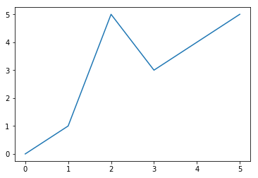


### <font color='brown'>간단한 그래프를 작성하는 메쏘드 </font>


```python
%matplotlib inline

import matplotlib.pyplot as plt
import pandas as pd

from matplotlib import font_manager, rc

# font_name = font_manager.FontProperties(fname="/Library/Fonts/AppleGothic.ttf").get_name()
font_name = font_manager.FontProperties(fname="C:/Windows/Fonts/MALGUN.TTF").get_name()
rc('font', family=font_name)

plt.rcParams['figure.figsize'] = (10,6)

```


```python
def make_simple_line_chart(years, gdp):

    # X축은 연도, Y축은 GDP인 선 그래프
    plt.plot(years, gdp, color='green', marker='.', linestyle='solid')
    
    # 제목
    plt.title("국가 GDP")

    # 라벨
    plt.xlabel("연도 (Year)")
    plt.ylabel("10억 달러 (Billions of $)")
    plt.show()
    
years = [1950,  1960,  1970,   1980,   1990,   2000,    2010]
gdp   = [300.2, 543.3, 1075.9, 2862.5, 5979.6, 10289.7, 14958.3]

make_simple_line_chart(years, gdp)    
```


<font size=2 color='blue'>
cf. plt.plot의 makrer, linestyle등 표시 방법은 <a href="http://matplotlib.org/api/lines_api.html">matplitlib/lines-api</a> 참조
</font>
```html
<font color='darkgray'>
lineStyles = {
    '-'    : '_draw_solid', 
    '--'   : '_draw_dashed', 
    '-.'   : '_draw_dash_dot', 
    ':'    : '_draw_dotted', 
    'None' : '_draw_nothing', 
    ' '    : '_draw_nothing', 
    ''     : '_draw_nothing'
}
<br>


markers = {
    '.' : 'point', 
    ',' : 'pixel', 
    'o' : 'circle', 
    'v' : 'triangle_down', 
    '^' : 'triangle_up', 
    '<' : 'triangle_left', 
    '>' : 'triangle_right', 
    '1' : 'tri_down', 
    '2' : 'tri_up', 
    '3' : 'tri_left', 
    '4' : 'tri_right', 
    '8' : 'octagon', 
    's' : 'square', 
    'p' : 'pentagon', 
    '*' : 'star', 
    'h' : 'hexagon1', 
    'H' : 'hexagon2', 
    '+' : 'plus', 
    'x' : 'x', 
    'D' : 'diamond', 
    'd' : 'thin_diamond', 
    '|' : 'vline', 
    '_' : 'hline', 
    'P' : 'plus_filled', 
    'X' : 'x_filled', 
     0  : 'tickleft', 
     1  : 'tickright', 
     2  : 'tickup', 
     3  : 'tickdown', 
     4  : 'caretleft', 
     5  : 'caretright', 
     6  : 'caretup', 
     7  : 'caretdown', 
     8  : 'caretleftbase', 
     9  : 'caretrightbase', 
    10  : 'caretupbase', 
    11  : 'caretdownbase', 
    'None': 'nothing', 
     None : 'nothing', 
    ' '   : 'nothing', 
    ''    : 'nothing'
}
</font>
```
### <font color='brown'> 네이버영화(http://movie.naver.com/), 현재상영작 평점을 그래프 작성 </font>


```python
plt.rcParams['figure.figsize'] = (14,6)

movies = ['카3:새로운도전', '너의 이름은',  '예수는 역사다', '블랙 쉐도우', '아메리칸 하니',
          '올 리브 올리브', '빅터 영 페레즈', '파밍 보이즈', '제트스톰2',   '플립'  ]
grade =  [  9.42, 8.78, 8.64, 7.30, 9.33,
           10.00, 1.50, 9.44, 9.20, 9.10  ]

# bars are by default width 0.8, so we'll add 0.1 to the left coordinates
# so that each bar is centered
xs = [i + 0.0 for i, _ in enumerate(movies)]
print(xs)

plt.bar(xs, grade)
plt.xlabel("영화 제목")
plt.ylabel("영화 평점")
plt.title("현재 상영작 평점")

# label x-axis with movie names at bar centers
# plt.xticks([i for i in range(len(movies))], movies)
plt.xticks([i for i, _ in enumerate(movies)], movies)

plt.show()
```

    [0.0, 1.0, 2.0, 3.0, 4.0, 5.0, 6.0, 7.0, 8.0, 9.0]
    


```python
[ i for i, _ in enumerate(movies)]
```


    [0, 1, 2, 3, 4, 5, 6, 7, 8, 9]


```python
i, j = 1, 2
```

### <font color='brown'>  numpy 배열 그리기 </font>


```python
import numpy as np

t = np.arange(0, 2*3.14, 0.01)
```


```python
plt.figure
plt.plot(t)
plt.show()
```


### <font color='brown'> numpy를 이용하여 시간축과 함수 그래프 </font>


```python
import math

t = np.arange(0, 2*math.pi,0.01)
```


```python
y = np.sin(t)
```


```python
plt.figure(figsize=(6,4)) # figure 크기 조절하기
plt.plot(t, y)
plt.show()
```


```python
plt.figure(figsize=(6,4))
plt.plot(t, y)
plt.grid() # 그리드 적용하기
plt.show()
```


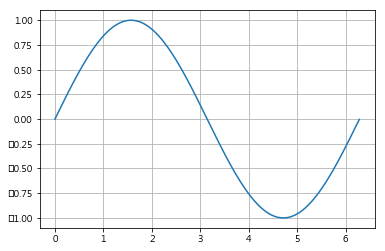


```python
plt.figure(figsize=(6,4))
plt.plot(t, y)
plt.grid()
plt.xlabel('time')       # x축 라벨 적용하기
plt.ylabel('Amplitude')  # y축 라벨 적용하기
plt.show()
```


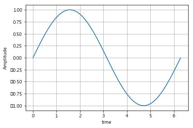


```python
plt.figure(figsize=(6,4))
plt.plot(t, y)
plt.grid()
plt.xlabel('time')
plt.ylabel('Amplitude')
plt.title('Example of sinewave')  # 그래프의 타이틀 적용하기
plt.show()
```


# np.diff
Signature: np.diff(a, n=1, axis=-1)
Docstring:
Calculate the n-th discrete difference along given axis.

The first difference is given by ``out[n] = a[n+1] - a[n]`` along
the given axis, higher differences are calculated by using `diff`
recursively.


```python
dy = np.diff(y)     # numpy의 차분 함수 사용하기
```


```python
% whos              # 변수 상태 확인
```

    No variables match your requested type.
    
# np.insert

Signature: np.insert(arr, obj, values, axis=None)
Docstring:
Insert values along the given axis before the given indices.

```python
dy = np.insert(dy, 0, 0)/0.01   # 차분의 특성으로 제일 앞에 의미없는 값 입력해두기
```


```python
% whos
```

    Variable                 Type        Data/Info
    ----------------------------------------------
    Image                    type        <class 'IPython.core.display.Image'>
    PLT_01                   str         images/PLT_01_screening.png
    data_list                list        n=6
    dy                       ndarray     629: 629 elems, type `float64`, 5032 bytes
    font_manager             module      <module 'matplotlib.font_<...>lotlib\\font_manager.py'>
    font_name                str         Malgun Gothic
    gdp                      list        n=7
    grade                    list        n=10
    i                        int         1
    j                        int         2
    make_simple_line_chart   function    <function make_simple_lin<...>rt at 0x0000026EB7E3C400>
    math                     module      <module 'math' (built-in)>
    movies                   list        n=10
    np                       module      <module 'numpy' from 'C:\<...>ges\\numpy\\__init__.py'>
    pd                       module      <module 'pandas' from 'C:<...>es\\pandas\\__init__.py'>
    plt                      module      <module 'matplotlib.pyplo<...>\\matplotlib\\pyplot.py'>
    rc                       function    <function rc at 0x0000026EB4674488>
    reference                function    <function <lambda> at 0x0000026EB6D4B598>
    t                        ndarray     629: 629 elems, type `float64`, 5032 bytes
    xs                       list        n=10
    y                        ndarray     629: 629 elems, type `float64`, 5032 bytes
    years                    list        n=7
    


```python
a = np.array([[1, 1], [2, 2], [3, 3]])
```


```python
a
```


    array([[1, 1],
           [2, 2],
           [3, 3]])


```python
np.insert(a, 2, 5)
```


    array([1, 1, 5, 2, 2, 3, 3])


```python
np.insert(a, 2, 5, axis=1)
```


    array([[1, 1, 5],
           [2, 2, 5],
           [3, 3, 5]])


### <font color='brown'> 두 개의 그래프 작성 </font>


```python
plt.figure(figsize=(6,4))
plt.plot(t, y)
plt.plot(t, dy)
plt.grid()
plt.xlabel('time')
plt.ylabel('Amplitude')
plt.title('Example of sinewave')
plt.show()
```


### <font color='brown'>  범례를 적용하기 위해 label을 적용하고 legend 실행 </font>


```python
plt.figure(figsize=(6,4))
plt.plot(t, y, label='sin')
plt.plot(t, dy, label='cos')
plt.grid()
plt.legend()                # legend
plt.xlabel('time')
plt.ylabel('Amplitude')
plt.title('Example of sinewave')
plt.show()
```


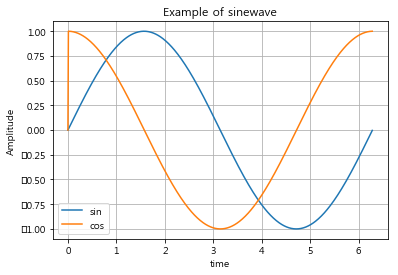


### <font color='brown'> 그래프 색상 바꾸기 </font>


```python
plt.figure(figsize=(6,4))
plt.plot(t, y, label='sin')
plt.plot(t, dy, 'r', label='cos')   # color : ['b', 'g', 'r', 'c', 'm', 'y', 'k', 'w' ]
plt.grid()
plt.legend()
plt.xlabel('time')
plt.ylabel('Amplitude')
plt.title('Example of sinewave')
plt.show()
```


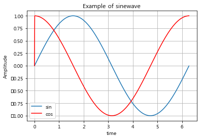


### <font color='brown'> 선 굵기 바꾸기 </font>


```python
plt.figure(figsize=(6,4))
plt.plot(t, y, lw=3, label='sin')     # linewidth
plt.plot(t, dy, 'r', label='cos')
plt.grid()
plt.legend()
plt.xlabel('time')
plt.ylabel('Amplitude')
plt.title('Example of sinewave')
plt.show()
```


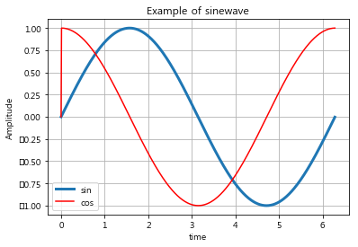


### <font color='brown'> 각 축별로 그리는 범위 조절 </font>


```python
plt.figure(figsize=(6,4))
plt.plot(t, y, lw=3, label='sin')
plt.plot(t, dy, 'r', label='cos')
plt.grid()
plt.legend()
plt.xlabel('time')
plt.ylabel('Amplitude')
plt.title('Example of sinewave')
plt.xlim(0, 3.14)    # set the xlim to xmin, xmax
plt.show()
```


```python
plt.figure(figsize=(6,4))
plt.plot(t, y, lw=3, label='sin')
plt.plot(t, dy, 'r', label='cos')
plt.grid()
plt.legend()
plt.xlabel('time')
plt.ylabel('Amplitude')
plt.title('Example of sinewave')
plt.ylim(-1.2/2, 1.2/2)    # set the ylim to ymin, ymax
plt.show()
```


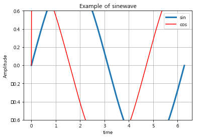


### <font color='brown'> 두 개 이상의 그래프 그리기의 다른 방법 </font>


```python
# 변수 초기화
%reset
```

    Once deleted, variables cannot be recovered. Proceed (y/[n])? y
    


```python
import numpy as np
import matplotlib.pyplot as plt
```


```python
t = np.arange(0, 5, 1.0)     # 0.1, 0.5, 1.0

plt.figure
plt.plot(t, t, t, t**2, t, t**3)
plt.show()
```


```python
t = np.arange(0, 5, 0.1)     # 0.1, 0.5, 1.0

plt.figure
plt.plot(t, t, t, t**2, t, t**3)
plt.show()
```


### <font color='brown'> 마커 적용 </font>


```python
t = np.arange(0, 5, 0.5)

plt.figure
plt.plot(t, t,    'r--')
plt.plot(t, t**2, 'bs' )
plt.plot(t, t**3, 'g^' )
plt.show()
```


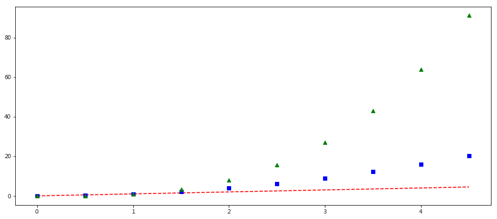


```python
t = np.arange(0, 5, 0.5)

plt.figure
plt.plot(t, t, 'r--', t, t**2, 'bs', t, t**3, 'g^')
plt.show()
```


### <font color='brown'> 두 개의 그림판(캠퍼스)에 그래프 작성 </font>


```python
t = np.arange(0, 5, 0.5)

fig1 = plt.figure(1)
plt1 = plt.plot(t, t**2, 'rs')

fig2 = plt.figure(2)
plt2 = plt.plot(t, t**3, 'b^')

plt.show()
```


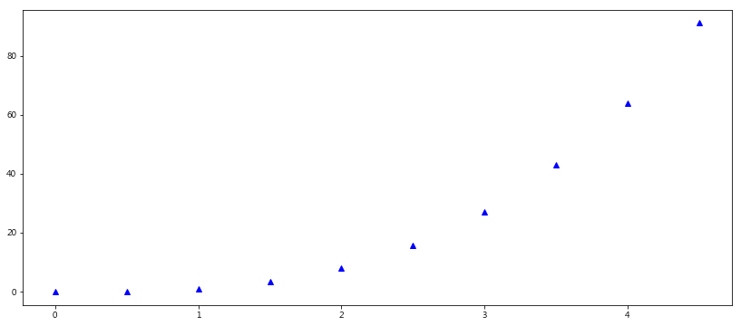


### <font color='brown'>  대쉬 위에 마커 표현 </font>


```python
import matplotlib.pyplot as plt

t = [0, 1, 2, 3, 4, 5, 6] 
y = [1, 4, 5, 8, 9, 5, 3]
```


```python
plt.figure(figsize=(10,4))
plt.plot(t, y, color='green')
plt.show()
```


```python
plt.figure(figsize=(10,4))
plt.plot(t, y, color='green', linestyle='dashed')
plt.show()
```


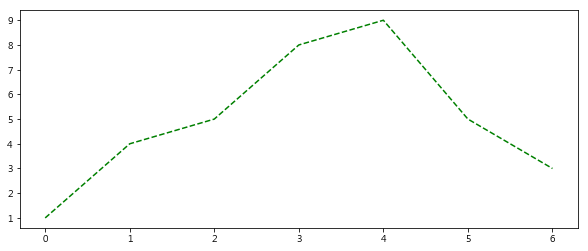


```python
plt.figure(figsize=(10,4))
plt.plot(t, y, color='green', linestyle='dashed', marker='o')
plt.show()
```


```python
plt.figure(figsize=(10,4))
plt.plot(t, y, color='green', linestyle='dashed', marker='o',
        markerfacecolor = 'blue')
plt.show()
```


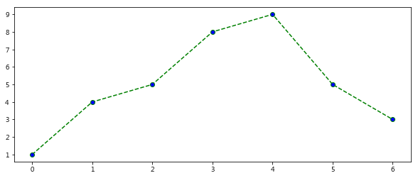


```python
plt.figure(figsize=(10,4))
plt.plot(t, y, color='green', linestyle='dashed', marker='o',
        markerfacecolor = 'blue', markersize=12)
plt.show()
```


### <font color='brown'> scatter 함수 사용 </font>


```python
import matplotlib.pyplot as plt
import numpy as np
```


```python
t = np.array([0,1,2,3,4,5,6,7,8,9])
y = np.array([9,8,7,9,8,3,2,4,3,4])
```


```python
plt.figure(figsize=(10,4))
plt.scatter(t,y)
plt.show()
```


```python
colormap = t

plt.figure(figsize=(10,4))
plt.scatter(t,y, marker='>')
plt.show()
```


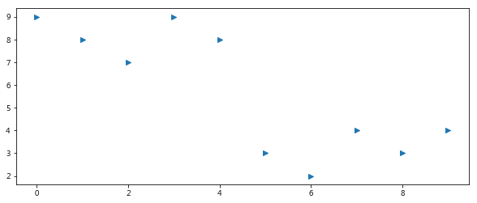


```python
colormap = t

plt.figure(figsize=(10,4))
plt.scatter(t,y, s=50, c=colormap, marker='>')
plt.show()
```


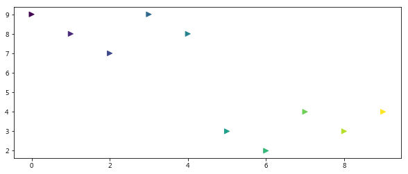


```python
colormap = t

plt.figure(figsize=(12.5,4))
plt.scatter(t,y, s=50, c=colormap, marker='>')
plt.colorbar()
plt.show()
```


### <font color='brown'> bar 그래프 작성 </font>


```python
plt.figure(figsize=(10,4))
plt.bar(t,y)
plt.show()
```


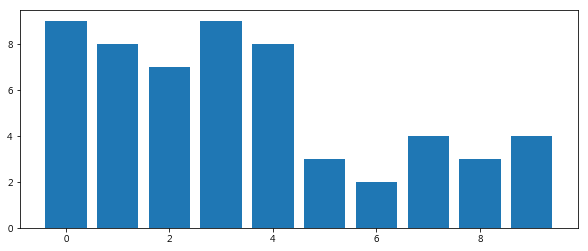


```python
plt.figure(figsize=(10,4))
plt.bar(t,y, width = 1.0, color='r')    # plt.bar(left, height, width=0.8, bottom=None, hold=None, data=None, **kwargs)
plt.show()
```


```python
y1 = np.array([3,2,4,3,4, 9,8,7,9,8])
```


```python
plt.figure(figsize=(10,4))
plt.bar(t,y, color='r', width=0.3, label='apple')
plt.bar(t + 0.4, y1, color='y', width=0.3,label='banana')
plt.xlabel('data')
plt.ylabel('mount')
plt.legend()
plt.show()
```


```python
plt.figure(figsize=(10,4))
plt.bar(t,y, color='r', width=0.3, label='apple')
plt.bar(t + 0.4, y1, color='y', width=0.3,label='banana')
plt.xlabel('data')
plt.ylabel('mount')
plt.legend()

plt.xticks(t, ('1Q','2Q','3Q','4Q','1Q','2Q','3Q','4Q','1Q','2Q'))    # set the locations and labels of the xticks
plt.show()
```


```python
plt.figure(figsize=(10,4))
plt.bar(t,y, color='r', width=0.3, label='apple')
plt.bar(t + 0.4, y1, color='y', width=0.3,label='banana')
plt.xlabel('data')
plt.ylabel('mount')
plt.legend()

plt.xticks(t+0.4, ('1Q','2Q','3Q','4Q','1Q','2Q','3Q','4Q','1Q','2Q'))   # set the locations of the xticks
plt.show()
```


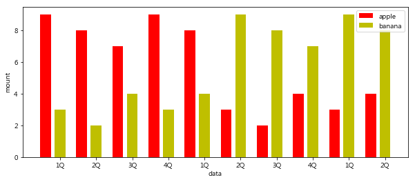


### <font color='brown'> 좌우 bar 그래프 효과 </font>


```python
plt.figure(figsize=(12,4))
plt.barh(t,y, color='r', label='apple')
plt.barh(t, -y1, color='y', label='banana')
plt.xlabel('data')
plt.ylabel('mount')
plt.legend()
plt.show()
```


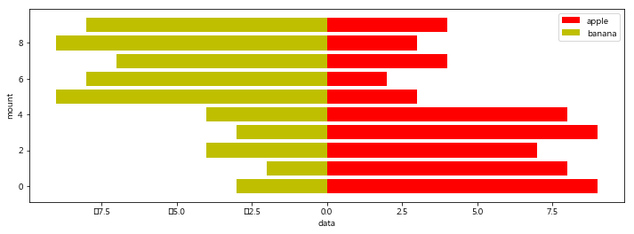


```python
plt.figure(figsize=(12,4))
plt.barh(t,y, color='r', label='apple')
plt.barh(t, -y1, color='y', label='banana')
plt.xlabel('data')
plt.ylabel('mount')
plt.legend()
plt.xticks([-10,-5,0,5,10],('10','5','0','5','10'))    # Get or set the *x*-limits of the current tick locations and labels.
plt.show()
```


### <font color='brown'> pie 그래프 작성 </font>


```python
plt.figure(figsize=(6,6))
plt.pie(y)
plt.show()
color=('b','g','r','c','m','y','k','w')    # colors : A sequence of matplotlib color args through which the pie chart
```


```python
label = ['Blue','Green','Red','Cyan','Magenta',
         'Yellow','Black','White','Blue', 'Green']
plt.figure(figsize=(6,6))
plt.pie(y, labels=label)    # labels : A sequence of strings providing the labels for each wedge
plt.show()
```


### <font color='brown'> 히그토그램 작성 </font>


```python
data = np.random.normal(5, 3, 1000)
```


```python
plt.figure(figsize=(10,4))
plt.plot(data)
plt.show()
```


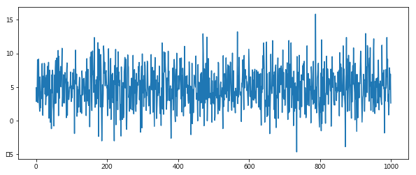


```python
plt.figure(figsize=(10,4))
plt.hist(data)
plt.show()
```


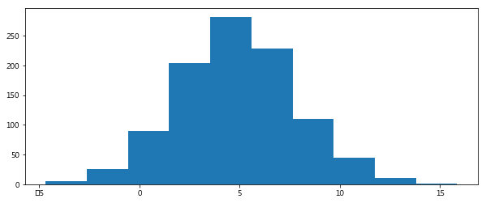


```python
plt.figure(figsize=(10,4))
plt.hist(data, bins=20)     # bins : integer, If an integer is given, `bins + 1` bin edges are returned
plt.show()
```


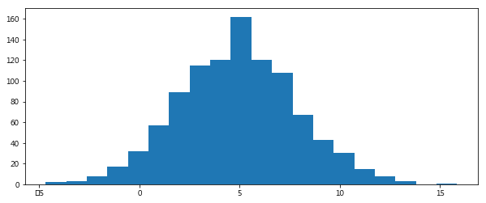


```python
plt.figure(figsize=(10,4))
plt.hist(data,bins=10, facecolor='red', 
         alpha=0.4, histtype='stepfilled')
plt.hist(data,bins=20, facecolor='green', 
         alpha=0.4, histtype='stepfilled')     # histtype : {'bar', 'barstacked', 'step',  'stepfilled'}
plt.show()
```


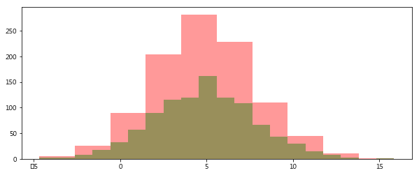


```python
x = np.random.randn(10000)
```


```python
plt.figure(figsize=(10,4))
plt.plot(x)
plt.show()
```


```python
plt.figure(figsize=(10,4))
plt.hist(x, normed=1, bins=20)
plt.show()
```


### <font color='brown'> box 그래프 작성 </font>


```python
s1 = np.random.normal(loc=0,  scale=1.0, size=1000)    # loc : Mean ("centre") of the distribution.
s2 = np.random.normal(loc=5,  scale=0.5, size=1000)    # scale : Standard deviation (spread or "width") of the distribution.
s3 = np.random.normal(loc=10, scale=2.0, size=1000)    # size : Output shape
```


```python
plt.figure(figsize=(10,4))
plt.plot(s1, label='s1')
plt.plot(s2, label='s2')
plt.plot(s3, label='s3')
plt.legend()
plt.show()
```


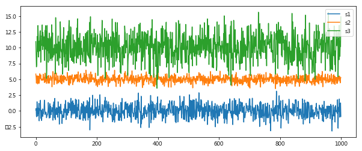


```python
plt.figure(figsize=(10,4))
plt.boxplot((s1, s2, s3))
plt.grid()
plt.show()
```


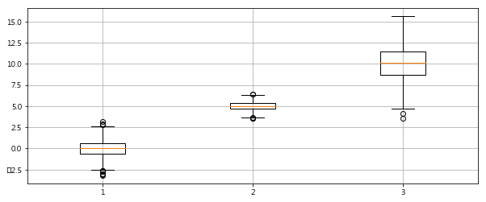


### <font color='brown'> annotation 적용 </font>


```python
t = np.arange(0,5,0.01)
y = np.cos(2*np.pi*t)

plt.figure(figsize=(10,4))
plt.plot(t,y)
plt.annotate('local max', xy=(1,1), xytext=(1.5,1.2),
            arrowprops=dict(facecolor='black',shrink=0.05))
plt.ylim(-1.1,1.4)
plt.show()
```


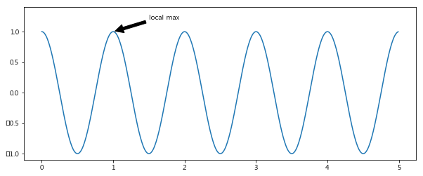


### <font color='brown'> subplot 적용 </font>
plt.subplot

Signature: plt.subplot(*args, **kwargs)
Docstring:
Return a subplot axes positioned by the given grid definition.

Typical call signature::

  subplot(nrows, ncols, plot_number)

Where *nrows* and *ncols* are used to notionally split the figure
into ``nrows * ncols`` sub-axes, and *plot_number* is used to identify
the particular subplot that this function is to create within the notional
grid. *plot_number* starts at 1, increments across rows first and has a
maximum of ``nrows * ncols``.

```python
plt.figure(figsize=(10,4))
plt.subplot(221)      # 2x2에 1번째,  subplot(nrows, ncols, plot_number)
plt.subplot(222)      # 2x2에 2번째 
plt.subplot(212)      # 2x1에 2번째

plt.show()
```


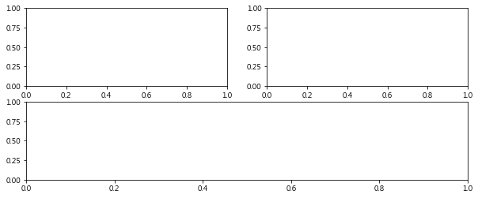


```python
plt.figure(figsize=(10,4))

plt.subplot(411)
plt.subplot(423)
plt.subplot(424)
plt.subplot(413)
# plt.subplot(414)
plt.subplot(427)
plt.subplot(428)

plt.show()
```


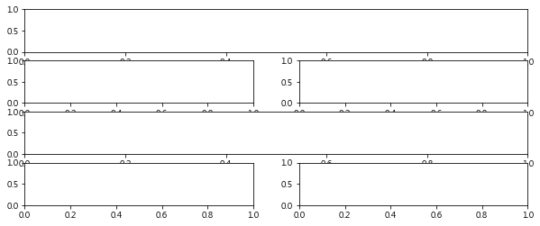


```python
t = np.arange(0,5,0.01)

plt.figure(figsize=(10,4))

plt.subplot(411)
plt.plot(t,np.sqrt(t))

plt.subplot(423)
plt.plot(t,t**2)

plt.subplot(424)
plt.plot(t,t**3)

plt.subplot(413)
plt.plot(t,np.sin(t))

plt.subplot(414)
plt.plot(t,np.cos(t))

plt.show()
```


<hr>
<marquee><font size=3 color='brown'>The BigpyCraft find the information to design valuable society with Technology & Craft.</font></marquee>
<div align='right'><font size=2 color='gray'> &lt; The End &gt; </font></div>
