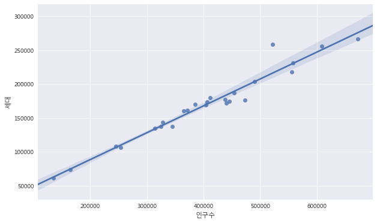
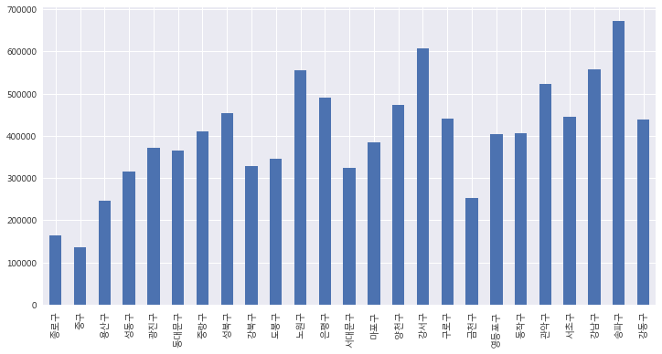
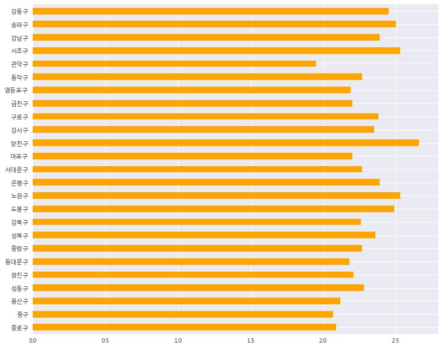
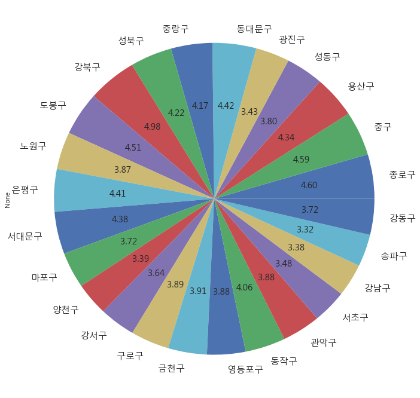

# Industry 4.0 의 중심, BigData

<div align='right'><font size=2 color='gray'>Data Processing Based Python @ <font color='blue'><a href='https://www.facebook.com/jskim.kr'>FB / jskim.kr</a></font>, [김진수](bigpycraft@gmail.com)</font></div>
<hr>

## 서울시 구별 인구 현황

### 서울시 통계DB
- http://stat.seoul.go.kr/jsp3/index.jsp
- 서울에서 인구수가 많으면 고령비율도 높을까?


```python
% matplotlib inline

import matplotlib.pyplot as plt
import pandas as pd
import seaborn as sns
sns.set()
```


```python
from matplotlib import font_manager, rc
font_name = font_manager.FontProperties(fname="C:/Windows/Fonts/malgun.ttf").get_name()
rc('font', family=font_name)

plt.rcParams['figure.figsize'] = (10,6)

from IPython.display import Image

reference = lambda file, w=None, h=None : \
    Image(filename=file, width=w, height=h) 
    
stat_01 = './images/DC_stat_seoul_population.png'
```


```python
Image(stat_01)
```


```python
population = pd.read_excel('data/Report_2018_1Q.xls', 
                     header=2,
                     parse_cols="B, C, D, M, N"
                    )
population.head()
```


<div>
<style>
    .dataframe thead tr:only-child th {
        text-align: right;
    }

    .dataframe thead th {
        text-align: left;
    }

    .dataframe tbody tr th {
        vertical-align: top;
    }
</style>
<table border="1" class="dataframe">
  <thead>
    <tr style="text-align: right;">
      <th></th>
      <th>자치구</th>
      <th>세대</th>
      <th>계</th>
      <th>세대당인구</th>
      <th>65세이상고령자</th>
    </tr>
  </thead>
  <tbody>
    <tr>
      <th>0</th>
      <td>합계</td>
      <td>4237610</td>
      <td>10112070</td>
      <td>2.32</td>
      <td>1382420</td>
    </tr>
    <tr>
      <th>1</th>
      <td>종로구</td>
      <td>73879</td>
      <td>164348</td>
      <td>2.09</td>
      <td>26429</td>
    </tr>
    <tr>
      <th>2</th>
      <td>중구</td>
      <td>60903</td>
      <td>135139</td>
      <td>2.07</td>
      <td>21655</td>
    </tr>
    <tr>
      <th>3</th>
      <td>용산구</td>
      <td>108497</td>
      <td>245411</td>
      <td>2.12</td>
      <td>37238</td>
    </tr>
    <tr>
      <th>4</th>
      <td>성동구</td>
      <td>134543</td>
      <td>314551</td>
      <td>2.28</td>
      <td>41752</td>
    </tr>
  </tbody>
</table>
</div>


```python
population.tail()
```


<div>
<style>
    .dataframe thead tr:only-child th {
        text-align: right;
    }

    .dataframe thead th {
        text-align: left;
    }

    .dataframe tbody tr th {
        vertical-align: top;
    }
</style>
<table border="1" class="dataframe">
  <thead>
    <tr style="text-align: right;">
      <th></th>
      <th>자치구</th>
      <th>세대</th>
      <th>계</th>
      <th>세대당인구</th>
      <th>65세이상고령자</th>
    </tr>
  </thead>
  <tbody>
    <tr>
      <th>21</th>
      <td>관악구</td>
      <td>258536</td>
      <td>522292</td>
      <td>1.95</td>
      <td>70807</td>
    </tr>
    <tr>
      <th>22</th>
      <td>서초구</td>
      <td>174225</td>
      <td>445164</td>
      <td>2.53</td>
      <td>54055</td>
    </tr>
    <tr>
      <th>23</th>
      <td>강남구</td>
      <td>231219</td>
      <td>557865</td>
      <td>2.39</td>
      <td>65859</td>
    </tr>
    <tr>
      <th>24</th>
      <td>송파구</td>
      <td>266550</td>
      <td>671994</td>
      <td>2.50</td>
      <td>77978</td>
    </tr>
    <tr>
      <th>25</th>
      <td>강동구</td>
      <td>177490</td>
      <td>438225</td>
      <td>2.45</td>
      <td>56983</td>
    </tr>
  </tbody>
</table>
</div>


#### <font color='blue'> # unique 체크후, 합계오 nan 부분을 drop </font>


```python
population['자치구'].unique()
```


    array(['합계', '종로구', '중구', '용산구', '성동구', '광진구', '동대문구', '중랑구', '성북구', '강북구',
           '도봉구', '노원구', '은평구', '서대문구', '마포구', '양천구', '강서구', '구로구', '금천구',
           '영등포구', '동작구', '관악구', '서초구', '강남구', '송파구', '강동구'], dtype=object)


```python
population = population.drop([0])
population
```


<div>
<style>
    .dataframe thead tr:only-child th {
        text-align: right;
    }

    .dataframe thead th {
        text-align: left;
    }

    .dataframe tbody tr th {
        vertical-align: top;
    }
</style>
<table border="1" class="dataframe">
  <thead>
    <tr style="text-align: right;">
      <th></th>
      <th>자치구</th>
      <th>세대</th>
      <th>계</th>
      <th>세대당인구</th>
      <th>65세이상고령자</th>
    </tr>
  </thead>
  <tbody>
    <tr>
      <th>1</th>
      <td>종로구</td>
      <td>73879</td>
      <td>164348</td>
      <td>2.09</td>
      <td>26429</td>
    </tr>
    <tr>
      <th>2</th>
      <td>중구</td>
      <td>60903</td>
      <td>135139</td>
      <td>2.07</td>
      <td>21655</td>
    </tr>
    <tr>
      <th>3</th>
      <td>용산구</td>
      <td>108497</td>
      <td>245411</td>
      <td>2.12</td>
      <td>37238</td>
    </tr>
    <tr>
      <th>4</th>
      <td>성동구</td>
      <td>134543</td>
      <td>314551</td>
      <td>2.28</td>
      <td>41752</td>
    </tr>
    <tr>
      <th>5</th>
      <td>광진구</td>
      <td>161407</td>
      <td>371671</td>
      <td>2.21</td>
      <td>44470</td>
    </tr>
    <tr>
      <th>6</th>
      <td>동대문구</td>
      <td>160489</td>
      <td>364962</td>
      <td>2.18</td>
      <td>56284</td>
    </tr>
    <tr>
      <th>7</th>
      <td>중랑구</td>
      <td>179600</td>
      <td>411552</td>
      <td>2.27</td>
      <td>59992</td>
    </tr>
    <tr>
      <th>8</th>
      <td>성북구</td>
      <td>187234</td>
      <td>453902</td>
      <td>2.36</td>
      <td>66896</td>
    </tr>
    <tr>
      <th>9</th>
      <td>강북구</td>
      <td>143139</td>
      <td>327511</td>
      <td>2.26</td>
      <td>57002</td>
    </tr>
    <tr>
      <th>10</th>
      <td>도봉구</td>
      <td>137479</td>
      <td>345041</td>
      <td>2.49</td>
      <td>54293</td>
    </tr>
    <tr>
      <th>11</th>
      <td>노원구</td>
      <td>217999</td>
      <td>555803</td>
      <td>2.53</td>
      <td>75081</td>
    </tr>
    <tr>
      <th>12</th>
      <td>은평구</td>
      <td>203431</td>
      <td>490253</td>
      <td>2.39</td>
      <td>75535</td>
    </tr>
    <tr>
      <th>13</th>
      <td>서대문구</td>
      <td>137758</td>
      <td>324871</td>
      <td>2.27</td>
      <td>49645</td>
    </tr>
    <tr>
      <th>14</th>
      <td>마포구</td>
      <td>170219</td>
      <td>385624</td>
      <td>2.20</td>
      <td>50122</td>
    </tr>
    <tr>
      <th>15</th>
      <td>양천구</td>
      <td>176559</td>
      <td>473087</td>
      <td>2.66</td>
      <td>56070</td>
    </tr>
    <tr>
      <th>16</th>
      <td>강서구</td>
      <td>256042</td>
      <td>608361</td>
      <td>2.35</td>
      <td>77381</td>
    </tr>
    <tr>
      <th>17</th>
      <td>구로구</td>
      <td>171751</td>
      <td>440396</td>
      <td>2.38</td>
      <td>59838</td>
    </tr>
    <tr>
      <th>18</th>
      <td>금천구</td>
      <td>106333</td>
      <td>253344</td>
      <td>2.20</td>
      <td>34640</td>
    </tr>
    <tr>
      <th>19</th>
      <td>영등포구</td>
      <td>168784</td>
      <td>403988</td>
      <td>2.19</td>
      <td>54704</td>
    </tr>
    <tr>
      <th>20</th>
      <td>동작구</td>
      <td>173544</td>
      <td>406715</td>
      <td>2.27</td>
      <td>57711</td>
    </tr>
    <tr>
      <th>21</th>
      <td>관악구</td>
      <td>258536</td>
      <td>522292</td>
      <td>1.95</td>
      <td>70807</td>
    </tr>
    <tr>
      <th>22</th>
      <td>서초구</td>
      <td>174225</td>
      <td>445164</td>
      <td>2.53</td>
      <td>54055</td>
    </tr>
    <tr>
      <th>23</th>
      <td>강남구</td>
      <td>231219</td>
      <td>557865</td>
      <td>2.39</td>
      <td>65859</td>
    </tr>
    <tr>
      <th>24</th>
      <td>송파구</td>
      <td>266550</td>
      <td>671994</td>
      <td>2.50</td>
      <td>77978</td>
    </tr>
    <tr>
      <th>25</th>
      <td>강동구</td>
      <td>177490</td>
      <td>438225</td>
      <td>2.45</td>
      <td>56983</td>
    </tr>
  </tbody>
</table>
</div>


```python
population['자치구'].unique()
```


    array(['종로구', '중구', '용산구', '성동구', '광진구', '동대문구', '중랑구', '성북구', '강북구',
           '도봉구', '노원구', '은평구', '서대문구', '마포구', '양천구', '강서구', '구로구', '금천구',
           '영등포구', '동작구', '관악구', '서초구', '강남구', '송파구', '강동구'], dtype=object)


```python
population.rename(columns = {'계':'인구수'}, inplace=True)
population.rename(columns = {'자치구':'구'}, inplace=True)
population.head()
```


<div>
<style>
    .dataframe thead tr:only-child th {
        text-align: right;
    }

    .dataframe thead th {
        text-align: left;
    }

    .dataframe tbody tr th {
        vertical-align: top;
    }
</style>
<table border="1" class="dataframe">
  <thead>
    <tr style="text-align: right;">
      <th></th>
      <th>구</th>
      <th>세대</th>
      <th>인구수</th>
      <th>세대당인구</th>
      <th>65세이상고령자</th>
    </tr>
  </thead>
  <tbody>
    <tr>
      <th>1</th>
      <td>종로구</td>
      <td>73879</td>
      <td>164348</td>
      <td>2.09</td>
      <td>26429</td>
    </tr>
    <tr>
      <th>2</th>
      <td>중구</td>
      <td>60903</td>
      <td>135139</td>
      <td>2.07</td>
      <td>21655</td>
    </tr>
    <tr>
      <th>3</th>
      <td>용산구</td>
      <td>108497</td>
      <td>245411</td>
      <td>2.12</td>
      <td>37238</td>
    </tr>
    <tr>
      <th>4</th>
      <td>성동구</td>
      <td>134543</td>
      <td>314551</td>
      <td>2.28</td>
      <td>41752</td>
    </tr>
    <tr>
      <th>5</th>
      <td>광진구</td>
      <td>161407</td>
      <td>371671</td>
      <td>2.21</td>
      <td>44470</td>
    </tr>
  </tbody>
</table>
</div>


```python
sns.regplot(x="인구수", y="세대", data=population);
```





```python
sns.regplot(x="인구수", y="65세이상고령자", data=population);
```


### <font color='blue'> 참조.  https://github.com/southkorea/southkorea-maps/tree/master/kostat/2013/json </font>


```python
import json
import folium
import warnings
warnings.simplefilter(action = "ignore", category = FutureWarning)
```


```python
geo_path = 'data/skorea_municipalities_geo_simple.json'

geo_str = json.load(open(geo_path, encoding='utf-8'))
# geo_str
```


```python
guDat = pd.DataFrame({'gu':population['구'], 'counts':population['인구수']})
guDat.head()
```


<div>
<style>
    .dataframe thead tr:only-child th {
        text-align: right;
    }

    .dataframe thead th {
        text-align: left;
    }

    .dataframe tbody tr th {
        vertical-align: top;
    }
</style>
<table border="1" class="dataframe">
  <thead>
    <tr style="text-align: right;">
      <th></th>
      <th>counts</th>
      <th>gu</th>
    </tr>
  </thead>
  <tbody>
    <tr>
      <th>1</th>
      <td>164348</td>
      <td>종로구</td>
    </tr>
    <tr>
      <th>2</th>
      <td>135139</td>
      <td>중구</td>
    </tr>
    <tr>
      <th>3</th>
      <td>245411</td>
      <td>용산구</td>
    </tr>
    <tr>
      <th>4</th>
      <td>314551</td>
      <td>성동구</td>
    </tr>
    <tr>
      <th>5</th>
      <td>371671</td>
      <td>광진구</td>
    </tr>
  </tbody>
</table>
</div>


```python
map = folium.Map(location=[37.5502, 126.982], zoom_start=12)
map
```


<div style="width:100%;"><div style="position:relative;width:100%;height:0;padding-bottom:60%;"><iframe src="data:text/html;charset=utf-8;base64,PCFET0NUWVBFIGh0bWw+CjxoZWFkPiAgICAKICAgIDxtZXRhIGh0dHAtZXF1aXY9ImNvbnRlbnQtdHlwZSIgY29udGVudD0idGV4dC9odG1sOyBjaGFyc2V0PVVURi04IiAvPgogICAgPHNjcmlwdD5MX1BSRUZFUl9DQU5WQVMgPSBmYWxzZTsgTF9OT19UT1VDSCA9IGZhbHNlOyBMX0RJU0FCTEVfM0QgPSBmYWxzZTs8L3NjcmlwdD4KICAgIDxzY3JpcHQgc3JjPSJodHRwczovL2Nkbi5qc2RlbGl2ci5uZXQvbnBtL2xlYWZsZXRAMS4yLjAvZGlzdC9sZWFmbGV0LmpzIj48L3NjcmlwdD4KICAgIDxzY3JpcHQgc3JjPSJodHRwczovL2FqYXguZ29vZ2xlYXBpcy5jb20vYWpheC9saWJzL2pxdWVyeS8xLjExLjEvanF1ZXJ5Lm1pbi5qcyI+PC9zY3JpcHQ+CiAgICA8c2NyaXB0IHNyYz0iaHR0cHM6Ly9tYXhjZG4uYm9vdHN0cmFwY2RuLmNvbS9ib290c3RyYXAvMy4yLjAvanMvYm9vdHN0cmFwLm1pbi5qcyI+PC9zY3JpcHQ+CiAgICA8c2NyaXB0IHNyYz0iaHR0cHM6Ly9jZG5qcy5jbG91ZGZsYXJlLmNvbS9hamF4L2xpYnMvTGVhZmxldC5hd2Vzb21lLW1hcmtlcnMvMi4wLjIvbGVhZmxldC5hd2Vzb21lLW1hcmtlcnMuanMiPjwvc2NyaXB0PgogICAgPGxpbmsgcmVsPSJzdHlsZXNoZWV0IiBocmVmPSJodHRwczovL2Nkbi5qc2RlbGl2ci5uZXQvbnBtL2xlYWZsZXRAMS4yLjAvZGlzdC9sZWFmbGV0LmNzcyIgLz4KICAgIDxsaW5rIHJlbD0ic3R5bGVzaGVldCIgaHJlZj0iaHR0cHM6Ly9tYXhjZG4uYm9vdHN0cmFwY2RuLmNvbS9ib290c3RyYXAvMy4yLjAvY3NzL2Jvb3RzdHJhcC5taW4uY3NzIiAvPgogICAgPGxpbmsgcmVsPSJzdHlsZXNoZWV0IiBocmVmPSJodHRwczovL21heGNkbi5ib290c3RyYXBjZG4uY29tL2Jvb3RzdHJhcC8zLjIuMC9jc3MvYm9vdHN0cmFwLXRoZW1lLm1pbi5jc3MiIC8+CiAgICA8bGluayByZWw9InN0eWxlc2hlZXQiIGhyZWY9Imh0dHBzOi8vbWF4Y2RuLmJvb3RzdHJhcGNkbi5jb20vZm9udC1hd2Vzb21lLzQuNi4zL2Nzcy9mb250LWF3ZXNvbWUubWluLmNzcyIgLz4KICAgIDxsaW5rIHJlbD0ic3R5bGVzaGVldCIgaHJlZj0iaHR0cHM6Ly9jZG5qcy5jbG91ZGZsYXJlLmNvbS9hamF4L2xpYnMvTGVhZmxldC5hd2Vzb21lLW1hcmtlcnMvMi4wLjIvbGVhZmxldC5hd2Vzb21lLW1hcmtlcnMuY3NzIiAvPgogICAgPGxpbmsgcmVsPSJzdHlsZXNoZWV0IiBocmVmPSJodHRwczovL3Jhd2dpdC5jb20vcHl0aG9uLXZpc3VhbGl6YXRpb24vZm9saXVtL21hc3Rlci9mb2xpdW0vdGVtcGxhdGVzL2xlYWZsZXQuYXdlc29tZS5yb3RhdGUuY3NzIiAvPgogICAgPHN0eWxlPmh0bWwsIGJvZHkge3dpZHRoOiAxMDAlO2hlaWdodDogMTAwJTttYXJnaW46IDA7cGFkZGluZzogMDt9PC9zdHlsZT4KICAgIDxzdHlsZT4jbWFwIHtwb3NpdGlvbjphYnNvbHV0ZTt0b3A6MDtib3R0b206MDtyaWdodDowO2xlZnQ6MDt9PC9zdHlsZT4KICAgIAogICAgICAgICAgICA8c3R5bGU+ICNtYXBfNjU5NDAyMWFkNzgwNDM2ZmFkNTAzNzU4MjA3Y2Q2MjEgewogICAgICAgICAgICAgICAgcG9zaXRpb24gOiByZWxhdGl2ZTsKICAgICAgICAgICAgICAgIHdpZHRoIDogMTAwLjAlOwogICAgICAgICAgICAgICAgaGVpZ2h0OiAxMDAuMCU7CiAgICAgICAgICAgICAgICBsZWZ0OiAwLjAlOwogICAgICAgICAgICAgICAgdG9wOiAwLjAlOwogICAgICAgICAgICAgICAgfQogICAgICAgICAgICA8L3N0eWxlPgogICAgICAgIAo8L2hlYWQ+Cjxib2R5PiAgICAKICAgIAogICAgICAgICAgICA8ZGl2IGNsYXNzPSJmb2xpdW0tbWFwIiBpZD0ibWFwXzY1OTQwMjFhZDc4MDQzNmZhZDUwMzc1ODIwN2NkNjIxIiA+PC9kaXY+CiAgICAgICAgCjwvYm9keT4KPHNjcmlwdD4gICAgCiAgICAKCiAgICAgICAgICAgIAogICAgICAgICAgICAgICAgdmFyIGJvdW5kcyA9IG51bGw7CiAgICAgICAgICAgIAoKICAgICAgICAgICAgdmFyIG1hcF82NTk0MDIxYWQ3ODA0MzZmYWQ1MDM3NTgyMDdjZDYyMSA9IEwubWFwKAogICAgICAgICAgICAgICAgICAgICAgICAgICAgICAgICAgJ21hcF82NTk0MDIxYWQ3ODA0MzZmYWQ1MDM3NTgyMDdjZDYyMScsCiAgICAgICAgICAgICAgICAgICAgICAgICAgICAgICAgICB7Y2VudGVyOiBbMzcuNTUwMiwxMjYuOTgyXSwKICAgICAgICAgICAgICAgICAgICAgICAgICAgICAgICAgIHpvb206IDEyLAogICAgICAgICAgICAgICAgICAgICAgICAgICAgICAgICAgbWF4Qm91bmRzOiBib3VuZHMsCiAgICAgICAgICAgICAgICAgICAgICAgICAgICAgICAgICBsYXllcnM6IFtdLAogICAgICAgICAgICAgICAgICAgICAgICAgICAgICAgICAgd29ybGRDb3B5SnVtcDogZmFsc2UsCiAgICAgICAgICAgICAgICAgICAgICAgICAgICAgICAgICBjcnM6IEwuQ1JTLkVQU0czODU3CiAgICAgICAgICAgICAgICAgICAgICAgICAgICAgICAgIH0pOwogICAgICAgICAgICAKICAgICAgICAKICAgIAogICAgICAgICAgICB2YXIgdGlsZV9sYXllcl80YjM3ODUyYjZiMzk0M2ExOTM3NjYyYWE1NmViMWYzMyA9IEwudGlsZUxheWVyKAogICAgICAgICAgICAgICAgJ2h0dHBzOi8ve3N9LnRpbGUub3BlbnN0cmVldG1hcC5vcmcve3p9L3t4fS97eX0ucG5nJywKICAgICAgICAgICAgICAgIHsKICAiYXR0cmlidXRpb24iOiBudWxsLAogICJkZXRlY3RSZXRpbmEiOiBmYWxzZSwKICAibWF4Wm9vbSI6IDE4LAogICJtaW5ab29tIjogMSwKICAibm9XcmFwIjogZmFsc2UsCiAgInN1YmRvbWFpbnMiOiAiYWJjIgp9CiAgICAgICAgICAgICAgICApLmFkZFRvKG1hcF82NTk0MDIxYWQ3ODA0MzZmYWQ1MDM3NTgyMDdjZDYyMSk7CiAgICAgICAgCjwvc2NyaXB0Pg==" style="position:absolute;width:100%;height:100%;left:0;top:0;border:none !important;" allowfullscreen webkitallowfullscreen mozallowfullscreen></iframe></div></div>


```python
map = folium.Map(location=[37.5502, 126.982], zoom_start=11, tiles='Stamen Toner')
map
```


<div style="width:100%;"><div style="position:relative;width:100%;height:0;padding-bottom:60%;"><iframe src="data:text/html;charset=utf-8;base64,PCFET0NUWVBFIGh0bWw+CjxoZWFkPiAgICAKICAgIDxtZXRhIGh0dHAtZXF1aXY9ImNvbnRlbnQtdHlwZSIgY29udGVudD0idGV4dC9odG1sOyBjaGFyc2V0PVVURi04IiAvPgogICAgPHNjcmlwdD5MX1BSRUZFUl9DQU5WQVMgPSBmYWxzZTsgTF9OT19UT1VDSCA9IGZhbHNlOyBMX0RJU0FCTEVfM0QgPSBmYWxzZTs8L3NjcmlwdD4KICAgIDxzY3JpcHQgc3JjPSJodHRwczovL2Nkbi5qc2RlbGl2ci5uZXQvbnBtL2xlYWZsZXRAMS4yLjAvZGlzdC9sZWFmbGV0LmpzIj48L3NjcmlwdD4KICAgIDxzY3JpcHQgc3JjPSJodHRwczovL2FqYXguZ29vZ2xlYXBpcy5jb20vYWpheC9saWJzL2pxdWVyeS8xLjExLjEvanF1ZXJ5Lm1pbi5qcyI+PC9zY3JpcHQ+CiAgICA8c2NyaXB0IHNyYz0iaHR0cHM6Ly9tYXhjZG4uYm9vdHN0cmFwY2RuLmNvbS9ib290c3RyYXAvMy4yLjAvanMvYm9vdHN0cmFwLm1pbi5qcyI+PC9zY3JpcHQ+CiAgICA8c2NyaXB0IHNyYz0iaHR0cHM6Ly9jZG5qcy5jbG91ZGZsYXJlLmNvbS9hamF4L2xpYnMvTGVhZmxldC5hd2Vzb21lLW1hcmtlcnMvMi4wLjIvbGVhZmxldC5hd2Vzb21lLW1hcmtlcnMuanMiPjwvc2NyaXB0PgogICAgPGxpbmsgcmVsPSJzdHlsZXNoZWV0IiBocmVmPSJodHRwczovL2Nkbi5qc2RlbGl2ci5uZXQvbnBtL2xlYWZsZXRAMS4yLjAvZGlzdC9sZWFmbGV0LmNzcyIgLz4KICAgIDxsaW5rIHJlbD0ic3R5bGVzaGVldCIgaHJlZj0iaHR0cHM6Ly9tYXhjZG4uYm9vdHN0cmFwY2RuLmNvbS9ib290c3RyYXAvMy4yLjAvY3NzL2Jvb3RzdHJhcC5taW4uY3NzIiAvPgogICAgPGxpbmsgcmVsPSJzdHlsZXNoZWV0IiBocmVmPSJodHRwczovL21heGNkbi5ib290c3RyYXBjZG4uY29tL2Jvb3RzdHJhcC8zLjIuMC9jc3MvYm9vdHN0cmFwLXRoZW1lLm1pbi5jc3MiIC8+CiAgICA8bGluayByZWw9InN0eWxlc2hlZXQiIGhyZWY9Imh0dHBzOi8vbWF4Y2RuLmJvb3RzdHJhcGNkbi5jb20vZm9udC1hd2Vzb21lLzQuNi4zL2Nzcy9mb250LWF3ZXNvbWUubWluLmNzcyIgLz4KICAgIDxsaW5rIHJlbD0ic3R5bGVzaGVldCIgaHJlZj0iaHR0cHM6Ly9jZG5qcy5jbG91ZGZsYXJlLmNvbS9hamF4L2xpYnMvTGVhZmxldC5hd2Vzb21lLW1hcmtlcnMvMi4wLjIvbGVhZmxldC5hd2Vzb21lLW1hcmtlcnMuY3NzIiAvPgogICAgPGxpbmsgcmVsPSJzdHlsZXNoZWV0IiBocmVmPSJodHRwczovL3Jhd2dpdC5jb20vcHl0aG9uLXZpc3VhbGl6YXRpb24vZm9saXVtL21hc3Rlci9mb2xpdW0vdGVtcGxhdGVzL2xlYWZsZXQuYXdlc29tZS5yb3RhdGUuY3NzIiAvPgogICAgPHN0eWxlPmh0bWwsIGJvZHkge3dpZHRoOiAxMDAlO2hlaWdodDogMTAwJTttYXJnaW46IDA7cGFkZGluZzogMDt9PC9zdHlsZT4KICAgIDxzdHlsZT4jbWFwIHtwb3NpdGlvbjphYnNvbHV0ZTt0b3A6MDtib3R0b206MDtyaWdodDowO2xlZnQ6MDt9PC9zdHlsZT4KICAgIAogICAgICAgICAgICA8c3R5bGU+ICNtYXBfMmI3MGViN2MzYmIxNDcwYWE5M2Q2ZjQ1MTE2ZmVkNTEgewogICAgICAgICAgICAgICAgcG9zaXRpb24gOiByZWxhdGl2ZTsKICAgICAgICAgICAgICAgIHdpZHRoIDogMTAwLjAlOwogICAgICAgICAgICAgICAgaGVpZ2h0OiAxMDAuMCU7CiAgICAgICAgICAgICAgICBsZWZ0OiAwLjAlOwogICAgICAgICAgICAgICAgdG9wOiAwLjAlOwogICAgICAgICAgICAgICAgfQogICAgICAgICAgICA8L3N0eWxlPgogICAgICAgIAo8L2hlYWQ+Cjxib2R5PiAgICAKICAgIAogICAgICAgICAgICA8ZGl2IGNsYXNzPSJmb2xpdW0tbWFwIiBpZD0ibWFwXzJiNzBlYjdjM2JiMTQ3MGFhOTNkNmY0NTExNmZlZDUxIiA+PC9kaXY+CiAgICAgICAgCjwvYm9keT4KPHNjcmlwdD4gICAgCiAgICAKCiAgICAgICAgICAgIAogICAgICAgICAgICAgICAgdmFyIGJvdW5kcyA9IG51bGw7CiAgICAgICAgICAgIAoKICAgICAgICAgICAgdmFyIG1hcF8yYjcwZWI3YzNiYjE0NzBhYTkzZDZmNDUxMTZmZWQ1MSA9IEwubWFwKAogICAgICAgICAgICAgICAgICAgICAgICAgICAgICAgICAgJ21hcF8yYjcwZWI3YzNiYjE0NzBhYTkzZDZmNDUxMTZmZWQ1MScsCiAgICAgICAgICAgICAgICAgICAgICAgICAgICAgICAgICB7Y2VudGVyOiBbMzcuNTUwMiwxMjYuOTgyXSwKICAgICAgICAgICAgICAgICAgICAgICAgICAgICAgICAgIHpvb206IDExLAogICAgICAgICAgICAgICAgICAgICAgICAgICAgICAgICAgbWF4Qm91bmRzOiBib3VuZHMsCiAgICAgICAgICAgICAgICAgICAgICAgICAgICAgICAgICBsYXllcnM6IFtdLAogICAgICAgICAgICAgICAgICAgICAgICAgICAgICAgICAgd29ybGRDb3B5SnVtcDogZmFsc2UsCiAgICAgICAgICAgICAgICAgICAgICAgICAgICAgICAgICBjcnM6IEwuQ1JTLkVQU0czODU3CiAgICAgICAgICAgICAgICAgICAgICAgICAgICAgICAgIH0pOwogICAgICAgICAgICAKICAgICAgICAKICAgIAogICAgICAgICAgICB2YXIgdGlsZV9sYXllcl81NjcxNTUxNWViNjU0MTJlOWUwMjAwNDVmYWE0ZDhmZCA9IEwudGlsZUxheWVyKAogICAgICAgICAgICAgICAgJ2h0dHBzOi8vc3RhbWVuLXRpbGVzLXtzfS5hLnNzbC5mYXN0bHkubmV0L3RvbmVyL3t6fS97eH0ve3l9LnBuZycsCiAgICAgICAgICAgICAgICB7CiAgImF0dHJpYnV0aW9uIjogbnVsbCwKICAiZGV0ZWN0UmV0aW5hIjogZmFsc2UsCiAgIm1heFpvb20iOiAxOCwKICAibWluWm9vbSI6IDEsCiAgIm5vV3JhcCI6IGZhbHNlLAogICJzdWJkb21haW5zIjogImFiYyIKfQogICAgICAgICAgICAgICAgKS5hZGRUbyhtYXBfMmI3MGViN2MzYmIxNDcwYWE5M2Q2ZjQ1MTE2ZmVkNTEpOwogICAgICAgIAo8L3NjcmlwdD4=" style="position:absolute;width:100%;height:100%;left:0;top:0;border:none !important;" allowfullscreen webkitallowfullscreen mozallowfullscreen></iframe></div></div>


```python
map = folium.Map(location=[37.5502, 126.982], zoom_start=11, tiles='Stamen Toner')

map.choropleth(geo_data=geo_str,
              data=guDat,
              columns=['gu', 'counts'],
              fill_color='YlGnBu', #PuRd, YlGnBu
              key_on='feature.id')
```


```python
map
```


<div style="width:100%;"><div style="position:relative;width:100%;height:0;padding-bottom:60%;"><iframe src="data:text/html;charset=utf-8;base64,PCFET0NUWVBFIGh0bWw+CjxoZWFkPiAgICAKICAgIDxtZXRhIGh0dHAtZXF1aXY9ImNvbnRlbnQtdHlwZSIgY29udGVudD0idGV4dC9odG1sOyBjaGFyc2V0PVVURi04IiAvPgogICAgPHNjcmlwdD5MX1BSRUZFUl9DQU5WQVMgPSBmYWxzZTsgTF9OT19UT1VDSCA9IGZhbHNlOyBMX0RJU0FCTEVfM0QgPSBmYWxzZTs8L3NjcmlwdD4KICAgIDxzY3JpcHQgc3JjPSJodHRwczovL2Nkbi5qc2RlbGl2ci5uZXQvbnBtL2xlYWZsZXRAMS4yLjAvZGlzdC9sZWFmbGV0LmpzIj48L3NjcmlwdD4KICAgIDxzY3JpcHQgc3JjPSJodHRwczovL2FqYXguZ29vZ2xlYXBpcy5jb20vYWpheC9saWJzL2pxdWVyeS8xLjExLjEvanF1ZXJ5Lm1pbi5qcyI+PC9zY3JpcHQ+CiAgICA8c2NyaXB0IHNyYz0iaHR0cHM6Ly9tYXhjZG4uYm9vdHN0cmFwY2RuLmNvbS9ib290c3RyYXAvMy4yLjAvanMvYm9vdHN0cmFwLm1pbi5qcyI+PC9zY3JpcHQ+CiAgICA8c2NyaXB0IHNyYz0iaHR0cHM6Ly9jZG5qcy5jbG91ZGZsYXJlLmNvbS9hamF4L2xpYnMvTGVhZmxldC5hd2Vzb21lLW1hcmtlcnMvMi4wLjIvbGVhZmxldC5hd2Vzb21lLW1hcmtlcnMuanMiPjwvc2NyaXB0PgogICAgPGxpbmsgcmVsPSJzdHlsZXNoZWV0IiBocmVmPSJodHRwczovL2Nkbi5qc2RlbGl2ci5uZXQvbnBtL2xlYWZsZXRAMS4yLjAvZGlzdC9sZWFmbGV0LmNzcyIgLz4KICAgIDxsaW5rIHJlbD0ic3R5bGVzaGVldCIgaHJlZj0iaHR0cHM6Ly9tYXhjZG4uYm9vdHN0cmFwY2RuLmNvbS9ib290c3RyYXAvMy4yLjAvY3NzL2Jvb3RzdHJhcC5taW4uY3NzIiAvPgogICAgPGxpbmsgcmVsPSJzdHlsZXNoZWV0IiBocmVmPSJodHRwczovL21heGNkbi5ib290c3RyYXBjZG4uY29tL2Jvb3RzdHJhcC8zLjIuMC9jc3MvYm9vdHN0cmFwLXRoZW1lLm1pbi5jc3MiIC8+CiAgICA8bGluayByZWw9InN0eWxlc2hlZXQiIGhyZWY9Imh0dHBzOi8vbWF4Y2RuLmJvb3RzdHJhcGNkbi5jb20vZm9udC1hd2Vzb21lLzQuNi4zL2Nzcy9mb250LWF3ZXNvbWUubWluLmNzcyIgLz4KICAgIDxsaW5rIHJlbD0ic3R5bGVzaGVldCIgaHJlZj0iaHR0cHM6Ly9jZG5qcy5jbG91ZGZsYXJlLmNvbS9hamF4L2xpYnMvTGVhZmxldC5hd2Vzb21lLW1hcmtlcnMvMi4wLjIvbGVhZmxldC5hd2Vzb21lLW1hcmtlcnMuY3NzIiAvPgogICAgPGxpbmsgcmVsPSJzdHlsZXNoZWV0IiBocmVmPSJodHRwczovL3Jhd2dpdC5jb20vcHl0aG9uLXZpc3VhbGl6YXRpb24vZm9saXVtL21hc3Rlci9mb2xpdW0vdGVtcGxhdGVzL2xlYWZsZXQuYXdlc29tZS5yb3RhdGUuY3NzIiAvPgogICAgPHN0eWxlPmh0bWwsIGJvZHkge3dpZHRoOiAxMDAlO2hlaWdodDogMTAwJTttYXJnaW46IDA7cGFkZGluZzogMDt9PC9zdHlsZT4KICAgIDxzdHlsZT4jbWFwIHtwb3NpdGlvbjphYnNvbHV0ZTt0b3A6MDtib3R0b206MDtyaWdodDowO2xlZnQ6MDt9PC9zdHlsZT4KICAgIAogICAgICAgICAgICA8c3R5bGU+ICNtYXBfOTg5YjBiMWY3Y2M1NDVhNzhhOTE2MDNmNjRiNDRlYTUgewogICAgICAgICAgICAgICAgcG9zaXRpb24gOiByZWxhdGl2ZTsKICAgICAgICAgICAgICAgIHdpZHRoIDogMTAwLjAlOwogICAgICAgICAgICAgICAgaGVpZ2h0OiAxMDAuMCU7CiAgICAgICAgICAgICAgICBsZWZ0OiAwLjAlOwogICAgICAgICAgICAgICAgdG9wOiAwLjAlOwogICAgICAgICAgICAgICAgfQogICAgICAgICAgICA8L3N0eWxlPgogICAgICAgIAogICAgPHNjcmlwdCBzcmM9Imh0dHBzOi8vY2RuanMuY2xvdWRmbGFyZS5jb20vYWpheC9saWJzL2QzLzMuNS41L2QzLm1pbi5qcyI+PC9zY3JpcHQ+CjwvaGVhZD4KPGJvZHk+ICAgIAogICAgCiAgICAgICAgICAgIDxkaXYgY2xhc3M9ImZvbGl1bS1tYXAiIGlkPSJtYXBfOTg5YjBiMWY3Y2M1NDVhNzhhOTE2MDNmNjRiNDRlYTUiID48L2Rpdj4KICAgICAgICAKPC9ib2R5Pgo8c2NyaXB0PiAgICAKICAgIAoKICAgICAgICAgICAgCiAgICAgICAgICAgICAgICB2YXIgYm91bmRzID0gbnVsbDsKICAgICAgICAgICAgCgogICAgICAgICAgICB2YXIgbWFwXzk4OWIwYjFmN2NjNTQ1YTc4YTkxNjAzZjY0YjQ0ZWE1ID0gTC5tYXAoCiAgICAgICAgICAgICAgICAgICAgICAgICAgICAgICAgICAnbWFwXzk4OWIwYjFmN2NjNTQ1YTc4YTkxNjAzZjY0YjQ0ZWE1JywKICAgICAgICAgICAgICAgICAgICAgICAgICAgICAgICAgIHtjZW50ZXI6IFszNy41NTAyLDEyNi45ODJdLAogICAgICAgICAgICAgICAgICAgICAgICAgICAgICAgICAgem9vbTogMTEsCiAgICAgICAgICAgICAgICAgICAgICAgICAgICAgICAgICBtYXhCb3VuZHM6IGJvdW5kcywKICAgICAgICAgICAgICAgICAgICAgICAgICAgICAgICAgIGxheWVyczogW10sCiAgICAgICAgICAgICAgICAgICAgICAgICAgICAgICAgICB3b3JsZENvcHlKdW1wOiBmYWxzZSwKICAgICAgICAgICAgICAgICAgICAgICAgICAgICAgICAgIGNyczogTC5DUlMuRVBTRzM4NTcKICAgICAgICAgICAgICAgICAgICAgICAgICAgICAgICAgfSk7CiAgICAgICAgICAgIAogICAgICAgIAogICAgCiAgICAgICAgICAgIHZhciB0aWxlX2xheWVyXzIzODlhNDk2YTk1NTQzODM5MTJiYzY3NmE4YTVkZmMzID0gTC50aWxlTGF5ZXIoCiAgICAgICAgICAgICAgICAnaHR0cHM6Ly9zdGFtZW4tdGlsZXMte3N9LmEuc3NsLmZhc3RseS5uZXQvdG9uZXIve3p9L3t4fS97eX0ucG5nJywKICAgICAgICAgICAgICAgIHsKICAiYXR0cmlidXRpb24iOiBudWxsLAogICJkZXRlY3RSZXRpbmEiOiBmYWxzZSwKICAibWF4Wm9vbSI6IDE4LAogICJtaW5ab29tIjogMSwKICAibm9XcmFwIjogZmFsc2UsCiAgInN1YmRvbWFpbnMiOiAiYWJjIgp9CiAgICAgICAgICAgICAgICApLmFkZFRvKG1hcF85ODliMGIxZjdjYzU0NWE3OGE5MTYwM2Y2NGI0NGVhNSk7CiAgICAgICAgCiAgICAKCiAgICAgICAgICAgIAoKICAgICAgICAgICAgICAgIHZhciBnZW9fanNvbl8xNzNmZGQwMmVlY2I0ZDI0YWFlMjIzNjc0ZjI3MWIxOSA9IEwuZ2VvSnNvbigKICAgICAgICAgICAgICAgICAgICB7ImZlYXR1cmVzIjogW3siZ2VvbWV0cnkiOiB7ImNvb3JkaW5hdGVzIjogW1tbMTI3LjExNTE5NTg0OTgxNjA2LCAzNy41NTc1MzMxODA3MDQ5MTVdLCBbMTI3LjE2NjgzMTg0MzY2MTI5LCAzNy41NzY3MjQ4NzM4ODYyN10sIFsxMjcuMTg0MDg3OTIzMzAxNTIsIDM3LjU1ODE0MjgwMzY5NTc1XSwgWzEyNy4xNjUzMDk4NDMwNzQ0NywgMzcuNTQyMjE4NTEyNTg2OTNdLCBbMTI3LjE0NjcyODA2ODIzNTAyLCAzNy41MTQxNTY4MDY4MDI5MV0sIFsxMjcuMTIxMjMxNjU3MTk2MTUsIDM3LjUyNTI4MjcwMDg5XSwgWzEyNy4xMTE2NzY0MjAzNjA4LCAzNy41NDA2Njk5NTUzMjQ5NjVdLCBbMTI3LjExNTE5NTg0OTgxNjA2LCAzNy41NTc1MzMxODA3MDQ5MTVdXV0sICJ0eXBlIjogIlBvbHlnb24ifSwgImlkIjogIlx1YWMxNVx1YjNkOVx1YWQ2YyIsICJwcm9wZXJ0aWVzIjogeyJiYXNlX3llYXIiOiAiMjAxMyIsICJjb2RlIjogIjExMjUwIiwgImhpZ2hsaWdodCI6IHt9LCAibmFtZSI6ICJcdWFjMTVcdWIzZDlcdWFkNmMiLCAibmFtZV9lbmciOiAiR2FuZ2RvbmctZ3UiLCAic3R5bGUiOiB7ImNvbG9yIjogImJsYWNrIiwgImZpbGxDb2xvciI6ICIjMWQ5MWMwIiwgImZpbGxPcGFjaXR5IjogMC42LCAib3BhY2l0eSI6IDEsICJ3ZWlnaHQiOiAxfX0sICJ0eXBlIjogIkZlYXR1cmUifSwgeyJnZW9tZXRyeSI6IHsiY29vcmRpbmF0ZXMiOiBbW1sxMjcuMDY5MDY5ODEzMDM3MiwgMzcuNTIyMjc5NDIzNTA1MDI2XSwgWzEyNy4xMDA4NzUxOTc5MTk2MiwgMzcuNTI0ODQxMjIwMTY3MDU1XSwgWzEyNy4xMTE2NzY0MjAzNjA4LCAzNy41NDA2Njk5NTUzMjQ5NjVdLCBbMTI3LjEyMTIzMTY1NzE5NjE1LCAzNy41MjUyODI3MDA4OV0sIFsxMjcuMTQ2NzI4MDY4MjM1MDIsIDM3LjUxNDE1NjgwNjgwMjkxXSwgWzEyNy4xNjM0OTQ0MjE1NzY1LCAzNy40OTc0NDU0MDYwOTc0ODRdLCBbMTI3LjE0MjA2MDU4NDEzMjc0LCAzNy40NzA4OTgxOTA5ODUwMV0sIFsxMjcuMTI0NDA1NzEwODA4OTMsIDM3LjQ2MjQwNDQ1NTg3MDQ4XSwgWzEyNy4xMTExNzA4NTIwMTIzOCwgMzcuNDg1NzA4MzgxNTEyNDQ1XSwgWzEyNy4wNzE5MTQ2MDAwNzI0LCAzNy41MDIyNDAxMzU4NzY2OV0sIFsxMjcuMDY5MDY5ODEzMDM3MiwgMzcuNTIyMjc5NDIzNTA1MDI2XV1dLCAidHlwZSI6ICJQb2x5Z29uIn0sICJpZCI6ICJcdWMxYTFcdWQzMGNcdWFkNmMiLCAicHJvcGVydGllcyI6IHsiYmFzZV95ZWFyIjogIjIwMTMiLCAiY29kZSI6ICIxMTI0MCIsICJoaWdobGlnaHQiOiB7fSwgIm5hbWUiOiAiXHVjMWExXHVkMzBjXHVhZDZjIiwgIm5hbWVfZW5nIjogIlNvbmdwYS1ndSIsICJzdHlsZSI6IHsiY29sb3IiOiAiYmxhY2siLCAiZmlsbENvbG9yIjogIiMwYzJjODQiLCAiZmlsbE9wYWNpdHkiOiAwLjYsICJvcGFjaXR5IjogMSwgIndlaWdodCI6IDF9fSwgInR5cGUiOiAiRmVhdHVyZSJ9LCB7Imdlb21ldHJ5IjogeyJjb29yZGluYXRlcyI6IFtbWzEyNy4wNTg2NzM1OTI4ODM5OCwgMzcuNTI2Mjk5NzQ5MjI1NjhdLCBbMTI3LjA2OTA2OTgxMzAzNzIsIDM3LjUyMjI3OTQyMzUwNTAyNl0sIFsxMjcuMDcxOTE0NjAwMDcyNCwgMzcuNTAyMjQwMTM1ODc2NjldLCBbMTI3LjExMTE3MDg1MjAxMjM4LCAzNy40ODU3MDgzODE1MTI0NDVdLCBbMTI3LjEyNDQwNTcxMDgwODkzLCAzNy40NjI0MDQ0NTU4NzA0OF0sIFsxMjcuMDk4NDI3NTkzMTg3NTEsIDM3LjQ1ODYyMjUzODU3NDYxXSwgWzEyNy4wODY0MDQ0MDU3ODE1NiwgMzcuNDcyNjk3OTM1MTg0NjU1XSwgWzEyNy4wNTU5MTcwNDgxOTA0LCAzNy40NjU5MjI4OTE0MDc3XSwgWzEyNy4wMzYyMTkxNTA5ODc5OCwgMzcuNDgxNzU4MDI0Mjc2MDNdLCBbMTI3LjAxMzk3MTE5NjY3NTEzLCAzNy41MjUwMzk4ODI4OTY2OV0sIFsxMjcuMDIzMDI4MzE4OTA1NTksIDM3LjUzMjMxODk5NTgyNjYzXSwgWzEyNy4wNTg2NzM1OTI4ODM5OCwgMzcuNTI2Mjk5NzQ5MjI1NjhdXV0sICJ0eXBlIjogIlBvbHlnb24ifSwgImlkIjogIlx1YWMxNVx1YjBhOFx1YWQ2YyIsICJwcm9wZXJ0aWVzIjogeyJiYXNlX3llYXIiOiAiMjAxMyIsICJjb2RlIjogIjExMjMwIiwgImhpZ2hsaWdodCI6IHt9LCAibmFtZSI6ICJcdWFjMTVcdWIwYThcdWFkNmMiLCAibmFtZV9lbmciOiAiR2FuZ25hbS1ndSIsICJzdHlsZSI6IHsiY29sb3IiOiAiYmxhY2siLCAiZmlsbENvbG9yIjogIiMyMjVlYTgiLCAiZmlsbE9wYWNpdHkiOiAwLjYsICJvcGFjaXR5IjogMSwgIndlaWdodCI6IDF9fSwgInR5cGUiOiAiRmVhdHVyZSJ9LCB7Imdlb21ldHJ5IjogeyJjb29yZGluYXRlcyI6IFtbWzEyNy4wMTM5NzExOTY2NzUxMywgMzcuNTI1MDM5ODgyODk2NjldLCBbMTI3LjAzNjIxOTE1MDk4Nzk4LCAzNy40ODE3NTgwMjQyNzYwM10sIFsxMjcuMDU1OTE3MDQ4MTkwNCwgMzcuNDY1OTIyODkxNDA3N10sIFsxMjcuMDg2NDA0NDA1NzgxNTYsIDM3LjQ3MjY5NzkzNTE4NDY1NV0sIFsxMjcuMDk4NDI3NTkzMTg3NTEsIDM3LjQ1ODYyMjUzODU3NDYxXSwgWzEyNy4wOTA0NjkyODU2NTk1MSwgMzcuNDQyOTY4MjYxMTQxODVdLCBbMTI3LjA2Nzc4MTA3NjA1NDMzLCAzNy40MjYxOTc0MjQwNTczMTRdLCBbMTI3LjA0OTU3MjMyOTg3MTQyLCAzNy40MjgwNTgzNjg0NTY5NF0sIFsxMjcuMDM4ODE3ODI1OTc5MjIsIDM3LjQ1MzgyMDM5ODUxNzE1XSwgWzEyNi45OTA3MjA3MzE5NTQ2MiwgMzcuNDU1MzI2MTQzMzEwMDI1XSwgWzEyNi45ODM2NzY2ODI5MTgwMiwgMzcuNDczODU2NDkyNjkyMDg2XSwgWzEyNi45ODIyMzgwNzkxNjA4MSwgMzcuNTA5MzE0OTY2NzcwMzI2XSwgWzEyNy4wMTM5NzExOTY2NzUxMywgMzcuNTI1MDM5ODgyODk2NjldXV0sICJ0eXBlIjogIlBvbHlnb24ifSwgImlkIjogIlx1YzExY1x1Y2QwOFx1YWQ2YyIsICJwcm9wZXJ0aWVzIjogeyJiYXNlX3llYXIiOiAiMjAxMyIsICJjb2RlIjogIjExMjIwIiwgImhpZ2hsaWdodCI6IHt9LCAibmFtZSI6ICJcdWMxMWNcdWNkMDhcdWFkNmMiLCAibmFtZV9lbmciOiAiU2VvY2hvLWd1IiwgInN0eWxlIjogeyJjb2xvciI6ICJibGFjayIsICJmaWxsQ29sb3IiOiAiIzFkOTFjMCIsICJmaWxsT3BhY2l0eSI6IDAuNiwgIm9wYWNpdHkiOiAxLCAid2VpZ2h0IjogMX19LCAidHlwZSI6ICJGZWF0dXJlIn0sIHsiZ2VvbWV0cnkiOiB7ImNvb3JkaW5hdGVzIjogW1tbMTI2Ljk4MzY3NjY4MjkxODAyLCAzNy40NzM4NTY0OTI2OTIwODZdLCBbMTI2Ljk5MDcyMDczMTk1NDYyLCAzNy40NTUzMjYxNDMzMTAwMjVdLCBbMTI2Ljk2NTIwNDM5MDg1MTQzLCAzNy40MzgyNDk3ODQwMDYyNDZdLCBbMTI2Ljk1MDAwMDAxMDEwMTgyLCAzNy40MzYxMzQ1MTE2NTcxOV0sIFsxMjYuOTMwODQ0MDgwNTY1MjUsIDM3LjQ0NzM4MjkyODMzMzk5NF0sIFsxMjYuOTE2NzcyODE0NjYwMSwgMzcuNDU0OTA1NjY0MjM3ODldLCBbMTI2LjkwMTU2MDk0MTI5ODk1LCAzNy40Nzc1Mzg0Mjc4OTkwMV0sIFsxMjYuOTA1MzE5NzU4MDE4MTIsIDM3LjQ4MjE4MDg3NTc1NDI5XSwgWzEyNi45NDkyMjY2MTM4OTUwOCwgMzcuNDkxMjU0Mzc0OTU2NDldLCBbMTI2Ljk3MjU4OTE4NTA2NjIsIDM3LjQ3MjU2MTM2MzI3ODEyNV0sIFsxMjYuOTgzNjc2NjgyOTE4MDIsIDM3LjQ3Mzg1NjQ5MjY5MjA4Nl1dXSwgInR5cGUiOiAiUG9seWdvbiJ9LCAiaWQiOiAiXHVhZDAwXHVjNTQ1XHVhZDZjIiwgInByb3BlcnRpZXMiOiB7ImJhc2VfeWVhciI6ICIyMDEzIiwgImNvZGUiOiAiMTEyMTAiLCAiaGlnaGxpZ2h0Ijoge30sICJuYW1lIjogIlx1YWQwMFx1YzU0NVx1YWQ2YyIsICJuYW1lX2VuZyI6ICJHd2FuYWstZ3UiLCAic3R5bGUiOiB7ImNvbG9yIjogImJsYWNrIiwgImZpbGxDb2xvciI6ICIjMjI1ZWE4IiwgImZpbGxPcGFjaXR5IjogMC42LCAib3BhY2l0eSI6IDEsICJ3ZWlnaHQiOiAxfX0sICJ0eXBlIjogIkZlYXR1cmUifSwgeyJnZW9tZXRyeSI6IHsiY29vcmRpbmF0ZXMiOiBbW1sxMjYuOTgyMjM4MDc5MTYwODEsIDM3LjUwOTMxNDk2Njc3MDMyNl0sIFsxMjYuOTgzNjc2NjgyOTE4MDIsIDM3LjQ3Mzg1NjQ5MjY5MjA4Nl0sIFsxMjYuOTcyNTg5MTg1MDY2MiwgMzcuNDcyNTYxMzYzMjc4MTI1XSwgWzEyNi45NDkyMjY2MTM4OTUwOCwgMzcuNDkxMjU0Mzc0OTU2NDldLCBbMTI2LjkwNTMxOTc1ODAxODEyLCAzNy40ODIxODA4NzU3NTQyOV0sIFsxMjYuOTIxNzc4OTMxNzQ4MjUsIDM3LjQ5NDg4OTg3NzQxNTE3Nl0sIFsxMjYuOTI4MTA2Mjg4MjgyNzksIDM3LjUxMzI5NTk1NzMyMDE1XSwgWzEyNi45NTI0OTk5MDI5ODE1OSwgMzcuNTE3MjI1MDA3NDE4MTNdLCBbMTI2Ljk4MjIzODA3OTE2MDgxLCAzNy41MDkzMTQ5NjY3NzAzMjZdXV0sICJ0eXBlIjogIlBvbHlnb24ifSwgImlkIjogIlx1YjNkOVx1Yzc5MVx1YWQ2YyIsICJwcm9wZXJ0aWVzIjogeyJiYXNlX3llYXIiOiAiMjAxMyIsICJjb2RlIjogIjExMjAwIiwgImhpZ2hsaWdodCI6IHt9LCAibmFtZSI6ICJcdWIzZDlcdWM3OTFcdWFkNmMiLCAibmFtZV9lbmciOiAiRG9uZ2phay1ndSIsICJzdHlsZSI6IHsiY29sb3IiOiAiYmxhY2siLCAiZmlsbENvbG9yIjogIiMxZDkxYzAiLCAiZmlsbE9wYWNpdHkiOiAwLjYsICJvcGFjaXR5IjogMSwgIndlaWdodCI6IDF9fSwgInR5cGUiOiAiRmVhdHVyZSJ9LCB7Imdlb21ldHJ5IjogeyJjb29yZGluYXRlcyI6IFtbWzEyNi44OTE4NDY2Mzg2Mjc2NCwgMzcuNTQ3MzczOTc0OTk3MTE0XSwgWzEyNi45NDU2NjczMzA4MzIxMiwgMzcuNTI2NjE3NTQyNDUzMzY2XSwgWzEyNi45NTI0OTk5MDI5ODE1OSwgMzcuNTE3MjI1MDA3NDE4MTNdLCBbMTI2LjkyODEwNjI4ODI4Mjc5LCAzNy41MTMyOTU5NTczMjAxNV0sIFsxMjYuOTIxNzc4OTMxNzQ4MjUsIDM3LjQ5NDg4OTg3NzQxNTE3Nl0sIFsxMjYuOTA1MzE5NzU4MDE4MTIsIDM3LjQ4MjE4MDg3NTc1NDI5XSwgWzEyNi44OTU5NDc3Njc4MjQ4NSwgMzcuNTA0Njc1MjgxMzA5MTc2XSwgWzEyNi44ODE1NjQwMjM1Mzg2MiwgMzcuNTEzOTcwMDM0NzY1Njg0XSwgWzEyNi44ODgyNTc1Nzg2MDA5OSwgMzcuNTQwNzk3MzM2MzAyMzJdLCBbMTI2Ljg5MTg0NjYzODYyNzY0LCAzNy41NDczNzM5NzQ5OTcxMTRdXV0sICJ0eXBlIjogIlBvbHlnb24ifSwgImlkIjogIlx1YzYwMVx1YjRmMVx1ZDNlY1x1YWQ2YyIsICJwcm9wZXJ0aWVzIjogeyJiYXNlX3llYXIiOiAiMjAxMyIsICJjb2RlIjogIjExMTkwIiwgImhpZ2hsaWdodCI6IHt9LCAibmFtZSI6ICJcdWM2MDFcdWI0ZjFcdWQzZWNcdWFkNmMiLCAibmFtZV9lbmciOiAiWWVvbmdkZXVuZ3BvLWd1IiwgInN0eWxlIjogeyJjb2xvciI6ICJibGFjayIsICJmaWxsQ29sb3IiOiAiIzFkOTFjMCIsICJmaWxsT3BhY2l0eSI6IDAuNiwgIm9wYWNpdHkiOiAxLCAid2VpZ2h0IjogMX19LCAidHlwZSI6ICJGZWF0dXJlIn0sIHsiZ2VvbWV0cnkiOiB7ImNvb3JkaW5hdGVzIjogW1tbMTI2LjkwMTU2MDk0MTI5ODk1LCAzNy40Nzc1Mzg0Mjc4OTkwMV0sIFsxMjYuOTE2NzcyODE0NjYwMSwgMzcuNDU0OTA1NjY0MjM3ODldLCBbMTI2LjkzMDg0NDA4MDU2NTI1LCAzNy40NDczODI5MjgzMzM5OTRdLCBbMTI2LjkwMjU4MzE3MTE2OTcsIDM3LjQzNDU0OTM2NjM0OTEyNF0sIFsxMjYuODc2ODMyNzE1MDI0MjgsIDM3LjQ4MjU3NjU5MTYwNzMwNV0sIFsxMjYuOTAxNTYwOTQxMjk4OTUsIDM3LjQ3NzUzODQyNzg5OTAxXV1dLCAidHlwZSI6ICJQb2x5Z29uIn0sICJpZCI6ICJcdWFlMDhcdWNjOWNcdWFkNmMiLCAicHJvcGVydGllcyI6IHsiYmFzZV95ZWFyIjogIjIwMTMiLCAiY29kZSI6ICIxMTE4MCIsICJoaWdobGlnaHQiOiB7fSwgIm5hbWUiOiAiXHVhZTA4XHVjYzljXHVhZDZjIiwgIm5hbWVfZW5nIjogIkdldW1jaGVvbi1ndSIsICJzdHlsZSI6IHsiY29sb3IiOiAiYmxhY2siLCAiZmlsbENvbG9yIjogIiM3ZmNkYmIiLCAiZmlsbE9wYWNpdHkiOiAwLjYsICJvcGFjaXR5IjogMSwgIndlaWdodCI6IDF9fSwgInR5cGUiOiAiRmVhdHVyZSJ9LCB7Imdlb21ldHJ5IjogeyJjb29yZGluYXRlcyI6IFtbWzEyNi44MjY4ODA4MTUxNzMxNCwgMzcuNTA1NDg5NzIyMzI4OTZdLCBbMTI2Ljg4MTU2NDAyMzUzODYyLCAzNy41MTM5NzAwMzQ3NjU2ODRdLCBbMTI2Ljg5NTk0Nzc2NzgyNDg1LCAzNy41MDQ2NzUyODEzMDkxNzZdLCBbMTI2LjkwNTMxOTc1ODAxODEyLCAzNy40ODIxODA4NzU3NTQyOV0sIFsxMjYuOTAxNTYwOTQxMjk4OTUsIDM3LjQ3NzUzODQyNzg5OTAxXSwgWzEyNi44NzY4MzI3MTUwMjQyOCwgMzcuNDgyNTc2NTkxNjA3MzA1XSwgWzEyNi44NDc2MjY3NjA1NDk1MywgMzcuNDcxNDY3MjM5MzYzMjNdLCBbMTI2LjgzNTQ5NDg1MDc2MTk2LCAzNy40NzQwOTgyMzY5NzUwOTVdLCBbMTI2LjgyMjY0Nzk2NzkxMzQ4LCAzNy40ODc4NDc2NDkyMTQ3XSwgWzEyNi44MjUwNDczNjMzMTQwNiwgMzcuNTAzMDI2MTI2NDA0NDNdLCBbMTI2LjgyNjg4MDgxNTE3MzE0LCAzNy41MDU0ODk3MjIzMjg5Nl1dXSwgInR5cGUiOiAiUG9seWdvbiJ9LCAiaWQiOiAiXHVhZDZjXHViODVjXHVhZDZjIiwgInByb3BlcnRpZXMiOiB7ImJhc2VfeWVhciI6ICIyMDEzIiwgImNvZGUiOiAiMTExNzAiLCAiaGlnaGxpZ2h0Ijoge30sICJuYW1lIjogIlx1YWQ2Y1x1Yjg1Y1x1YWQ2YyIsICJuYW1lX2VuZyI6ICJHdXJvLWd1IiwgInN0eWxlIjogeyJjb2xvciI6ICJibGFjayIsICJmaWxsQ29sb3IiOiAiIzFkOTFjMCIsICJmaWxsT3BhY2l0eSI6IDAuNiwgIm9wYWNpdHkiOiAxLCAid2VpZ2h0IjogMX19LCAidHlwZSI6ICJGZWF0dXJlIn0sIHsiZ2VvbWV0cnkiOiB7ImNvb3JkaW5hdGVzIjogW1tbMTI2Ljc5NTc1NzY4NTUyOTA3LCAzNy41Nzg4MTA4NzYzMzIwMl0sIFsxMjYuODA3MDIxMTUwMjM1OTcsIDM3LjYwMTIzMDAxMDEzMjI4XSwgWzEyNi44MjI1MTQzODQ3NzEwNSwgMzcuNTg4MDQzMDgxMDA4Ml0sIFsxMjYuODU5ODQxOTkzOTk2NjcsIDM3LjU3MTg0Nzg1NTI5Mjc0NV0sIFsxMjYuODkxODQ2NjM4NjI3NjQsIDM3LjU0NzM3Mzk3NDk5NzExNF0sIFsxMjYuODg4MjU3NTc4NjAwOTksIDM3LjU0MDc5NzMzNjMwMjMyXSwgWzEyNi44NjYzNzQ2NDMyMTIzOCwgMzcuNTQ4NTkxOTEwOTQ4MjNdLCBbMTI2Ljg2NjEwMDczNDc2Mzk1LCAzNy41MjY5OTk2NDE0NDY2OV0sIFsxMjYuODQyNTcyOTE5NDMxNTMsIDM3LjUyMzczNzA3ODA1NTk2XSwgWzEyNi44MjQyMzMxNDI2NzIyLCAzNy41Mzc4ODA3ODc1MzI0OF0sIFsxMjYuNzczMjQ0MTc3MTc3MDMsIDM3LjU0NTkxMjM0NTA1NTRdLCBbMTI2Ljc2OTc5MTgwNTc5MzUyLCAzNy41NTEzOTE4MzAwODgwOV0sIFsxMjYuNzk1NzU3Njg1NTI5MDcsIDM3LjU3ODgxMDg3NjMzMjAyXV1dLCAidHlwZSI6ICJQb2x5Z29uIn0sICJpZCI6ICJcdWFjMTVcdWMxMWNcdWFkNmMiLCAicHJvcGVydGllcyI6IHsiYmFzZV95ZWFyIjogIjIwMTMiLCAiY29kZSI6ICIxMTE2MCIsICJoaWdobGlnaHQiOiB7fSwgIm5hbWUiOiAiXHVhYzE1XHVjMTFjXHVhZDZjIiwgIm5hbWVfZW5nIjogIkdhbmdzZW8tZ3UiLCAic3R5bGUiOiB7ImNvbG9yIjogImJsYWNrIiwgImZpbGxDb2xvciI6ICIjMGMyYzg0IiwgImZpbGxPcGFjaXR5IjogMC42LCAib3BhY2l0eSI6IDEsICJ3ZWlnaHQiOiAxfX0sICJ0eXBlIjogIkZlYXR1cmUifSwgeyJnZW9tZXRyeSI6IHsiY29vcmRpbmF0ZXMiOiBbW1sxMjYuODI0MjMzMTQyNjcyMiwgMzcuNTM3ODgwNzg3NTMyNDhdLCBbMTI2Ljg0MjU3MjkxOTQzMTUzLCAzNy41MjM3MzcwNzgwNTU5Nl0sIFsxMjYuODY2MTAwNzM0NzYzOTUsIDM3LjUyNjk5OTY0MTQ0NjY5XSwgWzEyNi44NjYzNzQ2NDMyMTIzOCwgMzcuNTQ4NTkxOTEwOTQ4MjNdLCBbMTI2Ljg4ODI1NzU3ODYwMDk5LCAzNy41NDA3OTczMzYzMDIzMl0sIFsxMjYuODgxNTY0MDIzNTM4NjIsIDM3LjUxMzk3MDAzNDc2NTY4NF0sIFsxMjYuODI2ODgwODE1MTczMTQsIDM3LjUwNTQ4OTcyMjMyODk2XSwgWzEyNi44MjQyMzMxNDI2NzIyLCAzNy41Mzc4ODA3ODc1MzI0OF1dXSwgInR5cGUiOiAiUG9seWdvbiJ9LCAiaWQiOiAiXHVjNTkxXHVjYzljXHVhZDZjIiwgInByb3BlcnRpZXMiOiB7ImJhc2VfeWVhciI6ICIyMDEzIiwgImNvZGUiOiAiMTExNTAiLCAiaGlnaGxpZ2h0Ijoge30sICJuYW1lIjogIlx1YzU5MVx1Y2M5Y1x1YWQ2YyIsICJuYW1lX2VuZyI6ICJZYW5nY2hlb24tZ3UiLCAic3R5bGUiOiB7ImNvbG9yIjogImJsYWNrIiwgImZpbGxDb2xvciI6ICIjMWQ5MWMwIiwgImZpbGxPcGFjaXR5IjogMC42LCAib3BhY2l0eSI6IDEsICJ3ZWlnaHQiOiAxfX0sICJ0eXBlIjogIkZlYXR1cmUifSwgeyJnZW9tZXRyeSI6IHsiY29vcmRpbmF0ZXMiOiBbW1sxMjYuOTA1MjIwNjU4MzEwNTMsIDM3LjU3NDA5NzAwNTIyNTc0XSwgWzEyNi45Mzg5ODE2MTc5ODk3MywgMzcuNTUyMzEwMDAzNzI4MTI0XSwgWzEyNi45NjM1ODIyNjcxMDgxMiwgMzcuNTU2MDU2MzU0NzUxNTRdLCBbMTI2Ljk2NDQ4NTcwNTUzMDU1LCAzNy41NDg3MDU2OTIwMjE2MzVdLCBbMTI2Ljk0NTY2NzMzMDgzMjEyLCAzNy41MjY2MTc1NDI0NTMzNjZdLCBbMTI2Ljg5MTg0NjYzODYyNzY0LCAzNy41NDczNzM5NzQ5OTcxMTRdLCBbMTI2Ljg1OTg0MTk5Mzk5NjY3LCAzNy41NzE4NDc4NTUyOTI3NDVdLCBbMTI2Ljg4NDMzMjg0NzczMjg4LCAzNy41ODgxNDMzMjI4ODA1MjZdLCBbMTI2LjkwNTIyMDY1ODMxMDUzLCAzNy41NzQwOTcwMDUyMjU3NF1dXSwgInR5cGUiOiAiUG9seWdvbiJ9LCAiaWQiOiAiXHViOWM4XHVkM2VjXHVhZDZjIiwgInByb3BlcnRpZXMiOiB7ImJhc2VfeWVhciI6ICIyMDEzIiwgImNvZGUiOiAiMTExNDAiLCAiaGlnaGxpZ2h0Ijoge30sICJuYW1lIjogIlx1YjljOFx1ZDNlY1x1YWQ2YyIsICJuYW1lX2VuZyI6ICJNYXBvLWd1IiwgInN0eWxlIjogeyJjb2xvciI6ICJibGFjayIsICJmaWxsQ29sb3IiOiAiIzQxYjZjNCIsICJmaWxsT3BhY2l0eSI6IDAuNiwgIm9wYWNpdHkiOiAxLCAid2VpZ2h0IjogMX19LCAidHlwZSI6ICJGZWF0dXJlIn0sIHsiZ2VvbWV0cnkiOiB7ImNvb3JkaW5hdGVzIjogW1tbMTI2Ljk1MjQ3NTIwMzA1NzIsIDM3LjYwNTA4NjkyNzM3MDQ1XSwgWzEyNi45NTU2NTQyNTg0NjQ2MywgMzcuNTc2MDgwNzkwODgxNDU2XSwgWzEyNi45Njg3MzYzMzI3OTA3NSwgMzcuNTYzMTM2MDQ2OTA4MjddLCBbMTI2Ljk2MzU4MjI2NzEwODEyLCAzNy41NTYwNTYzNTQ3NTE1NF0sIFsxMjYuOTM4OTgxNjE3OTg5NzMsIDM3LjU1MjMxMDAwMzcyODEyNF0sIFsxMjYuOTA1MjIwNjU4MzEwNTMsIDM3LjU3NDA5NzAwNTIyNTc0XSwgWzEyNi45NTI0NzUyMDMwNTcyLCAzNy42MDUwODY5MjczNzA0NV1dXSwgInR5cGUiOiAiUG9seWdvbiJ9LCAiaWQiOiAiXHVjMTFjXHViMzAwXHViYjM4XHVhZDZjIiwgInByb3BlcnRpZXMiOiB7ImJhc2VfeWVhciI6ICIyMDEzIiwgImNvZGUiOiAiMTExMzAiLCAiaGlnaGxpZ2h0Ijoge30sICJuYW1lIjogIlx1YzExY1x1YjMwMFx1YmIzOFx1YWQ2YyIsICJuYW1lX2VuZyI6ICJTZW9kYWVtdW4tZ3UiLCAic3R5bGUiOiB7ImNvbG9yIjogImJsYWNrIiwgImZpbGxDb2xvciI6ICIjNDFiNmM0IiwgImZpbGxPcGFjaXR5IjogMC42LCAib3BhY2l0eSI6IDEsICJ3ZWlnaHQiOiAxfX0sICJ0eXBlIjogIkZlYXR1cmUifSwgeyJnZW9tZXRyeSI6IHsiY29vcmRpbmF0ZXMiOiBbW1sxMjYuOTczODg2NDEyODcwMiwgMzcuNjI5NDk2MzQ3ODY4ODhdLCBbMTI2Ljk1NDI3MDE3MDA2MTI5LCAzNy42MjIwMzM0MzEzMzk0MjVdLCBbMTI2Ljk1MjQ3NTIwMzA1NzIsIDM3LjYwNTA4NjkyNzM3MDQ1XSwgWzEyNi45MDUyMjA2NTgzMTA1MywgMzcuNTc0MDk3MDA1MjI1NzRdLCBbMTI2Ljg4NDMzMjg0NzczMjg4LCAzNy41ODgxNDMzMjI4ODA1MjZdLCBbMTI2LjkwMzk2NjgxMDAzNTk1LCAzNy41OTIyNzQwMzQxOTk0Ml0sIFsxMjYuOTAzMDMwNjYxNzc2NjgsIDM3LjYwOTk3NzkxMTQwMTM0NF0sIFsxMjYuOTE0NTU0ODE0Mjk2NDgsIDM3LjY0MTUwMDUwOTk2OTM1XSwgWzEyNi45NTY0NzM3OTczODcsIDM3LjY1MjQ4MDczNzMzOTQ0NV0sIFsxMjYuOTczODg2NDEyODcwMiwgMzcuNjI5NDk2MzQ3ODY4ODhdXV0sICJ0eXBlIjogIlBvbHlnb24ifSwgImlkIjogIlx1Yzc0MFx1ZDNjOVx1YWQ2YyIsICJwcm9wZXJ0aWVzIjogeyJiYXNlX3llYXIiOiAiMjAxMyIsICJjb2RlIjogIjExMTIwIiwgImhpZ2hsaWdodCI6IHt9LCAibmFtZSI6ICJcdWM3NDBcdWQzYzlcdWFkNmMiLCAibmFtZV9lbmciOiAiRXVucHllb25nLWd1IiwgInN0eWxlIjogeyJjb2xvciI6ICJibGFjayIsICJmaWxsQ29sb3IiOiAiIzFkOTFjMCIsICJmaWxsT3BhY2l0eSI6IDAuNiwgIm9wYWNpdHkiOiAxLCAid2VpZ2h0IjogMX19LCAidHlwZSI6ICJGZWF0dXJlIn0sIHsiZ2VvbWV0cnkiOiB7ImNvb3JkaW5hdGVzIjogW1tbMTI3LjA4Mzg3NTI3MDMxOTUsIDM3LjY5MzU5NTM0MjAyMDM0XSwgWzEyNy4wOTcwNjM5MTMwOTY5NSwgMzcuNjg2MzgzNzE5MzcyMjk0XSwgWzEyNy4wOTQ0MDc2NjI5ODcxNywgMzcuNjQ3MTM0OTA0NzMwNDVdLCBbMTI3LjExMzI2Nzk1ODU1MTk5LCAzNy42Mzk2MjI5MDUzMTU5MjVdLCBbMTI3LjEwNzgyMjc3Njg4MTI5LCAzNy42MTgwNDI0NDI0MTA2OV0sIFsxMjcuMDczNTEyNDM4MjUyNzgsIDM3LjYxMjgzNjYwMzQyMzEzXSwgWzEyNy4wNTIwOTM3MzU2ODYxOSwgMzcuNjIxNjQwNjU0ODc3ODJdLCBbMTI3LjA0MzU4ODAwODk1NjA5LCAzNy42Mjg0ODkzMTI5ODcxNV0sIFsxMjcuMDU4MDAwNzUyMjAwOTEsIDM3LjY0MzE4MjYzODc4Mjc2XSwgWzEyNy4wNTI4ODQ3OTcxMDQ4NSwgMzcuNjg0MjM4NTcwODQzNDddLCBbMTI3LjA4Mzg3NTI3MDMxOTUsIDM3LjY5MzU5NTM0MjAyMDM0XV1dLCAidHlwZSI6ICJQb2x5Z29uIn0sICJpZCI6ICJcdWIxNzhcdWM2ZDBcdWFkNmMiLCAicHJvcGVydGllcyI6IHsiYmFzZV95ZWFyIjogIjIwMTMiLCAiY29kZSI6ICIxMTExMCIsICJoaWdobGlnaHQiOiB7fSwgIm5hbWUiOiAiXHViMTc4XHVjNmQwXHVhZDZjIiwgIm5hbWVfZW5nIjogIk5vd29uLWd1IiwgInN0eWxlIjogeyJjb2xvciI6ICJibGFjayIsICJmaWxsQ29sb3IiOiAiIzIyNWVhOCIsICJmaWxsT3BhY2l0eSI6IDAuNiwgIm9wYWNpdHkiOiAxLCAid2VpZ2h0IjogMX19LCAidHlwZSI6ICJGZWF0dXJlIn0sIHsiZ2VvbWV0cnkiOiB7ImNvb3JkaW5hdGVzIjogW1tbMTI3LjA1Mjg4NDc5NzEwNDg1LCAzNy42ODQyMzg1NzA4NDM0N10sIFsxMjcuMDU4MDAwNzUyMjAwOTEsIDM3LjY0MzE4MjYzODc4Mjc2XSwgWzEyNy4wNDM1ODgwMDg5NTYwOSwgMzcuNjI4NDg5MzEyOTg3MTVdLCBbMTI3LjAxNDY1OTM1ODkyNDY2LCAzNy42NDk0MzY4NzQ5NjgxMl0sIFsxMjcuMDIwNjIxMTYxNDEzODksIDM3LjY2NzE3MzU3NTk3MTIwNV0sIFsxMjcuMDEwMzk2NjYwNDIwNzEsIDM3LjY4MTg5NDU4OTYwMzU5NF0sIFsxMjcuMDE3OTUwOTkyMDM0MzIsIDM3LjY5ODI0NDEyNzc1NjYyXSwgWzEyNy4wNTI4ODQ3OTcxMDQ4NSwgMzcuNjg0MjM4NTcwODQzNDddXV0sICJ0eXBlIjogIlBvbHlnb24ifSwgImlkIjogIlx1YjNjNFx1YmQwOVx1YWQ2YyIsICJwcm9wZXJ0aWVzIjogeyJiYXNlX3llYXIiOiAiMjAxMyIsICJjb2RlIjogIjExMTAwIiwgImhpZ2hsaWdodCI6IHt9LCAibmFtZSI6ICJcdWIzYzRcdWJkMDlcdWFkNmMiLCAibmFtZV9lbmciOiAiRG9ib25nLWd1IiwgInN0eWxlIjogeyJjb2xvciI6ICJibGFjayIsICJmaWxsQ29sb3IiOiAiIzQxYjZjNCIsICJmaWxsT3BhY2l0eSI6IDAuNiwgIm9wYWNpdHkiOiAxLCAid2VpZ2h0IjogMX19LCAidHlwZSI6ICJGZWF0dXJlIn0sIHsiZ2VvbWV0cnkiOiB7ImNvb3JkaW5hdGVzIjogW1tbMTI2Ljk5MzgzOTAzNDI0LCAzNy42NzY2ODE3NjExOTkwODVdLCBbMTI3LjAxMDM5NjY2MDQyMDcxLCAzNy42ODE4OTQ1ODk2MDM1OTRdLCBbMTI3LjAyMDYyMTE2MTQxMzg5LCAzNy42NjcxNzM1NzU5NzEyMDVdLCBbMTI3LjAxNDY1OTM1ODkyNDY2LCAzNy42NDk0MzY4NzQ5NjgxMl0sIFsxMjcuMDQzNTg4MDA4OTU2MDksIDM3LjYyODQ4OTMxMjk4NzE1XSwgWzEyNy4wNTIwOTM3MzU2ODYxOSwgMzcuNjIxNjQwNjU0ODc3ODJdLCBbMTI3LjAzODkyNDAwOTkyMzAxLCAzNy42MDk3MTU2MTEwMjM4MTZdLCBbMTI3LjAxMjgxNTQ3NDk1MjMsIDM3LjYxMzY1MjI0MzQ3MDI1Nl0sIFsxMjYuOTg2NzI3MDU1MTM4NjksIDM3LjYzMzc3NjQxMjg4MTk2XSwgWzEyNi45ODE3NDUyNjc2NTUxLCAzNy42NTIwOTc2OTM4Nzc3Nl0sIFsxMjYuOTkzODM5MDM0MjQsIDM3LjY3NjY4MTc2MTE5OTA4NV1dXSwgInR5cGUiOiAiUG9seWdvbiJ9LCAiaWQiOiAiXHVhYzE1XHViZDgxXHVhZDZjIiwgInByb3BlcnRpZXMiOiB7ImJhc2VfeWVhciI6ICIyMDEzIiwgImNvZGUiOiAiMTEwOTAiLCAiaGlnaGxpZ2h0Ijoge30sICJuYW1lIjogIlx1YWMxNVx1YmQ4MVx1YWQ2YyIsICJuYW1lX2VuZyI6ICJHYW5nYnVrLWd1IiwgInN0eWxlIjogeyJjb2xvciI6ICJibGFjayIsICJmaWxsQ29sb3IiOiAiIzQxYjZjNCIsICJmaWxsT3BhY2l0eSI6IDAuNiwgIm9wYWNpdHkiOiAxLCAid2VpZ2h0IjogMX19LCAidHlwZSI6ICJGZWF0dXJlIn0sIHsiZ2VvbWV0cnkiOiB7ImNvb3JkaW5hdGVzIjogW1tbMTI2Ljk3NzE3NTQwNjQxNiwgMzcuNjI4NTk3MTU0MDAzODhdLCBbMTI2Ljk4NjcyNzA1NTEzODY5LCAzNy42MzM3NzY0MTI4ODE5Nl0sIFsxMjcuMDEyODE1NDc0OTUyMywgMzcuNjEzNjUyMjQzNDcwMjU2XSwgWzEyNy4wMzg5MjQwMDk5MjMwMSwgMzcuNjA5NzE1NjExMDIzODE2XSwgWzEyNy4wNTIwOTM3MzU2ODYxOSwgMzcuNjIxNjQwNjU0ODc3ODJdLCBbMTI3LjA3MzUxMjQzODI1Mjc4LCAzNy42MTI4MzY2MDM0MjMxM10sIFsxMjcuMDczODI3MDcwOTkyMjcsIDM3LjYwNDAxOTI4OTg2NDE5XSwgWzEyNy4wNDI3MDUyMjIwOTQsIDM3LjU5MjM5NDM3NTkzMzkxXSwgWzEyNy4wMjUyNzI1NDUyODAwMywgMzcuNTc1MjQ2MTYyNDUyNDldLCBbMTI2Ljk5MzQ4MjkzMzU4MzE0LCAzNy41ODg1NjU0NTcyMTYxNTZdLCBbMTI2Ljk4ODc5ODY1OTkyMzg0LCAzNy42MTE4OTI3MzE5NzU2XSwgWzEyNi45NzcxNzU0MDY0MTYsIDM3LjYyODU5NzE1NDAwMzg4XV1dLCAidHlwZSI6ICJQb2x5Z29uIn0sICJpZCI6ICJcdWMxMzFcdWJkODFcdWFkNmMiLCAicHJvcGVydGllcyI6IHsiYmFzZV95ZWFyIjogIjIwMTMiLCAiY29kZSI6ICIxMTA4MCIsICJoaWdobGlnaHQiOiB7fSwgIm5hbWUiOiAiXHVjMTMxXHViZDgxXHVhZDZjIiwgIm5hbWVfZW5nIjogIlNlb25nYnVrLWd1IiwgInN0eWxlIjogeyJjb2xvciI6ICJibGFjayIsICJmaWxsQ29sb3IiOiAiIzFkOTFjMCIsICJmaWxsT3BhY2l0eSI6IDAuNiwgIm9wYWNpdHkiOiAxLCAid2VpZ2h0IjogMX19LCAidHlwZSI6ICJGZWF0dXJlIn0sIHsiZ2VvbWV0cnkiOiB7ImNvb3JkaW5hdGVzIjogW1tbMTI3LjA3MzUxMjQzODI1Mjc4LCAzNy42MTI4MzY2MDM0MjMxM10sIFsxMjcuMTA3ODIyNzc2ODgxMjksIDM3LjYxODA0MjQ0MjQxMDY5XSwgWzEyNy4xMjAxMjQ2MDIwMTE0LCAzNy42MDE3ODQ1NzU5ODE4OF0sIFsxMjcuMTAzMDQxNzQyNDkyMTQsIDM3LjU3MDc2MzQyMjkwOTU1XSwgWzEyNy4wODA2ODU0MTI4MDQwMywgMzcuNTY5MDY0MjU1MTkwMTddLCBbMTI3LjA3MzgyNzA3MDk5MjI3LCAzNy42MDQwMTkyODk4NjQxOV0sIFsxMjcuMDczNTEyNDM4MjUyNzgsIDM3LjYxMjgzNjYwMzQyMzEzXV1dLCAidHlwZSI6ICJQb2x5Z29uIn0sICJpZCI6ICJcdWM5MTFcdWI3OTFcdWFkNmMiLCAicHJvcGVydGllcyI6IHsiYmFzZV95ZWFyIjogIjIwMTMiLCAiY29kZSI6ICIxMTA3MCIsICJoaWdobGlnaHQiOiB7fSwgIm5hbWUiOiAiXHVjOTExXHViNzkxXHVhZDZjIiwgIm5hbWVfZW5nIjogIkp1bmduYW5nLWd1IiwgInN0eWxlIjogeyJjb2xvciI6ICJibGFjayIsICJmaWxsQ29sb3IiOiAiIzFkOTFjMCIsICJmaWxsT3BhY2l0eSI6IDAuNiwgIm9wYWNpdHkiOiAxLCAid2VpZ2h0IjogMX19LCAidHlwZSI6ICJGZWF0dXJlIn0sIHsiZ2VvbWV0cnkiOiB7ImNvb3JkaW5hdGVzIjogW1tbMTI3LjAyNTI3MjU0NTI4MDAzLCAzNy41NzUyNDYxNjI0NTI0OV0sIFsxMjcuMDQyNzA1MjIyMDk0LCAzNy41OTIzOTQzNzU5MzM5MV0sIFsxMjcuMDczODI3MDcwOTkyMjcsIDM3LjYwNDAxOTI4OTg2NDE5XSwgWzEyNy4wODA2ODU0MTI4MDQwMywgMzcuNTY5MDY0MjU1MTkwMTddLCBbMTI3LjA3NDIxMDUzMDI0MzYyLCAzNy41NTcyNDc2OTcxMjA4NV0sIFsxMjcuMDUwMDU2MDEwODE1NjcsIDM3LjU2NzU3NzYxMjU5MDg0Nl0sIFsxMjcuMDI1NDcyNjYzNDk5NzYsIDM3LjU2ODk0MzU1MjIzNzczNF0sIFsxMjcuMDI1MjcyNTQ1MjgwMDMsIDM3LjU3NTI0NjE2MjQ1MjQ5XV1dLCAidHlwZSI6ICJQb2x5Z29uIn0sICJpZCI6ICJcdWIzZDlcdWIzMDBcdWJiMzhcdWFkNmMiLCAicHJvcGVydGllcyI6IHsiYmFzZV95ZWFyIjogIjIwMTMiLCAiY29kZSI6ICIxMTA2MCIsICJoaWdobGlnaHQiOiB7fSwgIm5hbWUiOiAiXHViM2Q5XHViMzAwXHViYjM4XHVhZDZjIiwgIm5hbWVfZW5nIjogIkRvbmdkYWVtdW4tZ3UiLCAic3R5bGUiOiB7ImNvbG9yIjogImJsYWNrIiwgImZpbGxDb2xvciI6ICIjNDFiNmM0IiwgImZpbGxPcGFjaXR5IjogMC42LCAib3BhY2l0eSI6IDEsICJ3ZWlnaHQiOiAxfX0sICJ0eXBlIjogIkZlYXR1cmUifSwgeyJnZW9tZXRyeSI6IHsiY29vcmRpbmF0ZXMiOiBbW1sxMjcuMDgwNjg1NDEyODA0MDMsIDM3LjU2OTA2NDI1NTE5MDE3XSwgWzEyNy4xMDMwNDE3NDI0OTIxNCwgMzcuNTcwNzYzNDIyOTA5NTVdLCBbMTI3LjExNTE5NTg0OTgxNjA2LCAzNy41NTc1MzMxODA3MDQ5MTVdLCBbMTI3LjExMTY3NjQyMDM2MDgsIDM3LjU0MDY2OTk1NTMyNDk2NV0sIFsxMjcuMTAwODc1MTk3OTE5NjIsIDM3LjUyNDg0MTIyMDE2NzA1NV0sIFsxMjcuMDY5MDY5ODEzMDM3MiwgMzcuNTIyMjc5NDIzNTA1MDI2XSwgWzEyNy4wNTg2NzM1OTI4ODM5OCwgMzcuNTI2Mjk5NzQ5MjI1NjhdLCBbMTI3LjA3NDIxMDUzMDI0MzYyLCAzNy41NTcyNDc2OTcxMjA4NV0sIFsxMjcuMDgwNjg1NDEyODA0MDMsIDM3LjU2OTA2NDI1NTE5MDE3XV1dLCAidHlwZSI6ICJQb2x5Z29uIn0sICJpZCI6ICJcdWFkMTFcdWM5YzRcdWFkNmMiLCAicHJvcGVydGllcyI6IHsiYmFzZV95ZWFyIjogIjIwMTMiLCAiY29kZSI6ICIxMTA1MCIsICJoaWdobGlnaHQiOiB7fSwgIm5hbWUiOiAiXHVhZDExXHVjOWM0XHVhZDZjIiwgIm5hbWVfZW5nIjogIkd3YW5namluLWd1IiwgInN0eWxlIjogeyJjb2xvciI6ICJibGFjayIsICJmaWxsQ29sb3IiOiAiIzQxYjZjNCIsICJmaWxsT3BhY2l0eSI6IDAuNiwgIm9wYWNpdHkiOiAxLCAid2VpZ2h0IjogMX19LCAidHlwZSI6ICJGZWF0dXJlIn0sIHsiZ2VvbWV0cnkiOiB7ImNvb3JkaW5hdGVzIjogW1tbMTI3LjAyNTQ3MjY2MzQ5OTc2LCAzNy41Njg5NDM1NTIyMzc3MzRdLCBbMTI3LjA1MDA1NjAxMDgxNTY3LCAzNy41Njc1Nzc2MTI1OTA4NDZdLCBbMTI3LjA3NDIxMDUzMDI0MzYyLCAzNy41NTcyNDc2OTcxMjA4NV0sIFsxMjcuMDU4NjczNTkyODgzOTgsIDM3LjUyNjI5OTc0OTIyNTY4XSwgWzEyNy4wMjMwMjgzMTg5MDU1OSwgMzcuNTMyMzE4OTk1ODI2NjNdLCBbMTI3LjAxMDcwODk0MTc3NDgyLCAzNy41NDExODA0ODk2NDc2Ml0sIFsxMjcuMDI1NDcyNjYzNDk5NzYsIDM3LjU2ODk0MzU1MjIzNzczNF1dXSwgInR5cGUiOiAiUG9seWdvbiJ9LCAiaWQiOiAiXHVjMTMxXHViM2Q5XHVhZDZjIiwgInByb3BlcnRpZXMiOiB7ImJhc2VfeWVhciI6ICIyMDEzIiwgImNvZGUiOiAiMTEwNDAiLCAiaGlnaGxpZ2h0Ijoge30sICJuYW1lIjogIlx1YzEzMVx1YjNkOVx1YWQ2YyIsICJuYW1lX2VuZyI6ICJTZW9uZ2RvbmctZ3UiLCAic3R5bGUiOiB7ImNvbG9yIjogImJsYWNrIiwgImZpbGxDb2xvciI6ICIjNDFiNmM0IiwgImZpbGxPcGFjaXR5IjogMC42LCAib3BhY2l0eSI6IDEsICJ3ZWlnaHQiOiAxfX0sICJ0eXBlIjogIkZlYXR1cmUifSwgeyJnZW9tZXRyeSI6IHsiY29vcmRpbmF0ZXMiOiBbW1sxMjcuMDEwNzA4OTQxNzc0ODIsIDM3LjU0MTE4MDQ4OTY0NzYyXSwgWzEyNy4wMjMwMjgzMTg5MDU1OSwgMzcuNTMyMzE4OTk1ODI2NjNdLCBbMTI3LjAxMzk3MTE5NjY3NTEzLCAzNy41MjUwMzk4ODI4OTY2OV0sIFsxMjYuOTgyMjM4MDc5MTYwODEsIDM3LjUwOTMxNDk2Njc3MDMyNl0sIFsxMjYuOTUyNDk5OTAyOTgxNTksIDM3LjUxNzIyNTAwNzQxODEzXSwgWzEyNi45NDU2NjczMzA4MzIxMiwgMzcuNTI2NjE3NTQyNDUzMzY2XSwgWzEyNi45NjQ0ODU3MDU1MzA1NSwgMzcuNTQ4NzA1NjkyMDIxNjM1XSwgWzEyNi45ODc1Mjk5NjkwMzMyOCwgMzcuNTUwOTQ4MTg4MDcxMzldLCBbMTI3LjAxMDcwODk0MTc3NDgyLCAzNy41NDExODA0ODk2NDc2Ml1dXSwgInR5cGUiOiAiUG9seWdvbiJ9LCAiaWQiOiAiXHVjNmE5XHVjMGIwXHVhZDZjIiwgInByb3BlcnRpZXMiOiB7ImJhc2VfeWVhciI6ICIyMDEzIiwgImNvZGUiOiAiMTEwMzAiLCAiaGlnaGxpZ2h0Ijoge30sICJuYW1lIjogIlx1YzZhOVx1YzBiMFx1YWQ2YyIsICJuYW1lX2VuZyI6ICJZb25nc2FuLWd1IiwgInN0eWxlIjogeyJjb2xvciI6ICJibGFjayIsICJmaWxsQ29sb3IiOiAiIzdmY2RiYiIsICJmaWxsT3BhY2l0eSI6IDAuNiwgIm9wYWNpdHkiOiAxLCAid2VpZ2h0IjogMX19LCAidHlwZSI6ICJGZWF0dXJlIn0sIHsiZ2VvbWV0cnkiOiB7ImNvb3JkaW5hdGVzIjogW1tbMTI3LjAyNTQ3MjY2MzQ5OTc2LCAzNy41Njg5NDM1NTIyMzc3MzRdLCBbMTI3LjAxMDcwODk0MTc3NDgyLCAzNy41NDExODA0ODk2NDc2Ml0sIFsxMjYuOTg3NTI5OTY5MDMzMjgsIDM3LjU1MDk0ODE4ODA3MTM5XSwgWzEyNi45NjQ0ODU3MDU1MzA1NSwgMzcuNTQ4NzA1NjkyMDIxNjM1XSwgWzEyNi45NjM1ODIyNjcxMDgxMiwgMzcuNTU2MDU2MzU0NzUxNTRdLCBbMTI2Ljk2ODczNjMzMjc5MDc1LCAzNy41NjMxMzYwNDY5MDgyN10sIFsxMjcuMDI1NDcyNjYzNDk5NzYsIDM3LjU2ODk0MzU1MjIzNzczNF1dXSwgInR5cGUiOiAiUG9seWdvbiJ9LCAiaWQiOiAiXHVjOTExXHVhZDZjIiwgInByb3BlcnRpZXMiOiB7ImJhc2VfeWVhciI6ICIyMDEzIiwgImNvZGUiOiAiMTEwMjAiLCAiaGlnaGxpZ2h0Ijoge30sICJuYW1lIjogIlx1YzkxMVx1YWQ2YyIsICJuYW1lX2VuZyI6ICJKdW5nLWd1IiwgInN0eWxlIjogeyJjb2xvciI6ICJibGFjayIsICJmaWxsQ29sb3IiOiAiI2M3ZTliNCIsICJmaWxsT3BhY2l0eSI6IDAuNiwgIm9wYWNpdHkiOiAxLCAid2VpZ2h0IjogMX19LCAidHlwZSI6ICJGZWF0dXJlIn0sIHsiZ2VvbWV0cnkiOiB7ImNvb3JkaW5hdGVzIjogW1tbMTI2Ljk3Mzg4NjQxMjg3MDIsIDM3LjYyOTQ5NjM0Nzg2ODg4XSwgWzEyNi45NzcxNzU0MDY0MTYsIDM3LjYyODU5NzE1NDAwMzg4XSwgWzEyNi45ODg3OTg2NTk5MjM4NCwgMzcuNjExODkyNzMxOTc1Nl0sIFsxMjYuOTkzNDgyOTMzNTgzMTQsIDM3LjU4ODU2NTQ1NzIxNjE1Nl0sIFsxMjcuMDI1MjcyNTQ1MjgwMDMsIDM3LjU3NTI0NjE2MjQ1MjQ5XSwgWzEyNy4wMjU0NzI2NjM0OTk3NiwgMzcuNTY4OTQzNTUyMjM3NzM0XSwgWzEyNi45Njg3MzYzMzI3OTA3NSwgMzcuNTYzMTM2MDQ2OTA4MjddLCBbMTI2Ljk1NTY1NDI1ODQ2NDYzLCAzNy41NzYwODA3OTA4ODE0NTZdLCBbMTI2Ljk1MjQ3NTIwMzA1NzIsIDM3LjYwNTA4NjkyNzM3MDQ1XSwgWzEyNi45NTQyNzAxNzAwNjEyOSwgMzcuNjIyMDMzNDMxMzM5NDI1XSwgWzEyNi45NzM4ODY0MTI4NzAyLCAzNy42Mjk0OTYzNDc4Njg4OF1dXSwgInR5cGUiOiAiUG9seWdvbiJ9LCAiaWQiOiAiXHVjODg1XHViODVjXHVhZDZjIiwgInByb3BlcnRpZXMiOiB7ImJhc2VfeWVhciI6ICIyMDEzIiwgImNvZGUiOiAiMTEwMTAiLCAiaGlnaGxpZ2h0Ijoge30sICJuYW1lIjogIlx1Yzg4NVx1Yjg1Y1x1YWQ2YyIsICJuYW1lX2VuZyI6ICJKb25nbm8tZ3UiLCAic3R5bGUiOiB7ImNvbG9yIjogImJsYWNrIiwgImZpbGxDb2xvciI6ICIjYzdlOWI0IiwgImZpbGxPcGFjaXR5IjogMC42LCAib3BhY2l0eSI6IDEsICJ3ZWlnaHQiOiAxfX0sICJ0eXBlIjogIkZlYXR1cmUifV0sICJ0eXBlIjogIkZlYXR1cmVDb2xsZWN0aW9uIn0KICAgICAgICAgICAgICAgICAgICAKICAgICAgICAgICAgICAgICAgICApLmFkZFRvKG1hcF85ODliMGIxZjdjYzU0NWE3OGE5MTYwM2Y2NGI0NGVhNSk7CiAgICAgICAgICAgICAgICBnZW9fanNvbl8xNzNmZGQwMmVlY2I0ZDI0YWFlMjIzNjc0ZjI3MWIxOS5zZXRTdHlsZShmdW5jdGlvbihmZWF0dXJlKSB7cmV0dXJuIGZlYXR1cmUucHJvcGVydGllcy5zdHlsZTt9KTsKCiAgICAgICAgICAgIAogICAgCiAgICB2YXIgY29sb3JfbWFwXzcwYWQ0NDYyNTA1YjQ3N2M5YmUzMTdmZTM1OGMyMTU1ID0ge307CgogICAgCiAgICBjb2xvcl9tYXBfNzBhZDQ0NjI1MDViNDc3YzliZTMxN2ZlMzU4YzIxNTUuY29sb3IgPSBkMy5zY2FsZS50aHJlc2hvbGQoKQogICAgICAgICAgICAgIC5kb21haW4oWzEyOTc3MC40NTAwMDAwMDAwMSwgMTMwODY3LjgyODk1NzkxNTg0LCAxMzE5NjUuMjA3OTE1ODMxNjgsIDEzMzA2Mi41ODY4NzM3NDc1LCAxMzQxNTkuOTY1ODMxNjYzMzQsIDEzNTI1Ny4zNDQ3ODk1NzkxNiwgMTM2MzU0LjcyMzc0NzQ5NTAxLCAxMzc0NTIuMTAyNzA1NDEwODMsIDEzODU0OS40ODE2NjMzMjY2NywgMTM5NjQ2Ljg2MDYyMTI0MjQ5LCAxNDA3NDQuMjM5NTc5MTU4MzQsIDE0MTg0MS42MTg1MzcwNzQxNiwgMTQyOTM4Ljk5NzQ5NDk5MDAxLCAxNDQwMzYuMzc2NDUyOTA1ODIsIDE0NTEzMy43NTU0MTA4MjE2NCwgMTQ2MjMxLjEzNDM2ODczNzQ5LCAxNDczMjguNTEzMzI2NjUzMzQsIDE0ODQyNS44OTIyODQ1NjkxNiwgMTQ5NTIzLjI3MTI0MjQ4NDk3LCAxNTA2MjAuNjUwMjAwNDAwODIsIDE1MTcxOC4wMjkxNTgzMTY2NCwgMTUyODE1LjQwODExNjIzMjQ5LCAxNTM5MTIuNzg3MDc0MTQ4MzEsIDE1NTAxMC4xNjYwMzIwNjQxNSwgMTU2MTA3LjU0NDk4OTk3OTk3LCAxNTcyMDQuOTIzOTQ3ODk1ODIsIDE1ODMwMi4zMDI5MDU4MTE2NCwgMTU5Mzk5LjY4MTg2MzcyNzQ4LCAxNjA0OTcuMDYwODIxNjQzMywgMTYxNTk0LjQzOTc3OTU1OTE1LCAxNjI2OTEuODE4NzM3NDc0OTcsIDE2Mzc4OS4xOTc2OTUzOTA3OSwgMTY0ODg2LjU3NjY1MzMwNjYzLCAxNjU5ODMuOTU1NjExMjIyNDgsIDE2NzA4MS4zMzQ1NjkxMzgzLCAxNjgxNzguNzEzNTI3MDU0MTIsIDE2OTI3Ni4wOTI0ODQ5Njk5NCwgMTcwMzczLjQ3MTQ0Mjg4NTc4LCAxNzE0NzAuODUwNDAwODAxNjMsIDE3MjU2OC4yMjkzNTg3MTc0NSwgMTczNjY1LjYwODMxNjYzMzI3LCAxNzQ3NjIuOTg3Mjc0NTQ5MTIsIDE3NTg2MC4zNjYyMzI0NjQ5NiwgMTc2OTU3Ljc0NTE5MDM4MDc4LCAxNzgwNTUuMTI0MTQ4Mjk2NiwgMTc5MTUyLjUwMzEwNjIxMjQ1LCAxODAyNDkuODgyMDY0MTI4MjksIDE4MTM0Ny4yNjEwMjIwNDQxMSwgMTgyNDQ0LjYzOTk3OTk1OTkzLCAxODM1NDIuMDE4OTM3ODc1NzgsIDE4NDYzOS4zOTc4OTU3OTE2LCAxODU3MzYuNzc2ODUzNzA3NDQsIDE4NjgzNC4xNTU4MTE2MjMyNiwgMTg3OTMxLjUzNDc2OTUzOTA4LCAxODkwMjguOTEzNzI3NDU0OTMsIDE5MDEyNi4yOTI2ODUzNzA3OCwgMTkxMjIzLjY3MTY0MzI4NjU5LCAxOTIzMjEuMDUwNjAxMjAyNDEsIDE5MzQxOC40Mjk1NTkxMTgyNiwgMTk0NTE1LjgwODUxNzAzNDExLCAxOTU2MTMuMTg3NDc0OTQ5OTMsIDE5NjcxMC41NjY0MzI4NjU3NCwgMTk3ODA3Ljk0NTM5MDc4MTU2LCAxOTg5MDUuMzI0MzQ4Njk3NDEsIDIwMDAwMi43MDMzMDY2MTMyNiwgMjAxMTAwLjA4MjI2NDUyOTA4LCAyMDIxOTcuNDYxMjIyNDQ0OTIsIDIwMzI5NC44NDAxODAzNjA3NCwgMjA0MzkyLjIxOTEzODI3NjU5LCAyMDU0ODkuNTk4MDk2MTkyNDEsIDIwNjU4Ni45NzcwNTQxMDgyMywgMjA3Njg0LjM1NjAxMjAyNDA3LCAyMDg3ODEuNzM0OTY5OTM5ODksIDIwOTg3OS4xMTM5Mjc4NTU3NCwgMjEwOTc2LjQ5Mjg4NTc3MTU2LCAyMTIwNzMuODcxODQzNjg3NCwgMjEzMTcxLjI1MDgwMTYwMzI1LCAyMTQyNjguNjI5NzU5NTE5MDcsIDIxNTM2Ni4wMDg3MTc0MzQ4OSwgMjE2NDYzLjM4NzY3NTM1MDcxLCAyMTc1NjAuNzY2NjMzMjY2NTUsIDIxODY1OC4xNDU1OTExODI0LCAyMTk3NTUuNTI0NTQ5MDk4MjIsIDIyMDg1Mi45MDM1MDcwMTQwNCwgMjIxOTUwLjI4MjQ2NDkyOTg5LCAyMjMwNDcuNjYxNDIyODQ1NzMsIDIyNDE0NS4wNDAzODA3NjE1NSwgMjI1MjQyLjQxOTMzODY3NzM3LCAyMjYzMzkuNzk4Mjk2NTkzMjIsIDIyNzQzNy4xNzcyNTQ1MDkwNCwgMjI4NTM0LjU1NjIxMjQyNDg4LCAyMjk2MzEuOTM1MTcwMzQwNywgMjMwNzI5LjMxNDEyODI1NjU1LCAyMzE4MjYuNjkzMDg2MTcyNCwgMjMyOTI0LjA3MjA0NDA4ODIxLCAyMzQwMjEuNDUxMDAyMDA0MDMsIDIzNTExOC44Mjk5NTk5MTk4NSwgMjM2MjE2LjIwODkxNzgzNTcsIDIzNzMxMy41ODc4NzU3NTE1NSwgMjM4NDEwLjk2NjgzMzY2NzM2LCAyMzk1MDguMzQ1NzkxNTgzMTgsIDI0MDYwNS43MjQ3NDk0OTkwMywgMjQxNzAzLjEwMzcwNzQxNDg4LCAyNDI4MDAuNDgyNjY1MzMwNywgMjQzODk3Ljg2MTYyMzI0NjUxLCAyNDQ5OTUuMjQwNTgxMTYyMzMsIDI0NjA5Mi42MTk1MzkwNzgxOCwgMjQ3MTg5Ljk5ODQ5Njk5NDAzLCAyNDgyODcuMzc3NDU0OTA5ODUsIDI0OTM4NC43NTY0MTI4MjU2OSwgMjUwNDgyLjEzNTM3MDc0MTUxLCAyNTE1NzkuNTE0MzI4NjU3MzYsIDI1MjY3Ni44OTMyODY1NzMxOCwgMjUzNzc0LjI3MjI0NDQ4OSwgMjU0ODcxLjY1MTIwMjQwNDg0LCAyNTU5NjkuMDMwMTYwMzIwNjYsIDI1NzA2Ni40MDkxMTgyMzY1MSwgMjU4MTYzLjc4ODA3NjE1MjMzLCAyNTkyNjEuMTY3MDM0MDY4MTcsIDI2MDM1OC41NDU5OTE5ODQwMiwgMjYxNDU1LjkyNDk0OTg5OTg0LCAyNjI1NTMuMzAzOTA3ODE1NjYsIDI2MzY1MC42ODI4NjU3MzE1MywgMjY0NzQ4LjA2MTgyMzY0NzM1LCAyNjU4NDUuNDQwNzgxNTYzMTcsIDI2Njk0Mi44MTk3Mzk0Nzg5OSwgMjY4MDQwLjE5ODY5NzM5NDgxLCAyNjkxMzcuNTc3NjU1MzEwNjMsIDI3MDIzNC45NTY2MTMyMjY1LCAyNzEzMzIuMzM1NTcxMTQyMzIsIDI3MjQyOS43MTQ1MjkwNTgyLCAyNzM1MjcuMDkzNDg2OTc0MDIsIDI3NDYyNC40NzI0NDQ4ODk4MywgMjc1NzIxLjg1MTQwMjgwNTY1LCAyNzY4MTkuMjMwMzYwNzIxNDcsIDI3NzkxNi42MDkzMTg2MzcyOSwgMjc5MDEzLjk4ODI3NjU1MzExLCAyODAxMTEuMzY3MjM0NDY4OTgsIDI4MTIwOC43NDYxOTIzODQ4LCAyODIzMDYuMTI1MTUwMzAwNjIsIDI4MzQwMy41MDQxMDgyMTY1LCAyODQ1MDAuODgzMDY2MTMyMzIsIDI4NTU5OC4yNjIwMjQwNDgxMywgMjg2Njk1LjY0MDk4MTk2Mzk1LCAyODc3OTMuMDE5OTM5ODc5NzcsIDI4ODg5MC4zOTg4OTc3OTU2NSwgMjg5OTg3Ljc3Nzg1NTcxMTQ3LCAyOTEwODUuMTU2ODEzNjI3MzQsIDI5MjE4Mi41MzU3NzE1NDMxNiwgMjkzMjc5LjkxNDcyOTQ1ODk4LCAyOTQzNzcuMjkzNjg3Mzc0OCwgMjk1NDc0LjY3MjY0NTI5MDYyLCAyOTY1NzIuMDUxNjAzMjA2NDMsIDI5NzY2OS40MzA1NjExMjIyNSwgMjk4NzY2LjgwOTUxOTAzODEzLCAyOTk4NjQuMTg4NDc2OTUzOTUsIDMwMDk2MS41Njc0MzQ4Njk3NiwgMzAyMDU4Ljk0NjM5Mjc4NTY0LCAzMDMxNTYuMzI1MzUwNzAxNDYsIDMwNDI1My43MDQzMDg2MTcyOCwgMzA1MzUxLjA4MzI2NjUzMzEsIDMwNjQ0OC40NjIyMjQ0NDg5MSwgMzA3NTQ1Ljg0MTE4MjM2NDc5LCAzMDg2NDMuMjIwMTQwMjgwNjEsIDMwOTc0MC41OTkwOTgxOTY0OSwgMzEwODM3Ljk3ODA1NjExMjMsIDMxMTkzNS4zNTcwMTQwMjgxMiwgMzEzMDMyLjczNTk3MTk0Mzk0LCAzMTQxMzAuMTE0OTI5ODU5NzYsIDMxNTIyNy40OTM4ODc3NzU1OCwgMzE2MzI0Ljg3Mjg0NTY5MTQsIDMxNzQyMi4yNTE4MDM2MDcyMSwgMzE4NTE5LjYzMDc2MTUyMzA5LCAzMTk2MTcuMDA5NzE5NDM4OTEsIDMyMDcxNC4zODg2NzczNTQ3OSwgMzIxODExLjc2NzYzNTI3MDYsIDMyMjkwOS4xNDY1OTMxODY0MiwgMzI0MDA2LjUyNTU1MTEwMjI0LCAzMjUxMDMuOTA0NTA5MDE4MDYsIDMyNjIwMS4yODM0NjY5MzM5NCwgMzI3Mjk4LjY2MjQyNDg0OTc1LCAzMjgzOTYuMDQxMzgyNzY1NjMsIDMyOTQ5My40MjAzNDA2ODE0NSwgMzMwNTkwLjc5OTI5ODU5NzI3LCAzMzE2ODguMTc4MjU2NTEzMDksIDMzMjc4NS41NTcyMTQ0Mjg5LCAzMzM4ODIuOTM2MTcyMzQ0NzIsIDMzNDk4MC4zMTUxMzAyNjA1NCwgMzM2MDc3LjY5NDA4ODE3NjM2LCAzMzcxNzUuMDczMDQ2MDkyMjQsIDMzODI3Mi40NTIwMDQwMDgwNSwgMzM5MzY5LjgzMDk2MTkyMzkzLCAzNDA0NjcuMjA5OTE5ODM5NzUsIDM0MTU2NC41ODg4Nzc3NTU1NywgMzQyNjYxLjk2NzgzNTY3MTM4LCAzNDM3NTkuMzQ2NzkzNTg3MiwgMzQ0ODU2LjcyNTc1MTUwMzA4LCAzNDU5NTQuMTA0NzA5NDE4OSwgMzQ3MDUxLjQ4MzY2NzMzNDcyLCAzNDgxNDguODYyNjI1MjUwNTksIDM0OTI0Ni4yNDE1ODMxNjY0MSwgMzUwMzQzLjYyMDU0MTA4MjIzLCAzNTE0NDAuOTk5NDk4OTk4MDUsIDM1MjUzOC4zNzg0NTY5MTM4NywgMzUzNjM1Ljc1NzQxNDgyOTY4LCAzNTQ3MzMuMTM2MzcyNzQ1NSwgMzU1ODMwLjUxNTMzMDY2MTM4LCAzNTY5MjcuODk0Mjg4NTc3MiwgMzU4MDI1LjI3MzI0NjQ5MzAyLCAzNTkxMjIuNjUyMjA0NDA4ODksIDM2MDIyMC4wMzExNjIzMjQ3MSwgMzYxMzE3LjQxMDEyMDI0MDUzLCAzNjI0MTQuNzg5MDc4MTU2MzUsIDM2MzUxMi4xNjgwMzYwNzIyMiwgMzY0NjA5LjU0Njk5Mzk4ODA0LCAzNjU3MDYuOTI1OTUxOTAzODYsIDM2NjgwNC4zMDQ5MDk4MTk3NCwgMzY3OTAxLjY4Mzg2NzczNTU2LCAzNjg5OTkuMDYyODI1NjUxMzcsIDM3MDA5Ni40NDE3ODM1NjcxOSwgMzcxMTkzLjgyMDc0MTQ4MzAxLCAzNzIyOTEuMTk5Njk5Mzk4ODMsIDM3MzM4OC41Nzg2NTczMTQ2NSwgMzc0NDg1Ljk1NzYxNTIzMDUyLCAzNzU1ODMuMzM2NTczMTQ2MzQsIDM3NjY4MC43MTU1MzEwNjIxNiwgMzc3Nzc4LjA5NDQ4ODk3ODA0LCAzNzg4NzUuNDczNDQ2ODkzODUsIDM3OTk3Mi44NTI0MDQ4MDk2NywgMzgxMDcwLjIzMTM2MjcyNTQ5LCAzODIxNjcuNjEwMzIwNjQxMzEsIDM4MzI2NC45ODkyNzg1NTcxOSwgMzg0MzYyLjM2ODIzNjQ3MywgMzg1NDU5Ljc0NzE5NDM4ODg4LCAzODY1NTcuMTI2MTUyMzA0NywgMzg3NjU0LjUwNTExMDIyMDUyLCAzODg3NTEuODg0MDY4MTM2MzQsIDM4OTg0OS4yNjMwMjYwNTIxNSwgMzkwOTQ2LjY0MTk4Mzk2Nzk3LCAzOTIwNDQuMDIwOTQxODgzODUsIDM5MzE0MS4zOTk4OTk3OTk2NywgMzk0MjM4Ljc3ODg1NzcxNTQ5LCAzOTUzMzYuMTU3ODE1NjMxMywgMzk2NDMzLjUzNjc3MzU0NzE4LCAzOTc1MzAuOTE1NzMxNDYzLCAzOTg2MjguMjk0Njg5Mzc4ODIsIDM5OTcyNS42NzM2NDcyOTQ2NCwgNDAwODIzLjA1MjYwNTIxMDQ1LCA0MDE5MjAuNDMxNTYzMTI2MjcsIDQwMzAxNy44MTA1MjEwNDIxNSwgNDA0MTE1LjE4OTQ3ODk1Nzk3LCA0MDUyMTIuNTY4NDM2ODczNzksIDQwNjMwOS45NDczOTQ3ODk2LCA0MDc0MDcuMzI2MzUyNzA1NDIsIDQwODUwNC43MDUzMTA2MjEzLCA0MDk2MDIuMDg0MjY4NTM3MTIsIDQxMDY5OS40NjMyMjY0NTI5OSwgNDExNzk2Ljg0MjE4NDM2ODgxLCA0MTI4OTQuMjIxMTQyMjg0NjMsIDQxMzk5MS42MDAxMDAyMDA1MSwgNDE1MDg4Ljk3OTA1ODExNjMzLCA0MTYxODYuMzU4MDE2MDMyMTQsIDQxNzI4My43MzY5NzM5NDc5NiwgNDE4MzgxLjExNTkzMTg2Mzc4LCA0MTk0NzguNDk0ODg5Nzc5NjYsIDQyMDU3NS44NzM4NDc2OTU0NywgNDIxNjczLjI1MjgwNTYxMTI5LCA0MjI3NzAuNjMxNzYzNTI3MTEsIDQyMzg2OC4wMTA3MjE0NDI5MywgNDI0OTY1LjM4OTY3OTM1ODgxLCA0MjYwNjIuNzY4NjM3Mjc0NjIsIDQyNzE2MC4xNDc1OTUxOTA0NCwgNDI4MjU3LjUyNjU1MzEwNjI2LCA0MjkzNTQuOTA1NTExMDIyMDgsIDQzMDQ1Mi4yODQ0Njg5Mzc5NiwgNDMxNTQ5LjY2MzQyNjg1Mzc3LCA0MzI2NDcuMDQyMzg0NzY5NTksIDQzMzc0NC40MjEzNDI2ODU0MSwgNDM0ODQxLjgwMDMwMDYwMTIzLCA0MzU5MzkuMTc5MjU4NTE3MTEsIDQzNzAzNi41NTgyMTY0MzI5MiwgNDM4MTMzLjkzNzE3NDM0ODc0LCA0MzkyMzEuMzE2MTMyMjY0NTYsIDQ0MDMyOC42OTUwOTAxODAzOCwgNDQxNDI2LjA3NDA0ODA5NjI2LCA0NDI1MjMuNDUzMDA2MDEyMDcsIDQ0MzYyMC44MzE5NjM5Mjc4OSwgNDQ0NzE4LjIxMDkyMTg0MzcxLCA0NDU4MTUuNTg5ODc5NzU5NTMsIDQ0NjkxMi45Njg4Mzc2NzU0MSwgNDQ4MDEwLjM0Nzc5NTU5MTI4LCA0NDkxMDcuNzI2NzUzNTA3MSwgNDUwMjA1LjEwNTcxMTQyMjkyLCA0NTEzMDIuNDg0NjY5MzM4OCwgNDUyMzk5Ljg2MzYyNzI1NDYxLCA0NTM0OTcuMjQyNTg1MTcwNDMsIDQ1NDU5NC42MjE1NDMwODYyNSwgNDU1NjkyLjAwMDUwMTAwMjA3LCA0NTY3ODkuMzc5NDU4OTE3OTUsIDQ1Nzg4Ni43NTg0MTY4MzM3NiwgNDU4OTg0LjEzNzM3NDc0OTU4LCA0NjAwODEuNTE2MzMyNjY1NCwgNDYxMTc4Ljg5NTI5MDU4MTIyLCA0NjIyNzYuMjc0MjQ4NDk3MDksIDQ2MzM3My42NTMyMDY0MTI5MSwgNDY0NDcxLjAzMjE2NDMyODczLCA0NjU1NjguNDExMTIyMjQ0NTUsIDQ2NjY2NS43OTAwODAxNjAzNywgNDY3NzYzLjE2OTAzODA3NjI0LCA0Njg4NjAuNTQ3OTk1OTkyMDYsIDQ2OTk1Ny45MjY5NTM5MDc4OCwgNDcxMDU1LjMwNTkxMTgyMzcsIDQ3MjE1Mi42ODQ4Njk3Mzk1MiwgNDczMjUwLjA2MzgyNzY1NTM5LCA0NzQzNDcuNDQyNzg1NTcxMjEsIDQ3NTQ0NC44MjE3NDM0ODcwMywgNDc2NTQyLjIwMDcwMTQwMjg1LCA0Nzc2MzkuNTc5NjU5MzE4NjcsIDQ3ODczNi45NTg2MTcyMzQ1NCwgNDc5ODM0LjMzNzU3NTE1MDM2LCA0ODA5MzEuNzE2NTMzMDY2MTgsIDQ4MjAyOS4wOTU0OTA5ODIsIDQ4MzEyNi40NzQ0NDg4OTc4MiwgNDg0MjIzLjg1MzQwNjgxMzY5LCA0ODUzMjEuMjMyMzY0NzI5NTcsIDQ4NjQxOC42MTEzMjI2NDUzOSwgNDg3NTE1Ljk5MDI4MDU2MTIxLCA0ODg2MTMuMzY5MjM4NDc3MDMsIDQ4OTcxMC43NDgxOTYzOTI5LCA0OTA4MDguMTI3MTU0MzA4NzIsIDQ5MTkwNS41MDYxMTIyMjQ1NCwgNDkzMDAyLjg4NTA3MDE0MDM2LCA0OTQxMDAuMjY0MDI4MDU2MTgsIDQ5NTE5Ny42NDI5ODU5NzIwNSwgNDk2Mjk1LjAyMTk0Mzg4Nzg3LCA0OTczOTIuNDAwOTAxODAzNjksIDQ5ODQ4OS43Nzk4NTk3MTk1MSwgNDk5NTg3LjE1ODgxNzYzNTMzLCA1MDA2ODQuNTM3Nzc1NTUxMiwgNTAxNzgxLjkxNjczMzQ2NzAyLCA1MDI4NzkuMjk1NjkxMzgyODQsIDUwMzk3Ni42NzQ2NDkyOTg2NiwgNTA1MDc0LjA1MzYwNzIxNDQ4LCA1MDYxNzEuNDMyNTY1MTMwMzUsIDUwNzI2OC44MTE1MjMwNDYxNywgNTA4MzY2LjE5MDQ4MDk2MTk5LCA1MDk0NjMuNTY5NDM4ODc3ODEsIDUxMDU2MC45NDgzOTY3OTM2MiwgNTExNjU4LjMyNzM1NDcwOTUsIDUxMjc1NS43MDYzMTI2MjUzMiwgNTEzODUzLjA4NTI3MDU0MTE0LCA1MTQ5NTAuNDY0MjI4NDU2OTYsIDUxNjA0Ny44NDMxODYzNzI4MywgNTE3MTQ1LjIyMjE0NDI4ODY1LCA1MTgyNDIuNjAxMTAyMjA0NDcsIDUxOTMzOS45ODAwNjAxMjAyOSwgNTIwNDM3LjM1OTAxODAzNjExLCA1MjE1MzQuNzM3OTc1OTUxOTgsIDUyMjYzMi4xMTY5MzM4Njc4NiwgNTIzNzI5LjQ5NTg5MTc4MzY4LCA1MjQ4MjYuODc0ODQ5Njk5NDQsIDUyNTkyNC4yNTM4MDc2MTUyNiwgNTI3MDIxLjYzMjc2NTUzMTE5LCA1MjgxMTkuMDExNzIzNDQ3MDEsIDUyOTIxNi4zOTA2ODEzNjI4MywgNTMwMzEzLjc2OTYzOTI3ODY1LCA1MzE0MTEuMTQ4NTk3MTk0NDYsIDUzMjUwOC41Mjc1NTUxMTA0LCA1MzM2MDUuOTA2NTEzMDI2MjIsIDUzNDcwMy4yODU0NzA5NDIwNCwgNTM1ODAwLjY2NDQyODg1Nzg1LCA1MzY4OTguMDQzMzg2NzczNjcsIDUzNzk5NS40MjIzNDQ2ODk0OSwgNTM5MDkyLjgwMTMwMjYwNTMxLCA1NDAxOTAuMTgwMjYwNTIxMTMsIDU0MTI4Ny41NTkyMTg0MzY5NSwgNTQyMzg0LjkzODE3NjM1Mjc2LCA1NDM0ODIuMzE3MTM0MjY4NTgsIDU0NDU3OS42OTYwOTIxODQ0LCA1NDU2NzcuMDc1MDUwMTAwMjIsIDU0Njc3NC40NTQwMDgwMTYwNCwgNTQ3ODcxLjgzMjk2NTkzMTg2LCA1NDg5NjkuMjExOTIzODQ3NzksIDU1MDA2Ni41OTA4ODE3NjM2MSwgNTUxMTYzLjk2OTgzOTY3OTQzLCA1NTIyNjEuMzQ4Nzk3NTk1MjQsIDU1MzM1OC43Mjc3NTU1MTEwNiwgNTU0NDU2LjEwNjcxMzQyNywgNTU1NTUzLjQ4NTY3MTM0MjgyLCA1NTY2NTAuODY0NjI5MjU4NjMsIDU1Nzc0OC4yNDM1ODcxNzQ0NSwgNTU4ODQ1LjYyMjU0NTA5MDI3LCA1NTk5NDMuMDAxNTAzMDA2MDksIDU2MTA0MC4zODA0NjA5MjE5MSwgNTYyMTM3Ljc1OTQxODgzNzczLCA1NjMyMzUuMTM4Mzc2NzUzNTQsIDU2NDMzMi41MTczMzQ2NjkzNiwgNTY1NDI5Ljg5NjI5MjU4NTMsIDU2NjUyNy4yNzUyNTA1MDExMiwgNTY3NjI0LjY1NDIwODQxNjkzLCA1Njg3MjIuMDMzMTY2MzMyNzUsIDU2OTgxOS40MTIxMjQyNDg1NywgNTcwOTE2Ljc5MTA4MjE2NDUxLCA1NzIwMTQuMTcwMDQwMDgwMzIsIDU3MzExMS41NDg5OTc5OTYxNCwgNTc0MjA4LjkyNzk1NTkxMTk2LCA1NzUzMDYuMzA2OTEzODI3NzgsIDU3NjQwMy42ODU4NzE3NDM2LCA1Nzc1MDEuMDY0ODI5NjU5NDIsIDU3ODU5OC40NDM3ODc1NzUyMywgNTc5Njk1LjgyMjc0NTQ5MTA1LCA1ODA3OTMuMjAxNzAzNDA2ODcsIDU4MTg5MC41ODA2NjEzMjI2OSwgNTgyOTg3Ljk1OTYxOTIzODUxLCA1ODQwODUuMzM4NTc3MTU0MzMsIDU4NTE4Mi43MTc1MzUwNzAxNCwgNTg2MjgwLjA5NjQ5Mjk4NTk2LCA1ODczNzcuNDc1NDUwOTAxOSwgNTg4NDc0Ljg1NDQwODgxNzcyLCA1ODk1NzIuMjMzMzY2NzMzNTMsIDU5MDY2OS42MTIzMjQ2NDkzNSwgNTkxNzY2Ljk5MTI4MjU2NTI5LCA1OTI4NjQuMzcwMjQwNDgxMSwgNTkzOTYxLjc0OTE5ODM5NjkyLCA1OTUwNTkuMTI4MTU2MzEyNzQsIDU5NjE1Ni41MDcxMTQyMjg1NiwgNTk3MjUzLjg4NjA3MjE0NDM4LCA1OTgzNTEuMjY1MDMwMDYwMiwgNTk5NDQ4LjY0Mzk4Nzk3NjAxLCA2MDA1NDYuMDIyOTQ1ODkxODMsIDYwMTY0My40MDE5MDM4MDc2NSwgNjAyNzQwLjc4MDg2MTcyMzU5LCA2MDM4MzguMTU5ODE5NjM5NCwgNjA0OTM1LjUzODc3NzU1NTIyLCA2MDYwMzIuOTE3NzM1NDcxMDQsIDYwNzEzMC4yOTY2OTMzODY4NiwgNjA4MjI3LjY3NTY1MTMwMjc5LCA2MDkzMjUuMDU0NjA5MjE4NjEsIDYxMDQyMi40MzM1NjcxMzQ0MywgNjExNTE5LjgxMjUyNTA1MDI1LCA2MTI2MTcuMTkxNDgyOTY2MDcsIDYxMzcxNC41NzA0NDA4ODE4OSwgNjE0ODExLjk0OTM5ODc5NzcsIDYxNTkwOS4zMjgzNTY3MTM1MiwgNjE3MDA2LjcwNzMxNDYyOTM0LCA2MTgxMDQuMDg2MjcyNTQ1MTYsIDYxOTIwMS40NjUyMzA0NjA5OCwgNjIwMjk4Ljg0NDE4ODM3NjgsIDYyMTM5Ni4yMjMxNDYyOTI2MSwgNjIyNDkzLjYwMjEwNDIwODQzLCA2MjM1OTAuOTgxMDYyMTI0MjUsIDYyNDY4OC4zNjAwMjAwNDAxOSwgNjI1Nzg1LjczODk3Nzk1NiwgNjI2ODgzLjExNzkzNTg3MTgyLCA2Mjc5ODAuNDk2ODkzNzg3NjQsIDYyOTA3Ny44NzU4NTE3MDM0NiwgNjMwMTc1LjI1NDgwOTYxOTM5LCA2MzEyNzIuNjMzNzY3NTM1MjEsIDYzMjM3MC4wMTI3MjU0NTEwMywgNjMzNDY3LjM5MTY4MzM2Njg1LCA2MzQ1NjQuNzcwNjQxMjgyNjcsIDYzNTY2Mi4xNDk1OTkxOTg0OCwgNjM2NzU5LjUyODU1NzExNDMsIDYzNzg1Ni45MDc1MTUwMzAxMiwgNjM4OTU0LjI4NjQ3Mjk0NTk0LCA2NDAwNTEuNjY1NDMwODYxNzYsIDY0MTE0OS4wNDQzODg3Nzc2OSwgNjQyMjQ2LjQyMzM0NjY5MzUxLCA2NDMzNDMuODAyMzA0NjA5MzMsIDY0NDQ0MS4xODEyNjI1MjUxNSwgNjQ1NTM4LjU2MDIyMDQ0MDk3LCA2NDY2MzUuOTM5MTc4MzU2OSwgNjQ3NzMzLjMxODEzNjI3MjcyLCA2NDg4MzAuNjk3MDk0MTg4NTQsIDY0OTkyOC4wNzYwNTIxMDQzNiwgNjUxMDI1LjQ1NTAxMDAyMDE3LCA2NTIxMjIuODMzOTY3OTM1OTksIDY1MzIyMC4yMTI5MjU4NTE4MSwgNjU0MzE3LjU5MTg4Mzc2NzYzLCA2NTU0MTQuOTcwODQxNjgzNDUsIDY1NjUxMi4zNDk3OTk1OTkyNywgNjU3NjA5LjcyODc1NzUxNTA4LCA2NTg3MDcuMTA3NzE1NDMwOSwgNjU5ODA0LjQ4NjY3MzM0NjcyLCA2NjA5MDEuODY1NjMxMjYyNTQsIDY2MTk5OS4yNDQ1ODkxNzg1OSwgNjYzMDk2LjYyMzU0NzA5NDQxLCA2NjQxOTQuMDAyNTA1MDEwMjMsIDY2NTI5MS4zODE0NjI5MjYwNSwgNjY2Mzg4Ljc2MDQyMDg0MTg2LCA2Njc0ODYuMTM5Mzc4NzU3NjgsIDY2ODU4My41MTgzMzY2NzM1LCA2Njk2ODAuODk3Mjk0NTg5MzIsIDY3MDc3OC4yNzYyNTI1MDUxNCwgNjcxODc1LjY1NTIxMDQyMDk1LCA2NzI5NzMuMDM0MTY4MzM2NzcsIDY3NDA3MC40MTMxMjYyNTI1OSwgNjc1MTY3Ljc5MjA4NDE2ODQxLCA2NzYyNjUuMTcxMDQyMDg0MjMsIDY3NzM2Mi41NTAwMDAwMDAwNV0pCiAgICAgICAgICAgICAgLnJhbmdlKFsnI2M3ZTliNCcsICcjYzdlOWI0JywgJyNjN2U5YjQnLCAnI2M3ZTliNCcsICcjYzdlOWI0JywgJyNjN2U5YjQnLCAnI2M3ZTliNCcsICcjYzdlOWI0JywgJyNjN2U5YjQnLCAnI2M3ZTliNCcsICcjYzdlOWI0JywgJyNjN2U5YjQnLCAnI2M3ZTliNCcsICcjYzdlOWI0JywgJyNjN2U5YjQnLCAnI2M3ZTliNCcsICcjYzdlOWI0JywgJyNjN2U5YjQnLCAnI2M3ZTliNCcsICcjYzdlOWI0JywgJyNjN2U5YjQnLCAnI2M3ZTliNCcsICcjYzdlOWI0JywgJyNjN2U5YjQnLCAnI2M3ZTliNCcsICcjYzdlOWI0JywgJyNjN2U5YjQnLCAnI2M3ZTliNCcsICcjYzdlOWI0JywgJyNjN2U5YjQnLCAnI2M3ZTliNCcsICcjYzdlOWI0JywgJyNjN2U5YjQnLCAnI2M3ZTliNCcsICcjYzdlOWI0JywgJyNjN2U5YjQnLCAnI2M3ZTliNCcsICcjYzdlOWI0JywgJyNjN2U5YjQnLCAnI2M3ZTliNCcsICcjYzdlOWI0JywgJyNjN2U5YjQnLCAnI2M3ZTliNCcsICcjYzdlOWI0JywgJyNjN2U5YjQnLCAnI2M3ZTliNCcsICcjYzdlOWI0JywgJyNjN2U5YjQnLCAnI2M3ZTliNCcsICcjYzdlOWI0JywgJyNjN2U5YjQnLCAnI2M3ZTliNCcsICcjYzdlOWI0JywgJyNjN2U5YjQnLCAnI2M3ZTliNCcsICcjYzdlOWI0JywgJyNjN2U5YjQnLCAnI2M3ZTliNCcsICcjYzdlOWI0JywgJyNjN2U5YjQnLCAnI2M3ZTliNCcsICcjYzdlOWI0JywgJyNjN2U5YjQnLCAnI2M3ZTliNCcsICcjYzdlOWI0JywgJyNjN2U5YjQnLCAnI2M3ZTliNCcsICcjYzdlOWI0JywgJyNjN2U5YjQnLCAnI2M3ZTliNCcsICcjYzdlOWI0JywgJyNjN2U5YjQnLCAnI2M3ZTliNCcsICcjYzdlOWI0JywgJyNjN2U5YjQnLCAnI2M3ZTliNCcsICcjYzdlOWI0JywgJyNjN2U5YjQnLCAnI2M3ZTliNCcsICcjYzdlOWI0JywgJyNjN2U5YjQnLCAnI2M3ZTliNCcsICcjYzdlOWI0JywgJyNjN2U5YjQnLCAnIzdmY2RiYicsICcjN2ZjZGJiJywgJyM3ZmNkYmInLCAnIzdmY2RiYicsICcjN2ZjZGJiJywgJyM3ZmNkYmInLCAnIzdmY2RiYicsICcjN2ZjZGJiJywgJyM3ZmNkYmInLCAnIzdmY2RiYicsICcjN2ZjZGJiJywgJyM3ZmNkYmInLCAnIzdmY2RiYicsICcjN2ZjZGJiJywgJyM3ZmNkYmInLCAnIzdmY2RiYicsICcjN2ZjZGJiJywgJyM3ZmNkYmInLCAnIzdmY2RiYicsICcjN2ZjZGJiJywgJyM3ZmNkYmInLCAnIzdmY2RiYicsICcjN2ZjZGJiJywgJyM3ZmNkYmInLCAnIzdmY2RiYicsICcjN2ZjZGJiJywgJyM3ZmNkYmInLCAnIzdmY2RiYicsICcjN2ZjZGJiJywgJyM3ZmNkYmInLCAnIzdmY2RiYicsICcjN2ZjZGJiJywgJyM3ZmNkYmInLCAnIzdmY2RiYicsICcjN2ZjZGJiJywgJyM3ZmNkYmInLCAnIzdmY2RiYicsICcjN2ZjZGJiJywgJyM3ZmNkYmInLCAnIzdmY2RiYicsICcjN2ZjZGJiJywgJyM3ZmNkYmInLCAnIzdmY2RiYicsICcjN2ZjZGJiJywgJyM3ZmNkYmInLCAnIzdmY2RiYicsICcjN2ZjZGJiJywgJyM3ZmNkYmInLCAnIzdmY2RiYicsICcjN2ZjZGJiJywgJyM3ZmNkYmInLCAnIzdmY2RiYicsICcjN2ZjZGJiJywgJyM3ZmNkYmInLCAnIzdmY2RiYicsICcjN2ZjZGJiJywgJyM3ZmNkYmInLCAnIzdmY2RiYicsICcjN2ZjZGJiJywgJyM3ZmNkYmInLCAnIzdmY2RiYicsICcjN2ZjZGJiJywgJyM3ZmNkYmInLCAnIzdmY2RiYicsICcjN2ZjZGJiJywgJyM3ZmNkYmInLCAnIzdmY2RiYicsICcjN2ZjZGJiJywgJyM3ZmNkYmInLCAnIzdmY2RiYicsICcjN2ZjZGJiJywgJyM3ZmNkYmInLCAnIzdmY2RiYicsICcjN2ZjZGJiJywgJyM3ZmNkYmInLCAnIzdmY2RiYicsICcjN2ZjZGJiJywgJyM3ZmNkYmInLCAnIzdmY2RiYicsICcjN2ZjZGJiJywgJyM3ZmNkYmInLCAnIzdmY2RiYicsICcjN2ZjZGJiJywgJyM0MWI2YzQnLCAnIzQxYjZjNCcsICcjNDFiNmM0JywgJyM0MWI2YzQnLCAnIzQxYjZjNCcsICcjNDFiNmM0JywgJyM0MWI2YzQnLCAnIzQxYjZjNCcsICcjNDFiNmM0JywgJyM0MWI2YzQnLCAnIzQxYjZjNCcsICcjNDFiNmM0JywgJyM0MWI2YzQnLCAnIzQxYjZjNCcsICcjNDFiNmM0JywgJyM0MWI2YzQnLCAnIzQxYjZjNCcsICcjNDFiNmM0JywgJyM0MWI2YzQnLCAnIzQxYjZjNCcsICcjNDFiNmM0JywgJyM0MWI2YzQnLCAnIzQxYjZjNCcsICcjNDFiNmM0JywgJyM0MWI2YzQnLCAnIzQxYjZjNCcsICcjNDFiNmM0JywgJyM0MWI2YzQnLCAnIzQxYjZjNCcsICcjNDFiNmM0JywgJyM0MWI2YzQnLCAnIzQxYjZjNCcsICcjNDFiNmM0JywgJyM0MWI2YzQnLCAnIzQxYjZjNCcsICcjNDFiNmM0JywgJyM0MWI2YzQnLCAnIzQxYjZjNCcsICcjNDFiNmM0JywgJyM0MWI2YzQnLCAnIzQxYjZjNCcsICcjNDFiNmM0JywgJyM0MWI2YzQnLCAnIzQxYjZjNCcsICcjNDFiNmM0JywgJyM0MWI2YzQnLCAnIzQxYjZjNCcsICcjNDFiNmM0JywgJyM0MWI2YzQnLCAnIzQxYjZjNCcsICcjNDFiNmM0JywgJyM0MWI2YzQnLCAnIzQxYjZjNCcsICcjNDFiNmM0JywgJyM0MWI2YzQnLCAnIzQxYjZjNCcsICcjNDFiNmM0JywgJyM0MWI2YzQnLCAnIzQxYjZjNCcsICcjNDFiNmM0JywgJyM0MWI2YzQnLCAnIzQxYjZjNCcsICcjNDFiNmM0JywgJyM0MWI2YzQnLCAnIzQxYjZjNCcsICcjNDFiNmM0JywgJyM0MWI2YzQnLCAnIzQxYjZjNCcsICcjNDFiNmM0JywgJyM0MWI2YzQnLCAnIzQxYjZjNCcsICcjNDFiNmM0JywgJyM0MWI2YzQnLCAnIzQxYjZjNCcsICcjNDFiNmM0JywgJyM0MWI2YzQnLCAnIzQxYjZjNCcsICcjNDFiNmM0JywgJyM0MWI2YzQnLCAnIzQxYjZjNCcsICcjNDFiNmM0JywgJyM0MWI2YzQnLCAnIzQxYjZjNCcsICcjMWQ5MWMwJywgJyMxZDkxYzAnLCAnIzFkOTFjMCcsICcjMWQ5MWMwJywgJyMxZDkxYzAnLCAnIzFkOTFjMCcsICcjMWQ5MWMwJywgJyMxZDkxYzAnLCAnIzFkOTFjMCcsICcjMWQ5MWMwJywgJyMxZDkxYzAnLCAnIzFkOTFjMCcsICcjMWQ5MWMwJywgJyMxZDkxYzAnLCAnIzFkOTFjMCcsICcjMWQ5MWMwJywgJyMxZDkxYzAnLCAnIzFkOTFjMCcsICcjMWQ5MWMwJywgJyMxZDkxYzAnLCAnIzFkOTFjMCcsICcjMWQ5MWMwJywgJyMxZDkxYzAnLCAnIzFkOTFjMCcsICcjMWQ5MWMwJywgJyMxZDkxYzAnLCAnIzFkOTFjMCcsICcjMWQ5MWMwJywgJyMxZDkxYzAnLCAnIzFkOTFjMCcsICcjMWQ5MWMwJywgJyMxZDkxYzAnLCAnIzFkOTFjMCcsICcjMWQ5MWMwJywgJyMxZDkxYzAnLCAnIzFkOTFjMCcsICcjMWQ5MWMwJywgJyMxZDkxYzAnLCAnIzFkOTFjMCcsICcjMWQ5MWMwJywgJyMxZDkxYzAnLCAnIzFkOTFjMCcsICcjMWQ5MWMwJywgJyMxZDkxYzAnLCAnIzFkOTFjMCcsICcjMWQ5MWMwJywgJyMxZDkxYzAnLCAnIzFkOTFjMCcsICcjMWQ5MWMwJywgJyMxZDkxYzAnLCAnIzFkOTFjMCcsICcjMWQ5MWMwJywgJyMxZDkxYzAnLCAnIzFkOTFjMCcsICcjMWQ5MWMwJywgJyMxZDkxYzAnLCAnIzFkOTFjMCcsICcjMWQ5MWMwJywgJyMxZDkxYzAnLCAnIzFkOTFjMCcsICcjMWQ5MWMwJywgJyMxZDkxYzAnLCAnIzFkOTFjMCcsICcjMWQ5MWMwJywgJyMxZDkxYzAnLCAnIzFkOTFjMCcsICcjMWQ5MWMwJywgJyMxZDkxYzAnLCAnIzFkOTFjMCcsICcjMWQ5MWMwJywgJyMxZDkxYzAnLCAnIzFkOTFjMCcsICcjMWQ5MWMwJywgJyMxZDkxYzAnLCAnIzFkOTFjMCcsICcjMWQ5MWMwJywgJyMxZDkxYzAnLCAnIzFkOTFjMCcsICcjMWQ5MWMwJywgJyMxZDkxYzAnLCAnIzFkOTFjMCcsICcjMWQ5MWMwJywgJyMxZDkxYzAnLCAnIzIyNWVhOCcsICcjMjI1ZWE4JywgJyMyMjVlYTgnLCAnIzIyNWVhOCcsICcjMjI1ZWE4JywgJyMyMjVlYTgnLCAnIzIyNWVhOCcsICcjMjI1ZWE4JywgJyMyMjVlYTgnLCAnIzIyNWVhOCcsICcjMjI1ZWE4JywgJyMyMjVlYTgnLCAnIzIyNWVhOCcsICcjMjI1ZWE4JywgJyMyMjVlYTgnLCAnIzIyNWVhOCcsICcjMjI1ZWE4JywgJyMyMjVlYTgnLCAnIzIyNWVhOCcsICcjMjI1ZWE4JywgJyMyMjVlYTgnLCAnIzIyNWVhOCcsICcjMjI1ZWE4JywgJyMyMjVlYTgnLCAnIzIyNWVhOCcsICcjMjI1ZWE4JywgJyMyMjVlYTgnLCAnIzIyNWVhOCcsICcjMjI1ZWE4JywgJyMyMjVlYTgnLCAnIzIyNWVhOCcsICcjMjI1ZWE4JywgJyMyMjVlYTgnLCAnIzIyNWVhOCcsICcjMjI1ZWE4JywgJyMyMjVlYTgnLCAnIzIyNWVhOCcsICcjMjI1ZWE4JywgJyMyMjVlYTgnLCAnIzIyNWVhOCcsICcjMjI1ZWE4JywgJyMyMjVlYTgnLCAnIzIyNWVhOCcsICcjMjI1ZWE4JywgJyMyMjVlYTgnLCAnIzIyNWVhOCcsICcjMjI1ZWE4JywgJyMyMjVlYTgnLCAnIzIyNWVhOCcsICcjMjI1ZWE4JywgJyMyMjVlYTgnLCAnIzIyNWVhOCcsICcjMjI1ZWE4JywgJyMyMjVlYTgnLCAnIzIyNWVhOCcsICcjMjI1ZWE4JywgJyMyMjVlYTgnLCAnIzIyNWVhOCcsICcjMjI1ZWE4JywgJyMyMjVlYTgnLCAnIzIyNWVhOCcsICcjMjI1ZWE4JywgJyMyMjVlYTgnLCAnIzIyNWVhOCcsICcjMjI1ZWE4JywgJyMyMjVlYTgnLCAnIzIyNWVhOCcsICcjMjI1ZWE4JywgJyMyMjVlYTgnLCAnIzIyNWVhOCcsICcjMjI1ZWE4JywgJyMyMjVlYTgnLCAnIzIyNWVhOCcsICcjMjI1ZWE4JywgJyMyMjVlYTgnLCAnIzIyNWVhOCcsICcjMjI1ZWE4JywgJyMyMjVlYTgnLCAnIzIyNWVhOCcsICcjMjI1ZWE4JywgJyMyMjVlYTgnLCAnIzIyNWVhOCcsICcjMjI1ZWE4JywgJyMwYzJjODQnLCAnIzBjMmM4NCcsICcjMGMyYzg0JywgJyMwYzJjODQnLCAnIzBjMmM4NCcsICcjMGMyYzg0JywgJyMwYzJjODQnLCAnIzBjMmM4NCcsICcjMGMyYzg0JywgJyMwYzJjODQnLCAnIzBjMmM4NCcsICcjMGMyYzg0JywgJyMwYzJjODQnLCAnIzBjMmM4NCcsICcjMGMyYzg0JywgJyMwYzJjODQnLCAnIzBjMmM4NCcsICcjMGMyYzg0JywgJyMwYzJjODQnLCAnIzBjMmM4NCcsICcjMGMyYzg0JywgJyMwYzJjODQnLCAnIzBjMmM4NCcsICcjMGMyYzg0JywgJyMwYzJjODQnLCAnIzBjMmM4NCcsICcjMGMyYzg0JywgJyMwYzJjODQnLCAnIzBjMmM4NCcsICcjMGMyYzg0JywgJyMwYzJjODQnLCAnIzBjMmM4NCcsICcjMGMyYzg0JywgJyMwYzJjODQnLCAnIzBjMmM4NCcsICcjMGMyYzg0JywgJyMwYzJjODQnLCAnIzBjMmM4NCcsICcjMGMyYzg0JywgJyMwYzJjODQnLCAnIzBjMmM4NCcsICcjMGMyYzg0JywgJyMwYzJjODQnLCAnIzBjMmM4NCcsICcjMGMyYzg0JywgJyMwYzJjODQnLCAnIzBjMmM4NCcsICcjMGMyYzg0JywgJyMwYzJjODQnLCAnIzBjMmM4NCcsICcjMGMyYzg0JywgJyMwYzJjODQnLCAnIzBjMmM4NCcsICcjMGMyYzg0JywgJyMwYzJjODQnLCAnIzBjMmM4NCcsICcjMGMyYzg0JywgJyMwYzJjODQnLCAnIzBjMmM4NCcsICcjMGMyYzg0JywgJyMwYzJjODQnLCAnIzBjMmM4NCcsICcjMGMyYzg0JywgJyMwYzJjODQnLCAnIzBjMmM4NCcsICcjMGMyYzg0JywgJyMwYzJjODQnLCAnIzBjMmM4NCcsICcjMGMyYzg0JywgJyMwYzJjODQnLCAnIzBjMmM4NCcsICcjMGMyYzg0JywgJyMwYzJjODQnLCAnIzBjMmM4NCcsICcjMGMyYzg0JywgJyMwYzJjODQnLCAnIzBjMmM4NCcsICcjMGMyYzg0JywgJyMwYzJjODQnLCAnIzBjMmM4NCcsICcjMGMyYzg0JywgJyMwYzJjODQnLCAnIzBjMmM4NCcsICcjMGMyYzg0J10pOwogICAgCgogICAgY29sb3JfbWFwXzcwYWQ0NDYyNTA1YjQ3N2M5YmUzMTdmZTM1OGMyMTU1LnggPSBkMy5zY2FsZS5saW5lYXIoKQogICAgICAgICAgICAgIC5kb21haW4oWzEyOTc3MC40NSwgNjc3MzYyLjU1XSkKICAgICAgICAgICAgICAucmFuZ2UoWzAsIDQwMF0pOwoKICAgIGNvbG9yX21hcF83MGFkNDQ2MjUwNWI0NzdjOWJlMzE3ZmUzNThjMjE1NS5sZWdlbmQgPSBMLmNvbnRyb2woe3Bvc2l0aW9uOiAndG9wcmlnaHQnfSk7CiAgICBjb2xvcl9tYXBfNzBhZDQ0NjI1MDViNDc3YzliZTMxN2ZlMzU4YzIxNTUubGVnZW5kLm9uQWRkID0gZnVuY3Rpb24gKG1hcCkge3ZhciBkaXYgPSBMLkRvbVV0aWwuY3JlYXRlKCdkaXYnLCAnbGVnZW5kJyk7IHJldHVybiBkaXZ9OwogICAgY29sb3JfbWFwXzcwYWQ0NDYyNTA1YjQ3N2M5YmUzMTdmZTM1OGMyMTU1LmxlZ2VuZC5hZGRUbyhtYXBfOTg5YjBiMWY3Y2M1NDVhNzhhOTE2MDNmNjRiNDRlYTUpOwoKICAgIGNvbG9yX21hcF83MGFkNDQ2MjUwNWI0NzdjOWJlMzE3ZmUzNThjMjE1NS54QXhpcyA9IGQzLnN2Zy5heGlzKCkKICAgICAgICAuc2NhbGUoY29sb3JfbWFwXzcwYWQ0NDYyNTA1YjQ3N2M5YmUzMTdmZTM1OGMyMTU1LngpCiAgICAgICAgLm9yaWVudCgidG9wIikKICAgICAgICAudGlja1NpemUoMSkKICAgICAgICAudGlja1ZhbHVlcyhbMTI5NzcwLjQ1MDAwMDAwMDAxLCAyMjEwMzUuODAwMDAwMDAwMDUsIDMxMjMwMS4xNTAwMDAwMDAwMiwgNDAzNTY2LjUwMDAwMDAwMDA2LCA0OTQ4MzEuODUwMDAwMDAwMDksIDU4NjA5Ny4yMDAwMDAwMDAwNywgNjc3MzYyLjU1MDAwMDAwMDA1XSk7CgogICAgY29sb3JfbWFwXzcwYWQ0NDYyNTA1YjQ3N2M5YmUzMTdmZTM1OGMyMTU1LnN2ZyA9IGQzLnNlbGVjdCgiLmxlZ2VuZC5sZWFmbGV0LWNvbnRyb2wiKS5hcHBlbmQoInN2ZyIpCiAgICAgICAgLmF0dHIoImlkIiwgJ2xlZ2VuZCcpCiAgICAgICAgLmF0dHIoIndpZHRoIiwgNDUwKQogICAgICAgIC5hdHRyKCJoZWlnaHQiLCA0MCk7CgogICAgY29sb3JfbWFwXzcwYWQ0NDYyNTA1YjQ3N2M5YmUzMTdmZTM1OGMyMTU1LmcgPSBjb2xvcl9tYXBfNzBhZDQ0NjI1MDViNDc3YzliZTMxN2ZlMzU4YzIxNTUuc3ZnLmFwcGVuZCgiZyIpCiAgICAgICAgLmF0dHIoImNsYXNzIiwgImtleSIpCiAgICAgICAgLmF0dHIoInRyYW5zZm9ybSIsICJ0cmFuc2xhdGUoMjUsMTYpIik7CgogICAgY29sb3JfbWFwXzcwYWQ0NDYyNTA1YjQ3N2M5YmUzMTdmZTM1OGMyMTU1Lmcuc2VsZWN0QWxsKCJyZWN0IikKICAgICAgICAuZGF0YShjb2xvcl9tYXBfNzBhZDQ0NjI1MDViNDc3YzliZTMxN2ZlMzU4YzIxNTUuY29sb3IucmFuZ2UoKS5tYXAoZnVuY3Rpb24oZCwgaSkgewogICAgICAgICAgcmV0dXJuIHsKICAgICAgICAgICAgeDA6IGkgPyBjb2xvcl9tYXBfNzBhZDQ0NjI1MDViNDc3YzliZTMxN2ZlMzU4YzIxNTUueChjb2xvcl9tYXBfNzBhZDQ0NjI1MDViNDc3YzliZTMxN2ZlMzU4YzIxNTUuY29sb3IuZG9tYWluKClbaSAtIDFdKSA6IGNvbG9yX21hcF83MGFkNDQ2MjUwNWI0NzdjOWJlMzE3ZmUzNThjMjE1NS54LnJhbmdlKClbMF0sCiAgICAgICAgICAgIHgxOiBpIDwgY29sb3JfbWFwXzcwYWQ0NDYyNTA1YjQ3N2M5YmUzMTdmZTM1OGMyMTU1LmNvbG9yLmRvbWFpbigpLmxlbmd0aCA/IGNvbG9yX21hcF83MGFkNDQ2MjUwNWI0NzdjOWJlMzE3ZmUzNThjMjE1NS54KGNvbG9yX21hcF83MGFkNDQ2MjUwNWI0NzdjOWJlMzE3ZmUzNThjMjE1NS5jb2xvci5kb21haW4oKVtpXSkgOiBjb2xvcl9tYXBfNzBhZDQ0NjI1MDViNDc3YzliZTMxN2ZlMzU4YzIxNTUueC5yYW5nZSgpWzFdLAogICAgICAgICAgICB6OiBkCiAgICAgICAgICB9OwogICAgICAgIH0pKQogICAgICAuZW50ZXIoKS5hcHBlbmQoInJlY3QiKQogICAgICAgIC5hdHRyKCJoZWlnaHQiLCAxMCkKICAgICAgICAuYXR0cigieCIsIGZ1bmN0aW9uKGQpIHsgcmV0dXJuIGQueDA7IH0pCiAgICAgICAgLmF0dHIoIndpZHRoIiwgZnVuY3Rpb24oZCkgeyByZXR1cm4gZC54MSAtIGQueDA7IH0pCiAgICAgICAgLnN0eWxlKCJmaWxsIiwgZnVuY3Rpb24oZCkgeyByZXR1cm4gZC56OyB9KTsKCiAgICBjb2xvcl9tYXBfNzBhZDQ0NjI1MDViNDc3YzliZTMxN2ZlMzU4YzIxNTUuZy5jYWxsKGNvbG9yX21hcF83MGFkNDQ2MjUwNWI0NzdjOWJlMzE3ZmUzNThjMjE1NS54QXhpcykuYXBwZW5kKCJ0ZXh0IikKICAgICAgICAuYXR0cigiY2xhc3MiLCAiY2FwdGlvbiIpCiAgICAgICAgLmF0dHIoInkiLCAyMSkKICAgICAgICAudGV4dCgnJyk7Cjwvc2NyaXB0Pg==" style="position:absolute;width:100%;height:100%;left:0;top:0;border:none !important;" allowfullscreen webkitallowfullscreen mozallowfullscreen></iframe></div></div>


```python
map = folium.Map(location=[37.5502, 126.982], zoom_start=11, tiles='Stamen Toner')

map.choropleth(geo_data=geo_str,
              data=guDat,
              columns=['gu', 'counts'],
              fill_color='PuRd', #PuRd, YlGnBu
              key_on='feature.id')
```


```python
map
```


<div style="width:100%;"><div style="position:relative;width:100%;height:0;padding-bottom:60%;"><iframe src="data:text/html;charset=utf-8;base64,PCFET0NUWVBFIGh0bWw+CjxoZWFkPiAgICAKICAgIDxtZXRhIGh0dHAtZXF1aXY9ImNvbnRlbnQtdHlwZSIgY29udGVudD0idGV4dC9odG1sOyBjaGFyc2V0PVVURi04IiAvPgogICAgPHNjcmlwdD5MX1BSRUZFUl9DQU5WQVMgPSBmYWxzZTsgTF9OT19UT1VDSCA9IGZhbHNlOyBMX0RJU0FCTEVfM0QgPSBmYWxzZTs8L3NjcmlwdD4KICAgIDxzY3JpcHQgc3JjPSJodHRwczovL2Nkbi5qc2RlbGl2ci5uZXQvbnBtL2xlYWZsZXRAMS4yLjAvZGlzdC9sZWFmbGV0LmpzIj48L3NjcmlwdD4KICAgIDxzY3JpcHQgc3JjPSJodHRwczovL2FqYXguZ29vZ2xlYXBpcy5jb20vYWpheC9saWJzL2pxdWVyeS8xLjExLjEvanF1ZXJ5Lm1pbi5qcyI+PC9zY3JpcHQ+CiAgICA8c2NyaXB0IHNyYz0iaHR0cHM6Ly9tYXhjZG4uYm9vdHN0cmFwY2RuLmNvbS9ib290c3RyYXAvMy4yLjAvanMvYm9vdHN0cmFwLm1pbi5qcyI+PC9zY3JpcHQ+CiAgICA8c2NyaXB0IHNyYz0iaHR0cHM6Ly9jZG5qcy5jbG91ZGZsYXJlLmNvbS9hamF4L2xpYnMvTGVhZmxldC5hd2Vzb21lLW1hcmtlcnMvMi4wLjIvbGVhZmxldC5hd2Vzb21lLW1hcmtlcnMuanMiPjwvc2NyaXB0PgogICAgPGxpbmsgcmVsPSJzdHlsZXNoZWV0IiBocmVmPSJodHRwczovL2Nkbi5qc2RlbGl2ci5uZXQvbnBtL2xlYWZsZXRAMS4yLjAvZGlzdC9sZWFmbGV0LmNzcyIgLz4KICAgIDxsaW5rIHJlbD0ic3R5bGVzaGVldCIgaHJlZj0iaHR0cHM6Ly9tYXhjZG4uYm9vdHN0cmFwY2RuLmNvbS9ib290c3RyYXAvMy4yLjAvY3NzL2Jvb3RzdHJhcC5taW4uY3NzIiAvPgogICAgPGxpbmsgcmVsPSJzdHlsZXNoZWV0IiBocmVmPSJodHRwczovL21heGNkbi5ib290c3RyYXBjZG4uY29tL2Jvb3RzdHJhcC8zLjIuMC9jc3MvYm9vdHN0cmFwLXRoZW1lLm1pbi5jc3MiIC8+CiAgICA8bGluayByZWw9InN0eWxlc2hlZXQiIGhyZWY9Imh0dHBzOi8vbWF4Y2RuLmJvb3RzdHJhcGNkbi5jb20vZm9udC1hd2Vzb21lLzQuNi4zL2Nzcy9mb250LWF3ZXNvbWUubWluLmNzcyIgLz4KICAgIDxsaW5rIHJlbD0ic3R5bGVzaGVldCIgaHJlZj0iaHR0cHM6Ly9jZG5qcy5jbG91ZGZsYXJlLmNvbS9hamF4L2xpYnMvTGVhZmxldC5hd2Vzb21lLW1hcmtlcnMvMi4wLjIvbGVhZmxldC5hd2Vzb21lLW1hcmtlcnMuY3NzIiAvPgogICAgPGxpbmsgcmVsPSJzdHlsZXNoZWV0IiBocmVmPSJodHRwczovL3Jhd2dpdC5jb20vcHl0aG9uLXZpc3VhbGl6YXRpb24vZm9saXVtL21hc3Rlci9mb2xpdW0vdGVtcGxhdGVzL2xlYWZsZXQuYXdlc29tZS5yb3RhdGUuY3NzIiAvPgogICAgPHN0eWxlPmh0bWwsIGJvZHkge3dpZHRoOiAxMDAlO2hlaWdodDogMTAwJTttYXJnaW46IDA7cGFkZGluZzogMDt9PC9zdHlsZT4KICAgIDxzdHlsZT4jbWFwIHtwb3NpdGlvbjphYnNvbHV0ZTt0b3A6MDtib3R0b206MDtyaWdodDowO2xlZnQ6MDt9PC9zdHlsZT4KICAgIAogICAgICAgICAgICA8c3R5bGU+ICNtYXBfN2NiODRlOTEzZjQ3NDA3ZTk3Zjc2MDA0MWJjNGUwYTIgewogICAgICAgICAgICAgICAgcG9zaXRpb24gOiByZWxhdGl2ZTsKICAgICAgICAgICAgICAgIHdpZHRoIDogMTAwLjAlOwogICAgICAgICAgICAgICAgaGVpZ2h0OiAxMDAuMCU7CiAgICAgICAgICAgICAgICBsZWZ0OiAwLjAlOwogICAgICAgICAgICAgICAgdG9wOiAwLjAlOwogICAgICAgICAgICAgICAgfQogICAgICAgICAgICA8L3N0eWxlPgogICAgICAgIAogICAgPHNjcmlwdCBzcmM9Imh0dHBzOi8vY2RuanMuY2xvdWRmbGFyZS5jb20vYWpheC9saWJzL2QzLzMuNS41L2QzLm1pbi5qcyI+PC9zY3JpcHQ+CjwvaGVhZD4KPGJvZHk+ICAgIAogICAgCiAgICAgICAgICAgIDxkaXYgY2xhc3M9ImZvbGl1bS1tYXAiIGlkPSJtYXBfN2NiODRlOTEzZjQ3NDA3ZTk3Zjc2MDA0MWJjNGUwYTIiID48L2Rpdj4KICAgICAgICAKPC9ib2R5Pgo8c2NyaXB0PiAgICAKICAgIAoKICAgICAgICAgICAgCiAgICAgICAgICAgICAgICB2YXIgYm91bmRzID0gbnVsbDsKICAgICAgICAgICAgCgogICAgICAgICAgICB2YXIgbWFwXzdjYjg0ZTkxM2Y0NzQwN2U5N2Y3NjAwNDFiYzRlMGEyID0gTC5tYXAoCiAgICAgICAgICAgICAgICAgICAgICAgICAgICAgICAgICAnbWFwXzdjYjg0ZTkxM2Y0NzQwN2U5N2Y3NjAwNDFiYzRlMGEyJywKICAgICAgICAgICAgICAgICAgICAgICAgICAgICAgICAgIHtjZW50ZXI6IFszNy41NTAyLDEyNi45ODJdLAogICAgICAgICAgICAgICAgICAgICAgICAgICAgICAgICAgem9vbTogMTEsCiAgICAgICAgICAgICAgICAgICAgICAgICAgICAgICAgICBtYXhCb3VuZHM6IGJvdW5kcywKICAgICAgICAgICAgICAgICAgICAgICAgICAgICAgICAgIGxheWVyczogW10sCiAgICAgICAgICAgICAgICAgICAgICAgICAgICAgICAgICB3b3JsZENvcHlKdW1wOiBmYWxzZSwKICAgICAgICAgICAgICAgICAgICAgICAgICAgICAgICAgIGNyczogTC5DUlMuRVBTRzM4NTcKICAgICAgICAgICAgICAgICAgICAgICAgICAgICAgICAgfSk7CiAgICAgICAgICAgIAogICAgICAgIAogICAgCiAgICAgICAgICAgIHZhciB0aWxlX2xheWVyXzhjNWEwMDY0ZDg3OTQyOWVhNTdmNDFkMmRkNGY4YTJhID0gTC50aWxlTGF5ZXIoCiAgICAgICAgICAgICAgICAnaHR0cHM6Ly9zdGFtZW4tdGlsZXMte3N9LmEuc3NsLmZhc3RseS5uZXQvdG9uZXIve3p9L3t4fS97eX0ucG5nJywKICAgICAgICAgICAgICAgIHsKICAiYXR0cmlidXRpb24iOiBudWxsLAogICJkZXRlY3RSZXRpbmEiOiBmYWxzZSwKICAibWF4Wm9vbSI6IDE4LAogICJtaW5ab29tIjogMSwKICAibm9XcmFwIjogZmFsc2UsCiAgInN1YmRvbWFpbnMiOiAiYWJjIgp9CiAgICAgICAgICAgICAgICApLmFkZFRvKG1hcF83Y2I4NGU5MTNmNDc0MDdlOTdmNzYwMDQxYmM0ZTBhMik7CiAgICAgICAgCiAgICAKCiAgICAgICAgICAgIAoKICAgICAgICAgICAgICAgIHZhciBnZW9fanNvbl85MGY3YjJlNDgyNWQ0YzZkOGM3NDg1M2VmNGMwYWVjMCA9IEwuZ2VvSnNvbigKICAgICAgICAgICAgICAgICAgICB7ImZlYXR1cmVzIjogW3siZ2VvbWV0cnkiOiB7ImNvb3JkaW5hdGVzIjogW1tbMTI3LjExNTE5NTg0OTgxNjA2LCAzNy41NTc1MzMxODA3MDQ5MTVdLCBbMTI3LjE2NjgzMTg0MzY2MTI5LCAzNy41NzY3MjQ4NzM4ODYyN10sIFsxMjcuMTg0MDg3OTIzMzAxNTIsIDM3LjU1ODE0MjgwMzY5NTc1XSwgWzEyNy4xNjUzMDk4NDMwNzQ0NywgMzcuNTQyMjE4NTEyNTg2OTNdLCBbMTI3LjE0NjcyODA2ODIzNTAyLCAzNy41MTQxNTY4MDY4MDI5MV0sIFsxMjcuMTIxMjMxNjU3MTk2MTUsIDM3LjUyNTI4MjcwMDg5XSwgWzEyNy4xMTE2NzY0MjAzNjA4LCAzNy41NDA2Njk5NTUzMjQ5NjVdLCBbMTI3LjExNTE5NTg0OTgxNjA2LCAzNy41NTc1MzMxODA3MDQ5MTVdXV0sICJ0eXBlIjogIlBvbHlnb24ifSwgImlkIjogIlx1YWMxNVx1YjNkOVx1YWQ2YyIsICJwcm9wZXJ0aWVzIjogeyJiYXNlX3llYXIiOiAiMjAxMyIsICJjb2RlIjogIjExMjUwIiwgImhpZ2hsaWdodCI6IHt9LCAibmFtZSI6ICJcdWFjMTVcdWIzZDlcdWFkNmMiLCAibmFtZV9lbmciOiAiR2FuZ2RvbmctZ3UiLCAic3R5bGUiOiB7ImNvbG9yIjogImJsYWNrIiwgImZpbGxDb2xvciI6ICIjZTcyOThhIiwgImZpbGxPcGFjaXR5IjogMC42LCAib3BhY2l0eSI6IDEsICJ3ZWlnaHQiOiAxfX0sICJ0eXBlIjogIkZlYXR1cmUifSwgeyJnZW9tZXRyeSI6IHsiY29vcmRpbmF0ZXMiOiBbW1sxMjcuMDY5MDY5ODEzMDM3MiwgMzcuNTIyMjc5NDIzNTA1MDI2XSwgWzEyNy4xMDA4NzUxOTc5MTk2MiwgMzcuNTI0ODQxMjIwMTY3MDU1XSwgWzEyNy4xMTE2NzY0MjAzNjA4LCAzNy41NDA2Njk5NTUzMjQ5NjVdLCBbMTI3LjEyMTIzMTY1NzE5NjE1LCAzNy41MjUyODI3MDA4OV0sIFsxMjcuMTQ2NzI4MDY4MjM1MDIsIDM3LjUxNDE1NjgwNjgwMjkxXSwgWzEyNy4xNjM0OTQ0MjE1NzY1LCAzNy40OTc0NDU0MDYwOTc0ODRdLCBbMTI3LjE0MjA2MDU4NDEzMjc0LCAzNy40NzA4OTgxOTA5ODUwMV0sIFsxMjcuMTI0NDA1NzEwODA4OTMsIDM3LjQ2MjQwNDQ1NTg3MDQ4XSwgWzEyNy4xMTExNzA4NTIwMTIzOCwgMzcuNDg1NzA4MzgxNTEyNDQ1XSwgWzEyNy4wNzE5MTQ2MDAwNzI0LCAzNy41MDIyNDAxMzU4NzY2OV0sIFsxMjcuMDY5MDY5ODEzMDM3MiwgMzcuNTIyMjc5NDIzNTA1MDI2XV1dLCAidHlwZSI6ICJQb2x5Z29uIn0sICJpZCI6ICJcdWMxYTFcdWQzMGNcdWFkNmMiLCAicHJvcGVydGllcyI6IHsiYmFzZV95ZWFyIjogIjIwMTMiLCAiY29kZSI6ICIxMTI0MCIsICJoaWdobGlnaHQiOiB7fSwgIm5hbWUiOiAiXHVjMWExXHVkMzBjXHVhZDZjIiwgIm5hbWVfZW5nIjogIlNvbmdwYS1ndSIsICJzdHlsZSI6IHsiY29sb3IiOiAiYmxhY2siLCAiZmlsbENvbG9yIjogIiM5MTAwM2YiLCAiZmlsbE9wYWNpdHkiOiAwLjYsICJvcGFjaXR5IjogMSwgIndlaWdodCI6IDF9fSwgInR5cGUiOiAiRmVhdHVyZSJ9LCB7Imdlb21ldHJ5IjogeyJjb29yZGluYXRlcyI6IFtbWzEyNy4wNTg2NzM1OTI4ODM5OCwgMzcuNTI2Mjk5NzQ5MjI1NjhdLCBbMTI3LjA2OTA2OTgxMzAzNzIsIDM3LjUyMjI3OTQyMzUwNTAyNl0sIFsxMjcuMDcxOTE0NjAwMDcyNCwgMzcuNTAyMjQwMTM1ODc2NjldLCBbMTI3LjExMTE3MDg1MjAxMjM4LCAzNy40ODU3MDgzODE1MTI0NDVdLCBbMTI3LjEyNDQwNTcxMDgwODkzLCAzNy40NjI0MDQ0NTU4NzA0OF0sIFsxMjcuMDk4NDI3NTkzMTg3NTEsIDM3LjQ1ODYyMjUzODU3NDYxXSwgWzEyNy4wODY0MDQ0MDU3ODE1NiwgMzcuNDcyNjk3OTM1MTg0NjU1XSwgWzEyNy4wNTU5MTcwNDgxOTA0LCAzNy40NjU5MjI4OTE0MDc3XSwgWzEyNy4wMzYyMTkxNTA5ODc5OCwgMzcuNDgxNzU4MDI0Mjc2MDNdLCBbMTI3LjAxMzk3MTE5NjY3NTEzLCAzNy41MjUwMzk4ODI4OTY2OV0sIFsxMjcuMDIzMDI4MzE4OTA1NTksIDM3LjUzMjMxODk5NTgyNjYzXSwgWzEyNy4wNTg2NzM1OTI4ODM5OCwgMzcuNTI2Mjk5NzQ5MjI1NjhdXV0sICJ0eXBlIjogIlBvbHlnb24ifSwgImlkIjogIlx1YWMxNVx1YjBhOFx1YWQ2YyIsICJwcm9wZXJ0aWVzIjogeyJiYXNlX3llYXIiOiAiMjAxMyIsICJjb2RlIjogIjExMjMwIiwgImhpZ2hsaWdodCI6IHt9LCAibmFtZSI6ICJcdWFjMTVcdWIwYThcdWFkNmMiLCAibmFtZV9lbmciOiAiR2FuZ25hbS1ndSIsICJzdHlsZSI6IHsiY29sb3IiOiAiYmxhY2siLCAiZmlsbENvbG9yIjogIiNjZTEyNTYiLCAiZmlsbE9wYWNpdHkiOiAwLjYsICJvcGFjaXR5IjogMSwgIndlaWdodCI6IDF9fSwgInR5cGUiOiAiRmVhdHVyZSJ9LCB7Imdlb21ldHJ5IjogeyJjb29yZGluYXRlcyI6IFtbWzEyNy4wMTM5NzExOTY2NzUxMywgMzcuNTI1MDM5ODgyODk2NjldLCBbMTI3LjAzNjIxOTE1MDk4Nzk4LCAzNy40ODE3NTgwMjQyNzYwM10sIFsxMjcuMDU1OTE3MDQ4MTkwNCwgMzcuNDY1OTIyODkxNDA3N10sIFsxMjcuMDg2NDA0NDA1NzgxNTYsIDM3LjQ3MjY5NzkzNTE4NDY1NV0sIFsxMjcuMDk4NDI3NTkzMTg3NTEsIDM3LjQ1ODYyMjUzODU3NDYxXSwgWzEyNy4wOTA0NjkyODU2NTk1MSwgMzcuNDQyOTY4MjYxMTQxODVdLCBbMTI3LjA2Nzc4MTA3NjA1NDMzLCAzNy40MjYxOTc0MjQwNTczMTRdLCBbMTI3LjA0OTU3MjMyOTg3MTQyLCAzNy40MjgwNTgzNjg0NTY5NF0sIFsxMjcuMDM4ODE3ODI1OTc5MjIsIDM3LjQ1MzgyMDM5ODUxNzE1XSwgWzEyNi45OTA3MjA3MzE5NTQ2MiwgMzcuNDU1MzI2MTQzMzEwMDI1XSwgWzEyNi45ODM2NzY2ODI5MTgwMiwgMzcuNDczODU2NDkyNjkyMDg2XSwgWzEyNi45ODIyMzgwNzkxNjA4MSwgMzcuNTA5MzE0OTY2NzcwMzI2XSwgWzEyNy4wMTM5NzExOTY2NzUxMywgMzcuNTI1MDM5ODgyODk2NjldXV0sICJ0eXBlIjogIlBvbHlnb24ifSwgImlkIjogIlx1YzExY1x1Y2QwOFx1YWQ2YyIsICJwcm9wZXJ0aWVzIjogeyJiYXNlX3llYXIiOiAiMjAxMyIsICJjb2RlIjogIjExMjIwIiwgImhpZ2hsaWdodCI6IHt9LCAibmFtZSI6ICJcdWMxMWNcdWNkMDhcdWFkNmMiLCAibmFtZV9lbmciOiAiU2VvY2hvLWd1IiwgInN0eWxlIjogeyJjb2xvciI6ICJibGFjayIsICJmaWxsQ29sb3IiOiAiI2U3Mjk4YSIsICJmaWxsT3BhY2l0eSI6IDAuNiwgIm9wYWNpdHkiOiAxLCAid2VpZ2h0IjogMX19LCAidHlwZSI6ICJGZWF0dXJlIn0sIHsiZ2VvbWV0cnkiOiB7ImNvb3JkaW5hdGVzIjogW1tbMTI2Ljk4MzY3NjY4MjkxODAyLCAzNy40NzM4NTY0OTI2OTIwODZdLCBbMTI2Ljk5MDcyMDczMTk1NDYyLCAzNy40NTUzMjYxNDMzMTAwMjVdLCBbMTI2Ljk2NTIwNDM5MDg1MTQzLCAzNy40MzgyNDk3ODQwMDYyNDZdLCBbMTI2Ljk1MDAwMDAxMDEwMTgyLCAzNy40MzYxMzQ1MTE2NTcxOV0sIFsxMjYuOTMwODQ0MDgwNTY1MjUsIDM3LjQ0NzM4MjkyODMzMzk5NF0sIFsxMjYuOTE2NzcyODE0NjYwMSwgMzcuNDU0OTA1NjY0MjM3ODldLCBbMTI2LjkwMTU2MDk0MTI5ODk1LCAzNy40Nzc1Mzg0Mjc4OTkwMV0sIFsxMjYuOTA1MzE5NzU4MDE4MTIsIDM3LjQ4MjE4MDg3NTc1NDI5XSwgWzEyNi45NDkyMjY2MTM4OTUwOCwgMzcuNDkxMjU0Mzc0OTU2NDldLCBbMTI2Ljk3MjU4OTE4NTA2NjIsIDM3LjQ3MjU2MTM2MzI3ODEyNV0sIFsxMjYuOTgzNjc2NjgyOTE4MDIsIDM3LjQ3Mzg1NjQ5MjY5MjA4Nl1dXSwgInR5cGUiOiAiUG9seWdvbiJ9LCAiaWQiOiAiXHVhZDAwXHVjNTQ1XHVhZDZjIiwgInByb3BlcnRpZXMiOiB7ImJhc2VfeWVhciI6ICIyMDEzIiwgImNvZGUiOiAiMTEyMTAiLCAiaGlnaGxpZ2h0Ijoge30sICJuYW1lIjogIlx1YWQwMFx1YzU0NVx1YWQ2YyIsICJuYW1lX2VuZyI6ICJHd2FuYWstZ3UiLCAic3R5bGUiOiB7ImNvbG9yIjogImJsYWNrIiwgImZpbGxDb2xvciI6ICIjY2UxMjU2IiwgImZpbGxPcGFjaXR5IjogMC42LCAib3BhY2l0eSI6IDEsICJ3ZWlnaHQiOiAxfX0sICJ0eXBlIjogIkZlYXR1cmUifSwgeyJnZW9tZXRyeSI6IHsiY29vcmRpbmF0ZXMiOiBbW1sxMjYuOTgyMjM4MDc5MTYwODEsIDM3LjUwOTMxNDk2Njc3MDMyNl0sIFsxMjYuOTgzNjc2NjgyOTE4MDIsIDM3LjQ3Mzg1NjQ5MjY5MjA4Nl0sIFsxMjYuOTcyNTg5MTg1MDY2MiwgMzcuNDcyNTYxMzYzMjc4MTI1XSwgWzEyNi45NDkyMjY2MTM4OTUwOCwgMzcuNDkxMjU0Mzc0OTU2NDldLCBbMTI2LjkwNTMxOTc1ODAxODEyLCAzNy40ODIxODA4NzU3NTQyOV0sIFsxMjYuOTIxNzc4OTMxNzQ4MjUsIDM3LjQ5NDg4OTg3NzQxNTE3Nl0sIFsxMjYuOTI4MTA2Mjg4MjgyNzksIDM3LjUxMzI5NTk1NzMyMDE1XSwgWzEyNi45NTI0OTk5MDI5ODE1OSwgMzcuNTE3MjI1MDA3NDE4MTNdLCBbMTI2Ljk4MjIzODA3OTE2MDgxLCAzNy41MDkzMTQ5NjY3NzAzMjZdXV0sICJ0eXBlIjogIlBvbHlnb24ifSwgImlkIjogIlx1YjNkOVx1Yzc5MVx1YWQ2YyIsICJwcm9wZXJ0aWVzIjogeyJiYXNlX3llYXIiOiAiMjAxMyIsICJjb2RlIjogIjExMjAwIiwgImhpZ2hsaWdodCI6IHt9LCAibmFtZSI6ICJcdWIzZDlcdWM3OTFcdWFkNmMiLCAibmFtZV9lbmciOiAiRG9uZ2phay1ndSIsICJzdHlsZSI6IHsiY29sb3IiOiAiYmxhY2siLCAiZmlsbENvbG9yIjogIiNlNzI5OGEiLCAiZmlsbE9wYWNpdHkiOiAwLjYsICJvcGFjaXR5IjogMSwgIndlaWdodCI6IDF9fSwgInR5cGUiOiAiRmVhdHVyZSJ9LCB7Imdlb21ldHJ5IjogeyJjb29yZGluYXRlcyI6IFtbWzEyNi44OTE4NDY2Mzg2Mjc2NCwgMzcuNTQ3MzczOTc0OTk3MTE0XSwgWzEyNi45NDU2NjczMzA4MzIxMiwgMzcuNTI2NjE3NTQyNDUzMzY2XSwgWzEyNi45NTI0OTk5MDI5ODE1OSwgMzcuNTE3MjI1MDA3NDE4MTNdLCBbMTI2LjkyODEwNjI4ODI4Mjc5LCAzNy41MTMyOTU5NTczMjAxNV0sIFsxMjYuOTIxNzc4OTMxNzQ4MjUsIDM3LjQ5NDg4OTg3NzQxNTE3Nl0sIFsxMjYuOTA1MzE5NzU4MDE4MTIsIDM3LjQ4MjE4MDg3NTc1NDI5XSwgWzEyNi44OTU5NDc3Njc4MjQ4NSwgMzcuNTA0Njc1MjgxMzA5MTc2XSwgWzEyNi44ODE1NjQwMjM1Mzg2MiwgMzcuNTEzOTcwMDM0NzY1Njg0XSwgWzEyNi44ODgyNTc1Nzg2MDA5OSwgMzcuNTQwNzk3MzM2MzAyMzJdLCBbMTI2Ljg5MTg0NjYzODYyNzY0LCAzNy41NDczNzM5NzQ5OTcxMTRdXV0sICJ0eXBlIjogIlBvbHlnb24ifSwgImlkIjogIlx1YzYwMVx1YjRmMVx1ZDNlY1x1YWQ2YyIsICJwcm9wZXJ0aWVzIjogeyJiYXNlX3llYXIiOiAiMjAxMyIsICJjb2RlIjogIjExMTkwIiwgImhpZ2hsaWdodCI6IHt9LCAibmFtZSI6ICJcdWM2MDFcdWI0ZjFcdWQzZWNcdWFkNmMiLCAibmFtZV9lbmciOiAiWWVvbmdkZXVuZ3BvLWd1IiwgInN0eWxlIjogeyJjb2xvciI6ICJibGFjayIsICJmaWxsQ29sb3IiOiAiI2U3Mjk4YSIsICJmaWxsT3BhY2l0eSI6IDAuNiwgIm9wYWNpdHkiOiAxLCAid2VpZ2h0IjogMX19LCAidHlwZSI6ICJGZWF0dXJlIn0sIHsiZ2VvbWV0cnkiOiB7ImNvb3JkaW5hdGVzIjogW1tbMTI2LjkwMTU2MDk0MTI5ODk1LCAzNy40Nzc1Mzg0Mjc4OTkwMV0sIFsxMjYuOTE2NzcyODE0NjYwMSwgMzcuNDU0OTA1NjY0MjM3ODldLCBbMTI2LjkzMDg0NDA4MDU2NTI1LCAzNy40NDczODI5MjgzMzM5OTRdLCBbMTI2LjkwMjU4MzE3MTE2OTcsIDM3LjQzNDU0OTM2NjM0OTEyNF0sIFsxMjYuODc2ODMyNzE1MDI0MjgsIDM3LjQ4MjU3NjU5MTYwNzMwNV0sIFsxMjYuOTAxNTYwOTQxMjk4OTUsIDM3LjQ3NzUzODQyNzg5OTAxXV1dLCAidHlwZSI6ICJQb2x5Z29uIn0sICJpZCI6ICJcdWFlMDhcdWNjOWNcdWFkNmMiLCAicHJvcGVydGllcyI6IHsiYmFzZV95ZWFyIjogIjIwMTMiLCAiY29kZSI6ICIxMTE4MCIsICJoaWdobGlnaHQiOiB7fSwgIm5hbWUiOiAiXHVhZTA4XHVjYzljXHVhZDZjIiwgIm5hbWVfZW5nIjogIkdldW1jaGVvbi1ndSIsICJzdHlsZSI6IHsiY29sb3IiOiAiYmxhY2siLCAiZmlsbENvbG9yIjogIiNjOTk0YzciLCAiZmlsbE9wYWNpdHkiOiAwLjYsICJvcGFjaXR5IjogMSwgIndlaWdodCI6IDF9fSwgInR5cGUiOiAiRmVhdHVyZSJ9LCB7Imdlb21ldHJ5IjogeyJjb29yZGluYXRlcyI6IFtbWzEyNi44MjY4ODA4MTUxNzMxNCwgMzcuNTA1NDg5NzIyMzI4OTZdLCBbMTI2Ljg4MTU2NDAyMzUzODYyLCAzNy41MTM5NzAwMzQ3NjU2ODRdLCBbMTI2Ljg5NTk0Nzc2NzgyNDg1LCAzNy41MDQ2NzUyODEzMDkxNzZdLCBbMTI2LjkwNTMxOTc1ODAxODEyLCAzNy40ODIxODA4NzU3NTQyOV0sIFsxMjYuOTAxNTYwOTQxMjk4OTUsIDM3LjQ3NzUzODQyNzg5OTAxXSwgWzEyNi44NzY4MzI3MTUwMjQyOCwgMzcuNDgyNTc2NTkxNjA3MzA1XSwgWzEyNi44NDc2MjY3NjA1NDk1MywgMzcuNDcxNDY3MjM5MzYzMjNdLCBbMTI2LjgzNTQ5NDg1MDc2MTk2LCAzNy40NzQwOTgyMzY5NzUwOTVdLCBbMTI2LjgyMjY0Nzk2NzkxMzQ4LCAzNy40ODc4NDc2NDkyMTQ3XSwgWzEyNi44MjUwNDczNjMzMTQwNiwgMzcuNTAzMDI2MTI2NDA0NDNdLCBbMTI2LjgyNjg4MDgxNTE3MzE0LCAzNy41MDU0ODk3MjIzMjg5Nl1dXSwgInR5cGUiOiAiUG9seWdvbiJ9LCAiaWQiOiAiXHVhZDZjXHViODVjXHVhZDZjIiwgInByb3BlcnRpZXMiOiB7ImJhc2VfeWVhciI6ICIyMDEzIiwgImNvZGUiOiAiMTExNzAiLCAiaGlnaGxpZ2h0Ijoge30sICJuYW1lIjogIlx1YWQ2Y1x1Yjg1Y1x1YWQ2YyIsICJuYW1lX2VuZyI6ICJHdXJvLWd1IiwgInN0eWxlIjogeyJjb2xvciI6ICJibGFjayIsICJmaWxsQ29sb3IiOiAiI2U3Mjk4YSIsICJmaWxsT3BhY2l0eSI6IDAuNiwgIm9wYWNpdHkiOiAxLCAid2VpZ2h0IjogMX19LCAidHlwZSI6ICJGZWF0dXJlIn0sIHsiZ2VvbWV0cnkiOiB7ImNvb3JkaW5hdGVzIjogW1tbMTI2Ljc5NTc1NzY4NTUyOTA3LCAzNy41Nzg4MTA4NzYzMzIwMl0sIFsxMjYuODA3MDIxMTUwMjM1OTcsIDM3LjYwMTIzMDAxMDEzMjI4XSwgWzEyNi44MjI1MTQzODQ3NzEwNSwgMzcuNTg4MDQzMDgxMDA4Ml0sIFsxMjYuODU5ODQxOTkzOTk2NjcsIDM3LjU3MTg0Nzg1NTI5Mjc0NV0sIFsxMjYuODkxODQ2NjM4NjI3NjQsIDM3LjU0NzM3Mzk3NDk5NzExNF0sIFsxMjYuODg4MjU3NTc4NjAwOTksIDM3LjU0MDc5NzMzNjMwMjMyXSwgWzEyNi44NjYzNzQ2NDMyMTIzOCwgMzcuNTQ4NTkxOTEwOTQ4MjNdLCBbMTI2Ljg2NjEwMDczNDc2Mzk1LCAzNy41MjY5OTk2NDE0NDY2OV0sIFsxMjYuODQyNTcyOTE5NDMxNTMsIDM3LjUyMzczNzA3ODA1NTk2XSwgWzEyNi44MjQyMzMxNDI2NzIyLCAzNy41Mzc4ODA3ODc1MzI0OF0sIFsxMjYuNzczMjQ0MTc3MTc3MDMsIDM3LjU0NTkxMjM0NTA1NTRdLCBbMTI2Ljc2OTc5MTgwNTc5MzUyLCAzNy41NTEzOTE4MzAwODgwOV0sIFsxMjYuNzk1NzU3Njg1NTI5MDcsIDM3LjU3ODgxMDg3NjMzMjAyXV1dLCAidHlwZSI6ICJQb2x5Z29uIn0sICJpZCI6ICJcdWFjMTVcdWMxMWNcdWFkNmMiLCAicHJvcGVydGllcyI6IHsiYmFzZV95ZWFyIjogIjIwMTMiLCAiY29kZSI6ICIxMTE2MCIsICJoaWdobGlnaHQiOiB7fSwgIm5hbWUiOiAiXHVhYzE1XHVjMTFjXHVhZDZjIiwgIm5hbWVfZW5nIjogIkdhbmdzZW8tZ3UiLCAic3R5bGUiOiB7ImNvbG9yIjogImJsYWNrIiwgImZpbGxDb2xvciI6ICIjOTEwMDNmIiwgImZpbGxPcGFjaXR5IjogMC42LCAib3BhY2l0eSI6IDEsICJ3ZWlnaHQiOiAxfX0sICJ0eXBlIjogIkZlYXR1cmUifSwgeyJnZW9tZXRyeSI6IHsiY29vcmRpbmF0ZXMiOiBbW1sxMjYuODI0MjMzMTQyNjcyMiwgMzcuNTM3ODgwNzg3NTMyNDhdLCBbMTI2Ljg0MjU3MjkxOTQzMTUzLCAzNy41MjM3MzcwNzgwNTU5Nl0sIFsxMjYuODY2MTAwNzM0NzYzOTUsIDM3LjUyNjk5OTY0MTQ0NjY5XSwgWzEyNi44NjYzNzQ2NDMyMTIzOCwgMzcuNTQ4NTkxOTEwOTQ4MjNdLCBbMTI2Ljg4ODI1NzU3ODYwMDk5LCAzNy41NDA3OTczMzYzMDIzMl0sIFsxMjYuODgxNTY0MDIzNTM4NjIsIDM3LjUxMzk3MDAzNDc2NTY4NF0sIFsxMjYuODI2ODgwODE1MTczMTQsIDM3LjUwNTQ4OTcyMjMyODk2XSwgWzEyNi44MjQyMzMxNDI2NzIyLCAzNy41Mzc4ODA3ODc1MzI0OF1dXSwgInR5cGUiOiAiUG9seWdvbiJ9LCAiaWQiOiAiXHVjNTkxXHVjYzljXHVhZDZjIiwgInByb3BlcnRpZXMiOiB7ImJhc2VfeWVhciI6ICIyMDEzIiwgImNvZGUiOiAiMTExNTAiLCAiaGlnaGxpZ2h0Ijoge30sICJuYW1lIjogIlx1YzU5MVx1Y2M5Y1x1YWQ2YyIsICJuYW1lX2VuZyI6ICJZYW5nY2hlb24tZ3UiLCAic3R5bGUiOiB7ImNvbG9yIjogImJsYWNrIiwgImZpbGxDb2xvciI6ICIjZTcyOThhIiwgImZpbGxPcGFjaXR5IjogMC42LCAib3BhY2l0eSI6IDEsICJ3ZWlnaHQiOiAxfX0sICJ0eXBlIjogIkZlYXR1cmUifSwgeyJnZW9tZXRyeSI6IHsiY29vcmRpbmF0ZXMiOiBbW1sxMjYuOTA1MjIwNjU4MzEwNTMsIDM3LjU3NDA5NzAwNTIyNTc0XSwgWzEyNi45Mzg5ODE2MTc5ODk3MywgMzcuNTUyMzEwMDAzNzI4MTI0XSwgWzEyNi45NjM1ODIyNjcxMDgxMiwgMzcuNTU2MDU2MzU0NzUxNTRdLCBbMTI2Ljk2NDQ4NTcwNTUzMDU1LCAzNy41NDg3MDU2OTIwMjE2MzVdLCBbMTI2Ljk0NTY2NzMzMDgzMjEyLCAzNy41MjY2MTc1NDI0NTMzNjZdLCBbMTI2Ljg5MTg0NjYzODYyNzY0LCAzNy41NDczNzM5NzQ5OTcxMTRdLCBbMTI2Ljg1OTg0MTk5Mzk5NjY3LCAzNy41NzE4NDc4NTUyOTI3NDVdLCBbMTI2Ljg4NDMzMjg0NzczMjg4LCAzNy41ODgxNDMzMjI4ODA1MjZdLCBbMTI2LjkwNTIyMDY1ODMxMDUzLCAzNy41NzQwOTcwMDUyMjU3NF1dXSwgInR5cGUiOiAiUG9seWdvbiJ9LCAiaWQiOiAiXHViOWM4XHVkM2VjXHVhZDZjIiwgInByb3BlcnRpZXMiOiB7ImJhc2VfeWVhciI6ICIyMDEzIiwgImNvZGUiOiAiMTExNDAiLCAiaGlnaGxpZ2h0Ijoge30sICJuYW1lIjogIlx1YjljOFx1ZDNlY1x1YWQ2YyIsICJuYW1lX2VuZyI6ICJNYXBvLWd1IiwgInN0eWxlIjogeyJjb2xvciI6ICJibGFjayIsICJmaWxsQ29sb3IiOiAiI2RmNjViMCIsICJmaWxsT3BhY2l0eSI6IDAuNiwgIm9wYWNpdHkiOiAxLCAid2VpZ2h0IjogMX19LCAidHlwZSI6ICJGZWF0dXJlIn0sIHsiZ2VvbWV0cnkiOiB7ImNvb3JkaW5hdGVzIjogW1tbMTI2Ljk1MjQ3NTIwMzA1NzIsIDM3LjYwNTA4NjkyNzM3MDQ1XSwgWzEyNi45NTU2NTQyNTg0NjQ2MywgMzcuNTc2MDgwNzkwODgxNDU2XSwgWzEyNi45Njg3MzYzMzI3OTA3NSwgMzcuNTYzMTM2MDQ2OTA4MjddLCBbMTI2Ljk2MzU4MjI2NzEwODEyLCAzNy41NTYwNTYzNTQ3NTE1NF0sIFsxMjYuOTM4OTgxNjE3OTg5NzMsIDM3LjU1MjMxMDAwMzcyODEyNF0sIFsxMjYuOTA1MjIwNjU4MzEwNTMsIDM3LjU3NDA5NzAwNTIyNTc0XSwgWzEyNi45NTI0NzUyMDMwNTcyLCAzNy42MDUwODY5MjczNzA0NV1dXSwgInR5cGUiOiAiUG9seWdvbiJ9LCAiaWQiOiAiXHVjMTFjXHViMzAwXHViYjM4XHVhZDZjIiwgInByb3BlcnRpZXMiOiB7ImJhc2VfeWVhciI6ICIyMDEzIiwgImNvZGUiOiAiMTExMzAiLCAiaGlnaGxpZ2h0Ijoge30sICJuYW1lIjogIlx1YzExY1x1YjMwMFx1YmIzOFx1YWQ2YyIsICJuYW1lX2VuZyI6ICJTZW9kYWVtdW4tZ3UiLCAic3R5bGUiOiB7ImNvbG9yIjogImJsYWNrIiwgImZpbGxDb2xvciI6ICIjZGY2NWIwIiwgImZpbGxPcGFjaXR5IjogMC42LCAib3BhY2l0eSI6IDEsICJ3ZWlnaHQiOiAxfX0sICJ0eXBlIjogIkZlYXR1cmUifSwgeyJnZW9tZXRyeSI6IHsiY29vcmRpbmF0ZXMiOiBbW1sxMjYuOTczODg2NDEyODcwMiwgMzcuNjI5NDk2MzQ3ODY4ODhdLCBbMTI2Ljk1NDI3MDE3MDA2MTI5LCAzNy42MjIwMzM0MzEzMzk0MjVdLCBbMTI2Ljk1MjQ3NTIwMzA1NzIsIDM3LjYwNTA4NjkyNzM3MDQ1XSwgWzEyNi45MDUyMjA2NTgzMTA1MywgMzcuNTc0MDk3MDA1MjI1NzRdLCBbMTI2Ljg4NDMzMjg0NzczMjg4LCAzNy41ODgxNDMzMjI4ODA1MjZdLCBbMTI2LjkwMzk2NjgxMDAzNTk1LCAzNy41OTIyNzQwMzQxOTk0Ml0sIFsxMjYuOTAzMDMwNjYxNzc2NjgsIDM3LjYwOTk3NzkxMTQwMTM0NF0sIFsxMjYuOTE0NTU0ODE0Mjk2NDgsIDM3LjY0MTUwMDUwOTk2OTM1XSwgWzEyNi45NTY0NzM3OTczODcsIDM3LjY1MjQ4MDczNzMzOTQ0NV0sIFsxMjYuOTczODg2NDEyODcwMiwgMzcuNjI5NDk2MzQ3ODY4ODhdXV0sICJ0eXBlIjogIlBvbHlnb24ifSwgImlkIjogIlx1Yzc0MFx1ZDNjOVx1YWQ2YyIsICJwcm9wZXJ0aWVzIjogeyJiYXNlX3llYXIiOiAiMjAxMyIsICJjb2RlIjogIjExMTIwIiwgImhpZ2hsaWdodCI6IHt9LCAibmFtZSI6ICJcdWM3NDBcdWQzYzlcdWFkNmMiLCAibmFtZV9lbmciOiAiRXVucHllb25nLWd1IiwgInN0eWxlIjogeyJjb2xvciI6ICJibGFjayIsICJmaWxsQ29sb3IiOiAiI2U3Mjk4YSIsICJmaWxsT3BhY2l0eSI6IDAuNiwgIm9wYWNpdHkiOiAxLCAid2VpZ2h0IjogMX19LCAidHlwZSI6ICJGZWF0dXJlIn0sIHsiZ2VvbWV0cnkiOiB7ImNvb3JkaW5hdGVzIjogW1tbMTI3LjA4Mzg3NTI3MDMxOTUsIDM3LjY5MzU5NTM0MjAyMDM0XSwgWzEyNy4wOTcwNjM5MTMwOTY5NSwgMzcuNjg2MzgzNzE5MzcyMjk0XSwgWzEyNy4wOTQ0MDc2NjI5ODcxNywgMzcuNjQ3MTM0OTA0NzMwNDVdLCBbMTI3LjExMzI2Nzk1ODU1MTk5LCAzNy42Mzk2MjI5MDUzMTU5MjVdLCBbMTI3LjEwNzgyMjc3Njg4MTI5LCAzNy42MTgwNDI0NDI0MTA2OV0sIFsxMjcuMDczNTEyNDM4MjUyNzgsIDM3LjYxMjgzNjYwMzQyMzEzXSwgWzEyNy4wNTIwOTM3MzU2ODYxOSwgMzcuNjIxNjQwNjU0ODc3ODJdLCBbMTI3LjA0MzU4ODAwODk1NjA5LCAzNy42Mjg0ODkzMTI5ODcxNV0sIFsxMjcuMDU4MDAwNzUyMjAwOTEsIDM3LjY0MzE4MjYzODc4Mjc2XSwgWzEyNy4wNTI4ODQ3OTcxMDQ4NSwgMzcuNjg0MjM4NTcwODQzNDddLCBbMTI3LjA4Mzg3NTI3MDMxOTUsIDM3LjY5MzU5NTM0MjAyMDM0XV1dLCAidHlwZSI6ICJQb2x5Z29uIn0sICJpZCI6ICJcdWIxNzhcdWM2ZDBcdWFkNmMiLCAicHJvcGVydGllcyI6IHsiYmFzZV95ZWFyIjogIjIwMTMiLCAiY29kZSI6ICIxMTExMCIsICJoaWdobGlnaHQiOiB7fSwgIm5hbWUiOiAiXHViMTc4XHVjNmQwXHVhZDZjIiwgIm5hbWVfZW5nIjogIk5vd29uLWd1IiwgInN0eWxlIjogeyJjb2xvciI6ICJibGFjayIsICJmaWxsQ29sb3IiOiAiI2NlMTI1NiIsICJmaWxsT3BhY2l0eSI6IDAuNiwgIm9wYWNpdHkiOiAxLCAid2VpZ2h0IjogMX19LCAidHlwZSI6ICJGZWF0dXJlIn0sIHsiZ2VvbWV0cnkiOiB7ImNvb3JkaW5hdGVzIjogW1tbMTI3LjA1Mjg4NDc5NzEwNDg1LCAzNy42ODQyMzg1NzA4NDM0N10sIFsxMjcuMDU4MDAwNzUyMjAwOTEsIDM3LjY0MzE4MjYzODc4Mjc2XSwgWzEyNy4wNDM1ODgwMDg5NTYwOSwgMzcuNjI4NDg5MzEyOTg3MTVdLCBbMTI3LjAxNDY1OTM1ODkyNDY2LCAzNy42NDk0MzY4NzQ5NjgxMl0sIFsxMjcuMDIwNjIxMTYxNDEzODksIDM3LjY2NzE3MzU3NTk3MTIwNV0sIFsxMjcuMDEwMzk2NjYwNDIwNzEsIDM3LjY4MTg5NDU4OTYwMzU5NF0sIFsxMjcuMDE3OTUwOTkyMDM0MzIsIDM3LjY5ODI0NDEyNzc1NjYyXSwgWzEyNy4wNTI4ODQ3OTcxMDQ4NSwgMzcuNjg0MjM4NTcwODQzNDddXV0sICJ0eXBlIjogIlBvbHlnb24ifSwgImlkIjogIlx1YjNjNFx1YmQwOVx1YWQ2YyIsICJwcm9wZXJ0aWVzIjogeyJiYXNlX3llYXIiOiAiMjAxMyIsICJjb2RlIjogIjExMTAwIiwgImhpZ2hsaWdodCI6IHt9LCAibmFtZSI6ICJcdWIzYzRcdWJkMDlcdWFkNmMiLCAibmFtZV9lbmciOiAiRG9ib25nLWd1IiwgInN0eWxlIjogeyJjb2xvciI6ICJibGFjayIsICJmaWxsQ29sb3IiOiAiI2RmNjViMCIsICJmaWxsT3BhY2l0eSI6IDAuNiwgIm9wYWNpdHkiOiAxLCAid2VpZ2h0IjogMX19LCAidHlwZSI6ICJGZWF0dXJlIn0sIHsiZ2VvbWV0cnkiOiB7ImNvb3JkaW5hdGVzIjogW1tbMTI2Ljk5MzgzOTAzNDI0LCAzNy42NzY2ODE3NjExOTkwODVdLCBbMTI3LjAxMDM5NjY2MDQyMDcxLCAzNy42ODE4OTQ1ODk2MDM1OTRdLCBbMTI3LjAyMDYyMTE2MTQxMzg5LCAzNy42NjcxNzM1NzU5NzEyMDVdLCBbMTI3LjAxNDY1OTM1ODkyNDY2LCAzNy42NDk0MzY4NzQ5NjgxMl0sIFsxMjcuMDQzNTg4MDA4OTU2MDksIDM3LjYyODQ4OTMxMjk4NzE1XSwgWzEyNy4wNTIwOTM3MzU2ODYxOSwgMzcuNjIxNjQwNjU0ODc3ODJdLCBbMTI3LjAzODkyNDAwOTkyMzAxLCAzNy42MDk3MTU2MTEwMjM4MTZdLCBbMTI3LjAxMjgxNTQ3NDk1MjMsIDM3LjYxMzY1MjI0MzQ3MDI1Nl0sIFsxMjYuOTg2NzI3MDU1MTM4NjksIDM3LjYzMzc3NjQxMjg4MTk2XSwgWzEyNi45ODE3NDUyNjc2NTUxLCAzNy42NTIwOTc2OTM4Nzc3Nl0sIFsxMjYuOTkzODM5MDM0MjQsIDM3LjY3NjY4MTc2MTE5OTA4NV1dXSwgInR5cGUiOiAiUG9seWdvbiJ9LCAiaWQiOiAiXHVhYzE1XHViZDgxXHVhZDZjIiwgInByb3BlcnRpZXMiOiB7ImJhc2VfeWVhciI6ICIyMDEzIiwgImNvZGUiOiAiMTEwOTAiLCAiaGlnaGxpZ2h0Ijoge30sICJuYW1lIjogIlx1YWMxNVx1YmQ4MVx1YWQ2YyIsICJuYW1lX2VuZyI6ICJHYW5nYnVrLWd1IiwgInN0eWxlIjogeyJjb2xvciI6ICJibGFjayIsICJmaWxsQ29sb3IiOiAiI2RmNjViMCIsICJmaWxsT3BhY2l0eSI6IDAuNiwgIm9wYWNpdHkiOiAxLCAid2VpZ2h0IjogMX19LCAidHlwZSI6ICJGZWF0dXJlIn0sIHsiZ2VvbWV0cnkiOiB7ImNvb3JkaW5hdGVzIjogW1tbMTI2Ljk3NzE3NTQwNjQxNiwgMzcuNjI4NTk3MTU0MDAzODhdLCBbMTI2Ljk4NjcyNzA1NTEzODY5LCAzNy42MzM3NzY0MTI4ODE5Nl0sIFsxMjcuMDEyODE1NDc0OTUyMywgMzcuNjEzNjUyMjQzNDcwMjU2XSwgWzEyNy4wMzg5MjQwMDk5MjMwMSwgMzcuNjA5NzE1NjExMDIzODE2XSwgWzEyNy4wNTIwOTM3MzU2ODYxOSwgMzcuNjIxNjQwNjU0ODc3ODJdLCBbMTI3LjA3MzUxMjQzODI1Mjc4LCAzNy42MTI4MzY2MDM0MjMxM10sIFsxMjcuMDczODI3MDcwOTkyMjcsIDM3LjYwNDAxOTI4OTg2NDE5XSwgWzEyNy4wNDI3MDUyMjIwOTQsIDM3LjU5MjM5NDM3NTkzMzkxXSwgWzEyNy4wMjUyNzI1NDUyODAwMywgMzcuNTc1MjQ2MTYyNDUyNDldLCBbMTI2Ljk5MzQ4MjkzMzU4MzE0LCAzNy41ODg1NjU0NTcyMTYxNTZdLCBbMTI2Ljk4ODc5ODY1OTkyMzg0LCAzNy42MTE4OTI3MzE5NzU2XSwgWzEyNi45NzcxNzU0MDY0MTYsIDM3LjYyODU5NzE1NDAwMzg4XV1dLCAidHlwZSI6ICJQb2x5Z29uIn0sICJpZCI6ICJcdWMxMzFcdWJkODFcdWFkNmMiLCAicHJvcGVydGllcyI6IHsiYmFzZV95ZWFyIjogIjIwMTMiLCAiY29kZSI6ICIxMTA4MCIsICJoaWdobGlnaHQiOiB7fSwgIm5hbWUiOiAiXHVjMTMxXHViZDgxXHVhZDZjIiwgIm5hbWVfZW5nIjogIlNlb25nYnVrLWd1IiwgInN0eWxlIjogeyJjb2xvciI6ICJibGFjayIsICJmaWxsQ29sb3IiOiAiI2U3Mjk4YSIsICJmaWxsT3BhY2l0eSI6IDAuNiwgIm9wYWNpdHkiOiAxLCAid2VpZ2h0IjogMX19LCAidHlwZSI6ICJGZWF0dXJlIn0sIHsiZ2VvbWV0cnkiOiB7ImNvb3JkaW5hdGVzIjogW1tbMTI3LjA3MzUxMjQzODI1Mjc4LCAzNy42MTI4MzY2MDM0MjMxM10sIFsxMjcuMTA3ODIyNzc2ODgxMjksIDM3LjYxODA0MjQ0MjQxMDY5XSwgWzEyNy4xMjAxMjQ2MDIwMTE0LCAzNy42MDE3ODQ1NzU5ODE4OF0sIFsxMjcuMTAzMDQxNzQyNDkyMTQsIDM3LjU3MDc2MzQyMjkwOTU1XSwgWzEyNy4wODA2ODU0MTI4MDQwMywgMzcuNTY5MDY0MjU1MTkwMTddLCBbMTI3LjA3MzgyNzA3MDk5MjI3LCAzNy42MDQwMTkyODk4NjQxOV0sIFsxMjcuMDczNTEyNDM4MjUyNzgsIDM3LjYxMjgzNjYwMzQyMzEzXV1dLCAidHlwZSI6ICJQb2x5Z29uIn0sICJpZCI6ICJcdWM5MTFcdWI3OTFcdWFkNmMiLCAicHJvcGVydGllcyI6IHsiYmFzZV95ZWFyIjogIjIwMTMiLCAiY29kZSI6ICIxMTA3MCIsICJoaWdobGlnaHQiOiB7fSwgIm5hbWUiOiAiXHVjOTExXHViNzkxXHVhZDZjIiwgIm5hbWVfZW5nIjogIkp1bmduYW5nLWd1IiwgInN0eWxlIjogeyJjb2xvciI6ICJibGFjayIsICJmaWxsQ29sb3IiOiAiI2U3Mjk4YSIsICJmaWxsT3BhY2l0eSI6IDAuNiwgIm9wYWNpdHkiOiAxLCAid2VpZ2h0IjogMX19LCAidHlwZSI6ICJGZWF0dXJlIn0sIHsiZ2VvbWV0cnkiOiB7ImNvb3JkaW5hdGVzIjogW1tbMTI3LjAyNTI3MjU0NTI4MDAzLCAzNy41NzUyNDYxNjI0NTI0OV0sIFsxMjcuMDQyNzA1MjIyMDk0LCAzNy41OTIzOTQzNzU5MzM5MV0sIFsxMjcuMDczODI3MDcwOTkyMjcsIDM3LjYwNDAxOTI4OTg2NDE5XSwgWzEyNy4wODA2ODU0MTI4MDQwMywgMzcuNTY5MDY0MjU1MTkwMTddLCBbMTI3LjA3NDIxMDUzMDI0MzYyLCAzNy41NTcyNDc2OTcxMjA4NV0sIFsxMjcuMDUwMDU2MDEwODE1NjcsIDM3LjU2NzU3NzYxMjU5MDg0Nl0sIFsxMjcuMDI1NDcyNjYzNDk5NzYsIDM3LjU2ODk0MzU1MjIzNzczNF0sIFsxMjcuMDI1MjcyNTQ1MjgwMDMsIDM3LjU3NTI0NjE2MjQ1MjQ5XV1dLCAidHlwZSI6ICJQb2x5Z29uIn0sICJpZCI6ICJcdWIzZDlcdWIzMDBcdWJiMzhcdWFkNmMiLCAicHJvcGVydGllcyI6IHsiYmFzZV95ZWFyIjogIjIwMTMiLCAiY29kZSI6ICIxMTA2MCIsICJoaWdobGlnaHQiOiB7fSwgIm5hbWUiOiAiXHViM2Q5XHViMzAwXHViYjM4XHVhZDZjIiwgIm5hbWVfZW5nIjogIkRvbmdkYWVtdW4tZ3UiLCAic3R5bGUiOiB7ImNvbG9yIjogImJsYWNrIiwgImZpbGxDb2xvciI6ICIjZGY2NWIwIiwgImZpbGxPcGFjaXR5IjogMC42LCAib3BhY2l0eSI6IDEsICJ3ZWlnaHQiOiAxfX0sICJ0eXBlIjogIkZlYXR1cmUifSwgeyJnZW9tZXRyeSI6IHsiY29vcmRpbmF0ZXMiOiBbW1sxMjcuMDgwNjg1NDEyODA0MDMsIDM3LjU2OTA2NDI1NTE5MDE3XSwgWzEyNy4xMDMwNDE3NDI0OTIxNCwgMzcuNTcwNzYzNDIyOTA5NTVdLCBbMTI3LjExNTE5NTg0OTgxNjA2LCAzNy41NTc1MzMxODA3MDQ5MTVdLCBbMTI3LjExMTY3NjQyMDM2MDgsIDM3LjU0MDY2OTk1NTMyNDk2NV0sIFsxMjcuMTAwODc1MTk3OTE5NjIsIDM3LjUyNDg0MTIyMDE2NzA1NV0sIFsxMjcuMDY5MDY5ODEzMDM3MiwgMzcuNTIyMjc5NDIzNTA1MDI2XSwgWzEyNy4wNTg2NzM1OTI4ODM5OCwgMzcuNTI2Mjk5NzQ5MjI1NjhdLCBbMTI3LjA3NDIxMDUzMDI0MzYyLCAzNy41NTcyNDc2OTcxMjA4NV0sIFsxMjcuMDgwNjg1NDEyODA0MDMsIDM3LjU2OTA2NDI1NTE5MDE3XV1dLCAidHlwZSI6ICJQb2x5Z29uIn0sICJpZCI6ICJcdWFkMTFcdWM5YzRcdWFkNmMiLCAicHJvcGVydGllcyI6IHsiYmFzZV95ZWFyIjogIjIwMTMiLCAiY29kZSI6ICIxMTA1MCIsICJoaWdobGlnaHQiOiB7fSwgIm5hbWUiOiAiXHVhZDExXHVjOWM0XHVhZDZjIiwgIm5hbWVfZW5nIjogIkd3YW5namluLWd1IiwgInN0eWxlIjogeyJjb2xvciI6ICJibGFjayIsICJmaWxsQ29sb3IiOiAiI2RmNjViMCIsICJmaWxsT3BhY2l0eSI6IDAuNiwgIm9wYWNpdHkiOiAxLCAid2VpZ2h0IjogMX19LCAidHlwZSI6ICJGZWF0dXJlIn0sIHsiZ2VvbWV0cnkiOiB7ImNvb3JkaW5hdGVzIjogW1tbMTI3LjAyNTQ3MjY2MzQ5OTc2LCAzNy41Njg5NDM1NTIyMzc3MzRdLCBbMTI3LjA1MDA1NjAxMDgxNTY3LCAzNy41Njc1Nzc2MTI1OTA4NDZdLCBbMTI3LjA3NDIxMDUzMDI0MzYyLCAzNy41NTcyNDc2OTcxMjA4NV0sIFsxMjcuMDU4NjczNTkyODgzOTgsIDM3LjUyNjI5OTc0OTIyNTY4XSwgWzEyNy4wMjMwMjgzMTg5MDU1OSwgMzcuNTMyMzE4OTk1ODI2NjNdLCBbMTI3LjAxMDcwODk0MTc3NDgyLCAzNy41NDExODA0ODk2NDc2Ml0sIFsxMjcuMDI1NDcyNjYzNDk5NzYsIDM3LjU2ODk0MzU1MjIzNzczNF1dXSwgInR5cGUiOiAiUG9seWdvbiJ9LCAiaWQiOiAiXHVjMTMxXHViM2Q5XHVhZDZjIiwgInByb3BlcnRpZXMiOiB7ImJhc2VfeWVhciI6ICIyMDEzIiwgImNvZGUiOiAiMTEwNDAiLCAiaGlnaGxpZ2h0Ijoge30sICJuYW1lIjogIlx1YzEzMVx1YjNkOVx1YWQ2YyIsICJuYW1lX2VuZyI6ICJTZW9uZ2RvbmctZ3UiLCAic3R5bGUiOiB7ImNvbG9yIjogImJsYWNrIiwgImZpbGxDb2xvciI6ICIjZGY2NWIwIiwgImZpbGxPcGFjaXR5IjogMC42LCAib3BhY2l0eSI6IDEsICJ3ZWlnaHQiOiAxfX0sICJ0eXBlIjogIkZlYXR1cmUifSwgeyJnZW9tZXRyeSI6IHsiY29vcmRpbmF0ZXMiOiBbW1sxMjcuMDEwNzA4OTQxNzc0ODIsIDM3LjU0MTE4MDQ4OTY0NzYyXSwgWzEyNy4wMjMwMjgzMTg5MDU1OSwgMzcuNTMyMzE4OTk1ODI2NjNdLCBbMTI3LjAxMzk3MTE5NjY3NTEzLCAzNy41MjUwMzk4ODI4OTY2OV0sIFsxMjYuOTgyMjM4MDc5MTYwODEsIDM3LjUwOTMxNDk2Njc3MDMyNl0sIFsxMjYuOTUyNDk5OTAyOTgxNTksIDM3LjUxNzIyNTAwNzQxODEzXSwgWzEyNi45NDU2NjczMzA4MzIxMiwgMzcuNTI2NjE3NTQyNDUzMzY2XSwgWzEyNi45NjQ0ODU3MDU1MzA1NSwgMzcuNTQ4NzA1NjkyMDIxNjM1XSwgWzEyNi45ODc1Mjk5NjkwMzMyOCwgMzcuNTUwOTQ4MTg4MDcxMzldLCBbMTI3LjAxMDcwODk0MTc3NDgyLCAzNy41NDExODA0ODk2NDc2Ml1dXSwgInR5cGUiOiAiUG9seWdvbiJ9LCAiaWQiOiAiXHVjNmE5XHVjMGIwXHVhZDZjIiwgInByb3BlcnRpZXMiOiB7ImJhc2VfeWVhciI6ICIyMDEzIiwgImNvZGUiOiAiMTEwMzAiLCAiaGlnaGxpZ2h0Ijoge30sICJuYW1lIjogIlx1YzZhOVx1YzBiMFx1YWQ2YyIsICJuYW1lX2VuZyI6ICJZb25nc2FuLWd1IiwgInN0eWxlIjogeyJjb2xvciI6ICJibGFjayIsICJmaWxsQ29sb3IiOiAiI2M5OTRjNyIsICJmaWxsT3BhY2l0eSI6IDAuNiwgIm9wYWNpdHkiOiAxLCAid2VpZ2h0IjogMX19LCAidHlwZSI6ICJGZWF0dXJlIn0sIHsiZ2VvbWV0cnkiOiB7ImNvb3JkaW5hdGVzIjogW1tbMTI3LjAyNTQ3MjY2MzQ5OTc2LCAzNy41Njg5NDM1NTIyMzc3MzRdLCBbMTI3LjAxMDcwODk0MTc3NDgyLCAzNy41NDExODA0ODk2NDc2Ml0sIFsxMjYuOTg3NTI5OTY5MDMzMjgsIDM3LjU1MDk0ODE4ODA3MTM5XSwgWzEyNi45NjQ0ODU3MDU1MzA1NSwgMzcuNTQ4NzA1NjkyMDIxNjM1XSwgWzEyNi45NjM1ODIyNjcxMDgxMiwgMzcuNTU2MDU2MzU0NzUxNTRdLCBbMTI2Ljk2ODczNjMzMjc5MDc1LCAzNy41NjMxMzYwNDY5MDgyN10sIFsxMjcuMDI1NDcyNjYzNDk5NzYsIDM3LjU2ODk0MzU1MjIzNzczNF1dXSwgInR5cGUiOiAiUG9seWdvbiJ9LCAiaWQiOiAiXHVjOTExXHVhZDZjIiwgInByb3BlcnRpZXMiOiB7ImJhc2VfeWVhciI6ICIyMDEzIiwgImNvZGUiOiAiMTEwMjAiLCAiaGlnaGxpZ2h0Ijoge30sICJuYW1lIjogIlx1YzkxMVx1YWQ2YyIsICJuYW1lX2VuZyI6ICJKdW5nLWd1IiwgInN0eWxlIjogeyJjb2xvciI6ICJibGFjayIsICJmaWxsQ29sb3IiOiAiI2Q0YjlkYSIsICJmaWxsT3BhY2l0eSI6IDAuNiwgIm9wYWNpdHkiOiAxLCAid2VpZ2h0IjogMX19LCAidHlwZSI6ICJGZWF0dXJlIn0sIHsiZ2VvbWV0cnkiOiB7ImNvb3JkaW5hdGVzIjogW1tbMTI2Ljk3Mzg4NjQxMjg3MDIsIDM3LjYyOTQ5NjM0Nzg2ODg4XSwgWzEyNi45NzcxNzU0MDY0MTYsIDM3LjYyODU5NzE1NDAwMzg4XSwgWzEyNi45ODg3OTg2NTk5MjM4NCwgMzcuNjExODkyNzMxOTc1Nl0sIFsxMjYuOTkzNDgyOTMzNTgzMTQsIDM3LjU4ODU2NTQ1NzIxNjE1Nl0sIFsxMjcuMDI1MjcyNTQ1MjgwMDMsIDM3LjU3NTI0NjE2MjQ1MjQ5XSwgWzEyNy4wMjU0NzI2NjM0OTk3NiwgMzcuNTY4OTQzNTUyMjM3NzM0XSwgWzEyNi45Njg3MzYzMzI3OTA3NSwgMzcuNTYzMTM2MDQ2OTA4MjddLCBbMTI2Ljk1NTY1NDI1ODQ2NDYzLCAzNy41NzYwODA3OTA4ODE0NTZdLCBbMTI2Ljk1MjQ3NTIwMzA1NzIsIDM3LjYwNTA4NjkyNzM3MDQ1XSwgWzEyNi45NTQyNzAxNzAwNjEyOSwgMzcuNjIyMDMzNDMxMzM5NDI1XSwgWzEyNi45NzM4ODY0MTI4NzAyLCAzNy42Mjk0OTYzNDc4Njg4OF1dXSwgInR5cGUiOiAiUG9seWdvbiJ9LCAiaWQiOiAiXHVjODg1XHViODVjXHVhZDZjIiwgInByb3BlcnRpZXMiOiB7ImJhc2VfeWVhciI6ICIyMDEzIiwgImNvZGUiOiAiMTEwMTAiLCAiaGlnaGxpZ2h0Ijoge30sICJuYW1lIjogIlx1Yzg4NVx1Yjg1Y1x1YWQ2YyIsICJuYW1lX2VuZyI6ICJKb25nbm8tZ3UiLCAic3R5bGUiOiB7ImNvbG9yIjogImJsYWNrIiwgImZpbGxDb2xvciI6ICIjZDRiOWRhIiwgImZpbGxPcGFjaXR5IjogMC42LCAib3BhY2l0eSI6IDEsICJ3ZWlnaHQiOiAxfX0sICJ0eXBlIjogIkZlYXR1cmUifV0sICJ0eXBlIjogIkZlYXR1cmVDb2xsZWN0aW9uIn0KICAgICAgICAgICAgICAgICAgICAKICAgICAgICAgICAgICAgICAgICApLmFkZFRvKG1hcF83Y2I4NGU5MTNmNDc0MDdlOTdmNzYwMDQxYmM0ZTBhMik7CiAgICAgICAgICAgICAgICBnZW9fanNvbl85MGY3YjJlNDgyNWQ0YzZkOGM3NDg1M2VmNGMwYWVjMC5zZXRTdHlsZShmdW5jdGlvbihmZWF0dXJlKSB7cmV0dXJuIGZlYXR1cmUucHJvcGVydGllcy5zdHlsZTt9KTsKCiAgICAgICAgICAgIAogICAgCiAgICB2YXIgY29sb3JfbWFwXzNiNTM4OWNlM2NlNTRlYTI5MTEzY2I1Yjk5NzI1NDdmID0ge307CgogICAgCiAgICBjb2xvcl9tYXBfM2I1Mzg5Y2UzY2U1NGVhMjkxMTNjYjViOTk3MjU0N2YuY29sb3IgPSBkMy5zY2FsZS50aHJlc2hvbGQoKQogICAgICAgICAgICAgIC5kb21haW4oWzEyOTc3MC40NTAwMDAwMDAwMSwgMTMwODY3LjgyODk1NzkxNTg0LCAxMzE5NjUuMjA3OTE1ODMxNjgsIDEzMzA2Mi41ODY4NzM3NDc1LCAxMzQxNTkuOTY1ODMxNjYzMzQsIDEzNTI1Ny4zNDQ3ODk1NzkxNiwgMTM2MzU0LjcyMzc0NzQ5NTAxLCAxMzc0NTIuMTAyNzA1NDEwODMsIDEzODU0OS40ODE2NjMzMjY2NywgMTM5NjQ2Ljg2MDYyMTI0MjQ5LCAxNDA3NDQuMjM5NTc5MTU4MzQsIDE0MTg0MS42MTg1MzcwNzQxNiwgMTQyOTM4Ljk5NzQ5NDk5MDAxLCAxNDQwMzYuMzc2NDUyOTA1ODIsIDE0NTEzMy43NTU0MTA4MjE2NCwgMTQ2MjMxLjEzNDM2ODczNzQ5LCAxNDczMjguNTEzMzI2NjUzMzQsIDE0ODQyNS44OTIyODQ1NjkxNiwgMTQ5NTIzLjI3MTI0MjQ4NDk3LCAxNTA2MjAuNjUwMjAwNDAwODIsIDE1MTcxOC4wMjkxNTgzMTY2NCwgMTUyODE1LjQwODExNjIzMjQ5LCAxNTM5MTIuNzg3MDc0MTQ4MzEsIDE1NTAxMC4xNjYwMzIwNjQxNSwgMTU2MTA3LjU0NDk4OTk3OTk3LCAxNTcyMDQuOTIzOTQ3ODk1ODIsIDE1ODMwMi4zMDI5MDU4MTE2NCwgMTU5Mzk5LjY4MTg2MzcyNzQ4LCAxNjA0OTcuMDYwODIxNjQzMywgMTYxNTk0LjQzOTc3OTU1OTE1LCAxNjI2OTEuODE4NzM3NDc0OTcsIDE2Mzc4OS4xOTc2OTUzOTA3OSwgMTY0ODg2LjU3NjY1MzMwNjYzLCAxNjU5ODMuOTU1NjExMjIyNDgsIDE2NzA4MS4zMzQ1NjkxMzgzLCAxNjgxNzguNzEzNTI3MDU0MTIsIDE2OTI3Ni4wOTI0ODQ5Njk5NCwgMTcwMzczLjQ3MTQ0Mjg4NTc4LCAxNzE0NzAuODUwNDAwODAxNjMsIDE3MjU2OC4yMjkzNTg3MTc0NSwgMTczNjY1LjYwODMxNjYzMzI3LCAxNzQ3NjIuOTg3Mjc0NTQ5MTIsIDE3NTg2MC4zNjYyMzI0NjQ5NiwgMTc2OTU3Ljc0NTE5MDM4MDc4LCAxNzgwNTUuMTI0MTQ4Mjk2NiwgMTc5MTUyLjUwMzEwNjIxMjQ1LCAxODAyNDkuODgyMDY0MTI4MjksIDE4MTM0Ny4yNjEwMjIwNDQxMSwgMTgyNDQ0LjYzOTk3OTk1OTkzLCAxODM1NDIuMDE4OTM3ODc1NzgsIDE4NDYzOS4zOTc4OTU3OTE2LCAxODU3MzYuNzc2ODUzNzA3NDQsIDE4NjgzNC4xNTU4MTE2MjMyNiwgMTg3OTMxLjUzNDc2OTUzOTA4LCAxODkwMjguOTEzNzI3NDU0OTMsIDE5MDEyNi4yOTI2ODUzNzA3OCwgMTkxMjIzLjY3MTY0MzI4NjU5LCAxOTIzMjEuMDUwNjAxMjAyNDEsIDE5MzQxOC40Mjk1NTkxMTgyNiwgMTk0NTE1LjgwODUxNzAzNDExLCAxOTU2MTMuMTg3NDc0OTQ5OTMsIDE5NjcxMC41NjY0MzI4NjU3NCwgMTk3ODA3Ljk0NTM5MDc4MTU2LCAxOTg5MDUuMzI0MzQ4Njk3NDEsIDIwMDAwMi43MDMzMDY2MTMyNiwgMjAxMTAwLjA4MjI2NDUyOTA4LCAyMDIxOTcuNDYxMjIyNDQ0OTIsIDIwMzI5NC44NDAxODAzNjA3NCwgMjA0MzkyLjIxOTEzODI3NjU5LCAyMDU0ODkuNTk4MDk2MTkyNDEsIDIwNjU4Ni45NzcwNTQxMDgyMywgMjA3Njg0LjM1NjAxMjAyNDA3LCAyMDg3ODEuNzM0OTY5OTM5ODksIDIwOTg3OS4xMTM5Mjc4NTU3NCwgMjEwOTc2LjQ5Mjg4NTc3MTU2LCAyMTIwNzMuODcxODQzNjg3NCwgMjEzMTcxLjI1MDgwMTYwMzI1LCAyMTQyNjguNjI5NzU5NTE5MDcsIDIxNTM2Ni4wMDg3MTc0MzQ4OSwgMjE2NDYzLjM4NzY3NTM1MDcxLCAyMTc1NjAuNzY2NjMzMjY2NTUsIDIxODY1OC4xNDU1OTExODI0LCAyMTk3NTUuNTI0NTQ5MDk4MjIsIDIyMDg1Mi45MDM1MDcwMTQwNCwgMjIxOTUwLjI4MjQ2NDkyOTg5LCAyMjMwNDcuNjYxNDIyODQ1NzMsIDIyNDE0NS4wNDAzODA3NjE1NSwgMjI1MjQyLjQxOTMzODY3NzM3LCAyMjYzMzkuNzk4Mjk2NTkzMjIsIDIyNzQzNy4xNzcyNTQ1MDkwNCwgMjI4NTM0LjU1NjIxMjQyNDg4LCAyMjk2MzEuOTM1MTcwMzQwNywgMjMwNzI5LjMxNDEyODI1NjU1LCAyMzE4MjYuNjkzMDg2MTcyNCwgMjMyOTI0LjA3MjA0NDA4ODIxLCAyMzQwMjEuNDUxMDAyMDA0MDMsIDIzNTExOC44Mjk5NTk5MTk4NSwgMjM2MjE2LjIwODkxNzgzNTcsIDIzNzMxMy41ODc4NzU3NTE1NSwgMjM4NDEwLjk2NjgzMzY2NzM2LCAyMzk1MDguMzQ1NzkxNTgzMTgsIDI0MDYwNS43MjQ3NDk0OTkwMywgMjQxNzAzLjEwMzcwNzQxNDg4LCAyNDI4MDAuNDgyNjY1MzMwNywgMjQzODk3Ljg2MTYyMzI0NjUxLCAyNDQ5OTUuMjQwNTgxMTYyMzMsIDI0NjA5Mi42MTk1MzkwNzgxOCwgMjQ3MTg5Ljk5ODQ5Njk5NDAzLCAyNDgyODcuMzc3NDU0OTA5ODUsIDI0OTM4NC43NTY0MTI4MjU2OSwgMjUwNDgyLjEzNTM3MDc0MTUxLCAyNTE1NzkuNTE0MzI4NjU3MzYsIDI1MjY3Ni44OTMyODY1NzMxOCwgMjUzNzc0LjI3MjI0NDQ4OSwgMjU0ODcxLjY1MTIwMjQwNDg0LCAyNTU5NjkuMDMwMTYwMzIwNjYsIDI1NzA2Ni40MDkxMTgyMzY1MSwgMjU4MTYzLjc4ODA3NjE1MjMzLCAyNTkyNjEuMTY3MDM0MDY4MTcsIDI2MDM1OC41NDU5OTE5ODQwMiwgMjYxNDU1LjkyNDk0OTg5OTg0LCAyNjI1NTMuMzAzOTA3ODE1NjYsIDI2MzY1MC42ODI4NjU3MzE1MywgMjY0NzQ4LjA2MTgyMzY0NzM1LCAyNjU4NDUuNDQwNzgxNTYzMTcsIDI2Njk0Mi44MTk3Mzk0Nzg5OSwgMjY4MDQwLjE5ODY5NzM5NDgxLCAyNjkxMzcuNTc3NjU1MzEwNjMsIDI3MDIzNC45NTY2MTMyMjY1LCAyNzEzMzIuMzM1NTcxMTQyMzIsIDI3MjQyOS43MTQ1MjkwNTgyLCAyNzM1MjcuMDkzNDg2OTc0MDIsIDI3NDYyNC40NzI0NDQ4ODk4MywgMjc1NzIxLjg1MTQwMjgwNTY1LCAyNzY4MTkuMjMwMzYwNzIxNDcsIDI3NzkxNi42MDkzMTg2MzcyOSwgMjc5MDEzLjk4ODI3NjU1MzExLCAyODAxMTEuMzY3MjM0NDY4OTgsIDI4MTIwOC43NDYxOTIzODQ4LCAyODIzMDYuMTI1MTUwMzAwNjIsIDI4MzQwMy41MDQxMDgyMTY1LCAyODQ1MDAuODgzMDY2MTMyMzIsIDI4NTU5OC4yNjIwMjQwNDgxMywgMjg2Njk1LjY0MDk4MTk2Mzk1LCAyODc3OTMuMDE5OTM5ODc5NzcsIDI4ODg5MC4zOTg4OTc3OTU2NSwgMjg5OTg3Ljc3Nzg1NTcxMTQ3LCAyOTEwODUuMTU2ODEzNjI3MzQsIDI5MjE4Mi41MzU3NzE1NDMxNiwgMjkzMjc5LjkxNDcyOTQ1ODk4LCAyOTQzNzcuMjkzNjg3Mzc0OCwgMjk1NDc0LjY3MjY0NTI5MDYyLCAyOTY1NzIuMDUxNjAzMjA2NDMsIDI5NzY2OS40MzA1NjExMjIyNSwgMjk4NzY2LjgwOTUxOTAzODEzLCAyOTk4NjQuMTg4NDc2OTUzOTUsIDMwMDk2MS41Njc0MzQ4Njk3NiwgMzAyMDU4Ljk0NjM5Mjc4NTY0LCAzMDMxNTYuMzI1MzUwNzAxNDYsIDMwNDI1My43MDQzMDg2MTcyOCwgMzA1MzUxLjA4MzI2NjUzMzEsIDMwNjQ0OC40NjIyMjQ0NDg5MSwgMzA3NTQ1Ljg0MTE4MjM2NDc5LCAzMDg2NDMuMjIwMTQwMjgwNjEsIDMwOTc0MC41OTkwOTgxOTY0OSwgMzEwODM3Ljk3ODA1NjExMjMsIDMxMTkzNS4zNTcwMTQwMjgxMiwgMzEzMDMyLjczNTk3MTk0Mzk0LCAzMTQxMzAuMTE0OTI5ODU5NzYsIDMxNTIyNy40OTM4ODc3NzU1OCwgMzE2MzI0Ljg3Mjg0NTY5MTQsIDMxNzQyMi4yNTE4MDM2MDcyMSwgMzE4NTE5LjYzMDc2MTUyMzA5LCAzMTk2MTcuMDA5NzE5NDM4OTEsIDMyMDcxNC4zODg2NzczNTQ3OSwgMzIxODExLjc2NzYzNTI3MDYsIDMyMjkwOS4xNDY1OTMxODY0MiwgMzI0MDA2LjUyNTU1MTEwMjI0LCAzMjUxMDMuOTA0NTA5MDE4MDYsIDMyNjIwMS4yODM0NjY5MzM5NCwgMzI3Mjk4LjY2MjQyNDg0OTc1LCAzMjgzOTYuMDQxMzgyNzY1NjMsIDMyOTQ5My40MjAzNDA2ODE0NSwgMzMwNTkwLjc5OTI5ODU5NzI3LCAzMzE2ODguMTc4MjU2NTEzMDksIDMzMjc4NS41NTcyMTQ0Mjg5LCAzMzM4ODIuOTM2MTcyMzQ0NzIsIDMzNDk4MC4zMTUxMzAyNjA1NCwgMzM2MDc3LjY5NDA4ODE3NjM2LCAzMzcxNzUuMDczMDQ2MDkyMjQsIDMzODI3Mi40NTIwMDQwMDgwNSwgMzM5MzY5LjgzMDk2MTkyMzkzLCAzNDA0NjcuMjA5OTE5ODM5NzUsIDM0MTU2NC41ODg4Nzc3NTU1NywgMzQyNjYxLjk2NzgzNTY3MTM4LCAzNDM3NTkuMzQ2NzkzNTg3MiwgMzQ0ODU2LjcyNTc1MTUwMzA4LCAzNDU5NTQuMTA0NzA5NDE4OSwgMzQ3MDUxLjQ4MzY2NzMzNDcyLCAzNDgxNDguODYyNjI1MjUwNTksIDM0OTI0Ni4yNDE1ODMxNjY0MSwgMzUwMzQzLjYyMDU0MTA4MjIzLCAzNTE0NDAuOTk5NDk4OTk4MDUsIDM1MjUzOC4zNzg0NTY5MTM4NywgMzUzNjM1Ljc1NzQxNDgyOTY4LCAzNTQ3MzMuMTM2MzcyNzQ1NSwgMzU1ODMwLjUxNTMzMDY2MTM4LCAzNTY5MjcuODk0Mjg4NTc3MiwgMzU4MDI1LjI3MzI0NjQ5MzAyLCAzNTkxMjIuNjUyMjA0NDA4ODksIDM2MDIyMC4wMzExNjIzMjQ3MSwgMzYxMzE3LjQxMDEyMDI0MDUzLCAzNjI0MTQuNzg5MDc4MTU2MzUsIDM2MzUxMi4xNjgwMzYwNzIyMiwgMzY0NjA5LjU0Njk5Mzk4ODA0LCAzNjU3MDYuOTI1OTUxOTAzODYsIDM2NjgwNC4zMDQ5MDk4MTk3NCwgMzY3OTAxLjY4Mzg2NzczNTU2LCAzNjg5OTkuMDYyODI1NjUxMzcsIDM3MDA5Ni40NDE3ODM1NjcxOSwgMzcxMTkzLjgyMDc0MTQ4MzAxLCAzNzIyOTEuMTk5Njk5Mzk4ODMsIDM3MzM4OC41Nzg2NTczMTQ2NSwgMzc0NDg1Ljk1NzYxNTIzMDUyLCAzNzU1ODMuMzM2NTczMTQ2MzQsIDM3NjY4MC43MTU1MzEwNjIxNiwgMzc3Nzc4LjA5NDQ4ODk3ODA0LCAzNzg4NzUuNDczNDQ2ODkzODUsIDM3OTk3Mi44NTI0MDQ4MDk2NywgMzgxMDcwLjIzMTM2MjcyNTQ5LCAzODIxNjcuNjEwMzIwNjQxMzEsIDM4MzI2NC45ODkyNzg1NTcxOSwgMzg0MzYyLjM2ODIzNjQ3MywgMzg1NDU5Ljc0NzE5NDM4ODg4LCAzODY1NTcuMTI2MTUyMzA0NywgMzg3NjU0LjUwNTExMDIyMDUyLCAzODg3NTEuODg0MDY4MTM2MzQsIDM4OTg0OS4yNjMwMjYwNTIxNSwgMzkwOTQ2LjY0MTk4Mzk2Nzk3LCAzOTIwNDQuMDIwOTQxODgzODUsIDM5MzE0MS4zOTk4OTk3OTk2NywgMzk0MjM4Ljc3ODg1NzcxNTQ5LCAzOTUzMzYuMTU3ODE1NjMxMywgMzk2NDMzLjUzNjc3MzU0NzE4LCAzOTc1MzAuOTE1NzMxNDYzLCAzOTg2MjguMjk0Njg5Mzc4ODIsIDM5OTcyNS42NzM2NDcyOTQ2NCwgNDAwODIzLjA1MjYwNTIxMDQ1LCA0MDE5MjAuNDMxNTYzMTI2MjcsIDQwMzAxNy44MTA1MjEwNDIxNSwgNDA0MTE1LjE4OTQ3ODk1Nzk3LCA0MDUyMTIuNTY4NDM2ODczNzksIDQwNjMwOS45NDczOTQ3ODk2LCA0MDc0MDcuMzI2MzUyNzA1NDIsIDQwODUwNC43MDUzMTA2MjEzLCA0MDk2MDIuMDg0MjY4NTM3MTIsIDQxMDY5OS40NjMyMjY0NTI5OSwgNDExNzk2Ljg0MjE4NDM2ODgxLCA0MTI4OTQuMjIxMTQyMjg0NjMsIDQxMzk5MS42MDAxMDAyMDA1MSwgNDE1MDg4Ljk3OTA1ODExNjMzLCA0MTYxODYuMzU4MDE2MDMyMTQsIDQxNzI4My43MzY5NzM5NDc5NiwgNDE4MzgxLjExNTkzMTg2Mzc4LCA0MTk0NzguNDk0ODg5Nzc5NjYsIDQyMDU3NS44NzM4NDc2OTU0NywgNDIxNjczLjI1MjgwNTYxMTI5LCA0MjI3NzAuNjMxNzYzNTI3MTEsIDQyMzg2OC4wMTA3MjE0NDI5MywgNDI0OTY1LjM4OTY3OTM1ODgxLCA0MjYwNjIuNzY4NjM3Mjc0NjIsIDQyNzE2MC4xNDc1OTUxOTA0NCwgNDI4MjU3LjUyNjU1MzEwNjI2LCA0MjkzNTQuOTA1NTExMDIyMDgsIDQzMDQ1Mi4yODQ0Njg5Mzc5NiwgNDMxNTQ5LjY2MzQyNjg1Mzc3LCA0MzI2NDcuMDQyMzg0NzY5NTksIDQzMzc0NC40MjEzNDI2ODU0MSwgNDM0ODQxLjgwMDMwMDYwMTIzLCA0MzU5MzkuMTc5MjU4NTE3MTEsIDQzNzAzNi41NTgyMTY0MzI5MiwgNDM4MTMzLjkzNzE3NDM0ODc0LCA0MzkyMzEuMzE2MTMyMjY0NTYsIDQ0MDMyOC42OTUwOTAxODAzOCwgNDQxNDI2LjA3NDA0ODA5NjI2LCA0NDI1MjMuNDUzMDA2MDEyMDcsIDQ0MzYyMC44MzE5NjM5Mjc4OSwgNDQ0NzE4LjIxMDkyMTg0MzcxLCA0NDU4MTUuNTg5ODc5NzU5NTMsIDQ0NjkxMi45Njg4Mzc2NzU0MSwgNDQ4MDEwLjM0Nzc5NTU5MTI4LCA0NDkxMDcuNzI2NzUzNTA3MSwgNDUwMjA1LjEwNTcxMTQyMjkyLCA0NTEzMDIuNDg0NjY5MzM4OCwgNDUyMzk5Ljg2MzYyNzI1NDYxLCA0NTM0OTcuMjQyNTg1MTcwNDMsIDQ1NDU5NC42MjE1NDMwODYyNSwgNDU1NjkyLjAwMDUwMTAwMjA3LCA0NTY3ODkuMzc5NDU4OTE3OTUsIDQ1Nzg4Ni43NTg0MTY4MzM3NiwgNDU4OTg0LjEzNzM3NDc0OTU4LCA0NjAwODEuNTE2MzMyNjY1NCwgNDYxMTc4Ljg5NTI5MDU4MTIyLCA0NjIyNzYuMjc0MjQ4NDk3MDksIDQ2MzM3My42NTMyMDY0MTI5MSwgNDY0NDcxLjAzMjE2NDMyODczLCA0NjU1NjguNDExMTIyMjQ0NTUsIDQ2NjY2NS43OTAwODAxNjAzNywgNDY3NzYzLjE2OTAzODA3NjI0LCA0Njg4NjAuNTQ3OTk1OTkyMDYsIDQ2OTk1Ny45MjY5NTM5MDc4OCwgNDcxMDU1LjMwNTkxMTgyMzcsIDQ3MjE1Mi42ODQ4Njk3Mzk1MiwgNDczMjUwLjA2MzgyNzY1NTM5LCA0NzQzNDcuNDQyNzg1NTcxMjEsIDQ3NTQ0NC44MjE3NDM0ODcwMywgNDc2NTQyLjIwMDcwMTQwMjg1LCA0Nzc2MzkuNTc5NjU5MzE4NjcsIDQ3ODczNi45NTg2MTcyMzQ1NCwgNDc5ODM0LjMzNzU3NTE1MDM2LCA0ODA5MzEuNzE2NTMzMDY2MTgsIDQ4MjAyOS4wOTU0OTA5ODIsIDQ4MzEyNi40NzQ0NDg4OTc4MiwgNDg0MjIzLjg1MzQwNjgxMzY5LCA0ODUzMjEuMjMyMzY0NzI5NTcsIDQ4NjQxOC42MTEzMjI2NDUzOSwgNDg3NTE1Ljk5MDI4MDU2MTIxLCA0ODg2MTMuMzY5MjM4NDc3MDMsIDQ4OTcxMC43NDgxOTYzOTI5LCA0OTA4MDguMTI3MTU0MzA4NzIsIDQ5MTkwNS41MDYxMTIyMjQ1NCwgNDkzMDAyLjg4NTA3MDE0MDM2LCA0OTQxMDAuMjY0MDI4MDU2MTgsIDQ5NTE5Ny42NDI5ODU5NzIwNSwgNDk2Mjk1LjAyMTk0Mzg4Nzg3LCA0OTczOTIuNDAwOTAxODAzNjksIDQ5ODQ4OS43Nzk4NTk3MTk1MSwgNDk5NTg3LjE1ODgxNzYzNTMzLCA1MDA2ODQuNTM3Nzc1NTUxMiwgNTAxNzgxLjkxNjczMzQ2NzAyLCA1MDI4NzkuMjk1NjkxMzgyODQsIDUwMzk3Ni42NzQ2NDkyOTg2NiwgNTA1MDc0LjA1MzYwNzIxNDQ4LCA1MDYxNzEuNDMyNTY1MTMwMzUsIDUwNzI2OC44MTE1MjMwNDYxNywgNTA4MzY2LjE5MDQ4MDk2MTk5LCA1MDk0NjMuNTY5NDM4ODc3ODEsIDUxMDU2MC45NDgzOTY3OTM2MiwgNTExNjU4LjMyNzM1NDcwOTUsIDUxMjc1NS43MDYzMTI2MjUzMiwgNTEzODUzLjA4NTI3MDU0MTE0LCA1MTQ5NTAuNDY0MjI4NDU2OTYsIDUxNjA0Ny44NDMxODYzNzI4MywgNTE3MTQ1LjIyMjE0NDI4ODY1LCA1MTgyNDIuNjAxMTAyMjA0NDcsIDUxOTMzOS45ODAwNjAxMjAyOSwgNTIwNDM3LjM1OTAxODAzNjExLCA1MjE1MzQuNzM3OTc1OTUxOTgsIDUyMjYzMi4xMTY5MzM4Njc4NiwgNTIzNzI5LjQ5NTg5MTc4MzY4LCA1MjQ4MjYuODc0ODQ5Njk5NDQsIDUyNTkyNC4yNTM4MDc2MTUyNiwgNTI3MDIxLjYzMjc2NTUzMTE5LCA1MjgxMTkuMDExNzIzNDQ3MDEsIDUyOTIxNi4zOTA2ODEzNjI4MywgNTMwMzEzLjc2OTYzOTI3ODY1LCA1MzE0MTEuMTQ4NTk3MTk0NDYsIDUzMjUwOC41Mjc1NTUxMTA0LCA1MzM2MDUuOTA2NTEzMDI2MjIsIDUzNDcwMy4yODU0NzA5NDIwNCwgNTM1ODAwLjY2NDQyODg1Nzg1LCA1MzY4OTguMDQzMzg2NzczNjcsIDUzNzk5NS40MjIzNDQ2ODk0OSwgNTM5MDkyLjgwMTMwMjYwNTMxLCA1NDAxOTAuMTgwMjYwNTIxMTMsIDU0MTI4Ny41NTkyMTg0MzY5NSwgNTQyMzg0LjkzODE3NjM1Mjc2LCA1NDM0ODIuMzE3MTM0MjY4NTgsIDU0NDU3OS42OTYwOTIxODQ0LCA1NDU2NzcuMDc1MDUwMTAwMjIsIDU0Njc3NC40NTQwMDgwMTYwNCwgNTQ3ODcxLjgzMjk2NTkzMTg2LCA1NDg5NjkuMjExOTIzODQ3NzksIDU1MDA2Ni41OTA4ODE3NjM2MSwgNTUxMTYzLjk2OTgzOTY3OTQzLCA1NTIyNjEuMzQ4Nzk3NTk1MjQsIDU1MzM1OC43Mjc3NTU1MTEwNiwgNTU0NDU2LjEwNjcxMzQyNywgNTU1NTUzLjQ4NTY3MTM0MjgyLCA1NTY2NTAuODY0NjI5MjU4NjMsIDU1Nzc0OC4yNDM1ODcxNzQ0NSwgNTU4ODQ1LjYyMjU0NTA5MDI3LCA1NTk5NDMuMDAxNTAzMDA2MDksIDU2MTA0MC4zODA0NjA5MjE5MSwgNTYyMTM3Ljc1OTQxODgzNzczLCA1NjMyMzUuMTM4Mzc2NzUzNTQsIDU2NDMzMi41MTczMzQ2NjkzNiwgNTY1NDI5Ljg5NjI5MjU4NTMsIDU2NjUyNy4yNzUyNTA1MDExMiwgNTY3NjI0LjY1NDIwODQxNjkzLCA1Njg3MjIuMDMzMTY2MzMyNzUsIDU2OTgxOS40MTIxMjQyNDg1NywgNTcwOTE2Ljc5MTA4MjE2NDUxLCA1NzIwMTQuMTcwMDQwMDgwMzIsIDU3MzExMS41NDg5OTc5OTYxNCwgNTc0MjA4LjkyNzk1NTkxMTk2LCA1NzUzMDYuMzA2OTEzODI3NzgsIDU3NjQwMy42ODU4NzE3NDM2LCA1Nzc1MDEuMDY0ODI5NjU5NDIsIDU3ODU5OC40NDM3ODc1NzUyMywgNTc5Njk1LjgyMjc0NTQ5MTA1LCA1ODA3OTMuMjAxNzAzNDA2ODcsIDU4MTg5MC41ODA2NjEzMjI2OSwgNTgyOTg3Ljk1OTYxOTIzODUxLCA1ODQwODUuMzM4NTc3MTU0MzMsIDU4NTE4Mi43MTc1MzUwNzAxNCwgNTg2MjgwLjA5NjQ5Mjk4NTk2LCA1ODczNzcuNDc1NDUwOTAxOSwgNTg4NDc0Ljg1NDQwODgxNzcyLCA1ODk1NzIuMjMzMzY2NzMzNTMsIDU5MDY2OS42MTIzMjQ2NDkzNSwgNTkxNzY2Ljk5MTI4MjU2NTI5LCA1OTI4NjQuMzcwMjQwNDgxMSwgNTkzOTYxLjc0OTE5ODM5NjkyLCA1OTUwNTkuMTI4MTU2MzEyNzQsIDU5NjE1Ni41MDcxMTQyMjg1NiwgNTk3MjUzLjg4NjA3MjE0NDM4LCA1OTgzNTEuMjY1MDMwMDYwMiwgNTk5NDQ4LjY0Mzk4Nzk3NjAxLCA2MDA1NDYuMDIyOTQ1ODkxODMsIDYwMTY0My40MDE5MDM4MDc2NSwgNjAyNzQwLjc4MDg2MTcyMzU5LCA2MDM4MzguMTU5ODE5NjM5NCwgNjA0OTM1LjUzODc3NzU1NTIyLCA2MDYwMzIuOTE3NzM1NDcxMDQsIDYwNzEzMC4yOTY2OTMzODY4NiwgNjA4MjI3LjY3NTY1MTMwMjc5LCA2MDkzMjUuMDU0NjA5MjE4NjEsIDYxMDQyMi40MzM1NjcxMzQ0MywgNjExNTE5LjgxMjUyNTA1MDI1LCA2MTI2MTcuMTkxNDgyOTY2MDcsIDYxMzcxNC41NzA0NDA4ODE4OSwgNjE0ODExLjk0OTM5ODc5NzcsIDYxNTkwOS4zMjgzNTY3MTM1MiwgNjE3MDA2LjcwNzMxNDYyOTM0LCA2MTgxMDQuMDg2MjcyNTQ1MTYsIDYxOTIwMS40NjUyMzA0NjA5OCwgNjIwMjk4Ljg0NDE4ODM3NjgsIDYyMTM5Ni4yMjMxNDYyOTI2MSwgNjIyNDkzLjYwMjEwNDIwODQzLCA2MjM1OTAuOTgxMDYyMTI0MjUsIDYyNDY4OC4zNjAwMjAwNDAxOSwgNjI1Nzg1LjczODk3Nzk1NiwgNjI2ODgzLjExNzkzNTg3MTgyLCA2Mjc5ODAuNDk2ODkzNzg3NjQsIDYyOTA3Ny44NzU4NTE3MDM0NiwgNjMwMTc1LjI1NDgwOTYxOTM5LCA2MzEyNzIuNjMzNzY3NTM1MjEsIDYzMjM3MC4wMTI3MjU0NTEwMywgNjMzNDY3LjM5MTY4MzM2Njg1LCA2MzQ1NjQuNzcwNjQxMjgyNjcsIDYzNTY2Mi4xNDk1OTkxOTg0OCwgNjM2NzU5LjUyODU1NzExNDMsIDYzNzg1Ni45MDc1MTUwMzAxMiwgNjM4OTU0LjI4NjQ3Mjk0NTk0LCA2NDAwNTEuNjY1NDMwODYxNzYsIDY0MTE0OS4wNDQzODg3Nzc2OSwgNjQyMjQ2LjQyMzM0NjY5MzUxLCA2NDMzNDMuODAyMzA0NjA5MzMsIDY0NDQ0MS4xODEyNjI1MjUxNSwgNjQ1NTM4LjU2MDIyMDQ0MDk3LCA2NDY2MzUuOTM5MTc4MzU2OSwgNjQ3NzMzLjMxODEzNjI3MjcyLCA2NDg4MzAuNjk3MDk0MTg4NTQsIDY0OTkyOC4wNzYwNTIxMDQzNiwgNjUxMDI1LjQ1NTAxMDAyMDE3LCA2NTIxMjIuODMzOTY3OTM1OTksIDY1MzIyMC4yMTI5MjU4NTE4MSwgNjU0MzE3LjU5MTg4Mzc2NzYzLCA2NTU0MTQuOTcwODQxNjgzNDUsIDY1NjUxMi4zNDk3OTk1OTkyNywgNjU3NjA5LjcyODc1NzUxNTA4LCA2NTg3MDcuMTA3NzE1NDMwOSwgNjU5ODA0LjQ4NjY3MzM0NjcyLCA2NjA5MDEuODY1NjMxMjYyNTQsIDY2MTk5OS4yNDQ1ODkxNzg1OSwgNjYzMDk2LjYyMzU0NzA5NDQxLCA2NjQxOTQuMDAyNTA1MDEwMjMsIDY2NTI5MS4zODE0NjI5MjYwNSwgNjY2Mzg4Ljc2MDQyMDg0MTg2LCA2Njc0ODYuMTM5Mzc4NzU3NjgsIDY2ODU4My41MTgzMzY2NzM1LCA2Njk2ODAuODk3Mjk0NTg5MzIsIDY3MDc3OC4yNzYyNTI1MDUxNCwgNjcxODc1LjY1NTIxMDQyMDk1LCA2NzI5NzMuMDM0MTY4MzM2NzcsIDY3NDA3MC40MTMxMjYyNTI1OSwgNjc1MTY3Ljc5MjA4NDE2ODQxLCA2NzYyNjUuMTcxMDQyMDg0MjMsIDY3NzM2Mi41NTAwMDAwMDAwNV0pCiAgICAgICAgICAgICAgLnJhbmdlKFsnI2Q0YjlkYScsICcjZDRiOWRhJywgJyNkNGI5ZGEnLCAnI2Q0YjlkYScsICcjZDRiOWRhJywgJyNkNGI5ZGEnLCAnI2Q0YjlkYScsICcjZDRiOWRhJywgJyNkNGI5ZGEnLCAnI2Q0YjlkYScsICcjZDRiOWRhJywgJyNkNGI5ZGEnLCAnI2Q0YjlkYScsICcjZDRiOWRhJywgJyNkNGI5ZGEnLCAnI2Q0YjlkYScsICcjZDRiOWRhJywgJyNkNGI5ZGEnLCAnI2Q0YjlkYScsICcjZDRiOWRhJywgJyNkNGI5ZGEnLCAnI2Q0YjlkYScsICcjZDRiOWRhJywgJyNkNGI5ZGEnLCAnI2Q0YjlkYScsICcjZDRiOWRhJywgJyNkNGI5ZGEnLCAnI2Q0YjlkYScsICcjZDRiOWRhJywgJyNkNGI5ZGEnLCAnI2Q0YjlkYScsICcjZDRiOWRhJywgJyNkNGI5ZGEnLCAnI2Q0YjlkYScsICcjZDRiOWRhJywgJyNkNGI5ZGEnLCAnI2Q0YjlkYScsICcjZDRiOWRhJywgJyNkNGI5ZGEnLCAnI2Q0YjlkYScsICcjZDRiOWRhJywgJyNkNGI5ZGEnLCAnI2Q0YjlkYScsICcjZDRiOWRhJywgJyNkNGI5ZGEnLCAnI2Q0YjlkYScsICcjZDRiOWRhJywgJyNkNGI5ZGEnLCAnI2Q0YjlkYScsICcjZDRiOWRhJywgJyNkNGI5ZGEnLCAnI2Q0YjlkYScsICcjZDRiOWRhJywgJyNkNGI5ZGEnLCAnI2Q0YjlkYScsICcjZDRiOWRhJywgJyNkNGI5ZGEnLCAnI2Q0YjlkYScsICcjZDRiOWRhJywgJyNkNGI5ZGEnLCAnI2Q0YjlkYScsICcjZDRiOWRhJywgJyNkNGI5ZGEnLCAnI2Q0YjlkYScsICcjZDRiOWRhJywgJyNkNGI5ZGEnLCAnI2Q0YjlkYScsICcjZDRiOWRhJywgJyNkNGI5ZGEnLCAnI2Q0YjlkYScsICcjZDRiOWRhJywgJyNkNGI5ZGEnLCAnI2Q0YjlkYScsICcjZDRiOWRhJywgJyNkNGI5ZGEnLCAnI2Q0YjlkYScsICcjZDRiOWRhJywgJyNkNGI5ZGEnLCAnI2Q0YjlkYScsICcjZDRiOWRhJywgJyNkNGI5ZGEnLCAnI2Q0YjlkYScsICcjZDRiOWRhJywgJyNkNGI5ZGEnLCAnI2M5OTRjNycsICcjYzk5NGM3JywgJyNjOTk0YzcnLCAnI2M5OTRjNycsICcjYzk5NGM3JywgJyNjOTk0YzcnLCAnI2M5OTRjNycsICcjYzk5NGM3JywgJyNjOTk0YzcnLCAnI2M5OTRjNycsICcjYzk5NGM3JywgJyNjOTk0YzcnLCAnI2M5OTRjNycsICcjYzk5NGM3JywgJyNjOTk0YzcnLCAnI2M5OTRjNycsICcjYzk5NGM3JywgJyNjOTk0YzcnLCAnI2M5OTRjNycsICcjYzk5NGM3JywgJyNjOTk0YzcnLCAnI2M5OTRjNycsICcjYzk5NGM3JywgJyNjOTk0YzcnLCAnI2M5OTRjNycsICcjYzk5NGM3JywgJyNjOTk0YzcnLCAnI2M5OTRjNycsICcjYzk5NGM3JywgJyNjOTk0YzcnLCAnI2M5OTRjNycsICcjYzk5NGM3JywgJyNjOTk0YzcnLCAnI2M5OTRjNycsICcjYzk5NGM3JywgJyNjOTk0YzcnLCAnI2M5OTRjNycsICcjYzk5NGM3JywgJyNjOTk0YzcnLCAnI2M5OTRjNycsICcjYzk5NGM3JywgJyNjOTk0YzcnLCAnI2M5OTRjNycsICcjYzk5NGM3JywgJyNjOTk0YzcnLCAnI2M5OTRjNycsICcjYzk5NGM3JywgJyNjOTk0YzcnLCAnI2M5OTRjNycsICcjYzk5NGM3JywgJyNjOTk0YzcnLCAnI2M5OTRjNycsICcjYzk5NGM3JywgJyNjOTk0YzcnLCAnI2M5OTRjNycsICcjYzk5NGM3JywgJyNjOTk0YzcnLCAnI2M5OTRjNycsICcjYzk5NGM3JywgJyNjOTk0YzcnLCAnI2M5OTRjNycsICcjYzk5NGM3JywgJyNjOTk0YzcnLCAnI2M5OTRjNycsICcjYzk5NGM3JywgJyNjOTk0YzcnLCAnI2M5OTRjNycsICcjYzk5NGM3JywgJyNjOTk0YzcnLCAnI2M5OTRjNycsICcjYzk5NGM3JywgJyNjOTk0YzcnLCAnI2M5OTRjNycsICcjYzk5NGM3JywgJyNjOTk0YzcnLCAnI2M5OTRjNycsICcjYzk5NGM3JywgJyNjOTk0YzcnLCAnI2M5OTRjNycsICcjYzk5NGM3JywgJyNjOTk0YzcnLCAnI2M5OTRjNycsICcjYzk5NGM3JywgJyNkZjY1YjAnLCAnI2RmNjViMCcsICcjZGY2NWIwJywgJyNkZjY1YjAnLCAnI2RmNjViMCcsICcjZGY2NWIwJywgJyNkZjY1YjAnLCAnI2RmNjViMCcsICcjZGY2NWIwJywgJyNkZjY1YjAnLCAnI2RmNjViMCcsICcjZGY2NWIwJywgJyNkZjY1YjAnLCAnI2RmNjViMCcsICcjZGY2NWIwJywgJyNkZjY1YjAnLCAnI2RmNjViMCcsICcjZGY2NWIwJywgJyNkZjY1YjAnLCAnI2RmNjViMCcsICcjZGY2NWIwJywgJyNkZjY1YjAnLCAnI2RmNjViMCcsICcjZGY2NWIwJywgJyNkZjY1YjAnLCAnI2RmNjViMCcsICcjZGY2NWIwJywgJyNkZjY1YjAnLCAnI2RmNjViMCcsICcjZGY2NWIwJywgJyNkZjY1YjAnLCAnI2RmNjViMCcsICcjZGY2NWIwJywgJyNkZjY1YjAnLCAnI2RmNjViMCcsICcjZGY2NWIwJywgJyNkZjY1YjAnLCAnI2RmNjViMCcsICcjZGY2NWIwJywgJyNkZjY1YjAnLCAnI2RmNjViMCcsICcjZGY2NWIwJywgJyNkZjY1YjAnLCAnI2RmNjViMCcsICcjZGY2NWIwJywgJyNkZjY1YjAnLCAnI2RmNjViMCcsICcjZGY2NWIwJywgJyNkZjY1YjAnLCAnI2RmNjViMCcsICcjZGY2NWIwJywgJyNkZjY1YjAnLCAnI2RmNjViMCcsICcjZGY2NWIwJywgJyNkZjY1YjAnLCAnI2RmNjViMCcsICcjZGY2NWIwJywgJyNkZjY1YjAnLCAnI2RmNjViMCcsICcjZGY2NWIwJywgJyNkZjY1YjAnLCAnI2RmNjViMCcsICcjZGY2NWIwJywgJyNkZjY1YjAnLCAnI2RmNjViMCcsICcjZGY2NWIwJywgJyNkZjY1YjAnLCAnI2RmNjViMCcsICcjZGY2NWIwJywgJyNkZjY1YjAnLCAnI2RmNjViMCcsICcjZGY2NWIwJywgJyNkZjY1YjAnLCAnI2RmNjViMCcsICcjZGY2NWIwJywgJyNkZjY1YjAnLCAnI2RmNjViMCcsICcjZGY2NWIwJywgJyNkZjY1YjAnLCAnI2RmNjViMCcsICcjZGY2NWIwJywgJyNkZjY1YjAnLCAnI2RmNjViMCcsICcjZTcyOThhJywgJyNlNzI5OGEnLCAnI2U3Mjk4YScsICcjZTcyOThhJywgJyNlNzI5OGEnLCAnI2U3Mjk4YScsICcjZTcyOThhJywgJyNlNzI5OGEnLCAnI2U3Mjk4YScsICcjZTcyOThhJywgJyNlNzI5OGEnLCAnI2U3Mjk4YScsICcjZTcyOThhJywgJyNlNzI5OGEnLCAnI2U3Mjk4YScsICcjZTcyOThhJywgJyNlNzI5OGEnLCAnI2U3Mjk4YScsICcjZTcyOThhJywgJyNlNzI5OGEnLCAnI2U3Mjk4YScsICcjZTcyOThhJywgJyNlNzI5OGEnLCAnI2U3Mjk4YScsICcjZTcyOThhJywgJyNlNzI5OGEnLCAnI2U3Mjk4YScsICcjZTcyOThhJywgJyNlNzI5OGEnLCAnI2U3Mjk4YScsICcjZTcyOThhJywgJyNlNzI5OGEnLCAnI2U3Mjk4YScsICcjZTcyOThhJywgJyNlNzI5OGEnLCAnI2U3Mjk4YScsICcjZTcyOThhJywgJyNlNzI5OGEnLCAnI2U3Mjk4YScsICcjZTcyOThhJywgJyNlNzI5OGEnLCAnI2U3Mjk4YScsICcjZTcyOThhJywgJyNlNzI5OGEnLCAnI2U3Mjk4YScsICcjZTcyOThhJywgJyNlNzI5OGEnLCAnI2U3Mjk4YScsICcjZTcyOThhJywgJyNlNzI5OGEnLCAnI2U3Mjk4YScsICcjZTcyOThhJywgJyNlNzI5OGEnLCAnI2U3Mjk4YScsICcjZTcyOThhJywgJyNlNzI5OGEnLCAnI2U3Mjk4YScsICcjZTcyOThhJywgJyNlNzI5OGEnLCAnI2U3Mjk4YScsICcjZTcyOThhJywgJyNlNzI5OGEnLCAnI2U3Mjk4YScsICcjZTcyOThhJywgJyNlNzI5OGEnLCAnI2U3Mjk4YScsICcjZTcyOThhJywgJyNlNzI5OGEnLCAnI2U3Mjk4YScsICcjZTcyOThhJywgJyNlNzI5OGEnLCAnI2U3Mjk4YScsICcjZTcyOThhJywgJyNlNzI5OGEnLCAnI2U3Mjk4YScsICcjZTcyOThhJywgJyNlNzI5OGEnLCAnI2U3Mjk4YScsICcjZTcyOThhJywgJyNlNzI5OGEnLCAnI2U3Mjk4YScsICcjZTcyOThhJywgJyNlNzI5OGEnLCAnI2NlMTI1NicsICcjY2UxMjU2JywgJyNjZTEyNTYnLCAnI2NlMTI1NicsICcjY2UxMjU2JywgJyNjZTEyNTYnLCAnI2NlMTI1NicsICcjY2UxMjU2JywgJyNjZTEyNTYnLCAnI2NlMTI1NicsICcjY2UxMjU2JywgJyNjZTEyNTYnLCAnI2NlMTI1NicsICcjY2UxMjU2JywgJyNjZTEyNTYnLCAnI2NlMTI1NicsICcjY2UxMjU2JywgJyNjZTEyNTYnLCAnI2NlMTI1NicsICcjY2UxMjU2JywgJyNjZTEyNTYnLCAnI2NlMTI1NicsICcjY2UxMjU2JywgJyNjZTEyNTYnLCAnI2NlMTI1NicsICcjY2UxMjU2JywgJyNjZTEyNTYnLCAnI2NlMTI1NicsICcjY2UxMjU2JywgJyNjZTEyNTYnLCAnI2NlMTI1NicsICcjY2UxMjU2JywgJyNjZTEyNTYnLCAnI2NlMTI1NicsICcjY2UxMjU2JywgJyNjZTEyNTYnLCAnI2NlMTI1NicsICcjY2UxMjU2JywgJyNjZTEyNTYnLCAnI2NlMTI1NicsICcjY2UxMjU2JywgJyNjZTEyNTYnLCAnI2NlMTI1NicsICcjY2UxMjU2JywgJyNjZTEyNTYnLCAnI2NlMTI1NicsICcjY2UxMjU2JywgJyNjZTEyNTYnLCAnI2NlMTI1NicsICcjY2UxMjU2JywgJyNjZTEyNTYnLCAnI2NlMTI1NicsICcjY2UxMjU2JywgJyNjZTEyNTYnLCAnI2NlMTI1NicsICcjY2UxMjU2JywgJyNjZTEyNTYnLCAnI2NlMTI1NicsICcjY2UxMjU2JywgJyNjZTEyNTYnLCAnI2NlMTI1NicsICcjY2UxMjU2JywgJyNjZTEyNTYnLCAnI2NlMTI1NicsICcjY2UxMjU2JywgJyNjZTEyNTYnLCAnI2NlMTI1NicsICcjY2UxMjU2JywgJyNjZTEyNTYnLCAnI2NlMTI1NicsICcjY2UxMjU2JywgJyNjZTEyNTYnLCAnI2NlMTI1NicsICcjY2UxMjU2JywgJyNjZTEyNTYnLCAnI2NlMTI1NicsICcjY2UxMjU2JywgJyNjZTEyNTYnLCAnI2NlMTI1NicsICcjY2UxMjU2JywgJyNjZTEyNTYnLCAnI2NlMTI1NicsICcjY2UxMjU2JywgJyM5MTAwM2YnLCAnIzkxMDAzZicsICcjOTEwMDNmJywgJyM5MTAwM2YnLCAnIzkxMDAzZicsICcjOTEwMDNmJywgJyM5MTAwM2YnLCAnIzkxMDAzZicsICcjOTEwMDNmJywgJyM5MTAwM2YnLCAnIzkxMDAzZicsICcjOTEwMDNmJywgJyM5MTAwM2YnLCAnIzkxMDAzZicsICcjOTEwMDNmJywgJyM5MTAwM2YnLCAnIzkxMDAzZicsICcjOTEwMDNmJywgJyM5MTAwM2YnLCAnIzkxMDAzZicsICcjOTEwMDNmJywgJyM5MTAwM2YnLCAnIzkxMDAzZicsICcjOTEwMDNmJywgJyM5MTAwM2YnLCAnIzkxMDAzZicsICcjOTEwMDNmJywgJyM5MTAwM2YnLCAnIzkxMDAzZicsICcjOTEwMDNmJywgJyM5MTAwM2YnLCAnIzkxMDAzZicsICcjOTEwMDNmJywgJyM5MTAwM2YnLCAnIzkxMDAzZicsICcjOTEwMDNmJywgJyM5MTAwM2YnLCAnIzkxMDAzZicsICcjOTEwMDNmJywgJyM5MTAwM2YnLCAnIzkxMDAzZicsICcjOTEwMDNmJywgJyM5MTAwM2YnLCAnIzkxMDAzZicsICcjOTEwMDNmJywgJyM5MTAwM2YnLCAnIzkxMDAzZicsICcjOTEwMDNmJywgJyM5MTAwM2YnLCAnIzkxMDAzZicsICcjOTEwMDNmJywgJyM5MTAwM2YnLCAnIzkxMDAzZicsICcjOTEwMDNmJywgJyM5MTAwM2YnLCAnIzkxMDAzZicsICcjOTEwMDNmJywgJyM5MTAwM2YnLCAnIzkxMDAzZicsICcjOTEwMDNmJywgJyM5MTAwM2YnLCAnIzkxMDAzZicsICcjOTEwMDNmJywgJyM5MTAwM2YnLCAnIzkxMDAzZicsICcjOTEwMDNmJywgJyM5MTAwM2YnLCAnIzkxMDAzZicsICcjOTEwMDNmJywgJyM5MTAwM2YnLCAnIzkxMDAzZicsICcjOTEwMDNmJywgJyM5MTAwM2YnLCAnIzkxMDAzZicsICcjOTEwMDNmJywgJyM5MTAwM2YnLCAnIzkxMDAzZicsICcjOTEwMDNmJywgJyM5MTAwM2YnLCAnIzkxMDAzZicsICcjOTEwMDNmJywgJyM5MTAwM2YnLCAnIzkxMDAzZicsICcjOTEwMDNmJ10pOwogICAgCgogICAgY29sb3JfbWFwXzNiNTM4OWNlM2NlNTRlYTI5MTEzY2I1Yjk5NzI1NDdmLnggPSBkMy5zY2FsZS5saW5lYXIoKQogICAgICAgICAgICAgIC5kb21haW4oWzEyOTc3MC40NSwgNjc3MzYyLjU1XSkKICAgICAgICAgICAgICAucmFuZ2UoWzAsIDQwMF0pOwoKICAgIGNvbG9yX21hcF8zYjUzODljZTNjZTU0ZWEyOTExM2NiNWI5OTcyNTQ3Zi5sZWdlbmQgPSBMLmNvbnRyb2woe3Bvc2l0aW9uOiAndG9wcmlnaHQnfSk7CiAgICBjb2xvcl9tYXBfM2I1Mzg5Y2UzY2U1NGVhMjkxMTNjYjViOTk3MjU0N2YubGVnZW5kLm9uQWRkID0gZnVuY3Rpb24gKG1hcCkge3ZhciBkaXYgPSBMLkRvbVV0aWwuY3JlYXRlKCdkaXYnLCAnbGVnZW5kJyk7IHJldHVybiBkaXZ9OwogICAgY29sb3JfbWFwXzNiNTM4OWNlM2NlNTRlYTI5MTEzY2I1Yjk5NzI1NDdmLmxlZ2VuZC5hZGRUbyhtYXBfN2NiODRlOTEzZjQ3NDA3ZTk3Zjc2MDA0MWJjNGUwYTIpOwoKICAgIGNvbG9yX21hcF8zYjUzODljZTNjZTU0ZWEyOTExM2NiNWI5OTcyNTQ3Zi54QXhpcyA9IGQzLnN2Zy5heGlzKCkKICAgICAgICAuc2NhbGUoY29sb3JfbWFwXzNiNTM4OWNlM2NlNTRlYTI5MTEzY2I1Yjk5NzI1NDdmLngpCiAgICAgICAgLm9yaWVudCgidG9wIikKICAgICAgICAudGlja1NpemUoMSkKICAgICAgICAudGlja1ZhbHVlcyhbMTI5NzcwLjQ1MDAwMDAwMDAxLCAyMjEwMzUuODAwMDAwMDAwMDUsIDMxMjMwMS4xNTAwMDAwMDAwMiwgNDAzNTY2LjUwMDAwMDAwMDA2LCA0OTQ4MzEuODUwMDAwMDAwMDksIDU4NjA5Ny4yMDAwMDAwMDAwNywgNjc3MzYyLjU1MDAwMDAwMDA1XSk7CgogICAgY29sb3JfbWFwXzNiNTM4OWNlM2NlNTRlYTI5MTEzY2I1Yjk5NzI1NDdmLnN2ZyA9IGQzLnNlbGVjdCgiLmxlZ2VuZC5sZWFmbGV0LWNvbnRyb2wiKS5hcHBlbmQoInN2ZyIpCiAgICAgICAgLmF0dHIoImlkIiwgJ2xlZ2VuZCcpCiAgICAgICAgLmF0dHIoIndpZHRoIiwgNDUwKQogICAgICAgIC5hdHRyKCJoZWlnaHQiLCA0MCk7CgogICAgY29sb3JfbWFwXzNiNTM4OWNlM2NlNTRlYTI5MTEzY2I1Yjk5NzI1NDdmLmcgPSBjb2xvcl9tYXBfM2I1Mzg5Y2UzY2U1NGVhMjkxMTNjYjViOTk3MjU0N2Yuc3ZnLmFwcGVuZCgiZyIpCiAgICAgICAgLmF0dHIoImNsYXNzIiwgImtleSIpCiAgICAgICAgLmF0dHIoInRyYW5zZm9ybSIsICJ0cmFuc2xhdGUoMjUsMTYpIik7CgogICAgY29sb3JfbWFwXzNiNTM4OWNlM2NlNTRlYTI5MTEzY2I1Yjk5NzI1NDdmLmcuc2VsZWN0QWxsKCJyZWN0IikKICAgICAgICAuZGF0YShjb2xvcl9tYXBfM2I1Mzg5Y2UzY2U1NGVhMjkxMTNjYjViOTk3MjU0N2YuY29sb3IucmFuZ2UoKS5tYXAoZnVuY3Rpb24oZCwgaSkgewogICAgICAgICAgcmV0dXJuIHsKICAgICAgICAgICAgeDA6IGkgPyBjb2xvcl9tYXBfM2I1Mzg5Y2UzY2U1NGVhMjkxMTNjYjViOTk3MjU0N2YueChjb2xvcl9tYXBfM2I1Mzg5Y2UzY2U1NGVhMjkxMTNjYjViOTk3MjU0N2YuY29sb3IuZG9tYWluKClbaSAtIDFdKSA6IGNvbG9yX21hcF8zYjUzODljZTNjZTU0ZWEyOTExM2NiNWI5OTcyNTQ3Zi54LnJhbmdlKClbMF0sCiAgICAgICAgICAgIHgxOiBpIDwgY29sb3JfbWFwXzNiNTM4OWNlM2NlNTRlYTI5MTEzY2I1Yjk5NzI1NDdmLmNvbG9yLmRvbWFpbigpLmxlbmd0aCA/IGNvbG9yX21hcF8zYjUzODljZTNjZTU0ZWEyOTExM2NiNWI5OTcyNTQ3Zi54KGNvbG9yX21hcF8zYjUzODljZTNjZTU0ZWEyOTExM2NiNWI5OTcyNTQ3Zi5jb2xvci5kb21haW4oKVtpXSkgOiBjb2xvcl9tYXBfM2I1Mzg5Y2UzY2U1NGVhMjkxMTNjYjViOTk3MjU0N2YueC5yYW5nZSgpWzFdLAogICAgICAgICAgICB6OiBkCiAgICAgICAgICB9OwogICAgICAgIH0pKQogICAgICAuZW50ZXIoKS5hcHBlbmQoInJlY3QiKQogICAgICAgIC5hdHRyKCJoZWlnaHQiLCAxMCkKICAgICAgICAuYXR0cigieCIsIGZ1bmN0aW9uKGQpIHsgcmV0dXJuIGQueDA7IH0pCiAgICAgICAgLmF0dHIoIndpZHRoIiwgZnVuY3Rpb24oZCkgeyByZXR1cm4gZC54MSAtIGQueDA7IH0pCiAgICAgICAgLnN0eWxlKCJmaWxsIiwgZnVuY3Rpb24oZCkgeyByZXR1cm4gZC56OyB9KTsKCiAgICBjb2xvcl9tYXBfM2I1Mzg5Y2UzY2U1NGVhMjkxMTNjYjViOTk3MjU0N2YuZy5jYWxsKGNvbG9yX21hcF8zYjUzODljZTNjZTU0ZWEyOTExM2NiNWI5OTcyNTQ3Zi54QXhpcykuYXBwZW5kKCJ0ZXh0IikKICAgICAgICAuYXR0cigiY2xhc3MiLCAiY2FwdGlvbiIpCiAgICAgICAgLmF0dHIoInkiLCAyMSkKICAgICAgICAudGV4dCgnJyk7Cjwvc2NyaXB0Pg==" style="position:absolute;width:100%;height:100%;left:0;top:0;border:none !important;" allowfullscreen webkitallowfullscreen mozallowfullscreen></iframe></div></div>


```python
guDat = pd.DataFrame({'gu':population['구'], 'counts':population['65세이상고령자']})

map = folium.Map(location=[37.5502, 126.982], zoom_start=11, tiles='Stamen Toner')

map.choropleth(geo_data=geo_str,
              data=guDat,
              columns=['gu', 'counts'],
              fill_color='PuRd', #PuRd, YlGnBu
              key_on='feature.id')
```


```python
map
```


<div style="width:100%;"><div style="position:relative;width:100%;height:0;padding-bottom:60%;"><iframe src="data:text/html;charset=utf-8;base64,PCFET0NUWVBFIGh0bWw+CjxoZWFkPiAgICAKICAgIDxtZXRhIGh0dHAtZXF1aXY9ImNvbnRlbnQtdHlwZSIgY29udGVudD0idGV4dC9odG1sOyBjaGFyc2V0PVVURi04IiAvPgogICAgPHNjcmlwdD5MX1BSRUZFUl9DQU5WQVMgPSBmYWxzZTsgTF9OT19UT1VDSCA9IGZhbHNlOyBMX0RJU0FCTEVfM0QgPSBmYWxzZTs8L3NjcmlwdD4KICAgIDxzY3JpcHQgc3JjPSJodHRwczovL2Nkbi5qc2RlbGl2ci5uZXQvbnBtL2xlYWZsZXRAMS4yLjAvZGlzdC9sZWFmbGV0LmpzIj48L3NjcmlwdD4KICAgIDxzY3JpcHQgc3JjPSJodHRwczovL2FqYXguZ29vZ2xlYXBpcy5jb20vYWpheC9saWJzL2pxdWVyeS8xLjExLjEvanF1ZXJ5Lm1pbi5qcyI+PC9zY3JpcHQ+CiAgICA8c2NyaXB0IHNyYz0iaHR0cHM6Ly9tYXhjZG4uYm9vdHN0cmFwY2RuLmNvbS9ib290c3RyYXAvMy4yLjAvanMvYm9vdHN0cmFwLm1pbi5qcyI+PC9zY3JpcHQ+CiAgICA8c2NyaXB0IHNyYz0iaHR0cHM6Ly9jZG5qcy5jbG91ZGZsYXJlLmNvbS9hamF4L2xpYnMvTGVhZmxldC5hd2Vzb21lLW1hcmtlcnMvMi4wLjIvbGVhZmxldC5hd2Vzb21lLW1hcmtlcnMuanMiPjwvc2NyaXB0PgogICAgPGxpbmsgcmVsPSJzdHlsZXNoZWV0IiBocmVmPSJodHRwczovL2Nkbi5qc2RlbGl2ci5uZXQvbnBtL2xlYWZsZXRAMS4yLjAvZGlzdC9sZWFmbGV0LmNzcyIgLz4KICAgIDxsaW5rIHJlbD0ic3R5bGVzaGVldCIgaHJlZj0iaHR0cHM6Ly9tYXhjZG4uYm9vdHN0cmFwY2RuLmNvbS9ib290c3RyYXAvMy4yLjAvY3NzL2Jvb3RzdHJhcC5taW4uY3NzIiAvPgogICAgPGxpbmsgcmVsPSJzdHlsZXNoZWV0IiBocmVmPSJodHRwczovL21heGNkbi5ib290c3RyYXBjZG4uY29tL2Jvb3RzdHJhcC8zLjIuMC9jc3MvYm9vdHN0cmFwLXRoZW1lLm1pbi5jc3MiIC8+CiAgICA8bGluayByZWw9InN0eWxlc2hlZXQiIGhyZWY9Imh0dHBzOi8vbWF4Y2RuLmJvb3RzdHJhcGNkbi5jb20vZm9udC1hd2Vzb21lLzQuNi4zL2Nzcy9mb250LWF3ZXNvbWUubWluLmNzcyIgLz4KICAgIDxsaW5rIHJlbD0ic3R5bGVzaGVldCIgaHJlZj0iaHR0cHM6Ly9jZG5qcy5jbG91ZGZsYXJlLmNvbS9hamF4L2xpYnMvTGVhZmxldC5hd2Vzb21lLW1hcmtlcnMvMi4wLjIvbGVhZmxldC5hd2Vzb21lLW1hcmtlcnMuY3NzIiAvPgogICAgPGxpbmsgcmVsPSJzdHlsZXNoZWV0IiBocmVmPSJodHRwczovL3Jhd2dpdC5jb20vcHl0aG9uLXZpc3VhbGl6YXRpb24vZm9saXVtL21hc3Rlci9mb2xpdW0vdGVtcGxhdGVzL2xlYWZsZXQuYXdlc29tZS5yb3RhdGUuY3NzIiAvPgogICAgPHN0eWxlPmh0bWwsIGJvZHkge3dpZHRoOiAxMDAlO2hlaWdodDogMTAwJTttYXJnaW46IDA7cGFkZGluZzogMDt9PC9zdHlsZT4KICAgIDxzdHlsZT4jbWFwIHtwb3NpdGlvbjphYnNvbHV0ZTt0b3A6MDtib3R0b206MDtyaWdodDowO2xlZnQ6MDt9PC9zdHlsZT4KICAgIAogICAgICAgICAgICA8c3R5bGU+ICNtYXBfMWJlZTgxZDdmNTIzNGIzMTk3ZDI4ZTUyNzRiZjZmOWYgewogICAgICAgICAgICAgICAgcG9zaXRpb24gOiByZWxhdGl2ZTsKICAgICAgICAgICAgICAgIHdpZHRoIDogMTAwLjAlOwogICAgICAgICAgICAgICAgaGVpZ2h0OiAxMDAuMCU7CiAgICAgICAgICAgICAgICBsZWZ0OiAwLjAlOwogICAgICAgICAgICAgICAgdG9wOiAwLjAlOwogICAgICAgICAgICAgICAgfQogICAgICAgICAgICA8L3N0eWxlPgogICAgICAgIAogICAgPHNjcmlwdCBzcmM9Imh0dHBzOi8vY2RuanMuY2xvdWRmbGFyZS5jb20vYWpheC9saWJzL2QzLzMuNS41L2QzLm1pbi5qcyI+PC9zY3JpcHQ+CjwvaGVhZD4KPGJvZHk+ICAgIAogICAgCiAgICAgICAgICAgIDxkaXYgY2xhc3M9ImZvbGl1bS1tYXAiIGlkPSJtYXBfMWJlZTgxZDdmNTIzNGIzMTk3ZDI4ZTUyNzRiZjZmOWYiID48L2Rpdj4KICAgICAgICAKPC9ib2R5Pgo8c2NyaXB0PiAgICAKICAgIAoKICAgICAgICAgICAgCiAgICAgICAgICAgICAgICB2YXIgYm91bmRzID0gbnVsbDsKICAgICAgICAgICAgCgogICAgICAgICAgICB2YXIgbWFwXzFiZWU4MWQ3ZjUyMzRiMzE5N2QyOGU1Mjc0YmY2ZjlmID0gTC5tYXAoCiAgICAgICAgICAgICAgICAgICAgICAgICAgICAgICAgICAnbWFwXzFiZWU4MWQ3ZjUyMzRiMzE5N2QyOGU1Mjc0YmY2ZjlmJywKICAgICAgICAgICAgICAgICAgICAgICAgICAgICAgICAgIHtjZW50ZXI6IFszNy41NTAyLDEyNi45ODJdLAogICAgICAgICAgICAgICAgICAgICAgICAgICAgICAgICAgem9vbTogMTEsCiAgICAgICAgICAgICAgICAgICAgICAgICAgICAgICAgICBtYXhCb3VuZHM6IGJvdW5kcywKICAgICAgICAgICAgICAgICAgICAgICAgICAgICAgICAgIGxheWVyczogW10sCiAgICAgICAgICAgICAgICAgICAgICAgICAgICAgICAgICB3b3JsZENvcHlKdW1wOiBmYWxzZSwKICAgICAgICAgICAgICAgICAgICAgICAgICAgICAgICAgIGNyczogTC5DUlMuRVBTRzM4NTcKICAgICAgICAgICAgICAgICAgICAgICAgICAgICAgICAgfSk7CiAgICAgICAgICAgIAogICAgICAgIAogICAgCiAgICAgICAgICAgIHZhciB0aWxlX2xheWVyXzU3ZjJlNjFlMmM3YTQyYTM5Y2Q5ZjBjMjgwYTI3MTczID0gTC50aWxlTGF5ZXIoCiAgICAgICAgICAgICAgICAnaHR0cHM6Ly9zdGFtZW4tdGlsZXMte3N9LmEuc3NsLmZhc3RseS5uZXQvdG9uZXIve3p9L3t4fS97eX0ucG5nJywKICAgICAgICAgICAgICAgIHsKICAiYXR0cmlidXRpb24iOiBudWxsLAogICJkZXRlY3RSZXRpbmEiOiBmYWxzZSwKICAibWF4Wm9vbSI6IDE4LAogICJtaW5ab29tIjogMSwKICAibm9XcmFwIjogZmFsc2UsCiAgInN1YmRvbWFpbnMiOiAiYWJjIgp9CiAgICAgICAgICAgICAgICApLmFkZFRvKG1hcF8xYmVlODFkN2Y1MjM0YjMxOTdkMjhlNTI3NGJmNmY5Zik7CiAgICAgICAgCiAgICAKCiAgICAgICAgICAgIAoKICAgICAgICAgICAgICAgIHZhciBnZW9fanNvbl82MjAxNGYzZmQwOWE0NjFkYWE0NDQ5ZmUwMmZmNWNkNyA9IEwuZ2VvSnNvbigKICAgICAgICAgICAgICAgICAgICB7ImZlYXR1cmVzIjogW3siZ2VvbWV0cnkiOiB7ImNvb3JkaW5hdGVzIjogW1tbMTI3LjExNTE5NTg0OTgxNjA2LCAzNy41NTc1MzMxODA3MDQ5MTVdLCBbMTI3LjE2NjgzMTg0MzY2MTI5LCAzNy41NzY3MjQ4NzM4ODYyN10sIFsxMjcuMTg0MDg3OTIzMzAxNTIsIDM3LjU1ODE0MjgwMzY5NTc1XSwgWzEyNy4xNjUzMDk4NDMwNzQ0NywgMzcuNTQyMjE4NTEyNTg2OTNdLCBbMTI3LjE0NjcyODA2ODIzNTAyLCAzNy41MTQxNTY4MDY4MDI5MV0sIFsxMjcuMTIxMjMxNjU3MTk2MTUsIDM3LjUyNTI4MjcwMDg5XSwgWzEyNy4xMTE2NzY0MjAzNjA4LCAzNy41NDA2Njk5NTUzMjQ5NjVdLCBbMTI3LjExNTE5NTg0OTgxNjA2LCAzNy41NTc1MzMxODA3MDQ5MTVdXV0sICJ0eXBlIjogIlBvbHlnb24ifSwgImlkIjogIlx1YWMxNVx1YjNkOVx1YWQ2YyIsICJwcm9wZXJ0aWVzIjogeyJiYXNlX3llYXIiOiAiMjAxMyIsICJjb2RlIjogIjExMjUwIiwgImhpZ2hsaWdodCI6IHt9LCAibmFtZSI6ICJcdWFjMTVcdWIzZDlcdWFkNmMiLCAibmFtZV9lbmciOiAiR2FuZ2RvbmctZ3UiLCAic3R5bGUiOiB7ImNvbG9yIjogImJsYWNrIiwgImZpbGxDb2xvciI6ICIjZTcyOThhIiwgImZpbGxPcGFjaXR5IjogMC42LCAib3BhY2l0eSI6IDEsICJ3ZWlnaHQiOiAxfX0sICJ0eXBlIjogIkZlYXR1cmUifSwgeyJnZW9tZXRyeSI6IHsiY29vcmRpbmF0ZXMiOiBbW1sxMjcuMDY5MDY5ODEzMDM3MiwgMzcuNTIyMjc5NDIzNTA1MDI2XSwgWzEyNy4xMDA4NzUxOTc5MTk2MiwgMzcuNTI0ODQxMjIwMTY3MDU1XSwgWzEyNy4xMTE2NzY0MjAzNjA4LCAzNy41NDA2Njk5NTUzMjQ5NjVdLCBbMTI3LjEyMTIzMTY1NzE5NjE1LCAzNy41MjUyODI3MDA4OV0sIFsxMjcuMTQ2NzI4MDY4MjM1MDIsIDM3LjUxNDE1NjgwNjgwMjkxXSwgWzEyNy4xNjM0OTQ0MjE1NzY1LCAzNy40OTc0NDU0MDYwOTc0ODRdLCBbMTI3LjE0MjA2MDU4NDEzMjc0LCAzNy40NzA4OTgxOTA5ODUwMV0sIFsxMjcuMTI0NDA1NzEwODA4OTMsIDM3LjQ2MjQwNDQ1NTg3MDQ4XSwgWzEyNy4xMTExNzA4NTIwMTIzOCwgMzcuNDg1NzA4MzgxNTEyNDQ1XSwgWzEyNy4wNzE5MTQ2MDAwNzI0LCAzNy41MDIyNDAxMzU4NzY2OV0sIFsxMjcuMDY5MDY5ODEzMDM3MiwgMzcuNTIyMjc5NDIzNTA1MDI2XV1dLCAidHlwZSI6ICJQb2x5Z29uIn0sICJpZCI6ICJcdWMxYTFcdWQzMGNcdWFkNmMiLCAicHJvcGVydGllcyI6IHsiYmFzZV95ZWFyIjogIjIwMTMiLCAiY29kZSI6ICIxMTI0MCIsICJoaWdobGlnaHQiOiB7fSwgIm5hbWUiOiAiXHVjMWExXHVkMzBjXHVhZDZjIiwgIm5hbWVfZW5nIjogIlNvbmdwYS1ndSIsICJzdHlsZSI6IHsiY29sb3IiOiAiYmxhY2siLCAiZmlsbENvbG9yIjogIiM5MTAwM2YiLCAiZmlsbE9wYWNpdHkiOiAwLjYsICJvcGFjaXR5IjogMSwgIndlaWdodCI6IDF9fSwgInR5cGUiOiAiRmVhdHVyZSJ9LCB7Imdlb21ldHJ5IjogeyJjb29yZGluYXRlcyI6IFtbWzEyNy4wNTg2NzM1OTI4ODM5OCwgMzcuNTI2Mjk5NzQ5MjI1NjhdLCBbMTI3LjA2OTA2OTgxMzAzNzIsIDM3LjUyMjI3OTQyMzUwNTAyNl0sIFsxMjcuMDcxOTE0NjAwMDcyNCwgMzcuNTAyMjQwMTM1ODc2NjldLCBbMTI3LjExMTE3MDg1MjAxMjM4LCAzNy40ODU3MDgzODE1MTI0NDVdLCBbMTI3LjEyNDQwNTcxMDgwODkzLCAzNy40NjI0MDQ0NTU4NzA0OF0sIFsxMjcuMDk4NDI3NTkzMTg3NTEsIDM3LjQ1ODYyMjUzODU3NDYxXSwgWzEyNy4wODY0MDQ0MDU3ODE1NiwgMzcuNDcyNjk3OTM1MTg0NjU1XSwgWzEyNy4wNTU5MTcwNDgxOTA0LCAzNy40NjU5MjI4OTE0MDc3XSwgWzEyNy4wMzYyMTkxNTA5ODc5OCwgMzcuNDgxNzU4MDI0Mjc2MDNdLCBbMTI3LjAxMzk3MTE5NjY3NTEzLCAzNy41MjUwMzk4ODI4OTY2OV0sIFsxMjcuMDIzMDI4MzE4OTA1NTksIDM3LjUzMjMxODk5NTgyNjYzXSwgWzEyNy4wNTg2NzM1OTI4ODM5OCwgMzcuNTI2Mjk5NzQ5MjI1NjhdXV0sICJ0eXBlIjogIlBvbHlnb24ifSwgImlkIjogIlx1YWMxNVx1YjBhOFx1YWQ2YyIsICJwcm9wZXJ0aWVzIjogeyJiYXNlX3llYXIiOiAiMjAxMyIsICJjb2RlIjogIjExMjMwIiwgImhpZ2hsaWdodCI6IHt9LCAibmFtZSI6ICJcdWFjMTVcdWIwYThcdWFkNmMiLCAibmFtZV9lbmciOiAiR2FuZ25hbS1ndSIsICJzdHlsZSI6IHsiY29sb3IiOiAiYmxhY2siLCAiZmlsbENvbG9yIjogIiNjZTEyNTYiLCAiZmlsbE9wYWNpdHkiOiAwLjYsICJvcGFjaXR5IjogMSwgIndlaWdodCI6IDF9fSwgInR5cGUiOiAiRmVhdHVyZSJ9LCB7Imdlb21ldHJ5IjogeyJjb29yZGluYXRlcyI6IFtbWzEyNy4wMTM5NzExOTY2NzUxMywgMzcuNTI1MDM5ODgyODk2NjldLCBbMTI3LjAzNjIxOTE1MDk4Nzk4LCAzNy40ODE3NTgwMjQyNzYwM10sIFsxMjcuMDU1OTE3MDQ4MTkwNCwgMzcuNDY1OTIyODkxNDA3N10sIFsxMjcuMDg2NDA0NDA1NzgxNTYsIDM3LjQ3MjY5NzkzNTE4NDY1NV0sIFsxMjcuMDk4NDI3NTkzMTg3NTEsIDM3LjQ1ODYyMjUzODU3NDYxXSwgWzEyNy4wOTA0NjkyODU2NTk1MSwgMzcuNDQyOTY4MjYxMTQxODVdLCBbMTI3LjA2Nzc4MTA3NjA1NDMzLCAzNy40MjYxOTc0MjQwNTczMTRdLCBbMTI3LjA0OTU3MjMyOTg3MTQyLCAzNy40MjgwNTgzNjg0NTY5NF0sIFsxMjcuMDM4ODE3ODI1OTc5MjIsIDM3LjQ1MzgyMDM5ODUxNzE1XSwgWzEyNi45OTA3MjA3MzE5NTQ2MiwgMzcuNDU1MzI2MTQzMzEwMDI1XSwgWzEyNi45ODM2NzY2ODI5MTgwMiwgMzcuNDczODU2NDkyNjkyMDg2XSwgWzEyNi45ODIyMzgwNzkxNjA4MSwgMzcuNTA5MzE0OTY2NzcwMzI2XSwgWzEyNy4wMTM5NzExOTY2NzUxMywgMzcuNTI1MDM5ODgyODk2NjldXV0sICJ0eXBlIjogIlBvbHlnb24ifSwgImlkIjogIlx1YzExY1x1Y2QwOFx1YWQ2YyIsICJwcm9wZXJ0aWVzIjogeyJiYXNlX3llYXIiOiAiMjAxMyIsICJjb2RlIjogIjExMjIwIiwgImhpZ2hsaWdodCI6IHt9LCAibmFtZSI6ICJcdWMxMWNcdWNkMDhcdWFkNmMiLCAibmFtZV9lbmciOiAiU2VvY2hvLWd1IiwgInN0eWxlIjogeyJjb2xvciI6ICJibGFjayIsICJmaWxsQ29sb3IiOiAiI2U3Mjk4YSIsICJmaWxsT3BhY2l0eSI6IDAuNiwgIm9wYWNpdHkiOiAxLCAid2VpZ2h0IjogMX19LCAidHlwZSI6ICJGZWF0dXJlIn0sIHsiZ2VvbWV0cnkiOiB7ImNvb3JkaW5hdGVzIjogW1tbMTI2Ljk4MzY3NjY4MjkxODAyLCAzNy40NzM4NTY0OTI2OTIwODZdLCBbMTI2Ljk5MDcyMDczMTk1NDYyLCAzNy40NTUzMjYxNDMzMTAwMjVdLCBbMTI2Ljk2NTIwNDM5MDg1MTQzLCAzNy40MzgyNDk3ODQwMDYyNDZdLCBbMTI2Ljk1MDAwMDAxMDEwMTgyLCAzNy40MzYxMzQ1MTE2NTcxOV0sIFsxMjYuOTMwODQ0MDgwNTY1MjUsIDM3LjQ0NzM4MjkyODMzMzk5NF0sIFsxMjYuOTE2NzcyODE0NjYwMSwgMzcuNDU0OTA1NjY0MjM3ODldLCBbMTI2LjkwMTU2MDk0MTI5ODk1LCAzNy40Nzc1Mzg0Mjc4OTkwMV0sIFsxMjYuOTA1MzE5NzU4MDE4MTIsIDM3LjQ4MjE4MDg3NTc1NDI5XSwgWzEyNi45NDkyMjY2MTM4OTUwOCwgMzcuNDkxMjU0Mzc0OTU2NDldLCBbMTI2Ljk3MjU4OTE4NTA2NjIsIDM3LjQ3MjU2MTM2MzI3ODEyNV0sIFsxMjYuOTgzNjc2NjgyOTE4MDIsIDM3LjQ3Mzg1NjQ5MjY5MjA4Nl1dXSwgInR5cGUiOiAiUG9seWdvbiJ9LCAiaWQiOiAiXHVhZDAwXHVjNTQ1XHVhZDZjIiwgInByb3BlcnRpZXMiOiB7ImJhc2VfeWVhciI6ICIyMDEzIiwgImNvZGUiOiAiMTEyMTAiLCAiaGlnaGxpZ2h0Ijoge30sICJuYW1lIjogIlx1YWQwMFx1YzU0NVx1YWQ2YyIsICJuYW1lX2VuZyI6ICJHd2FuYWstZ3UiLCAic3R5bGUiOiB7ImNvbG9yIjogImJsYWNrIiwgImZpbGxDb2xvciI6ICIjOTEwMDNmIiwgImZpbGxPcGFjaXR5IjogMC42LCAib3BhY2l0eSI6IDEsICJ3ZWlnaHQiOiAxfX0sICJ0eXBlIjogIkZlYXR1cmUifSwgeyJnZW9tZXRyeSI6IHsiY29vcmRpbmF0ZXMiOiBbW1sxMjYuOTgyMjM4MDc5MTYwODEsIDM3LjUwOTMxNDk2Njc3MDMyNl0sIFsxMjYuOTgzNjc2NjgyOTE4MDIsIDM3LjQ3Mzg1NjQ5MjY5MjA4Nl0sIFsxMjYuOTcyNTg5MTg1MDY2MiwgMzcuNDcyNTYxMzYzMjc4MTI1XSwgWzEyNi45NDkyMjY2MTM4OTUwOCwgMzcuNDkxMjU0Mzc0OTU2NDldLCBbMTI2LjkwNTMxOTc1ODAxODEyLCAzNy40ODIxODA4NzU3NTQyOV0sIFsxMjYuOTIxNzc4OTMxNzQ4MjUsIDM3LjQ5NDg4OTg3NzQxNTE3Nl0sIFsxMjYuOTI4MTA2Mjg4MjgyNzksIDM3LjUxMzI5NTk1NzMyMDE1XSwgWzEyNi45NTI0OTk5MDI5ODE1OSwgMzcuNTE3MjI1MDA3NDE4MTNdLCBbMTI2Ljk4MjIzODA3OTE2MDgxLCAzNy41MDkzMTQ5NjY3NzAzMjZdXV0sICJ0eXBlIjogIlBvbHlnb24ifSwgImlkIjogIlx1YjNkOVx1Yzc5MVx1YWQ2YyIsICJwcm9wZXJ0aWVzIjogeyJiYXNlX3llYXIiOiAiMjAxMyIsICJjb2RlIjogIjExMjAwIiwgImhpZ2hsaWdodCI6IHt9LCAibmFtZSI6ICJcdWIzZDlcdWM3OTFcdWFkNmMiLCAibmFtZV9lbmciOiAiRG9uZ2phay1ndSIsICJzdHlsZSI6IHsiY29sb3IiOiAiYmxhY2siLCAiZmlsbENvbG9yIjogIiNlNzI5OGEiLCAiZmlsbE9wYWNpdHkiOiAwLjYsICJvcGFjaXR5IjogMSwgIndlaWdodCI6IDF9fSwgInR5cGUiOiAiRmVhdHVyZSJ9LCB7Imdlb21ldHJ5IjogeyJjb29yZGluYXRlcyI6IFtbWzEyNi44OTE4NDY2Mzg2Mjc2NCwgMzcuNTQ3MzczOTc0OTk3MTE0XSwgWzEyNi45NDU2NjczMzA4MzIxMiwgMzcuNTI2NjE3NTQyNDUzMzY2XSwgWzEyNi45NTI0OTk5MDI5ODE1OSwgMzcuNTE3MjI1MDA3NDE4MTNdLCBbMTI2LjkyODEwNjI4ODI4Mjc5LCAzNy41MTMyOTU5NTczMjAxNV0sIFsxMjYuOTIxNzc4OTMxNzQ4MjUsIDM3LjQ5NDg4OTg3NzQxNTE3Nl0sIFsxMjYuOTA1MzE5NzU4MDE4MTIsIDM3LjQ4MjE4MDg3NTc1NDI5XSwgWzEyNi44OTU5NDc3Njc4MjQ4NSwgMzcuNTA0Njc1MjgxMzA5MTc2XSwgWzEyNi44ODE1NjQwMjM1Mzg2MiwgMzcuNTEzOTcwMDM0NzY1Njg0XSwgWzEyNi44ODgyNTc1Nzg2MDA5OSwgMzcuNTQwNzk3MzM2MzAyMzJdLCBbMTI2Ljg5MTg0NjYzODYyNzY0LCAzNy41NDczNzM5NzQ5OTcxMTRdXV0sICJ0eXBlIjogIlBvbHlnb24ifSwgImlkIjogIlx1YzYwMVx1YjRmMVx1ZDNlY1x1YWQ2YyIsICJwcm9wZXJ0aWVzIjogeyJiYXNlX3llYXIiOiAiMjAxMyIsICJjb2RlIjogIjExMTkwIiwgImhpZ2hsaWdodCI6IHt9LCAibmFtZSI6ICJcdWM2MDFcdWI0ZjFcdWQzZWNcdWFkNmMiLCAibmFtZV9lbmciOiAiWWVvbmdkZXVuZ3BvLWd1IiwgInN0eWxlIjogeyJjb2xvciI6ICJibGFjayIsICJmaWxsQ29sb3IiOiAiI2U3Mjk4YSIsICJmaWxsT3BhY2l0eSI6IDAuNiwgIm9wYWNpdHkiOiAxLCAid2VpZ2h0IjogMX19LCAidHlwZSI6ICJGZWF0dXJlIn0sIHsiZ2VvbWV0cnkiOiB7ImNvb3JkaW5hdGVzIjogW1tbMTI2LjkwMTU2MDk0MTI5ODk1LCAzNy40Nzc1Mzg0Mjc4OTkwMV0sIFsxMjYuOTE2NzcyODE0NjYwMSwgMzcuNDU0OTA1NjY0MjM3ODldLCBbMTI2LjkzMDg0NDA4MDU2NTI1LCAzNy40NDczODI5MjgzMzM5OTRdLCBbMTI2LjkwMjU4MzE3MTE2OTcsIDM3LjQzNDU0OTM2NjM0OTEyNF0sIFsxMjYuODc2ODMyNzE1MDI0MjgsIDM3LjQ4MjU3NjU5MTYwNzMwNV0sIFsxMjYuOTAxNTYwOTQxMjk4OTUsIDM3LjQ3NzUzODQyNzg5OTAxXV1dLCAidHlwZSI6ICJQb2x5Z29uIn0sICJpZCI6ICJcdWFlMDhcdWNjOWNcdWFkNmMiLCAicHJvcGVydGllcyI6IHsiYmFzZV95ZWFyIjogIjIwMTMiLCAiY29kZSI6ICIxMTE4MCIsICJoaWdobGlnaHQiOiB7fSwgIm5hbWUiOiAiXHVhZTA4XHVjYzljXHVhZDZjIiwgIm5hbWVfZW5nIjogIkdldW1jaGVvbi1ndSIsICJzdHlsZSI6IHsiY29sb3IiOiAiYmxhY2siLCAiZmlsbENvbG9yIjogIiNjOTk0YzciLCAiZmlsbE9wYWNpdHkiOiAwLjYsICJvcGFjaXR5IjogMSwgIndlaWdodCI6IDF9fSwgInR5cGUiOiAiRmVhdHVyZSJ9LCB7Imdlb21ldHJ5IjogeyJjb29yZGluYXRlcyI6IFtbWzEyNi44MjY4ODA4MTUxNzMxNCwgMzcuNTA1NDg5NzIyMzI4OTZdLCBbMTI2Ljg4MTU2NDAyMzUzODYyLCAzNy41MTM5NzAwMzQ3NjU2ODRdLCBbMTI2Ljg5NTk0Nzc2NzgyNDg1LCAzNy41MDQ2NzUyODEzMDkxNzZdLCBbMTI2LjkwNTMxOTc1ODAxODEyLCAzNy40ODIxODA4NzU3NTQyOV0sIFsxMjYuOTAxNTYwOTQxMjk4OTUsIDM3LjQ3NzUzODQyNzg5OTAxXSwgWzEyNi44NzY4MzI3MTUwMjQyOCwgMzcuNDgyNTc2NTkxNjA3MzA1XSwgWzEyNi44NDc2MjY3NjA1NDk1MywgMzcuNDcxNDY3MjM5MzYzMjNdLCBbMTI2LjgzNTQ5NDg1MDc2MTk2LCAzNy40NzQwOTgyMzY5NzUwOTVdLCBbMTI2LjgyMjY0Nzk2NzkxMzQ4LCAzNy40ODc4NDc2NDkyMTQ3XSwgWzEyNi44MjUwNDczNjMzMTQwNiwgMzcuNTAzMDI2MTI2NDA0NDNdLCBbMTI2LjgyNjg4MDgxNTE3MzE0LCAzNy41MDU0ODk3MjIzMjg5Nl1dXSwgInR5cGUiOiAiUG9seWdvbiJ9LCAiaWQiOiAiXHVhZDZjXHViODVjXHVhZDZjIiwgInByb3BlcnRpZXMiOiB7ImJhc2VfeWVhciI6ICIyMDEzIiwgImNvZGUiOiAiMTExNzAiLCAiaGlnaGxpZ2h0Ijoge30sICJuYW1lIjogIlx1YWQ2Y1x1Yjg1Y1x1YWQ2YyIsICJuYW1lX2VuZyI6ICJHdXJvLWd1IiwgInN0eWxlIjogeyJjb2xvciI6ICJibGFjayIsICJmaWxsQ29sb3IiOiAiI2NlMTI1NiIsICJmaWxsT3BhY2l0eSI6IDAuNiwgIm9wYWNpdHkiOiAxLCAid2VpZ2h0IjogMX19LCAidHlwZSI6ICJGZWF0dXJlIn0sIHsiZ2VvbWV0cnkiOiB7ImNvb3JkaW5hdGVzIjogW1tbMTI2Ljc5NTc1NzY4NTUyOTA3LCAzNy41Nzg4MTA4NzYzMzIwMl0sIFsxMjYuODA3MDIxMTUwMjM1OTcsIDM3LjYwMTIzMDAxMDEzMjI4XSwgWzEyNi44MjI1MTQzODQ3NzEwNSwgMzcuNTg4MDQzMDgxMDA4Ml0sIFsxMjYuODU5ODQxOTkzOTk2NjcsIDM3LjU3MTg0Nzg1NTI5Mjc0NV0sIFsxMjYuODkxODQ2NjM4NjI3NjQsIDM3LjU0NzM3Mzk3NDk5NzExNF0sIFsxMjYuODg4MjU3NTc4NjAwOTksIDM3LjU0MDc5NzMzNjMwMjMyXSwgWzEyNi44NjYzNzQ2NDMyMTIzOCwgMzcuNTQ4NTkxOTEwOTQ4MjNdLCBbMTI2Ljg2NjEwMDczNDc2Mzk1LCAzNy41MjY5OTk2NDE0NDY2OV0sIFsxMjYuODQyNTcyOTE5NDMxNTMsIDM3LjUyMzczNzA3ODA1NTk2XSwgWzEyNi44MjQyMzMxNDI2NzIyLCAzNy41Mzc4ODA3ODc1MzI0OF0sIFsxMjYuNzczMjQ0MTc3MTc3MDMsIDM3LjU0NTkxMjM0NTA1NTRdLCBbMTI2Ljc2OTc5MTgwNTc5MzUyLCAzNy41NTEzOTE4MzAwODgwOV0sIFsxMjYuNzk1NzU3Njg1NTI5MDcsIDM3LjU3ODgxMDg3NjMzMjAyXV1dLCAidHlwZSI6ICJQb2x5Z29uIn0sICJpZCI6ICJcdWFjMTVcdWMxMWNcdWFkNmMiLCAicHJvcGVydGllcyI6IHsiYmFzZV95ZWFyIjogIjIwMTMiLCAiY29kZSI6ICIxMTE2MCIsICJoaWdobGlnaHQiOiB7fSwgIm5hbWUiOiAiXHVhYzE1XHVjMTFjXHVhZDZjIiwgIm5hbWVfZW5nIjogIkdhbmdzZW8tZ3UiLCAic3R5bGUiOiB7ImNvbG9yIjogImJsYWNrIiwgImZpbGxDb2xvciI6ICIjOTEwMDNmIiwgImZpbGxPcGFjaXR5IjogMC42LCAib3BhY2l0eSI6IDEsICJ3ZWlnaHQiOiAxfX0sICJ0eXBlIjogIkZlYXR1cmUifSwgeyJnZW9tZXRyeSI6IHsiY29vcmRpbmF0ZXMiOiBbW1sxMjYuODI0MjMzMTQyNjcyMiwgMzcuNTM3ODgwNzg3NTMyNDhdLCBbMTI2Ljg0MjU3MjkxOTQzMTUzLCAzNy41MjM3MzcwNzgwNTU5Nl0sIFsxMjYuODY2MTAwNzM0NzYzOTUsIDM3LjUyNjk5OTY0MTQ0NjY5XSwgWzEyNi44NjYzNzQ2NDMyMTIzOCwgMzcuNTQ4NTkxOTEwOTQ4MjNdLCBbMTI2Ljg4ODI1NzU3ODYwMDk5LCAzNy41NDA3OTczMzYzMDIzMl0sIFsxMjYuODgxNTY0MDIzNTM4NjIsIDM3LjUxMzk3MDAzNDc2NTY4NF0sIFsxMjYuODI2ODgwODE1MTczMTQsIDM3LjUwNTQ4OTcyMjMyODk2XSwgWzEyNi44MjQyMzMxNDI2NzIyLCAzNy41Mzc4ODA3ODc1MzI0OF1dXSwgInR5cGUiOiAiUG9seWdvbiJ9LCAiaWQiOiAiXHVjNTkxXHVjYzljXHVhZDZjIiwgInByb3BlcnRpZXMiOiB7ImJhc2VfeWVhciI6ICIyMDEzIiwgImNvZGUiOiAiMTExNTAiLCAiaGlnaGxpZ2h0Ijoge30sICJuYW1lIjogIlx1YzU5MVx1Y2M5Y1x1YWQ2YyIsICJuYW1lX2VuZyI6ICJZYW5nY2hlb24tZ3UiLCAic3R5bGUiOiB7ImNvbG9yIjogImJsYWNrIiwgImZpbGxDb2xvciI6ICIjZTcyOThhIiwgImZpbGxPcGFjaXR5IjogMC42LCAib3BhY2l0eSI6IDEsICJ3ZWlnaHQiOiAxfX0sICJ0eXBlIjogIkZlYXR1cmUifSwgeyJnZW9tZXRyeSI6IHsiY29vcmRpbmF0ZXMiOiBbW1sxMjYuOTA1MjIwNjU4MzEwNTMsIDM3LjU3NDA5NzAwNTIyNTc0XSwgWzEyNi45Mzg5ODE2MTc5ODk3MywgMzcuNTUyMzEwMDAzNzI4MTI0XSwgWzEyNi45NjM1ODIyNjcxMDgxMiwgMzcuNTU2MDU2MzU0NzUxNTRdLCBbMTI2Ljk2NDQ4NTcwNTUzMDU1LCAzNy41NDg3MDU2OTIwMjE2MzVdLCBbMTI2Ljk0NTY2NzMzMDgzMjEyLCAzNy41MjY2MTc1NDI0NTMzNjZdLCBbMTI2Ljg5MTg0NjYzODYyNzY0LCAzNy41NDczNzM5NzQ5OTcxMTRdLCBbMTI2Ljg1OTg0MTk5Mzk5NjY3LCAzNy41NzE4NDc4NTUyOTI3NDVdLCBbMTI2Ljg4NDMzMjg0NzczMjg4LCAzNy41ODgxNDMzMjI4ODA1MjZdLCBbMTI2LjkwNTIyMDY1ODMxMDUzLCAzNy41NzQwOTcwMDUyMjU3NF1dXSwgInR5cGUiOiAiUG9seWdvbiJ9LCAiaWQiOiAiXHViOWM4XHVkM2VjXHVhZDZjIiwgInByb3BlcnRpZXMiOiB7ImJhc2VfeWVhciI6ICIyMDEzIiwgImNvZGUiOiAiMTExNDAiLCAiaGlnaGxpZ2h0Ijoge30sICJuYW1lIjogIlx1YjljOFx1ZDNlY1x1YWQ2YyIsICJuYW1lX2VuZyI6ICJNYXBvLWd1IiwgInN0eWxlIjogeyJjb2xvciI6ICJibGFjayIsICJmaWxsQ29sb3IiOiAiI2U3Mjk4YSIsICJmaWxsT3BhY2l0eSI6IDAuNiwgIm9wYWNpdHkiOiAxLCAid2VpZ2h0IjogMX19LCAidHlwZSI6ICJGZWF0dXJlIn0sIHsiZ2VvbWV0cnkiOiB7ImNvb3JkaW5hdGVzIjogW1tbMTI2Ljk1MjQ3NTIwMzA1NzIsIDM3LjYwNTA4NjkyNzM3MDQ1XSwgWzEyNi45NTU2NTQyNTg0NjQ2MywgMzcuNTc2MDgwNzkwODgxNDU2XSwgWzEyNi45Njg3MzYzMzI3OTA3NSwgMzcuNTYzMTM2MDQ2OTA4MjddLCBbMTI2Ljk2MzU4MjI2NzEwODEyLCAzNy41NTYwNTYzNTQ3NTE1NF0sIFsxMjYuOTM4OTgxNjE3OTg5NzMsIDM3LjU1MjMxMDAwMzcyODEyNF0sIFsxMjYuOTA1MjIwNjU4MzEwNTMsIDM3LjU3NDA5NzAwNTIyNTc0XSwgWzEyNi45NTI0NzUyMDMwNTcyLCAzNy42MDUwODY5MjczNzA0NV1dXSwgInR5cGUiOiAiUG9seWdvbiJ9LCAiaWQiOiAiXHVjMTFjXHViMzAwXHViYjM4XHVhZDZjIiwgInByb3BlcnRpZXMiOiB7ImJhc2VfeWVhciI6ICIyMDEzIiwgImNvZGUiOiAiMTExMzAiLCAiaGlnaGxpZ2h0Ijoge30sICJuYW1lIjogIlx1YzExY1x1YjMwMFx1YmIzOFx1YWQ2YyIsICJuYW1lX2VuZyI6ICJTZW9kYWVtdW4tZ3UiLCAic3R5bGUiOiB7ImNvbG9yIjogImJsYWNrIiwgImZpbGxDb2xvciI6ICIjZGY2NWIwIiwgImZpbGxPcGFjaXR5IjogMC42LCAib3BhY2l0eSI6IDEsICJ3ZWlnaHQiOiAxfX0sICJ0eXBlIjogIkZlYXR1cmUifSwgeyJnZW9tZXRyeSI6IHsiY29vcmRpbmF0ZXMiOiBbW1sxMjYuOTczODg2NDEyODcwMiwgMzcuNjI5NDk2MzQ3ODY4ODhdLCBbMTI2Ljk1NDI3MDE3MDA2MTI5LCAzNy42MjIwMzM0MzEzMzk0MjVdLCBbMTI2Ljk1MjQ3NTIwMzA1NzIsIDM3LjYwNTA4NjkyNzM3MDQ1XSwgWzEyNi45MDUyMjA2NTgzMTA1MywgMzcuNTc0MDk3MDA1MjI1NzRdLCBbMTI2Ljg4NDMzMjg0NzczMjg4LCAzNy41ODgxNDMzMjI4ODA1MjZdLCBbMTI2LjkwMzk2NjgxMDAzNTk1LCAzNy41OTIyNzQwMzQxOTk0Ml0sIFsxMjYuOTAzMDMwNjYxNzc2NjgsIDM3LjYwOTk3NzkxMTQwMTM0NF0sIFsxMjYuOTE0NTU0ODE0Mjk2NDgsIDM3LjY0MTUwMDUwOTk2OTM1XSwgWzEyNi45NTY0NzM3OTczODcsIDM3LjY1MjQ4MDczNzMzOTQ0NV0sIFsxMjYuOTczODg2NDEyODcwMiwgMzcuNjI5NDk2MzQ3ODY4ODhdXV0sICJ0eXBlIjogIlBvbHlnb24ifSwgImlkIjogIlx1Yzc0MFx1ZDNjOVx1YWQ2YyIsICJwcm9wZXJ0aWVzIjogeyJiYXNlX3llYXIiOiAiMjAxMyIsICJjb2RlIjogIjExMTIwIiwgImhpZ2hsaWdodCI6IHt9LCAibmFtZSI6ICJcdWM3NDBcdWQzYzlcdWFkNmMiLCAibmFtZV9lbmciOiAiRXVucHllb25nLWd1IiwgInN0eWxlIjogeyJjb2xvciI6ICJibGFjayIsICJmaWxsQ29sb3IiOiAiIzkxMDAzZiIsICJmaWxsT3BhY2l0eSI6IDAuNiwgIm9wYWNpdHkiOiAxLCAid2VpZ2h0IjogMX19LCAidHlwZSI6ICJGZWF0dXJlIn0sIHsiZ2VvbWV0cnkiOiB7ImNvb3JkaW5hdGVzIjogW1tbMTI3LjA4Mzg3NTI3MDMxOTUsIDM3LjY5MzU5NTM0MjAyMDM0XSwgWzEyNy4wOTcwNjM5MTMwOTY5NSwgMzcuNjg2MzgzNzE5MzcyMjk0XSwgWzEyNy4wOTQ0MDc2NjI5ODcxNywgMzcuNjQ3MTM0OTA0NzMwNDVdLCBbMTI3LjExMzI2Nzk1ODU1MTk5LCAzNy42Mzk2MjI5MDUzMTU5MjVdLCBbMTI3LjEwNzgyMjc3Njg4MTI5LCAzNy42MTgwNDI0NDI0MTA2OV0sIFsxMjcuMDczNTEyNDM4MjUyNzgsIDM3LjYxMjgzNjYwMzQyMzEzXSwgWzEyNy4wNTIwOTM3MzU2ODYxOSwgMzcuNjIxNjQwNjU0ODc3ODJdLCBbMTI3LjA0MzU4ODAwODk1NjA5LCAzNy42Mjg0ODkzMTI5ODcxNV0sIFsxMjcuMDU4MDAwNzUyMjAwOTEsIDM3LjY0MzE4MjYzODc4Mjc2XSwgWzEyNy4wNTI4ODQ3OTcxMDQ4NSwgMzcuNjg0MjM4NTcwODQzNDddLCBbMTI3LjA4Mzg3NTI3MDMxOTUsIDM3LjY5MzU5NTM0MjAyMDM0XV1dLCAidHlwZSI6ICJQb2x5Z29uIn0sICJpZCI6ICJcdWIxNzhcdWM2ZDBcdWFkNmMiLCAicHJvcGVydGllcyI6IHsiYmFzZV95ZWFyIjogIjIwMTMiLCAiY29kZSI6ICIxMTExMCIsICJoaWdobGlnaHQiOiB7fSwgIm5hbWUiOiAiXHViMTc4XHVjNmQwXHVhZDZjIiwgIm5hbWVfZW5nIjogIk5vd29uLWd1IiwgInN0eWxlIjogeyJjb2xvciI6ICJibGFjayIsICJmaWxsQ29sb3IiOiAiIzkxMDAzZiIsICJmaWxsT3BhY2l0eSI6IDAuNiwgIm9wYWNpdHkiOiAxLCAid2VpZ2h0IjogMX19LCAidHlwZSI6ICJGZWF0dXJlIn0sIHsiZ2VvbWV0cnkiOiB7ImNvb3JkaW5hdGVzIjogW1tbMTI3LjA1Mjg4NDc5NzEwNDg1LCAzNy42ODQyMzg1NzA4NDM0N10sIFsxMjcuMDU4MDAwNzUyMjAwOTEsIDM3LjY0MzE4MjYzODc4Mjc2XSwgWzEyNy4wNDM1ODgwMDg5NTYwOSwgMzcuNjI4NDg5MzEyOTg3MTVdLCBbMTI3LjAxNDY1OTM1ODkyNDY2LCAzNy42NDk0MzY4NzQ5NjgxMl0sIFsxMjcuMDIwNjIxMTYxNDEzODksIDM3LjY2NzE3MzU3NTk3MTIwNV0sIFsxMjcuMDEwMzk2NjYwNDIwNzEsIDM3LjY4MTg5NDU4OTYwMzU5NF0sIFsxMjcuMDE3OTUwOTkyMDM0MzIsIDM3LjY5ODI0NDEyNzc1NjYyXSwgWzEyNy4wNTI4ODQ3OTcxMDQ4NSwgMzcuNjg0MjM4NTcwODQzNDddXV0sICJ0eXBlIjogIlBvbHlnb24ifSwgImlkIjogIlx1YjNjNFx1YmQwOVx1YWQ2YyIsICJwcm9wZXJ0aWVzIjogeyJiYXNlX3llYXIiOiAiMjAxMyIsICJjb2RlIjogIjExMTAwIiwgImhpZ2hsaWdodCI6IHt9LCAibmFtZSI6ICJcdWIzYzRcdWJkMDlcdWFkNmMiLCAibmFtZV9lbmciOiAiRG9ib25nLWd1IiwgInN0eWxlIjogeyJjb2xvciI6ICJibGFjayIsICJmaWxsQ29sb3IiOiAiI2U3Mjk4YSIsICJmaWxsT3BhY2l0eSI6IDAuNiwgIm9wYWNpdHkiOiAxLCAid2VpZ2h0IjogMX19LCAidHlwZSI6ICJGZWF0dXJlIn0sIHsiZ2VvbWV0cnkiOiB7ImNvb3JkaW5hdGVzIjogW1tbMTI2Ljk5MzgzOTAzNDI0LCAzNy42NzY2ODE3NjExOTkwODVdLCBbMTI3LjAxMDM5NjY2MDQyMDcxLCAzNy42ODE4OTQ1ODk2MDM1OTRdLCBbMTI3LjAyMDYyMTE2MTQxMzg5LCAzNy42NjcxNzM1NzU5NzEyMDVdLCBbMTI3LjAxNDY1OTM1ODkyNDY2LCAzNy42NDk0MzY4NzQ5NjgxMl0sIFsxMjcuMDQzNTg4MDA4OTU2MDksIDM3LjYyODQ4OTMxMjk4NzE1XSwgWzEyNy4wNTIwOTM3MzU2ODYxOSwgMzcuNjIxNjQwNjU0ODc3ODJdLCBbMTI3LjAzODkyNDAwOTkyMzAxLCAzNy42MDk3MTU2MTEwMjM4MTZdLCBbMTI3LjAxMjgxNTQ3NDk1MjMsIDM3LjYxMzY1MjI0MzQ3MDI1Nl0sIFsxMjYuOTg2NzI3MDU1MTM4NjksIDM3LjYzMzc3NjQxMjg4MTk2XSwgWzEyNi45ODE3NDUyNjc2NTUxLCAzNy42NTIwOTc2OTM4Nzc3Nl0sIFsxMjYuOTkzODM5MDM0MjQsIDM3LjY3NjY4MTc2MTE5OTA4NV1dXSwgInR5cGUiOiAiUG9seWdvbiJ9LCAiaWQiOiAiXHVhYzE1XHViZDgxXHVhZDZjIiwgInByb3BlcnRpZXMiOiB7ImJhc2VfeWVhciI6ICIyMDEzIiwgImNvZGUiOiAiMTEwOTAiLCAiaGlnaGxpZ2h0Ijoge30sICJuYW1lIjogIlx1YWMxNVx1YmQ4MVx1YWQ2YyIsICJuYW1lX2VuZyI6ICJHYW5nYnVrLWd1IiwgInN0eWxlIjogeyJjb2xvciI6ICJibGFjayIsICJmaWxsQ29sb3IiOiAiI2U3Mjk4YSIsICJmaWxsT3BhY2l0eSI6IDAuNiwgIm9wYWNpdHkiOiAxLCAid2VpZ2h0IjogMX19LCAidHlwZSI6ICJGZWF0dXJlIn0sIHsiZ2VvbWV0cnkiOiB7ImNvb3JkaW5hdGVzIjogW1tbMTI2Ljk3NzE3NTQwNjQxNiwgMzcuNjI4NTk3MTU0MDAzODhdLCBbMTI2Ljk4NjcyNzA1NTEzODY5LCAzNy42MzM3NzY0MTI4ODE5Nl0sIFsxMjcuMDEyODE1NDc0OTUyMywgMzcuNjEzNjUyMjQzNDcwMjU2XSwgWzEyNy4wMzg5MjQwMDk5MjMwMSwgMzcuNjA5NzE1NjExMDIzODE2XSwgWzEyNy4wNTIwOTM3MzU2ODYxOSwgMzcuNjIxNjQwNjU0ODc3ODJdLCBbMTI3LjA3MzUxMjQzODI1Mjc4LCAzNy42MTI4MzY2MDM0MjMxM10sIFsxMjcuMDczODI3MDcwOTkyMjcsIDM3LjYwNDAxOTI4OTg2NDE5XSwgWzEyNy4wNDI3MDUyMjIwOTQsIDM3LjU5MjM5NDM3NTkzMzkxXSwgWzEyNy4wMjUyNzI1NDUyODAwMywgMzcuNTc1MjQ2MTYyNDUyNDldLCBbMTI2Ljk5MzQ4MjkzMzU4MzE0LCAzNy41ODg1NjU0NTcyMTYxNTZdLCBbMTI2Ljk4ODc5ODY1OTkyMzg0LCAzNy42MTE4OTI3MzE5NzU2XSwgWzEyNi45NzcxNzU0MDY0MTYsIDM3LjYyODU5NzE1NDAwMzg4XV1dLCAidHlwZSI6ICJQb2x5Z29uIn0sICJpZCI6ICJcdWMxMzFcdWJkODFcdWFkNmMiLCAicHJvcGVydGllcyI6IHsiYmFzZV95ZWFyIjogIjIwMTMiLCAiY29kZSI6ICIxMTA4MCIsICJoaWdobGlnaHQiOiB7fSwgIm5hbWUiOiAiXHVjMTMxXHViZDgxXHVhZDZjIiwgIm5hbWVfZW5nIjogIlNlb25nYnVrLWd1IiwgInN0eWxlIjogeyJjb2xvciI6ICJibGFjayIsICJmaWxsQ29sb3IiOiAiI2NlMTI1NiIsICJmaWxsT3BhY2l0eSI6IDAuNiwgIm9wYWNpdHkiOiAxLCAid2VpZ2h0IjogMX19LCAidHlwZSI6ICJGZWF0dXJlIn0sIHsiZ2VvbWV0cnkiOiB7ImNvb3JkaW5hdGVzIjogW1tbMTI3LjA3MzUxMjQzODI1Mjc4LCAzNy42MTI4MzY2MDM0MjMxM10sIFsxMjcuMTA3ODIyNzc2ODgxMjksIDM3LjYxODA0MjQ0MjQxMDY5XSwgWzEyNy4xMjAxMjQ2MDIwMTE0LCAzNy42MDE3ODQ1NzU5ODE4OF0sIFsxMjcuMTAzMDQxNzQyNDkyMTQsIDM3LjU3MDc2MzQyMjkwOTU1XSwgWzEyNy4wODA2ODU0MTI4MDQwMywgMzcuNTY5MDY0MjU1MTkwMTddLCBbMTI3LjA3MzgyNzA3MDk5MjI3LCAzNy42MDQwMTkyODk4NjQxOV0sIFsxMjcuMDczNTEyNDM4MjUyNzgsIDM3LjYxMjgzNjYwMzQyMzEzXV1dLCAidHlwZSI6ICJQb2x5Z29uIn0sICJpZCI6ICJcdWM5MTFcdWI3OTFcdWFkNmMiLCAicHJvcGVydGllcyI6IHsiYmFzZV95ZWFyIjogIjIwMTMiLCAiY29kZSI6ICIxMTA3MCIsICJoaWdobGlnaHQiOiB7fSwgIm5hbWUiOiAiXHVjOTExXHViNzkxXHVhZDZjIiwgIm5hbWVfZW5nIjogIkp1bmduYW5nLWd1IiwgInN0eWxlIjogeyJjb2xvciI6ICJibGFjayIsICJmaWxsQ29sb3IiOiAiI2NlMTI1NiIsICJmaWxsT3BhY2l0eSI6IDAuNiwgIm9wYWNpdHkiOiAxLCAid2VpZ2h0IjogMX19LCAidHlwZSI6ICJGZWF0dXJlIn0sIHsiZ2VvbWV0cnkiOiB7ImNvb3JkaW5hdGVzIjogW1tbMTI3LjAyNTI3MjU0NTI4MDAzLCAzNy41NzUyNDYxNjI0NTI0OV0sIFsxMjcuMDQyNzA1MjIyMDk0LCAzNy41OTIzOTQzNzU5MzM5MV0sIFsxMjcuMDczODI3MDcwOTkyMjcsIDM3LjYwNDAxOTI4OTg2NDE5XSwgWzEyNy4wODA2ODU0MTI4MDQwMywgMzcuNTY5MDY0MjU1MTkwMTddLCBbMTI3LjA3NDIxMDUzMDI0MzYyLCAzNy41NTcyNDc2OTcxMjA4NV0sIFsxMjcuMDUwMDU2MDEwODE1NjcsIDM3LjU2NzU3NzYxMjU5MDg0Nl0sIFsxMjcuMDI1NDcyNjYzNDk5NzYsIDM3LjU2ODk0MzU1MjIzNzczNF0sIFsxMjcuMDI1MjcyNTQ1MjgwMDMsIDM3LjU3NTI0NjE2MjQ1MjQ5XV1dLCAidHlwZSI6ICJQb2x5Z29uIn0sICJpZCI6ICJcdWIzZDlcdWIzMDBcdWJiMzhcdWFkNmMiLCAicHJvcGVydGllcyI6IHsiYmFzZV95ZWFyIjogIjIwMTMiLCAiY29kZSI6ICIxMTA2MCIsICJoaWdobGlnaHQiOiB7fSwgIm5hbWUiOiAiXHViM2Q5XHViMzAwXHViYjM4XHVhZDZjIiwgIm5hbWVfZW5nIjogIkRvbmdkYWVtdW4tZ3UiLCAic3R5bGUiOiB7ImNvbG9yIjogImJsYWNrIiwgImZpbGxDb2xvciI6ICIjZTcyOThhIiwgImZpbGxPcGFjaXR5IjogMC42LCAib3BhY2l0eSI6IDEsICJ3ZWlnaHQiOiAxfX0sICJ0eXBlIjogIkZlYXR1cmUifSwgeyJnZW9tZXRyeSI6IHsiY29vcmRpbmF0ZXMiOiBbW1sxMjcuMDgwNjg1NDEyODA0MDMsIDM3LjU2OTA2NDI1NTE5MDE3XSwgWzEyNy4xMDMwNDE3NDI0OTIxNCwgMzcuNTcwNzYzNDIyOTA5NTVdLCBbMTI3LjExNTE5NTg0OTgxNjA2LCAzNy41NTc1MzMxODA3MDQ5MTVdLCBbMTI3LjExMTY3NjQyMDM2MDgsIDM3LjU0MDY2OTk1NTMyNDk2NV0sIFsxMjcuMTAwODc1MTk3OTE5NjIsIDM3LjUyNDg0MTIyMDE2NzA1NV0sIFsxMjcuMDY5MDY5ODEzMDM3MiwgMzcuNTIyMjc5NDIzNTA1MDI2XSwgWzEyNy4wNTg2NzM1OTI4ODM5OCwgMzcuNTI2Mjk5NzQ5MjI1NjhdLCBbMTI3LjA3NDIxMDUzMDI0MzYyLCAzNy41NTcyNDc2OTcxMjA4NV0sIFsxMjcuMDgwNjg1NDEyODA0MDMsIDM3LjU2OTA2NDI1NTE5MDE3XV1dLCAidHlwZSI6ICJQb2x5Z29uIn0sICJpZCI6ICJcdWFkMTFcdWM5YzRcdWFkNmMiLCAicHJvcGVydGllcyI6IHsiYmFzZV95ZWFyIjogIjIwMTMiLCAiY29kZSI6ICIxMTA1MCIsICJoaWdobGlnaHQiOiB7fSwgIm5hbWUiOiAiXHVhZDExXHVjOWM0XHVhZDZjIiwgIm5hbWVfZW5nIjogIkd3YW5namluLWd1IiwgInN0eWxlIjogeyJjb2xvciI6ICJibGFjayIsICJmaWxsQ29sb3IiOiAiI2RmNjViMCIsICJmaWxsT3BhY2l0eSI6IDAuNiwgIm9wYWNpdHkiOiAxLCAid2VpZ2h0IjogMX19LCAidHlwZSI6ICJGZWF0dXJlIn0sIHsiZ2VvbWV0cnkiOiB7ImNvb3JkaW5hdGVzIjogW1tbMTI3LjAyNTQ3MjY2MzQ5OTc2LCAzNy41Njg5NDM1NTIyMzc3MzRdLCBbMTI3LjA1MDA1NjAxMDgxNTY3LCAzNy41Njc1Nzc2MTI1OTA4NDZdLCBbMTI3LjA3NDIxMDUzMDI0MzYyLCAzNy41NTcyNDc2OTcxMjA4NV0sIFsxMjcuMDU4NjczNTkyODgzOTgsIDM3LjUyNjI5OTc0OTIyNTY4XSwgWzEyNy4wMjMwMjgzMTg5MDU1OSwgMzcuNTMyMzE4OTk1ODI2NjNdLCBbMTI3LjAxMDcwODk0MTc3NDgyLCAzNy41NDExODA0ODk2NDc2Ml0sIFsxMjcuMDI1NDcyNjYzNDk5NzYsIDM3LjU2ODk0MzU1MjIzNzczNF1dXSwgInR5cGUiOiAiUG9seWdvbiJ9LCAiaWQiOiAiXHVjMTMxXHViM2Q5XHVhZDZjIiwgInByb3BlcnRpZXMiOiB7ImJhc2VfeWVhciI6ICIyMDEzIiwgImNvZGUiOiAiMTEwNDAiLCAiaGlnaGxpZ2h0Ijoge30sICJuYW1lIjogIlx1YzEzMVx1YjNkOVx1YWQ2YyIsICJuYW1lX2VuZyI6ICJTZW9uZ2RvbmctZ3UiLCAic3R5bGUiOiB7ImNvbG9yIjogImJsYWNrIiwgImZpbGxDb2xvciI6ICIjZGY2NWIwIiwgImZpbGxPcGFjaXR5IjogMC42LCAib3BhY2l0eSI6IDEsICJ3ZWlnaHQiOiAxfX0sICJ0eXBlIjogIkZlYXR1cmUifSwgeyJnZW9tZXRyeSI6IHsiY29vcmRpbmF0ZXMiOiBbW1sxMjcuMDEwNzA4OTQxNzc0ODIsIDM3LjU0MTE4MDQ4OTY0NzYyXSwgWzEyNy4wMjMwMjgzMTg5MDU1OSwgMzcuNTMyMzE4OTk1ODI2NjNdLCBbMTI3LjAxMzk3MTE5NjY3NTEzLCAzNy41MjUwMzk4ODI4OTY2OV0sIFsxMjYuOTgyMjM4MDc5MTYwODEsIDM3LjUwOTMxNDk2Njc3MDMyNl0sIFsxMjYuOTUyNDk5OTAyOTgxNTksIDM3LjUxNzIyNTAwNzQxODEzXSwgWzEyNi45NDU2NjczMzA4MzIxMiwgMzcuNTI2NjE3NTQyNDUzMzY2XSwgWzEyNi45NjQ0ODU3MDU1MzA1NSwgMzcuNTQ4NzA1NjkyMDIxNjM1XSwgWzEyNi45ODc1Mjk5NjkwMzMyOCwgMzcuNTUwOTQ4MTg4MDcxMzldLCBbMTI3LjAxMDcwODk0MTc3NDgyLCAzNy41NDExODA0ODk2NDc2Ml1dXSwgInR5cGUiOiAiUG9seWdvbiJ9LCAiaWQiOiAiXHVjNmE5XHVjMGIwXHVhZDZjIiwgInByb3BlcnRpZXMiOiB7ImJhc2VfeWVhciI6ICIyMDEzIiwgImNvZGUiOiAiMTEwMzAiLCAiaGlnaGxpZ2h0Ijoge30sICJuYW1lIjogIlx1YzZhOVx1YzBiMFx1YWQ2YyIsICJuYW1lX2VuZyI6ICJZb25nc2FuLWd1IiwgInN0eWxlIjogeyJjb2xvciI6ICJibGFjayIsICJmaWxsQ29sb3IiOiAiI2M5OTRjNyIsICJmaWxsT3BhY2l0eSI6IDAuNiwgIm9wYWNpdHkiOiAxLCAid2VpZ2h0IjogMX19LCAidHlwZSI6ICJGZWF0dXJlIn0sIHsiZ2VvbWV0cnkiOiB7ImNvb3JkaW5hdGVzIjogW1tbMTI3LjAyNTQ3MjY2MzQ5OTc2LCAzNy41Njg5NDM1NTIyMzc3MzRdLCBbMTI3LjAxMDcwODk0MTc3NDgyLCAzNy41NDExODA0ODk2NDc2Ml0sIFsxMjYuOTg3NTI5OTY5MDMzMjgsIDM3LjU1MDk0ODE4ODA3MTM5XSwgWzEyNi45NjQ0ODU3MDU1MzA1NSwgMzcuNTQ4NzA1NjkyMDIxNjM1XSwgWzEyNi45NjM1ODIyNjcxMDgxMiwgMzcuNTU2MDU2MzU0NzUxNTRdLCBbMTI2Ljk2ODczNjMzMjc5MDc1LCAzNy41NjMxMzYwNDY5MDgyN10sIFsxMjcuMDI1NDcyNjYzNDk5NzYsIDM3LjU2ODk0MzU1MjIzNzczNF1dXSwgInR5cGUiOiAiUG9seWdvbiJ9LCAiaWQiOiAiXHVjOTExXHVhZDZjIiwgInByb3BlcnRpZXMiOiB7ImJhc2VfeWVhciI6ICIyMDEzIiwgImNvZGUiOiAiMTEwMjAiLCAiaGlnaGxpZ2h0Ijoge30sICJuYW1lIjogIlx1YzkxMVx1YWQ2YyIsICJuYW1lX2VuZyI6ICJKdW5nLWd1IiwgInN0eWxlIjogeyJjb2xvciI6ICJibGFjayIsICJmaWxsQ29sb3IiOiAiI2Q0YjlkYSIsICJmaWxsT3BhY2l0eSI6IDAuNiwgIm9wYWNpdHkiOiAxLCAid2VpZ2h0IjogMX19LCAidHlwZSI6ICJGZWF0dXJlIn0sIHsiZ2VvbWV0cnkiOiB7ImNvb3JkaW5hdGVzIjogW1tbMTI2Ljk3Mzg4NjQxMjg3MDIsIDM3LjYyOTQ5NjM0Nzg2ODg4XSwgWzEyNi45NzcxNzU0MDY0MTYsIDM3LjYyODU5NzE1NDAwMzg4XSwgWzEyNi45ODg3OTg2NTk5MjM4NCwgMzcuNjExODkyNzMxOTc1Nl0sIFsxMjYuOTkzNDgyOTMzNTgzMTQsIDM3LjU4ODU2NTQ1NzIxNjE1Nl0sIFsxMjcuMDI1MjcyNTQ1MjgwMDMsIDM3LjU3NTI0NjE2MjQ1MjQ5XSwgWzEyNy4wMjU0NzI2NjM0OTk3NiwgMzcuNTY4OTQzNTUyMjM3NzM0XSwgWzEyNi45Njg3MzYzMzI3OTA3NSwgMzcuNTYzMTM2MDQ2OTA4MjddLCBbMTI2Ljk1NTY1NDI1ODQ2NDYzLCAzNy41NzYwODA3OTA4ODE0NTZdLCBbMTI2Ljk1MjQ3NTIwMzA1NzIsIDM3LjYwNTA4NjkyNzM3MDQ1XSwgWzEyNi45NTQyNzAxNzAwNjEyOSwgMzcuNjIyMDMzNDMxMzM5NDI1XSwgWzEyNi45NzM4ODY0MTI4NzAyLCAzNy42Mjk0OTYzNDc4Njg4OF1dXSwgInR5cGUiOiAiUG9seWdvbiJ9LCAiaWQiOiAiXHVjODg1XHViODVjXHVhZDZjIiwgInByb3BlcnRpZXMiOiB7ImJhc2VfeWVhciI6ICIyMDEzIiwgImNvZGUiOiAiMTEwMTAiLCAiaGlnaGxpZ2h0Ijoge30sICJuYW1lIjogIlx1Yzg4NVx1Yjg1Y1x1YWQ2YyIsICJuYW1lX2VuZyI6ICJKb25nbm8tZ3UiLCAic3R5bGUiOiB7ImNvbG9yIjogImJsYWNrIiwgImZpbGxDb2xvciI6ICIjZDRiOWRhIiwgImZpbGxPcGFjaXR5IjogMC42LCAib3BhY2l0eSI6IDEsICJ3ZWlnaHQiOiAxfX0sICJ0eXBlIjogIkZlYXR1cmUifV0sICJ0eXBlIjogIkZlYXR1cmVDb2xsZWN0aW9uIn0KICAgICAgICAgICAgICAgICAgICAKICAgICAgICAgICAgICAgICAgICApLmFkZFRvKG1hcF8xYmVlODFkN2Y1MjM0YjMxOTdkMjhlNTI3NGJmNmY5Zik7CiAgICAgICAgICAgICAgICBnZW9fanNvbl82MjAxNGYzZmQwOWE0NjFkYWE0NDQ5ZmUwMmZmNWNkNy5zZXRTdHlsZShmdW5jdGlvbihmZWF0dXJlKSB7cmV0dXJuIGZlYXR1cmUucHJvcGVydGllcy5zdHlsZTt9KTsKCiAgICAgICAgICAgIAogICAgCiAgICB2YXIgY29sb3JfbWFwXzExNDZkMGY3NzZiOTQxOWY4OGM5MmFkN2M1ZTg1Zjk0ID0ge307CgogICAgCiAgICBjb2xvcl9tYXBfMTE0NmQwZjc3NmI5NDE5Zjg4YzkyYWQ3YzVlODVmOTQuY29sb3IgPSBkMy5zY2FsZS50aHJlc2hvbGQoKQogICAgICAgICAgICAgIC5kb21haW4oWzIxMDkxLjc3LCAyMTIwNi44OTkxNzgzNTY3MTQsIDIxMzIyLjAyODM1NjcxMzQyOCwgMjE0MzcuMTU3NTM1MDcwMTQyLCAyMTU1Mi4yODY3MTM0MjY4NTMsIDIxNjY3LjQxNTg5MTc4MzU2NywgMjE3ODIuNTQ1MDcwMTQwMjgxLCAyMTg5Ny42NzQyNDg0OTY5OTUsIDIyMDEyLjgwMzQyNjg1MzcwOSwgMjIxMjcuOTMyNjA1MjEwNDIyLCAyMjI0My4wNjE3ODM1NjcxMzMsIDIyMzU4LjE5MDk2MTkyMzg0NywgMjI0NzMuMzIwMTQwMjgwNTYxLCAyMjU4OC40NDkzMTg2MzcyNzUsIDIyNzAzLjU3ODQ5Njk5Mzk4OSwgMjI4MTguNzA3Njc1MzUwNzAzLCAyMjkzMy44MzY4NTM3MDc0MTcsIDIzMDQ4Ljk2NjAzMjA2NDEyNywgMjMxNjQuMDk1MjEwNDIwODQxLCAyMzI3OS4yMjQzODg3Nzc1NTUsIDIzMzk0LjM1MzU2NzEzNDI2OSwgMjM1MDkuNDgyNzQ1NDkwOTgzLCAyMzYyNC42MTE5MjM4NDc2OTcsIDIzNzM5Ljc0MTEwMjIwNDQxMSwgMjM4NTQuODcwMjgwNTYxMTIxLCAyMzk2OS45OTk0NTg5MTc4MzUsIDI0MDg1LjEyODYzNzI3NDU0OSwgMjQyMDAuMjU3ODE1NjMxMjYzLCAyNDMxNS4zODY5OTM5ODc5NzcsIDI0NDMwLjUxNjE3MjM0NDY5MSwgMjQ1NDUuNjQ1MzUwNzAxNDAxLCAyNDY2MC43NzQ1MjkwNTgxMTUsIDI0Nzc1LjkwMzcwNzQxNDgyOSwgMjQ4OTEuMDMyODg1NzcxNTQzLCAyNTAwNi4xNjIwNjQxMjgyNTcsIDI1MTIxLjI5MTI0MjQ4NDk3MSwgMjUyMzYuNDIwNDIwODQxNjg1LCAyNTM1MS41NDk1OTkxOTgzOTUsIDI1NDY2LjY3ODc3NzU1NTEwOSwgMjU1ODEuODA3OTU1OTExODIzLCAyNTY5Ni45MzcxMzQyNjg1MzcsIDI1ODEyLjA2NjMxMjYyNTI1MSwgMjU5MjcuMTk1NDkwOTgxOTY1LCAyNjA0Mi4zMjQ2NjkzMzg2NzUsIDI2MTU3LjQ1Mzg0NzY5NTM4OSwgMjYyNzIuNTgzMDI2MDUyMTAzLCAyNjM4Ny43MTIyMDQ0MDg4MTcsIDI2NTAyLjg0MTM4Mjc2NTUzMSwgMjY2MTcuOTcwNTYxMTIyMjQ1LCAyNjczMy4wOTk3Mzk0Nzg5NTksIDI2ODQ4LjIyODkxNzgzNTY3LCAyNjk2My4zNTgwOTYxOTIzODQsIDI3MDc4LjQ4NzI3NDU0OTA5NywgMjcxOTMuNjE2NDUyOTA1ODExLCAyNzMwOC43NDU2MzEyNjI1MjUsIDI3NDIzLjg3NDgwOTYxOTIzNiwgMjc1MzkuMDAzOTg3OTc1OTUsIDI3NjU0LjEzMzE2NjMzMjY2NCwgMjc3NjkuMjYyMzQ0Njg5Mzc4LCAyNzg4NC4zOTE1MjMwNDYwOTIsIDI3OTk5LjUyMDcwMTQwMjgwNiwgMjgxMTQuNjQ5ODc5NzU5NTIsIDI4MjI5Ljc3OTA1ODExNjIzNCwgMjgzNDQuOTA4MjM2NDcyOTQ3LCAyODQ2MC4wMzc0MTQ4Mjk2NTgsIDI4NTc1LjE2NjU5MzE4NjM3MiwgMjg2OTAuMjk1NzcxNTQzMDg2LCAyODgwNS40MjQ5NDk4OTk4LCAyODkyMC41NTQxMjgyNTY1MSwgMjkwMzUuNjgzMzA2NjEzMjI0LCAyOTE1MC44MTI0ODQ5Njk5MzgsIDI5MjY1Ljk0MTY2MzMyNjY1MiwgMjkzODEuMDcwODQxNjgzMzY2LCAyOTQ5Ni4yMDAwMjAwNDAwOCwgMjk2MTEuMzI5MTk4Mzk2Nzk0LCAyOTcyNi40NTgzNzY3NTM1MDgsIDI5ODQxLjU4NzU1NTExMDIxOCwgMjk5NTYuNzE2NzMzNDY2OTMyLCAzMDA3MS44NDU5MTE4MjM2NDYsIDMwMTg2Ljk3NTA5MDE4MDM1NiwgMzAzMDIuMTA0MjY4NTM3MDcsIDMwNDE3LjIzMzQ0Njg5Mzc4OCwgMzA1MzIuMzYyNjI1MjUwNDk4LCAzMDY0Ny40OTE4MDM2MDcyMTIsIDMwNzYyLjYyMDk4MTk2MzkyNiwgMzA4NzcuNzUwMTYwMzIwNjQsIDMwOTkyLjg3OTMzODY3NzM1NCwgMzExMDguMDA4NTE3MDM0MDY4LCAzMTIyMy4xMzc2OTUzOTA3ODIsIDMxMzM4LjI2Njg3Mzc0NzQ5NiwgMzE0NTMuMzk2MDUyMTA0MjEsIDMxNTY4LjUyNTIzMDQ2MDkyLCAzMTY4My42NTQ0MDg4MTc2MzQsIDMxNzk4Ljc4MzU4NzE3NDM0OCwgMzE5MTMuOTEyNzY1NTMxMDU5LCAzMjAyOS4wNDE5NDM4ODc3NzMsIDMyMTQ0LjE3MTEyMjI0NDQ4NiwgMzIyNTkuMzAwMzAwNjAxMiwgMzIzNzQuNDI5NDc4OTU3OTE0LCAzMjQ4OS41NTg2NTczMTQ2MjgsIDMyNjA0LjY4NzgzNTY3MTM0MiwgMzI3MTkuODE3MDE0MDI4MDU2LCAzMjgzNC45NDYxOTIzODQ3NywgMzI5NTAuMDc1MzcwNzQxNDg0LCAzMzA2NS4yMDQ1NDkwOTgxOTgsIDMzMTgwLjMzMzcyNzQ1NDkxMiwgMzMyOTUuNDYyOTA1ODExNjE5LCAzMzQxMC41OTIwODQxNjgzMzMsIDMzNTI1LjcyMTI2MjUyNTA0NywgMzM2NDAuODUwNDQwODgxNzYxLCAzMzc1NS45Nzk2MTkyMzg0NzUsIDMzODcxLjEwODc5NzU5NTE4OSwgMzM5ODYuMjM3OTc1OTUxOTAzLCAzNDEwMS4zNjcxNTQzMDg2MTcsIDM0MjE2LjQ5NjMzMjY2NTMzMSwgMzQzMzEuNjI1NTExMDIyMDQ1LCAzNDQ0Ni43NTQ2ODkzNzg3NTgsIDM0NTYxLjg4Mzg2NzczNTQ3MiwgMzQ2NzcuMDEzMDQ2MDkyMTc5LCAzNDc5Mi4xNDIyMjQ0NDg4OTMsIDM0OTA3LjI3MTQwMjgwNTYwNywgMzUwMjIuNDAwNTgxMTYyMzIxLCAzNTEzNy41Mjk3NTk1MTkwMzUsIDM1MjUyLjY1ODkzNzg3NTc0OSwgMzUzNjcuNzg4MTE2MjMyNDYzLCAzNTQ4Mi45MTcyOTQ1ODkxNzcsIDM1NTk4LjA0NjQ3Mjk0NTg5MSwgMzU3MTMuMTc1NjUxMzAyNjA1LCAzNTgyOC4zMDQ4Mjk2NTkzMTksIDM1OTQzLjQzNDAwODAxNjAzMywgMzYwNTguNTYzMTg2MzcyNzQ3LCAzNjE3My42OTIzNjQ3Mjk0NjEsIDM2Mjg4LjgyMTU0MzA4NjE3NSwgMzY0MDMuOTUwNzIxNDQyODgxLCAzNjUxOS4wNzk4OTk3OTk1OTUsIDM2NjM0LjIwOTA3ODE1NjMwOSwgMzY3NDkuMzM4MjU2NTEzMDIzLCAzNjg2NC40Njc0MzQ4Njk3MzcsIDM2OTc5LjU5NjYxMzIyNjQ1MSwgMzcwOTQuNzI1NzkxNTgzMTY1LCAzNzIwOS44NTQ5Njk5Mzk4NzksIDM3MzI0Ljk4NDE0ODI5NjU5MywgMzc0NDAuMTEzMzI2NjUzMywgMzc1NTUuMjQyNTA1MDEwMDE0LCAzNzY3MC4zNzE2ODMzNjY3MjgsIDM3Nzg1LjUwMDg2MTcyMzQ0MiwgMzc5MDAuNjMwMDQwMDgwMTU2LCAzODAxNS43NTkyMTg0MzY4NywgMzgxMzAuODg4Mzk2NzkzNTg0LCAzODI0Ni4wMTc1NzUxNTAyOTcsIDM4MzYxLjE0Njc1MzUwNzAxMSwgMzg0NzYuMjc1OTMxODYzNzI1LCAzODU5MS40MDUxMTAyMjA0MzksIDM4NzA2LjUzNDI4ODU3NzE1MywgMzg4MjEuNjYzNDY2OTMzODY3LCAzODkzNi43OTI2NDUyOTA1ODEsIDM5MDUxLjkyMTgyMzY0NzI5NSwgMzkxNjcuMDUxMDAyMDA0MDA5LCAzOTI4Mi4xODAxODAzNjA3MTYsIDM5Mzk3LjMwOTM1ODcxNzQzNywgMzk1MTIuNDM4NTM3MDc0MTQ0LCAzOTYyNy41Njc3MTU0MzA4NTgsIDM5NzQyLjY5Njg5Mzc4NzU3OSwgMzk4NTcuODI2MDcyMTQ0Mjg2LCAzOTk3Mi45NTUyNTA1MDEsIDQwMDg4LjA4NDQyODg1NzcxNCwgNDAyMDMuMjEzNjA3MjE0NDI4LCA0MDMxOC4zNDI3ODU1NzExMzQsIDQwNDMzLjQ3MTk2MzkyNzg1NiwgNDA1NDguNjAxMTQyMjg0NTYyLCA0MDY2My43MzAzMjA2NDEyNzYsIDQwNzc4Ljg1OTQ5ODk5Nzk5LCA0MDg5My45ODg2NzczNTQ3MDQsIDQxMDA5LjExNzg1NTcxMTQxOCwgNDExMjQuMjQ3MDM0MDY4MTMyLCA0MTIzOS4zNzYyMTI0MjQ4NDYsIDQxMzU0LjUwNTM5MDc4MTU2LCA0MTQ2OS42MzQ1NjkxMzgyNzQsIDQxNTg0Ljc2Mzc0NzQ5NDk4OCwgNDE2OTkuODkyOTI1ODUxNzAyLCA0MTgxNS4wMjIxMDQyMDg0MTYsIDQxOTMwLjE1MTI4MjU2NTEzLCA0MjA0NS4yODA0NjA5MjE4NDQsIDQyMTYwLjQwOTYzOTI3ODU1OCwgNDIyNzUuNTM4ODE3NjM1MjcyLCA0MjM5MC42Njc5OTU5OTE5NzgsIDQyNTA1Ljc5NzE3NDM0ODcsIDQyNjIwLjkyNjM1MjcwNTQwNiwgNDI3MzYuMDU1NTMxMDYyMTIsIDQyODUxLjE4NDcwOTQxODgzNCwgNDI5NjYuMzEzODg3Nzc1NTQ4LCA0MzA4MS40NDMwNjYxMzIyNTUsIDQzMTk2LjU3MjI0NDQ4ODk3NiwgNDMzMTEuNzAxNDIyODQ1NjksIDQzNDI2LjgzMDYwMTIwMjM5NywgNDM1NDEuOTU5Nzc5NTU5MTE4LCA0MzY1Ny4wODg5NTc5MTU4MjUsIDQzNzcyLjIxODEzNjI3MjUzOSwgNDM4ODcuMzQ3MzE0NjI5MjUzLCA0NDAwMi40NzY0OTI5ODU5NjcsIDQ0MTE3LjYwNTY3MTM0MjY4MSwgNDQyMzIuNzM0ODQ5Njk5Mzk1LCA0NDM0Ny44NjQwMjgwNTYxMDksIDQ0NDYyLjk5MzIwNjQxMjgyMiwgNDQ1NzguMTIyMzg0NzY5NTM2LCA0NDY5My4yNTE1NjMxMjYyNSwgNDQ4MDguMzgwNzQxNDgyOTY0LCA0NDkyMy41MDk5MTk4Mzk2NzgsIDQ1MDM4LjYzOTA5ODE5NjM5MiwgNDUxNTMuNzY4Mjc2NTUzMTA2LCA0NTI2OC44OTc0NTQ5MDk4MiwgNDUzODQuMDI2NjMzMjY2NTM0LCA0NTQ5OS4xNTU4MTE2MjMyNDEsIDQ1NjE0LjI4NDk4OTk3OTk2MiwgNDU3MjkuNDE0MTY4MzM2NjY5LCA0NTg0NC41NDMzNDY2OTMzODMsIDQ1OTU5LjY3MjUyNTA1MDA5NywgNDYwNzQuODAxNzAzNDA2ODExLCA0NjE4OS45MzA4ODE3NjM1MTcsIDQ2MzA1LjA2MDA2MDEyMDIzOSwgNDY0MjAuMTg5MjM4NDc2OTQ1LCA0NjUzNS4zMTg0MTY4MzM2NTksIDQ2NjUwLjQ0NzU5NTE5MDM3MywgNDY3NjUuNTc2NzczNTQ3MDg3LCA0Njg4MC43MDU5NTE5MDM4MDEsIDQ2OTk1LjgzNTEzMDI2MDUxNSwgNDcxMTAuOTY0MzA4NjE3MjI5LCA0NzIyNi4wOTM0ODY5NzM5NDMsIDQ3MzQxLjIyMjY2NTMzMDY1NywgNDc0NTYuMzUxODQzNjg3MzcxLCA0NzU3MS40ODEwMjIwNDQwODUsIDQ3Njg2LjYxMDIwMDQwMDc5OSwgNDc4MDEuNzM5Mzc4NzU3NTEzLCA0NzkxNi44Njg1NTcxMTQyMjcsIDQ4MDMxLjk5NzczNTQ3MDk0MSwgNDgxNDcuMTI2OTEzODI3NjU1LCA0ODI2Mi4yNTYwOTIxODQzNjksIDQ4Mzc3LjM4NTI3MDU0MTA4MywgNDg0OTIuNTE0NDQ4ODk3Nzk3LCA0ODYwNy42NDM2MjcyNTQ1MDMsIDQ4NzIyLjc3MjgwNTYxMTIyNSwgNDg4MzcuOTAxOTgzOTY3OTMxLCA0ODk1My4wMzExNjIzMjQ2NDUsIDQ5MDY4LjE2MDM0MDY4MTM1OSwgNDkxODMuMjg5NTE5MDM4MDczLCA0OTI5OC40MTg2OTczOTQ3OCwgNDk0MTMuNTQ3ODc1NzUxNTAxLCA0OTUyOC42NzcwNTQxMDgyMDgsIDQ5NjQzLjgwNjIzMjQ2NDkyMiwgNDk3NTguOTM1NDEwODIxNjM2LCA0OTg3NC4wNjQ1ODkxNzgzNSwgNDk5ODkuMTkzNzY3NTM1MDY0LCA1MDEwNC4zMjI5NDU4OTE3NzgsIDUwMjE5LjQ1MjEyNDI0ODQ5MiwgNTAzMzQuNTgxMzAyNjA1MjA2LCA1MDQ0OS43MTA0ODA5NjE5MiwgNTA1NjQuODM5NjU5MzE4NjMzLCA1MDY3OS45Njg4Mzc2NzUzNDcsIDUwNzk1LjA5ODAxNjAzMjA2MSwgNTA5MTAuMjI3MTk0Mzg4Nzc1LCA1MTAyNS4zNTYzNzI3NDU0ODksIDUxMTQwLjQ4NTU1MTEwMjIwMywgNTEyNTUuNjE0NzI5NDU4OTE3LCA1MTM3MC43NDM5MDc4MTU2MzEsIDUxNDg1Ljg3MzA4NjE3MjM0NSwgNTE2MDEuMDAyMjY0NTI5MDU5LCA1MTcxNi4xMzE0NDI4ODU3NjYsIDUxODMxLjI2MDYyMTI0MjQ4NywgNTE5NDYuMzg5Nzk5NTk5MTk0LCA1MjA2MS41MTg5Nzc5NTU5MDgsIDUyMTc2LjY0ODE1NjMxMjYyMiwgNTIyOTEuNzc3MzM0NjY5MzM2LCA1MjQwNi45MDY1MTMwMjYwNDIsIDUyNTIyLjAzNTY5MTM4Mjc2NCwgNTI2MzcuMTY0ODY5NzM5NDcsIDUyNzUyLjI5NDA0ODA5NjE4NCwgNTI4NjcuNDIzMjI2NDUyODk4LCA1Mjk4Mi41NTI0MDQ4MDk2MTIsIDUzMDk3LjY4MTU4MzE2NjMyNiwgNTMyMTIuODEwNzYxNTIzMDQsIDUzMzI3LjkzOTkzOTg3OTc1NCwgNTM0NDMuMDY5MTE4MjM2NDY4LCA1MzU1OC4xOTgyOTY1OTMxODIsIDUzNjczLjMyNzQ3NDk0OTg5NiwgNTM3ODguNDU2NjUzMzA2NjEsIDUzOTAzLjU4NTgzMTY2MzMyNCwgNTQwMTguNzE1MDEwMDIwMDM4LCA1NDEzMy44NDQxODgzNzY3NTIsIDU0MjQ4Ljk3MzM2NjczMzQ2NiwgNTQzNjQuMTAyNTQ1MDkwMTgsIDU0NDc5LjIzMTcyMzQ0Njg5NCwgNTQ1OTQuMzYwOTAxODAzNjA4LCA1NDcwOS40OTAwODAxNjAzMjIsIDU0ODI0LjYxOTI1ODUxNzAzNiwgNTQ5MzkuNzQ4NDM2ODczNzUsIDU1MDU0Ljg3NzYxNTIzMDQ2NCwgNTUxNzAuMDA2NzkzNTg3MTYzLCA1NTI4NS4xMzU5NzE5NDM4NzcsIDU1NDAwLjI2NTE1MDMwMDU5MSwgNTU1MTUuMzk0MzI4NjU3MzE5LCA1NTYzMC41MjM1MDcwMTQwMTksIDU1NzQ1LjY1MjY4NTM3MDczMywgNTU4NjAuNzgxODYzNzI3NDQ3LCA1NTk3NS45MTEwNDIwODQxNjEsIDU2MDkxLjA0MDIyMDQ0MDg3NSwgNTYyMDYuMTY5Mzk4Nzk3NTg5LCA1NjMyMS4yOTg1NzcxNTQzMDMsIDU2NDM2LjQyNzc1NTUxMTAxNywgNTY1NTEuNTU2OTMzODY3NzMxLCA1NjY2Ni42ODYxMTIyMjQ0NDUsIDU2NzgxLjgxNTI5MDU4MTE1OCwgNTY4OTYuOTQ0NDY4OTM3ODcyLCA1NzAxMi4wNzM2NDcyOTQ1ODYsIDU3MTI3LjIwMjgyNTY1MTMsIDU3MjQyLjMzMjAwNDAwODAxNCwgNTczNTcuNDYxMTgyMzY0NzI4LCA1NzQ3Mi41OTAzNjA3MjE0MjgsIDU3NTg3LjcxOTUzOTA3ODE1NiwgNTc3MDIuODQ4NzE3NDM0ODcsIDU3ODE3Ljk3Nzg5NTc5MTU4NCwgNTc5MzMuMTA3MDc0MTQ4Mjg0LCA1ODA0OC4yMzYyNTI1MDQ5OTgsIDU4MTYzLjM2NTQzMDg2MTcxMiwgNTgyNzguNDk0NjA5MjE4NDQsIDU4MzkzLjYyMzc4NzU3NTE1NCwgNTg1MDguNzUyOTY1OTMxODUzLCA1ODYyMy44ODIxNDQyODg1NjcsIDU4NzM5LjAxMTMyMjY0NTI4MSwgNTg4NTQuMTQwNTAxMDAxOTk1LCA1ODk2OS4yNjk2NzkzNTg3MDksIDU5MDg0LjM5ODg1NzcxNTQyMywgNTkxOTkuNTI4MDM2MDcyMTM3LCA1OTMxNC42NTcyMTQ0Mjg4NTEsIDU5NDI5Ljc4NjM5Mjc4NTU2NSwgNTk1NDQuOTE1NTcxMTQyMjc5LCA1OTY2MC4wNDQ3NDk0OTg5OTMsIDU5Nzc1LjE3MzkyNzg1NTcwNywgNTk4OTAuMzAzMTA2MjEyNDIxLCA2MDAwNS40MzIyODQ1NjkxMzUsIDYwMTIwLjU2MTQ2MjkyNTg0OSwgNjAyMzUuNjkwNjQxMjgyNTYzLCA2MDM1MC44MTk4MTk2MzkyNzcsIDYwNDY1Ljk0ODk5Nzk5NTk5MSwgNjA1ODEuMDc4MTc2MzUyNzA1LCA2MDY5Ni4yMDczNTQ3MDk0MTksIDYwODExLjMzNjUzMzA2NjExOCwgNjA5MjYuNDY1NzExNDIyODMyLCA2MTA0MS41OTQ4ODk3Nzk1NjEsIDYxMTU2LjcyNDA2ODEzNjI3NSwgNjEyNzEuODUzMjQ2NDkyOTc0LCA2MTM4Ni45ODI0MjQ4NDk2ODgsIDYxNTAyLjExMTYwMzIwNjQwMiwgNjE2MTcuMjQwNzgxNTYzMTE2LCA2MTczMi4zNjk5NTk5MTk4NDQsIDYxODQ3LjQ5OTEzODI3NjU0NCwgNjE5NjIuNjI4MzE2NjMzMjU4LCA2MjA3Ny43NTc0OTQ5ODk5NzIsIDYyMTkyLjg4NjY3MzM0NjY4NiwgNjIzMDguMDE1ODUxNzAzNCwgNjI0MjMuMTQ1MDMwMDYwMTE0LCA2MjUzOC4yNzQyMDg0MTY4MjgsIDYyNjUzLjQwMzM4Njc3MzU0MiwgNjI3NjguNTMyNTY1MTMwMjU2LCA2Mjg4My42NjE3NDM0ODY5NjksIDYyOTk4Ljc5MDkyMTg0MzY4MywgNjMxMTMuOTIwMTAwMjAwMzk3LCA2MzIyOS4wNDkyNzg1NTcxMTEsIDYzMzQ0LjE3ODQ1NjkxMzgyNSwgNjM0NTkuMzA3NjM1MjcwNTM5LCA2MzU3NC40MzY4MTM2MjcyNTMsIDYzNjg5LjU2NTk5MTk4Mzk1MywgNjM4MDQuNjk1MTcwMzQwNjgxLCA2MzkxOS44MjQzNDg2OTczOTUsIDY0MDM0Ljk1MzUyNzA1NDEwOSwgNjQxNTAuMDgyNzA1NDEwODA5LCA2NDI2NS4yMTE4ODM3Njc1MjMsIDY0MzgwLjM0MTA2MjEyNDIzNiwgNjQ0OTUuNDcwMjQwNDgwOTY1LCA2NDYxMC41OTk0MTg4Mzc2NjQsIDY0NzI1LjcyODU5NzE5NDM3OCwgNjQ4NDAuODU3Nzc1NTUxMDkyLCA2NDk1NS45ODY5NTM5MDc4MDYsIDY1MDcxLjExNjEzMjI2NDUyLCA2NTE4Ni4yNDUzMTA2MjEyMzQsIDY1MzAxLjM3NDQ4ODk3Nzk0OCwgNjU0MTYuNTAzNjY3MzM0NjYyLCA2NTUzMS42MzI4NDU2OTEzNzYsIDY1NjQ2Ljc2MjAyNDA0ODA5LCA2NTc2MS44OTEyMDI0MDQ4MDQsIDY1ODc3LjAyMDM4MDc2MTUxOCwgNjU5OTIuMTQ5NTU5MTE4MjMyLCA2NjEwNy4yNzg3Mzc0NzQ5NDYsIDY2MjIyLjQwNzkxNTgzMTY2LCA2NjMzNy41MzcwOTQxODgzNzQsIDY2NDUyLjY2NjI3MjU0NTA4OCwgNjY1NjcuNzk1NDUwOTAxODAyLCA2NjY4Mi45MjQ2MjkyNTg1MTYsIDY2Nzk4LjA1MzgwNzYxNTIzLCA2NjkxMy4xODI5ODU5NzE5NDQsIDY3MDI4LjMxMjE2NDMyODY0MywgNjcxNDMuNDQxMzQyNjg1MzU3LCA2NzI1OC41NzA1MjEwNDIwODYsIDY3MzczLjY5OTY5OTM5ODgsIDY3NDg4LjgyODg3Nzc1NTQ5OSwgNjc2MDMuOTU4MDU2MTEyMjEzLCA2NzcxOS4wODcyMzQ0Njg5MjcsIDY3ODM0LjIxNjQxMjgyNTY0MSwgNjc5NDkuMzQ1NTkxMTgyMzU1LCA2ODA2NC40NzQ3Njk1MzkwNjksIDY4MTc5LjYwMzk0Nzg5NTc4MywgNjgyOTQuNzMzMTI2MjUyNDk3LCA2ODQwOS44NjIzMDQ2MDkyMTEsIDY4NTI0Ljk5MTQ4Mjk2NTkyNSwgNjg2NDAuMTIwNjYxMzIyNjM5LCA2ODc1NS4yNDk4Mzk2NzkzNTMsIDY4ODcwLjM3OTAxODAzNjA2NywgNjg5ODUuNTA4MTk2MzkyNzgxLCA2OTEwMC42MzczNzQ3NDk0OTQsIDY5MjE1Ljc2NjU1MzEwNjIwOCwgNjkzMzAuODk1NzMxNDYyOTIyLCA2OTQ0Ni4wMjQ5MDk4MTk2MzYsIDY5NTYxLjE1NDA4ODE3NjM1LCA2OTY3Ni4yODMyNjY1MzMwNjQsIDY5NzkxLjQxMjQ0NDg4OTc3OCwgNjk5MDYuNTQxNjIzMjQ2NDc4LCA3MDAyMS42NzA4MDE2MDMyMDYsIDcwMTM2Ljc5OTk3OTk1OTkyLCA3MDI1MS45MjkxNTgzMTY2MzQsIDcwMzY3LjA1ODMzNjY3MzMzNCwgNzA0ODIuMTg3NTE1MDMwMDQ4LCA3MDU5Ny4zMTY2OTMzODY3NjEsIDcwNzEyLjQ0NTg3MTc0MzQ5LCA3MDgyNy41NzUwNTAxMDAxODksIDcwOTQyLjcwNDIyODQ1NjkwMywgNzEwNTcuODMzNDA2ODEzNjE3LCA3MTE3Mi45NjI1ODUxNzAzMzEsIDcxMjg4LjA5MTc2MzUyNzA0NSwgNzE0MDMuMjIwOTQxODgzNzU5LCA3MTUxOC4zNTAxMjAyNDA0NzMsIDcxNjMzLjQ3OTI5ODU5NzE4NywgNzE3NDguNjA4NDc2OTUzOTAxLCA3MTg2My43Mzc2NTUzMTA2MTUsIDcxOTc4Ljg2NjgzMzY2NzMyOSwgNzIwOTMuOTk2MDEyMDI0MDQzLCA3MjIwOS4xMjUxOTAzODA3NTcsIDcyMzI0LjI1NDM2ODczNzQ3MSwgNzI0MzkuMzgzNTQ3MDk0MTg1LCA3MjU1NC41MTI3MjU0NTA4OTksIDcyNjY5LjY0MTkwMzgwNzYxMywgNzI3ODQuNzcxMDgyMTY0MzI3LCA3Mjg5OS45MDAyNjA1MjEwNDEsIDczMDE1LjAyOTQzODg3Nzc1NSwgNzMxMzAuMTU4NjE3MjM0NDY5LCA3MzI0NS4yODc3OTU1OTExNjgsIDczMzYwLjQxNjk3Mzk0Nzg4MiwgNzM0NzUuNTQ2MTUyMzA0NjExLCA3MzU5MC42NzUzMzA2NjEzMjUsIDczNzA1LjgwNDUwOTAxODAyNCwgNzM4MjAuOTMzNjg3Mzc0NzM4LCA3MzkzNi4wNjI4NjU3MzE0NTIsIDc0MDUxLjE5MjA0NDA4ODE2NiwgNzQxNjYuMzIxMjIyNDQ0ODgsIDc0MjgxLjQ1MDQwMDgwMTU5NCwgNzQzOTYuNTc5NTc5MTU4MzA4LCA3NDUxMS43MDg3NTc1MTUwMjIsIDc0NjI2LjgzNzkzNTg3MTczNiwgNzQ3NDEuOTY3MTE0MjI4NDUsIDc0ODU3LjA5NjI5MjU4NTE2NCwgNzQ5NzIuMjI1NDcwOTQxODc4LCA3NTA4Ny4zNTQ2NDkyOTg1OTIsIDc1MjAyLjQ4MzgyNzY1NTMwNiwgNzUzMTcuNjEzMDA2MDEyMDE5LCA3NTQzMi43NDIxODQzNjg3MzMsIDc1NTQ3Ljg3MTM2MjcyNTQ0NywgNzU2NjMuMDAwNTQxMDgyMTYxLCA3NTc3OC4xMjk3MTk0Mzg4NzUsIDc1ODkzLjI1ODg5Nzc5NTU4OSwgNzYwMDguMzg4MDc2MTUyMjg5LCA3NjEyMy41MTcyNTQ1MDkwMDMsIDc2MjM4LjY0NjQzMjg2NTczMSwgNzYzNTMuNzc1NjExMjIyNDQ1LCA3NjQ2OC45MDQ3ODk1NzkxNTksIDc2NTg0LjAzMzk2NzkzNTg1OSwgNzY2OTkuMTYzMTQ2MjkyNTcyLCA3NjgxNC4yOTIzMjQ2NDkyODYsIDc2OTI5LjQyMTUwMzAwNjAxNSwgNzcwNDQuNTUwNjgxMzYyNzE0LCA3NzE1OS42Nzk4NTk3MTk0MjgsIDc3Mjc0LjgwOTAzODA3NjE0MiwgNzczODkuOTM4MjE2NDMyODU2LCA3NzUwNS4wNjczOTQ3ODk1NywgNzc2MjAuMTk2NTczMTQ2Mjg0LCA3NzczNS4zMjU3NTE1MDI5OTgsIDc3ODUwLjQ1NDkyOTg1OTcxMiwgNzc5NjUuNTg0MTA4MjE2NDI2LCA3ODA4MC43MTMyODY1NzMxNCwgNzgxOTUuODQyNDY0OTI5ODU0LCA3ODMxMC45NzE2NDMyODY1NjgsIDc4NDI2LjEwMDgyMTY0MzI4MiwgNzg1NDEuMjI5OTk5OTk5OTk2XSkKICAgICAgICAgICAgICAucmFuZ2UoWycjZDRiOWRhJywgJyNkNGI5ZGEnLCAnI2Q0YjlkYScsICcjZDRiOWRhJywgJyNkNGI5ZGEnLCAnI2Q0YjlkYScsICcjZDRiOWRhJywgJyNkNGI5ZGEnLCAnI2Q0YjlkYScsICcjZDRiOWRhJywgJyNkNGI5ZGEnLCAnI2Q0YjlkYScsICcjZDRiOWRhJywgJyNkNGI5ZGEnLCAnI2Q0YjlkYScsICcjZDRiOWRhJywgJyNkNGI5ZGEnLCAnI2Q0YjlkYScsICcjZDRiOWRhJywgJyNkNGI5ZGEnLCAnI2Q0YjlkYScsICcjZDRiOWRhJywgJyNkNGI5ZGEnLCAnI2Q0YjlkYScsICcjZDRiOWRhJywgJyNkNGI5ZGEnLCAnI2Q0YjlkYScsICcjZDRiOWRhJywgJyNkNGI5ZGEnLCAnI2Q0YjlkYScsICcjZDRiOWRhJywgJyNkNGI5ZGEnLCAnI2Q0YjlkYScsICcjZDRiOWRhJywgJyNkNGI5ZGEnLCAnI2Q0YjlkYScsICcjZDRiOWRhJywgJyNkNGI5ZGEnLCAnI2Q0YjlkYScsICcjZDRiOWRhJywgJyNkNGI5ZGEnLCAnI2Q0YjlkYScsICcjZDRiOWRhJywgJyNkNGI5ZGEnLCAnI2Q0YjlkYScsICcjZDRiOWRhJywgJyNkNGI5ZGEnLCAnI2Q0YjlkYScsICcjZDRiOWRhJywgJyNkNGI5ZGEnLCAnI2Q0YjlkYScsICcjZDRiOWRhJywgJyNkNGI5ZGEnLCAnI2Q0YjlkYScsICcjZDRiOWRhJywgJyNkNGI5ZGEnLCAnI2Q0YjlkYScsICcjZDRiOWRhJywgJyNkNGI5ZGEnLCAnI2Q0YjlkYScsICcjZDRiOWRhJywgJyNkNGI5ZGEnLCAnI2Q0YjlkYScsICcjZDRiOWRhJywgJyNkNGI5ZGEnLCAnI2Q0YjlkYScsICcjZDRiOWRhJywgJyNkNGI5ZGEnLCAnI2Q0YjlkYScsICcjZDRiOWRhJywgJyNkNGI5ZGEnLCAnI2Q0YjlkYScsICcjZDRiOWRhJywgJyNkNGI5ZGEnLCAnI2Q0YjlkYScsICcjZDRiOWRhJywgJyNkNGI5ZGEnLCAnI2Q0YjlkYScsICcjZDRiOWRhJywgJyNkNGI5ZGEnLCAnI2Q0YjlkYScsICcjZDRiOWRhJywgJyNkNGI5ZGEnLCAnI2Q0YjlkYScsICcjYzk5NGM3JywgJyNjOTk0YzcnLCAnI2M5OTRjNycsICcjYzk5NGM3JywgJyNjOTk0YzcnLCAnI2M5OTRjNycsICcjYzk5NGM3JywgJyNjOTk0YzcnLCAnI2M5OTRjNycsICcjYzk5NGM3JywgJyNjOTk0YzcnLCAnI2M5OTRjNycsICcjYzk5NGM3JywgJyNjOTk0YzcnLCAnI2M5OTRjNycsICcjYzk5NGM3JywgJyNjOTk0YzcnLCAnI2M5OTRjNycsICcjYzk5NGM3JywgJyNjOTk0YzcnLCAnI2M5OTRjNycsICcjYzk5NGM3JywgJyNjOTk0YzcnLCAnI2M5OTRjNycsICcjYzk5NGM3JywgJyNjOTk0YzcnLCAnI2M5OTRjNycsICcjYzk5NGM3JywgJyNjOTk0YzcnLCAnI2M5OTRjNycsICcjYzk5NGM3JywgJyNjOTk0YzcnLCAnI2M5OTRjNycsICcjYzk5NGM3JywgJyNjOTk0YzcnLCAnI2M5OTRjNycsICcjYzk5NGM3JywgJyNjOTk0YzcnLCAnI2M5OTRjNycsICcjYzk5NGM3JywgJyNjOTk0YzcnLCAnI2M5OTRjNycsICcjYzk5NGM3JywgJyNjOTk0YzcnLCAnI2M5OTRjNycsICcjYzk5NGM3JywgJyNjOTk0YzcnLCAnI2M5OTRjNycsICcjYzk5NGM3JywgJyNjOTk0YzcnLCAnI2M5OTRjNycsICcjYzk5NGM3JywgJyNjOTk0YzcnLCAnI2M5OTRjNycsICcjYzk5NGM3JywgJyNjOTk0YzcnLCAnI2M5OTRjNycsICcjYzk5NGM3JywgJyNjOTk0YzcnLCAnI2M5OTRjNycsICcjYzk5NGM3JywgJyNjOTk0YzcnLCAnI2M5OTRjNycsICcjYzk5NGM3JywgJyNjOTk0YzcnLCAnI2M5OTRjNycsICcjYzk5NGM3JywgJyNjOTk0YzcnLCAnI2M5OTRjNycsICcjYzk5NGM3JywgJyNjOTk0YzcnLCAnI2M5OTRjNycsICcjYzk5NGM3JywgJyNjOTk0YzcnLCAnI2M5OTRjNycsICcjYzk5NGM3JywgJyNjOTk0YzcnLCAnI2M5OTRjNycsICcjYzk5NGM3JywgJyNjOTk0YzcnLCAnI2M5OTRjNycsICcjYzk5NGM3JywgJyNjOTk0YzcnLCAnI2RmNjViMCcsICcjZGY2NWIwJywgJyNkZjY1YjAnLCAnI2RmNjViMCcsICcjZGY2NWIwJywgJyNkZjY1YjAnLCAnI2RmNjViMCcsICcjZGY2NWIwJywgJyNkZjY1YjAnLCAnI2RmNjViMCcsICcjZGY2NWIwJywgJyNkZjY1YjAnLCAnI2RmNjViMCcsICcjZGY2NWIwJywgJyNkZjY1YjAnLCAnI2RmNjViMCcsICcjZGY2NWIwJywgJyNkZjY1YjAnLCAnI2RmNjViMCcsICcjZGY2NWIwJywgJyNkZjY1YjAnLCAnI2RmNjViMCcsICcjZGY2NWIwJywgJyNkZjY1YjAnLCAnI2RmNjViMCcsICcjZGY2NWIwJywgJyNkZjY1YjAnLCAnI2RmNjViMCcsICcjZGY2NWIwJywgJyNkZjY1YjAnLCAnI2RmNjViMCcsICcjZGY2NWIwJywgJyNkZjY1YjAnLCAnI2RmNjViMCcsICcjZGY2NWIwJywgJyNkZjY1YjAnLCAnI2RmNjViMCcsICcjZGY2NWIwJywgJyNkZjY1YjAnLCAnI2RmNjViMCcsICcjZGY2NWIwJywgJyNkZjY1YjAnLCAnI2RmNjViMCcsICcjZGY2NWIwJywgJyNkZjY1YjAnLCAnI2RmNjViMCcsICcjZGY2NWIwJywgJyNkZjY1YjAnLCAnI2RmNjViMCcsICcjZGY2NWIwJywgJyNkZjY1YjAnLCAnI2RmNjViMCcsICcjZGY2NWIwJywgJyNkZjY1YjAnLCAnI2RmNjViMCcsICcjZGY2NWIwJywgJyNkZjY1YjAnLCAnI2RmNjViMCcsICcjZGY2NWIwJywgJyNkZjY1YjAnLCAnI2RmNjViMCcsICcjZGY2NWIwJywgJyNkZjY1YjAnLCAnI2RmNjViMCcsICcjZGY2NWIwJywgJyNkZjY1YjAnLCAnI2RmNjViMCcsICcjZGY2NWIwJywgJyNkZjY1YjAnLCAnI2RmNjViMCcsICcjZGY2NWIwJywgJyNkZjY1YjAnLCAnI2RmNjViMCcsICcjZGY2NWIwJywgJyNkZjY1YjAnLCAnI2RmNjViMCcsICcjZGY2NWIwJywgJyNkZjY1YjAnLCAnI2RmNjViMCcsICcjZGY2NWIwJywgJyNkZjY1YjAnLCAnI2RmNjViMCcsICcjZGY2NWIwJywgJyNlNzI5OGEnLCAnI2U3Mjk4YScsICcjZTcyOThhJywgJyNlNzI5OGEnLCAnI2U3Mjk4YScsICcjZTcyOThhJywgJyNlNzI5OGEnLCAnI2U3Mjk4YScsICcjZTcyOThhJywgJyNlNzI5OGEnLCAnI2U3Mjk4YScsICcjZTcyOThhJywgJyNlNzI5OGEnLCAnI2U3Mjk4YScsICcjZTcyOThhJywgJyNlNzI5OGEnLCAnI2U3Mjk4YScsICcjZTcyOThhJywgJyNlNzI5OGEnLCAnI2U3Mjk4YScsICcjZTcyOThhJywgJyNlNzI5OGEnLCAnI2U3Mjk4YScsICcjZTcyOThhJywgJyNlNzI5OGEnLCAnI2U3Mjk4YScsICcjZTcyOThhJywgJyNlNzI5OGEnLCAnI2U3Mjk4YScsICcjZTcyOThhJywgJyNlNzI5OGEnLCAnI2U3Mjk4YScsICcjZTcyOThhJywgJyNlNzI5OGEnLCAnI2U3Mjk4YScsICcjZTcyOThhJywgJyNlNzI5OGEnLCAnI2U3Mjk4YScsICcjZTcyOThhJywgJyNlNzI5OGEnLCAnI2U3Mjk4YScsICcjZTcyOThhJywgJyNlNzI5OGEnLCAnI2U3Mjk4YScsICcjZTcyOThhJywgJyNlNzI5OGEnLCAnI2U3Mjk4YScsICcjZTcyOThhJywgJyNlNzI5OGEnLCAnI2U3Mjk4YScsICcjZTcyOThhJywgJyNlNzI5OGEnLCAnI2U3Mjk4YScsICcjZTcyOThhJywgJyNlNzI5OGEnLCAnI2U3Mjk4YScsICcjZTcyOThhJywgJyNlNzI5OGEnLCAnI2U3Mjk4YScsICcjZTcyOThhJywgJyNlNzI5OGEnLCAnI2U3Mjk4YScsICcjZTcyOThhJywgJyNlNzI5OGEnLCAnI2U3Mjk4YScsICcjZTcyOThhJywgJyNlNzI5OGEnLCAnI2U3Mjk4YScsICcjZTcyOThhJywgJyNlNzI5OGEnLCAnI2U3Mjk4YScsICcjZTcyOThhJywgJyNlNzI5OGEnLCAnI2U3Mjk4YScsICcjZTcyOThhJywgJyNlNzI5OGEnLCAnI2U3Mjk4YScsICcjZTcyOThhJywgJyNlNzI5OGEnLCAnI2U3Mjk4YScsICcjZTcyOThhJywgJyNlNzI5OGEnLCAnI2U3Mjk4YScsICcjY2UxMjU2JywgJyNjZTEyNTYnLCAnI2NlMTI1NicsICcjY2UxMjU2JywgJyNjZTEyNTYnLCAnI2NlMTI1NicsICcjY2UxMjU2JywgJyNjZTEyNTYnLCAnI2NlMTI1NicsICcjY2UxMjU2JywgJyNjZTEyNTYnLCAnI2NlMTI1NicsICcjY2UxMjU2JywgJyNjZTEyNTYnLCAnI2NlMTI1NicsICcjY2UxMjU2JywgJyNjZTEyNTYnLCAnI2NlMTI1NicsICcjY2UxMjU2JywgJyNjZTEyNTYnLCAnI2NlMTI1NicsICcjY2UxMjU2JywgJyNjZTEyNTYnLCAnI2NlMTI1NicsICcjY2UxMjU2JywgJyNjZTEyNTYnLCAnI2NlMTI1NicsICcjY2UxMjU2JywgJyNjZTEyNTYnLCAnI2NlMTI1NicsICcjY2UxMjU2JywgJyNjZTEyNTYnLCAnI2NlMTI1NicsICcjY2UxMjU2JywgJyNjZTEyNTYnLCAnI2NlMTI1NicsICcjY2UxMjU2JywgJyNjZTEyNTYnLCAnI2NlMTI1NicsICcjY2UxMjU2JywgJyNjZTEyNTYnLCAnI2NlMTI1NicsICcjY2UxMjU2JywgJyNjZTEyNTYnLCAnI2NlMTI1NicsICcjY2UxMjU2JywgJyNjZTEyNTYnLCAnI2NlMTI1NicsICcjY2UxMjU2JywgJyNjZTEyNTYnLCAnI2NlMTI1NicsICcjY2UxMjU2JywgJyNjZTEyNTYnLCAnI2NlMTI1NicsICcjY2UxMjU2JywgJyNjZTEyNTYnLCAnI2NlMTI1NicsICcjY2UxMjU2JywgJyNjZTEyNTYnLCAnI2NlMTI1NicsICcjY2UxMjU2JywgJyNjZTEyNTYnLCAnI2NlMTI1NicsICcjY2UxMjU2JywgJyNjZTEyNTYnLCAnI2NlMTI1NicsICcjY2UxMjU2JywgJyNjZTEyNTYnLCAnI2NlMTI1NicsICcjY2UxMjU2JywgJyNjZTEyNTYnLCAnI2NlMTI1NicsICcjY2UxMjU2JywgJyNjZTEyNTYnLCAnI2NlMTI1NicsICcjY2UxMjU2JywgJyNjZTEyNTYnLCAnI2NlMTI1NicsICcjY2UxMjU2JywgJyNjZTEyNTYnLCAnI2NlMTI1NicsICcjY2UxMjU2JywgJyNjZTEyNTYnLCAnIzkxMDAzZicsICcjOTEwMDNmJywgJyM5MTAwM2YnLCAnIzkxMDAzZicsICcjOTEwMDNmJywgJyM5MTAwM2YnLCAnIzkxMDAzZicsICcjOTEwMDNmJywgJyM5MTAwM2YnLCAnIzkxMDAzZicsICcjOTEwMDNmJywgJyM5MTAwM2YnLCAnIzkxMDAzZicsICcjOTEwMDNmJywgJyM5MTAwM2YnLCAnIzkxMDAzZicsICcjOTEwMDNmJywgJyM5MTAwM2YnLCAnIzkxMDAzZicsICcjOTEwMDNmJywgJyM5MTAwM2YnLCAnIzkxMDAzZicsICcjOTEwMDNmJywgJyM5MTAwM2YnLCAnIzkxMDAzZicsICcjOTEwMDNmJywgJyM5MTAwM2YnLCAnIzkxMDAzZicsICcjOTEwMDNmJywgJyM5MTAwM2YnLCAnIzkxMDAzZicsICcjOTEwMDNmJywgJyM5MTAwM2YnLCAnIzkxMDAzZicsICcjOTEwMDNmJywgJyM5MTAwM2YnLCAnIzkxMDAzZicsICcjOTEwMDNmJywgJyM5MTAwM2YnLCAnIzkxMDAzZicsICcjOTEwMDNmJywgJyM5MTAwM2YnLCAnIzkxMDAzZicsICcjOTEwMDNmJywgJyM5MTAwM2YnLCAnIzkxMDAzZicsICcjOTEwMDNmJywgJyM5MTAwM2YnLCAnIzkxMDAzZicsICcjOTEwMDNmJywgJyM5MTAwM2YnLCAnIzkxMDAzZicsICcjOTEwMDNmJywgJyM5MTAwM2YnLCAnIzkxMDAzZicsICcjOTEwMDNmJywgJyM5MTAwM2YnLCAnIzkxMDAzZicsICcjOTEwMDNmJywgJyM5MTAwM2YnLCAnIzkxMDAzZicsICcjOTEwMDNmJywgJyM5MTAwM2YnLCAnIzkxMDAzZicsICcjOTEwMDNmJywgJyM5MTAwM2YnLCAnIzkxMDAzZicsICcjOTEwMDNmJywgJyM5MTAwM2YnLCAnIzkxMDAzZicsICcjOTEwMDNmJywgJyM5MTAwM2YnLCAnIzkxMDAzZicsICcjOTEwMDNmJywgJyM5MTAwM2YnLCAnIzkxMDAzZicsICcjOTEwMDNmJywgJyM5MTAwM2YnLCAnIzkxMDAzZicsICcjOTEwMDNmJywgJyM5MTAwM2YnLCAnIzkxMDAzZicsICcjOTEwMDNmJywgJyM5MTAwM2YnXSk7CiAgICAKCiAgICBjb2xvcl9tYXBfMTE0NmQwZjc3NmI5NDE5Zjg4YzkyYWQ3YzVlODVmOTQueCA9IGQzLnNjYWxlLmxpbmVhcigpCiAgICAgICAgICAgICAgLmRvbWFpbihbMjEwOTEuNzcsIDc4NTQxLjIzXSkKICAgICAgICAgICAgICAucmFuZ2UoWzAsIDQwMF0pOwoKICAgIGNvbG9yX21hcF8xMTQ2ZDBmNzc2Yjk0MTlmODhjOTJhZDdjNWU4NWY5NC5sZWdlbmQgPSBMLmNvbnRyb2woe3Bvc2l0aW9uOiAndG9wcmlnaHQnfSk7CiAgICBjb2xvcl9tYXBfMTE0NmQwZjc3NmI5NDE5Zjg4YzkyYWQ3YzVlODVmOTQubGVnZW5kLm9uQWRkID0gZnVuY3Rpb24gKG1hcCkge3ZhciBkaXYgPSBMLkRvbVV0aWwuY3JlYXRlKCdkaXYnLCAnbGVnZW5kJyk7IHJldHVybiBkaXZ9OwogICAgY29sb3JfbWFwXzExNDZkMGY3NzZiOTQxOWY4OGM5MmFkN2M1ZTg1Zjk0LmxlZ2VuZC5hZGRUbyhtYXBfMWJlZTgxZDdmNTIzNGIzMTk3ZDI4ZTUyNzRiZjZmOWYpOwoKICAgIGNvbG9yX21hcF8xMTQ2ZDBmNzc2Yjk0MTlmODhjOTJhZDdjNWU4NWY5NC54QXhpcyA9IGQzLnN2Zy5heGlzKCkKICAgICAgICAuc2NhbGUoY29sb3JfbWFwXzExNDZkMGY3NzZiOTQxOWY4OGM5MmFkN2M1ZTg1Zjk0LngpCiAgICAgICAgLm9yaWVudCgidG9wIikKICAgICAgICAudGlja1NpemUoMSkKICAgICAgICAudGlja1ZhbHVlcyhbMjEwOTEuNzcsIDMwNjY2LjY4LCA0MDI0MS41ODk5OTk5OTk5OTcsIDQ5ODE2LjUsIDU5MzkxLjQwOTk5OTk5OTk4OSwgNjg5NjYuMzE5OTk5OTk5OTkyLCA3ODU0MS4yMjk5OTk5OTk5OTZdKTsKCiAgICBjb2xvcl9tYXBfMTE0NmQwZjc3NmI5NDE5Zjg4YzkyYWQ3YzVlODVmOTQuc3ZnID0gZDMuc2VsZWN0KCIubGVnZW5kLmxlYWZsZXQtY29udHJvbCIpLmFwcGVuZCgic3ZnIikKICAgICAgICAuYXR0cigiaWQiLCAnbGVnZW5kJykKICAgICAgICAuYXR0cigid2lkdGgiLCA0NTApCiAgICAgICAgLmF0dHIoImhlaWdodCIsIDQwKTsKCiAgICBjb2xvcl9tYXBfMTE0NmQwZjc3NmI5NDE5Zjg4YzkyYWQ3YzVlODVmOTQuZyA9IGNvbG9yX21hcF8xMTQ2ZDBmNzc2Yjk0MTlmODhjOTJhZDdjNWU4NWY5NC5zdmcuYXBwZW5kKCJnIikKICAgICAgICAuYXR0cigiY2xhc3MiLCAia2V5IikKICAgICAgICAuYXR0cigidHJhbnNmb3JtIiwgInRyYW5zbGF0ZSgyNSwxNikiKTsKCiAgICBjb2xvcl9tYXBfMTE0NmQwZjc3NmI5NDE5Zjg4YzkyYWQ3YzVlODVmOTQuZy5zZWxlY3RBbGwoInJlY3QiKQogICAgICAgIC5kYXRhKGNvbG9yX21hcF8xMTQ2ZDBmNzc2Yjk0MTlmODhjOTJhZDdjNWU4NWY5NC5jb2xvci5yYW5nZSgpLm1hcChmdW5jdGlvbihkLCBpKSB7CiAgICAgICAgICByZXR1cm4gewogICAgICAgICAgICB4MDogaSA/IGNvbG9yX21hcF8xMTQ2ZDBmNzc2Yjk0MTlmODhjOTJhZDdjNWU4NWY5NC54KGNvbG9yX21hcF8xMTQ2ZDBmNzc2Yjk0MTlmODhjOTJhZDdjNWU4NWY5NC5jb2xvci5kb21haW4oKVtpIC0gMV0pIDogY29sb3JfbWFwXzExNDZkMGY3NzZiOTQxOWY4OGM5MmFkN2M1ZTg1Zjk0LngucmFuZ2UoKVswXSwKICAgICAgICAgICAgeDE6IGkgPCBjb2xvcl9tYXBfMTE0NmQwZjc3NmI5NDE5Zjg4YzkyYWQ3YzVlODVmOTQuY29sb3IuZG9tYWluKCkubGVuZ3RoID8gY29sb3JfbWFwXzExNDZkMGY3NzZiOTQxOWY4OGM5MmFkN2M1ZTg1Zjk0LngoY29sb3JfbWFwXzExNDZkMGY3NzZiOTQxOWY4OGM5MmFkN2M1ZTg1Zjk0LmNvbG9yLmRvbWFpbigpW2ldKSA6IGNvbG9yX21hcF8xMTQ2ZDBmNzc2Yjk0MTlmODhjOTJhZDdjNWU4NWY5NC54LnJhbmdlKClbMV0sCiAgICAgICAgICAgIHo6IGQKICAgICAgICAgIH07CiAgICAgICAgfSkpCiAgICAgIC5lbnRlcigpLmFwcGVuZCgicmVjdCIpCiAgICAgICAgLmF0dHIoImhlaWdodCIsIDEwKQogICAgICAgIC5hdHRyKCJ4IiwgZnVuY3Rpb24oZCkgeyByZXR1cm4gZC54MDsgfSkKICAgICAgICAuYXR0cigid2lkdGgiLCBmdW5jdGlvbihkKSB7IHJldHVybiBkLngxIC0gZC54MDsgfSkKICAgICAgICAuc3R5bGUoImZpbGwiLCBmdW5jdGlvbihkKSB7IHJldHVybiBkLno7IH0pOwoKICAgIGNvbG9yX21hcF8xMTQ2ZDBmNzc2Yjk0MTlmODhjOTJhZDdjNWU4NWY5NC5nLmNhbGwoY29sb3JfbWFwXzExNDZkMGY3NzZiOTQxOWY4OGM5MmFkN2M1ZTg1Zjk0LnhBeGlzKS5hcHBlbmQoInRleHQiKQogICAgICAgIC5hdHRyKCJjbGFzcyIsICJjYXB0aW9uIikKICAgICAgICAuYXR0cigieSIsIDIxKQogICAgICAgIC50ZXh0KCcnKTsKPC9zY3JpcHQ+" style="position:absolute;width:100%;height:100%;left:0;top:0;border:none !important;" allowfullscreen webkitallowfullscreen mozallowfullscreen></iframe></div></div>


```python
guDat = pd.DataFrame({'gu':population['구'], 'counts':population['세대당인구']})

map = folium.Map(location=[37.5502, 126.982], zoom_start=11, tiles='Stamen Toner')

map.choropleth(geo_data=geo_str,
              data=guDat,
              columns=['gu', 'counts'],
              fill_color='PuRd', #PuRd, YlGnBu
              key_on='feature.id')

```


```python
map
```


<div style="width:100%;"><div style="position:relative;width:100%;height:0;padding-bottom:60%;"><iframe src="data:text/html;charset=utf-8;base64,PCFET0NUWVBFIGh0bWw+CjxoZWFkPiAgICAKICAgIDxtZXRhIGh0dHAtZXF1aXY9ImNvbnRlbnQtdHlwZSIgY29udGVudD0idGV4dC9odG1sOyBjaGFyc2V0PVVURi04IiAvPgogICAgPHNjcmlwdD5MX1BSRUZFUl9DQU5WQVMgPSBmYWxzZTsgTF9OT19UT1VDSCA9IGZhbHNlOyBMX0RJU0FCTEVfM0QgPSBmYWxzZTs8L3NjcmlwdD4KICAgIDxzY3JpcHQgc3JjPSJodHRwczovL2Nkbi5qc2RlbGl2ci5uZXQvbnBtL2xlYWZsZXRAMS4yLjAvZGlzdC9sZWFmbGV0LmpzIj48L3NjcmlwdD4KICAgIDxzY3JpcHQgc3JjPSJodHRwczovL2FqYXguZ29vZ2xlYXBpcy5jb20vYWpheC9saWJzL2pxdWVyeS8xLjExLjEvanF1ZXJ5Lm1pbi5qcyI+PC9zY3JpcHQ+CiAgICA8c2NyaXB0IHNyYz0iaHR0cHM6Ly9tYXhjZG4uYm9vdHN0cmFwY2RuLmNvbS9ib290c3RyYXAvMy4yLjAvanMvYm9vdHN0cmFwLm1pbi5qcyI+PC9zY3JpcHQ+CiAgICA8c2NyaXB0IHNyYz0iaHR0cHM6Ly9jZG5qcy5jbG91ZGZsYXJlLmNvbS9hamF4L2xpYnMvTGVhZmxldC5hd2Vzb21lLW1hcmtlcnMvMi4wLjIvbGVhZmxldC5hd2Vzb21lLW1hcmtlcnMuanMiPjwvc2NyaXB0PgogICAgPGxpbmsgcmVsPSJzdHlsZXNoZWV0IiBocmVmPSJodHRwczovL2Nkbi5qc2RlbGl2ci5uZXQvbnBtL2xlYWZsZXRAMS4yLjAvZGlzdC9sZWFmbGV0LmNzcyIgLz4KICAgIDxsaW5rIHJlbD0ic3R5bGVzaGVldCIgaHJlZj0iaHR0cHM6Ly9tYXhjZG4uYm9vdHN0cmFwY2RuLmNvbS9ib290c3RyYXAvMy4yLjAvY3NzL2Jvb3RzdHJhcC5taW4uY3NzIiAvPgogICAgPGxpbmsgcmVsPSJzdHlsZXNoZWV0IiBocmVmPSJodHRwczovL21heGNkbi5ib290c3RyYXBjZG4uY29tL2Jvb3RzdHJhcC8zLjIuMC9jc3MvYm9vdHN0cmFwLXRoZW1lLm1pbi5jc3MiIC8+CiAgICA8bGluayByZWw9InN0eWxlc2hlZXQiIGhyZWY9Imh0dHBzOi8vbWF4Y2RuLmJvb3RzdHJhcGNkbi5jb20vZm9udC1hd2Vzb21lLzQuNi4zL2Nzcy9mb250LWF3ZXNvbWUubWluLmNzcyIgLz4KICAgIDxsaW5rIHJlbD0ic3R5bGVzaGVldCIgaHJlZj0iaHR0cHM6Ly9jZG5qcy5jbG91ZGZsYXJlLmNvbS9hamF4L2xpYnMvTGVhZmxldC5hd2Vzb21lLW1hcmtlcnMvMi4wLjIvbGVhZmxldC5hd2Vzb21lLW1hcmtlcnMuY3NzIiAvPgogICAgPGxpbmsgcmVsPSJzdHlsZXNoZWV0IiBocmVmPSJodHRwczovL3Jhd2dpdC5jb20vcHl0aG9uLXZpc3VhbGl6YXRpb24vZm9saXVtL21hc3Rlci9mb2xpdW0vdGVtcGxhdGVzL2xlYWZsZXQuYXdlc29tZS5yb3RhdGUuY3NzIiAvPgogICAgPHN0eWxlPmh0bWwsIGJvZHkge3dpZHRoOiAxMDAlO2hlaWdodDogMTAwJTttYXJnaW46IDA7cGFkZGluZzogMDt9PC9zdHlsZT4KICAgIDxzdHlsZT4jbWFwIHtwb3NpdGlvbjphYnNvbHV0ZTt0b3A6MDtib3R0b206MDtyaWdodDowO2xlZnQ6MDt9PC9zdHlsZT4KICAgIAogICAgICAgICAgICA8c3R5bGU+ICNtYXBfZjZhOWMxMDY0ZmI1NDE1ZTk2NmNhZjAyNDgzYWM0YmYgewogICAgICAgICAgICAgICAgcG9zaXRpb24gOiByZWxhdGl2ZTsKICAgICAgICAgICAgICAgIHdpZHRoIDogMTAwLjAlOwogICAgICAgICAgICAgICAgaGVpZ2h0OiAxMDAuMCU7CiAgICAgICAgICAgICAgICBsZWZ0OiAwLjAlOwogICAgICAgICAgICAgICAgdG9wOiAwLjAlOwogICAgICAgICAgICAgICAgfQogICAgICAgICAgICA8L3N0eWxlPgogICAgICAgIAogICAgPHNjcmlwdCBzcmM9Imh0dHBzOi8vY2RuanMuY2xvdWRmbGFyZS5jb20vYWpheC9saWJzL2QzLzMuNS41L2QzLm1pbi5qcyI+PC9zY3JpcHQ+CjwvaGVhZD4KPGJvZHk+ICAgIAogICAgCiAgICAgICAgICAgIDxkaXYgY2xhc3M9ImZvbGl1bS1tYXAiIGlkPSJtYXBfZjZhOWMxMDY0ZmI1NDE1ZTk2NmNhZjAyNDgzYWM0YmYiID48L2Rpdj4KICAgICAgICAKPC9ib2R5Pgo8c2NyaXB0PiAgICAKICAgIAoKICAgICAgICAgICAgCiAgICAgICAgICAgICAgICB2YXIgYm91bmRzID0gbnVsbDsKICAgICAgICAgICAgCgogICAgICAgICAgICB2YXIgbWFwX2Y2YTljMTA2NGZiNTQxNWU5NjZjYWYwMjQ4M2FjNGJmID0gTC5tYXAoCiAgICAgICAgICAgICAgICAgICAgICAgICAgICAgICAgICAnbWFwX2Y2YTljMTA2NGZiNTQxNWU5NjZjYWYwMjQ4M2FjNGJmJywKICAgICAgICAgICAgICAgICAgICAgICAgICAgICAgICAgIHtjZW50ZXI6IFszNy41NTAyLDEyNi45ODJdLAogICAgICAgICAgICAgICAgICAgICAgICAgICAgICAgICAgem9vbTogMTEsCiAgICAgICAgICAgICAgICAgICAgICAgICAgICAgICAgICBtYXhCb3VuZHM6IGJvdW5kcywKICAgICAgICAgICAgICAgICAgICAgICAgICAgICAgICAgIGxheWVyczogW10sCiAgICAgICAgICAgICAgICAgICAgICAgICAgICAgICAgICB3b3JsZENvcHlKdW1wOiBmYWxzZSwKICAgICAgICAgICAgICAgICAgICAgICAgICAgICAgICAgIGNyczogTC5DUlMuRVBTRzM4NTcKICAgICAgICAgICAgICAgICAgICAgICAgICAgICAgICAgfSk7CiAgICAgICAgICAgIAogICAgICAgIAogICAgCiAgICAgICAgICAgIHZhciB0aWxlX2xheWVyX2FmZjVkZDIwODQ4YzQ2NjNiNDRhODJjZWNiYmI1OWYxID0gTC50aWxlTGF5ZXIoCiAgICAgICAgICAgICAgICAnaHR0cHM6Ly9zdGFtZW4tdGlsZXMte3N9LmEuc3NsLmZhc3RseS5uZXQvdG9uZXIve3p9L3t4fS97eX0ucG5nJywKICAgICAgICAgICAgICAgIHsKICAiYXR0cmlidXRpb24iOiBudWxsLAogICJkZXRlY3RSZXRpbmEiOiBmYWxzZSwKICAibWF4Wm9vbSI6IDE4LAogICJtaW5ab29tIjogMSwKICAibm9XcmFwIjogZmFsc2UsCiAgInN1YmRvbWFpbnMiOiAiYWJjIgp9CiAgICAgICAgICAgICAgICApLmFkZFRvKG1hcF9mNmE5YzEwNjRmYjU0MTVlOTY2Y2FmMDI0ODNhYzRiZik7CiAgICAgICAgCiAgICAKCiAgICAgICAgICAgIAoKICAgICAgICAgICAgICAgIHZhciBnZW9fanNvbl9jNjY4YWEwN2NiZWE0NGFkYWY5YmYwOGEzMzgxNGFhNiA9IEwuZ2VvSnNvbigKICAgICAgICAgICAgICAgICAgICB7ImZlYXR1cmVzIjogW3siZ2VvbWV0cnkiOiB7ImNvb3JkaW5hdGVzIjogW1tbMTI3LjExNTE5NTg0OTgxNjA2LCAzNy41NTc1MzMxODA3MDQ5MTVdLCBbMTI3LjE2NjgzMTg0MzY2MTI5LCAzNy41NzY3MjQ4NzM4ODYyN10sIFsxMjcuMTg0MDg3OTIzMzAxNTIsIDM3LjU1ODE0MjgwMzY5NTc1XSwgWzEyNy4xNjUzMDk4NDMwNzQ0NywgMzcuNTQyMjE4NTEyNTg2OTNdLCBbMTI3LjE0NjcyODA2ODIzNTAyLCAzNy41MTQxNTY4MDY4MDI5MV0sIFsxMjcuMTIxMjMxNjU3MTk2MTUsIDM3LjUyNTI4MjcwMDg5XSwgWzEyNy4xMTE2NzY0MjAzNjA4LCAzNy41NDA2Njk5NTUzMjQ5NjVdLCBbMTI3LjExNTE5NTg0OTgxNjA2LCAzNy41NTc1MzMxODA3MDQ5MTVdXV0sICJ0eXBlIjogIlBvbHlnb24ifSwgImlkIjogIlx1YWMxNVx1YjNkOVx1YWQ2YyIsICJwcm9wZXJ0aWVzIjogeyJiYXNlX3llYXIiOiAiMjAxMyIsICJjb2RlIjogIjExMjUwIiwgImhpZ2hsaWdodCI6IHt9LCAibmFtZSI6ICJcdWFjMTVcdWIzZDlcdWFkNmMiLCAibmFtZV9lbmciOiAiR2FuZ2RvbmctZ3UiLCAic3R5bGUiOiB7ImNvbG9yIjogImJsYWNrIiwgImZpbGxDb2xvciI6ICIjY2UxMjU2IiwgImZpbGxPcGFjaXR5IjogMC42LCAib3BhY2l0eSI6IDEsICJ3ZWlnaHQiOiAxfX0sICJ0eXBlIjogIkZlYXR1cmUifSwgeyJnZW9tZXRyeSI6IHsiY29vcmRpbmF0ZXMiOiBbW1sxMjcuMDY5MDY5ODEzMDM3MiwgMzcuNTIyMjc5NDIzNTA1MDI2XSwgWzEyNy4xMDA4NzUxOTc5MTk2MiwgMzcuNTI0ODQxMjIwMTY3MDU1XSwgWzEyNy4xMTE2NzY0MjAzNjA4LCAzNy41NDA2Njk5NTUzMjQ5NjVdLCBbMTI3LjEyMTIzMTY1NzE5NjE1LCAzNy41MjUyODI3MDA4OV0sIFsxMjcuMTQ2NzI4MDY4MjM1MDIsIDM3LjUxNDE1NjgwNjgwMjkxXSwgWzEyNy4xNjM0OTQ0MjE1NzY1LCAzNy40OTc0NDU0MDYwOTc0ODRdLCBbMTI3LjE0MjA2MDU4NDEzMjc0LCAzNy40NzA4OTgxOTA5ODUwMV0sIFsxMjcuMTI0NDA1NzEwODA4OTMsIDM3LjQ2MjQwNDQ1NTg3MDQ4XSwgWzEyNy4xMTExNzA4NTIwMTIzOCwgMzcuNDg1NzA4MzgxNTEyNDQ1XSwgWzEyNy4wNzE5MTQ2MDAwNzI0LCAzNy41MDIyNDAxMzU4NzY2OV0sIFsxMjcuMDY5MDY5ODEzMDM3MiwgMzcuNTIyMjc5NDIzNTA1MDI2XV1dLCAidHlwZSI6ICJQb2x5Z29uIn0sICJpZCI6ICJcdWMxYTFcdWQzMGNcdWFkNmMiLCAicHJvcGVydGllcyI6IHsiYmFzZV95ZWFyIjogIjIwMTMiLCAiY29kZSI6ICIxMTI0MCIsICJoaWdobGlnaHQiOiB7fSwgIm5hbWUiOiAiXHVjMWExXHVkMzBjXHVhZDZjIiwgIm5hbWVfZW5nIjogIlNvbmdwYS1ndSIsICJzdHlsZSI6IHsiY29sb3IiOiAiYmxhY2siLCAiZmlsbENvbG9yIjogIiNjZTEyNTYiLCAiZmlsbE9wYWNpdHkiOiAwLjYsICJvcGFjaXR5IjogMSwgIndlaWdodCI6IDF9fSwgInR5cGUiOiAiRmVhdHVyZSJ9LCB7Imdlb21ldHJ5IjogeyJjb29yZGluYXRlcyI6IFtbWzEyNy4wNTg2NzM1OTI4ODM5OCwgMzcuNTI2Mjk5NzQ5MjI1NjhdLCBbMTI3LjA2OTA2OTgxMzAzNzIsIDM3LjUyMjI3OTQyMzUwNTAyNl0sIFsxMjcuMDcxOTE0NjAwMDcyNCwgMzcuNTAyMjQwMTM1ODc2NjldLCBbMTI3LjExMTE3MDg1MjAxMjM4LCAzNy40ODU3MDgzODE1MTI0NDVdLCBbMTI3LjEyNDQwNTcxMDgwODkzLCAzNy40NjI0MDQ0NTU4NzA0OF0sIFsxMjcuMDk4NDI3NTkzMTg3NTEsIDM3LjQ1ODYyMjUzODU3NDYxXSwgWzEyNy4wODY0MDQ0MDU3ODE1NiwgMzcuNDcyNjk3OTM1MTg0NjU1XSwgWzEyNy4wNTU5MTcwNDgxOTA0LCAzNy40NjU5MjI4OTE0MDc3XSwgWzEyNy4wMzYyMTkxNTA5ODc5OCwgMzcuNDgxNzU4MDI0Mjc2MDNdLCBbMTI3LjAxMzk3MTE5NjY3NTEzLCAzNy41MjUwMzk4ODI4OTY2OV0sIFsxMjcuMDIzMDI4MzE4OTA1NTksIDM3LjUzMjMxODk5NTgyNjYzXSwgWzEyNy4wNTg2NzM1OTI4ODM5OCwgMzcuNTI2Mjk5NzQ5MjI1NjhdXV0sICJ0eXBlIjogIlBvbHlnb24ifSwgImlkIjogIlx1YWMxNVx1YjBhOFx1YWQ2YyIsICJwcm9wZXJ0aWVzIjogeyJiYXNlX3llYXIiOiAiMjAxMyIsICJjb2RlIjogIjExMjMwIiwgImhpZ2hsaWdodCI6IHt9LCAibmFtZSI6ICJcdWFjMTVcdWIwYThcdWFkNmMiLCAibmFtZV9lbmciOiAiR2FuZ25hbS1ndSIsICJzdHlsZSI6IHsiY29sb3IiOiAiYmxhY2siLCAiZmlsbENvbG9yIjogIiNlNzI5OGEiLCAiZmlsbE9wYWNpdHkiOiAwLjYsICJvcGFjaXR5IjogMSwgIndlaWdodCI6IDF9fSwgInR5cGUiOiAiRmVhdHVyZSJ9LCB7Imdlb21ldHJ5IjogeyJjb29yZGluYXRlcyI6IFtbWzEyNy4wMTM5NzExOTY2NzUxMywgMzcuNTI1MDM5ODgyODk2NjldLCBbMTI3LjAzNjIxOTE1MDk4Nzk4LCAzNy40ODE3NTgwMjQyNzYwM10sIFsxMjcuMDU1OTE3MDQ4MTkwNCwgMzcuNDY1OTIyODkxNDA3N10sIFsxMjcuMDg2NDA0NDA1NzgxNTYsIDM3LjQ3MjY5NzkzNTE4NDY1NV0sIFsxMjcuMDk4NDI3NTkzMTg3NTEsIDM3LjQ1ODYyMjUzODU3NDYxXSwgWzEyNy4wOTA0NjkyODU2NTk1MSwgMzcuNDQyOTY4MjYxMTQxODVdLCBbMTI3LjA2Nzc4MTA3NjA1NDMzLCAzNy40MjYxOTc0MjQwNTczMTRdLCBbMTI3LjA0OTU3MjMyOTg3MTQyLCAzNy40MjgwNTgzNjg0NTY5NF0sIFsxMjcuMDM4ODE3ODI1OTc5MjIsIDM3LjQ1MzgyMDM5ODUxNzE1XSwgWzEyNi45OTA3MjA3MzE5NTQ2MiwgMzcuNDU1MzI2MTQzMzEwMDI1XSwgWzEyNi45ODM2NzY2ODI5MTgwMiwgMzcuNDczODU2NDkyNjkyMDg2XSwgWzEyNi45ODIyMzgwNzkxNjA4MSwgMzcuNTA5MzE0OTY2NzcwMzI2XSwgWzEyNy4wMTM5NzExOTY2NzUxMywgMzcuNTI1MDM5ODgyODk2NjldXV0sICJ0eXBlIjogIlBvbHlnb24ifSwgImlkIjogIlx1YzExY1x1Y2QwOFx1YWQ2YyIsICJwcm9wZXJ0aWVzIjogeyJiYXNlX3llYXIiOiAiMjAxMyIsICJjb2RlIjogIjExMjIwIiwgImhpZ2hsaWdodCI6IHt9LCAibmFtZSI6ICJcdWMxMWNcdWNkMDhcdWFkNmMiLCAibmFtZV9lbmciOiAiU2VvY2hvLWd1IiwgInN0eWxlIjogeyJjb2xvciI6ICJibGFjayIsICJmaWxsQ29sb3IiOiAiI2NlMTI1NiIsICJmaWxsT3BhY2l0eSI6IDAuNiwgIm9wYWNpdHkiOiAxLCAid2VpZ2h0IjogMX19LCAidHlwZSI6ICJGZWF0dXJlIn0sIHsiZ2VvbWV0cnkiOiB7ImNvb3JkaW5hdGVzIjogW1tbMTI2Ljk4MzY3NjY4MjkxODAyLCAzNy40NzM4NTY0OTI2OTIwODZdLCBbMTI2Ljk5MDcyMDczMTk1NDYyLCAzNy40NTUzMjYxNDMzMTAwMjVdLCBbMTI2Ljk2NTIwNDM5MDg1MTQzLCAzNy40MzgyNDk3ODQwMDYyNDZdLCBbMTI2Ljk1MDAwMDAxMDEwMTgyLCAzNy40MzYxMzQ1MTE2NTcxOV0sIFsxMjYuOTMwODQ0MDgwNTY1MjUsIDM3LjQ0NzM4MjkyODMzMzk5NF0sIFsxMjYuOTE2NzcyODE0NjYwMSwgMzcuNDU0OTA1NjY0MjM3ODldLCBbMTI2LjkwMTU2MDk0MTI5ODk1LCAzNy40Nzc1Mzg0Mjc4OTkwMV0sIFsxMjYuOTA1MzE5NzU4MDE4MTIsIDM3LjQ4MjE4MDg3NTc1NDI5XSwgWzEyNi45NDkyMjY2MTM4OTUwOCwgMzcuNDkxMjU0Mzc0OTU2NDldLCBbMTI2Ljk3MjU4OTE4NTA2NjIsIDM3LjQ3MjU2MTM2MzI3ODEyNV0sIFsxMjYuOTgzNjc2NjgyOTE4MDIsIDM3LjQ3Mzg1NjQ5MjY5MjA4Nl1dXSwgInR5cGUiOiAiUG9seWdvbiJ9LCAiaWQiOiAiXHVhZDAwXHVjNTQ1XHVhZDZjIiwgInByb3BlcnRpZXMiOiB7ImJhc2VfeWVhciI6ICIyMDEzIiwgImNvZGUiOiAiMTEyMTAiLCAiaGlnaGxpZ2h0Ijoge30sICJuYW1lIjogIlx1YWQwMFx1YzU0NVx1YWQ2YyIsICJuYW1lX2VuZyI6ICJHd2FuYWstZ3UiLCAic3R5bGUiOiB7ImNvbG9yIjogImJsYWNrIiwgImZpbGxDb2xvciI6ICIjZDRiOWRhIiwgImZpbGxPcGFjaXR5IjogMC42LCAib3BhY2l0eSI6IDEsICJ3ZWlnaHQiOiAxfX0sICJ0eXBlIjogIkZlYXR1cmUifSwgeyJnZW9tZXRyeSI6IHsiY29vcmRpbmF0ZXMiOiBbW1sxMjYuOTgyMjM4MDc5MTYwODEsIDM3LjUwOTMxNDk2Njc3MDMyNl0sIFsxMjYuOTgzNjc2NjgyOTE4MDIsIDM3LjQ3Mzg1NjQ5MjY5MjA4Nl0sIFsxMjYuOTcyNTg5MTg1MDY2MiwgMzcuNDcyNTYxMzYzMjc4MTI1XSwgWzEyNi45NDkyMjY2MTM4OTUwOCwgMzcuNDkxMjU0Mzc0OTU2NDldLCBbMTI2LjkwNTMxOTc1ODAxODEyLCAzNy40ODIxODA4NzU3NTQyOV0sIFsxMjYuOTIxNzc4OTMxNzQ4MjUsIDM3LjQ5NDg4OTg3NzQxNTE3Nl0sIFsxMjYuOTI4MTA2Mjg4MjgyNzksIDM3LjUxMzI5NTk1NzMyMDE1XSwgWzEyNi45NTI0OTk5MDI5ODE1OSwgMzcuNTE3MjI1MDA3NDE4MTNdLCBbMTI2Ljk4MjIzODA3OTE2MDgxLCAzNy41MDkzMTQ5NjY3NzAzMjZdXV0sICJ0eXBlIjogIlBvbHlnb24ifSwgImlkIjogIlx1YjNkOVx1Yzc5MVx1YWQ2YyIsICJwcm9wZXJ0aWVzIjogeyJiYXNlX3llYXIiOiAiMjAxMyIsICJjb2RlIjogIjExMjAwIiwgImhpZ2hsaWdodCI6IHt9LCAibmFtZSI6ICJcdWIzZDlcdWM3OTFcdWFkNmMiLCAibmFtZV9lbmciOiAiRG9uZ2phay1ndSIsICJzdHlsZSI6IHsiY29sb3IiOiAiYmxhY2siLCAiZmlsbENvbG9yIjogIiNkZjY1YjAiLCAiZmlsbE9wYWNpdHkiOiAwLjYsICJvcGFjaXR5IjogMSwgIndlaWdodCI6IDF9fSwgInR5cGUiOiAiRmVhdHVyZSJ9LCB7Imdlb21ldHJ5IjogeyJjb29yZGluYXRlcyI6IFtbWzEyNi44OTE4NDY2Mzg2Mjc2NCwgMzcuNTQ3MzczOTc0OTk3MTE0XSwgWzEyNi45NDU2NjczMzA4MzIxMiwgMzcuNTI2NjE3NTQyNDUzMzY2XSwgWzEyNi45NTI0OTk5MDI5ODE1OSwgMzcuNTE3MjI1MDA3NDE4MTNdLCBbMTI2LjkyODEwNjI4ODI4Mjc5LCAzNy41MTMyOTU5NTczMjAxNV0sIFsxMjYuOTIxNzc4OTMxNzQ4MjUsIDM3LjQ5NDg4OTg3NzQxNTE3Nl0sIFsxMjYuOTA1MzE5NzU4MDE4MTIsIDM3LjQ4MjE4MDg3NTc1NDI5XSwgWzEyNi44OTU5NDc3Njc4MjQ4NSwgMzcuNTA0Njc1MjgxMzA5MTc2XSwgWzEyNi44ODE1NjQwMjM1Mzg2MiwgMzcuNTEzOTcwMDM0NzY1Njg0XSwgWzEyNi44ODgyNTc1Nzg2MDA5OSwgMzcuNTQwNzk3MzM2MzAyMzJdLCBbMTI2Ljg5MTg0NjYzODYyNzY0LCAzNy41NDczNzM5NzQ5OTcxMTRdXV0sICJ0eXBlIjogIlBvbHlnb24ifSwgImlkIjogIlx1YzYwMVx1YjRmMVx1ZDNlY1x1YWQ2YyIsICJwcm9wZXJ0aWVzIjogeyJiYXNlX3llYXIiOiAiMjAxMyIsICJjb2RlIjogIjExMTkwIiwgImhpZ2hsaWdodCI6IHt9LCAibmFtZSI6ICJcdWM2MDFcdWI0ZjFcdWQzZWNcdWFkNmMiLCAibmFtZV9lbmciOiAiWWVvbmdkZXVuZ3BvLWd1IiwgInN0eWxlIjogeyJjb2xvciI6ICJibGFjayIsICJmaWxsQ29sb3IiOiAiI2RmNjViMCIsICJmaWxsT3BhY2l0eSI6IDAuNiwgIm9wYWNpdHkiOiAxLCAid2VpZ2h0IjogMX19LCAidHlwZSI6ICJGZWF0dXJlIn0sIHsiZ2VvbWV0cnkiOiB7ImNvb3JkaW5hdGVzIjogW1tbMTI2LjkwMTU2MDk0MTI5ODk1LCAzNy40Nzc1Mzg0Mjc4OTkwMV0sIFsxMjYuOTE2NzcyODE0NjYwMSwgMzcuNDU0OTA1NjY0MjM3ODldLCBbMTI2LjkzMDg0NDA4MDU2NTI1LCAzNy40NDczODI5MjgzMzM5OTRdLCBbMTI2LjkwMjU4MzE3MTE2OTcsIDM3LjQzNDU0OTM2NjM0OTEyNF0sIFsxMjYuODc2ODMyNzE1MDI0MjgsIDM3LjQ4MjU3NjU5MTYwNzMwNV0sIFsxMjYuOTAxNTYwOTQxMjk4OTUsIDM3LjQ3NzUzODQyNzg5OTAxXV1dLCAidHlwZSI6ICJQb2x5Z29uIn0sICJpZCI6ICJcdWFlMDhcdWNjOWNcdWFkNmMiLCAicHJvcGVydGllcyI6IHsiYmFzZV95ZWFyIjogIjIwMTMiLCAiY29kZSI6ICIxMTE4MCIsICJoaWdobGlnaHQiOiB7fSwgIm5hbWUiOiAiXHVhZTA4XHVjYzljXHVhZDZjIiwgIm5hbWVfZW5nIjogIkdldW1jaGVvbi1ndSIsICJzdHlsZSI6IHsiY29sb3IiOiAiYmxhY2siLCAiZmlsbENvbG9yIjogIiNkZjY1YjAiLCAiZmlsbE9wYWNpdHkiOiAwLjYsICJvcGFjaXR5IjogMSwgIndlaWdodCI6IDF9fSwgInR5cGUiOiAiRmVhdHVyZSJ9LCB7Imdlb21ldHJ5IjogeyJjb29yZGluYXRlcyI6IFtbWzEyNi44MjY4ODA4MTUxNzMxNCwgMzcuNTA1NDg5NzIyMzI4OTZdLCBbMTI2Ljg4MTU2NDAyMzUzODYyLCAzNy41MTM5NzAwMzQ3NjU2ODRdLCBbMTI2Ljg5NTk0Nzc2NzgyNDg1LCAzNy41MDQ2NzUyODEzMDkxNzZdLCBbMTI2LjkwNTMxOTc1ODAxODEyLCAzNy40ODIxODA4NzU3NTQyOV0sIFsxMjYuOTAxNTYwOTQxMjk4OTUsIDM3LjQ3NzUzODQyNzg5OTAxXSwgWzEyNi44NzY4MzI3MTUwMjQyOCwgMzcuNDgyNTc2NTkxNjA3MzA1XSwgWzEyNi44NDc2MjY3NjA1NDk1MywgMzcuNDcxNDY3MjM5MzYzMjNdLCBbMTI2LjgzNTQ5NDg1MDc2MTk2LCAzNy40NzQwOTgyMzY5NzUwOTVdLCBbMTI2LjgyMjY0Nzk2NzkxMzQ4LCAzNy40ODc4NDc2NDkyMTQ3XSwgWzEyNi44MjUwNDczNjMzMTQwNiwgMzcuNTAzMDI2MTI2NDA0NDNdLCBbMTI2LjgyNjg4MDgxNTE3MzE0LCAzNy41MDU0ODk3MjIzMjg5Nl1dXSwgInR5cGUiOiAiUG9seWdvbiJ9LCAiaWQiOiAiXHVhZDZjXHViODVjXHVhZDZjIiwgInByb3BlcnRpZXMiOiB7ImJhc2VfeWVhciI6ICIyMDEzIiwgImNvZGUiOiAiMTExNzAiLCAiaGlnaGxpZ2h0Ijoge30sICJuYW1lIjogIlx1YWQ2Y1x1Yjg1Y1x1YWQ2YyIsICJuYW1lX2VuZyI6ICJHdXJvLWd1IiwgInN0eWxlIjogeyJjb2xvciI6ICJibGFjayIsICJmaWxsQ29sb3IiOiAiI2U3Mjk4YSIsICJmaWxsT3BhY2l0eSI6IDAuNiwgIm9wYWNpdHkiOiAxLCAid2VpZ2h0IjogMX19LCAidHlwZSI6ICJGZWF0dXJlIn0sIHsiZ2VvbWV0cnkiOiB7ImNvb3JkaW5hdGVzIjogW1tbMTI2Ljc5NTc1NzY4NTUyOTA3LCAzNy41Nzg4MTA4NzYzMzIwMl0sIFsxMjYuODA3MDIxMTUwMjM1OTcsIDM3LjYwMTIzMDAxMDEzMjI4XSwgWzEyNi44MjI1MTQzODQ3NzEwNSwgMzcuNTg4MDQzMDgxMDA4Ml0sIFsxMjYuODU5ODQxOTkzOTk2NjcsIDM3LjU3MTg0Nzg1NTI5Mjc0NV0sIFsxMjYuODkxODQ2NjM4NjI3NjQsIDM3LjU0NzM3Mzk3NDk5NzExNF0sIFsxMjYuODg4MjU3NTc4NjAwOTksIDM3LjU0MDc5NzMzNjMwMjMyXSwgWzEyNi44NjYzNzQ2NDMyMTIzOCwgMzcuNTQ4NTkxOTEwOTQ4MjNdLCBbMTI2Ljg2NjEwMDczNDc2Mzk1LCAzNy41MjY5OTk2NDE0NDY2OV0sIFsxMjYuODQyNTcyOTE5NDMxNTMsIDM3LjUyMzczNzA3ODA1NTk2XSwgWzEyNi44MjQyMzMxNDI2NzIyLCAzNy41Mzc4ODA3ODc1MzI0OF0sIFsxMjYuNzczMjQ0MTc3MTc3MDMsIDM3LjU0NTkxMjM0NTA1NTRdLCBbMTI2Ljc2OTc5MTgwNTc5MzUyLCAzNy41NTEzOTE4MzAwODgwOV0sIFsxMjYuNzk1NzU3Njg1NTI5MDcsIDM3LjU3ODgxMDg3NjMzMjAyXV1dLCAidHlwZSI6ICJQb2x5Z29uIn0sICJpZCI6ICJcdWFjMTVcdWMxMWNcdWFkNmMiLCAicHJvcGVydGllcyI6IHsiYmFzZV95ZWFyIjogIjIwMTMiLCAiY29kZSI6ICIxMTE2MCIsICJoaWdobGlnaHQiOiB7fSwgIm5hbWUiOiAiXHVhYzE1XHVjMTFjXHVhZDZjIiwgIm5hbWVfZW5nIjogIkdhbmdzZW8tZ3UiLCAic3R5bGUiOiB7ImNvbG9yIjogImJsYWNrIiwgImZpbGxDb2xvciI6ICIjZTcyOThhIiwgImZpbGxPcGFjaXR5IjogMC42LCAib3BhY2l0eSI6IDEsICJ3ZWlnaHQiOiAxfX0sICJ0eXBlIjogIkZlYXR1cmUifSwgeyJnZW9tZXRyeSI6IHsiY29vcmRpbmF0ZXMiOiBbW1sxMjYuODI0MjMzMTQyNjcyMiwgMzcuNTM3ODgwNzg3NTMyNDhdLCBbMTI2Ljg0MjU3MjkxOTQzMTUzLCAzNy41MjM3MzcwNzgwNTU5Nl0sIFsxMjYuODY2MTAwNzM0NzYzOTUsIDM3LjUyNjk5OTY0MTQ0NjY5XSwgWzEyNi44NjYzNzQ2NDMyMTIzOCwgMzcuNTQ4NTkxOTEwOTQ4MjNdLCBbMTI2Ljg4ODI1NzU3ODYwMDk5LCAzNy41NDA3OTczMzYzMDIzMl0sIFsxMjYuODgxNTY0MDIzNTM4NjIsIDM3LjUxMzk3MDAzNDc2NTY4NF0sIFsxMjYuODI2ODgwODE1MTczMTQsIDM3LjUwNTQ4OTcyMjMyODk2XSwgWzEyNi44MjQyMzMxNDI2NzIyLCAzNy41Mzc4ODA3ODc1MzI0OF1dXSwgInR5cGUiOiAiUG9seWdvbiJ9LCAiaWQiOiAiXHVjNTkxXHVjYzljXHVhZDZjIiwgInByb3BlcnRpZXMiOiB7ImJhc2VfeWVhciI6ICIyMDEzIiwgImNvZGUiOiAiMTExNTAiLCAiaGlnaGxpZ2h0Ijoge30sICJuYW1lIjogIlx1YzU5MVx1Y2M5Y1x1YWQ2YyIsICJuYW1lX2VuZyI6ICJZYW5nY2hlb24tZ3UiLCAic3R5bGUiOiB7ImNvbG9yIjogImJsYWNrIiwgImZpbGxDb2xvciI6ICIjOTEwMDNmIiwgImZpbGxPcGFjaXR5IjogMC42LCAib3BhY2l0eSI6IDEsICJ3ZWlnaHQiOiAxfX0sICJ0eXBlIjogIkZlYXR1cmUifSwgeyJnZW9tZXRyeSI6IHsiY29vcmRpbmF0ZXMiOiBbW1sxMjYuOTA1MjIwNjU4MzEwNTMsIDM3LjU3NDA5NzAwNTIyNTc0XSwgWzEyNi45Mzg5ODE2MTc5ODk3MywgMzcuNTUyMzEwMDAzNzI4MTI0XSwgWzEyNi45NjM1ODIyNjcxMDgxMiwgMzcuNTU2MDU2MzU0NzUxNTRdLCBbMTI2Ljk2NDQ4NTcwNTUzMDU1LCAzNy41NDg3MDU2OTIwMjE2MzVdLCBbMTI2Ljk0NTY2NzMzMDgzMjEyLCAzNy41MjY2MTc1NDI0NTMzNjZdLCBbMTI2Ljg5MTg0NjYzODYyNzY0LCAzNy41NDczNzM5NzQ5OTcxMTRdLCBbMTI2Ljg1OTg0MTk5Mzk5NjY3LCAzNy41NzE4NDc4NTUyOTI3NDVdLCBbMTI2Ljg4NDMzMjg0NzczMjg4LCAzNy41ODgxNDMzMjI4ODA1MjZdLCBbMTI2LjkwNTIyMDY1ODMxMDUzLCAzNy41NzQwOTcwMDUyMjU3NF1dXSwgInR5cGUiOiAiUG9seWdvbiJ9LCAiaWQiOiAiXHViOWM4XHVkM2VjXHVhZDZjIiwgInByb3BlcnRpZXMiOiB7ImJhc2VfeWVhciI6ICIyMDEzIiwgImNvZGUiOiAiMTExNDAiLCAiaGlnaGxpZ2h0Ijoge30sICJuYW1lIjogIlx1YjljOFx1ZDNlY1x1YWQ2YyIsICJuYW1lX2VuZyI6ICJNYXBvLWd1IiwgInN0eWxlIjogeyJjb2xvciI6ICJibGFjayIsICJmaWxsQ29sb3IiOiAiI2RmNjViMCIsICJmaWxsT3BhY2l0eSI6IDAuNiwgIm9wYWNpdHkiOiAxLCAid2VpZ2h0IjogMX19LCAidHlwZSI6ICJGZWF0dXJlIn0sIHsiZ2VvbWV0cnkiOiB7ImNvb3JkaW5hdGVzIjogW1tbMTI2Ljk1MjQ3NTIwMzA1NzIsIDM3LjYwNTA4NjkyNzM3MDQ1XSwgWzEyNi45NTU2NTQyNTg0NjQ2MywgMzcuNTc2MDgwNzkwODgxNDU2XSwgWzEyNi45Njg3MzYzMzI3OTA3NSwgMzcuNTYzMTM2MDQ2OTA4MjddLCBbMTI2Ljk2MzU4MjI2NzEwODEyLCAzNy41NTYwNTYzNTQ3NTE1NF0sIFsxMjYuOTM4OTgxNjE3OTg5NzMsIDM3LjU1MjMxMDAwMzcyODEyNF0sIFsxMjYuOTA1MjIwNjU4MzEwNTMsIDM3LjU3NDA5NzAwNTIyNTc0XSwgWzEyNi45NTI0NzUyMDMwNTcyLCAzNy42MDUwODY5MjczNzA0NV1dXSwgInR5cGUiOiAiUG9seWdvbiJ9LCAiaWQiOiAiXHVjMTFjXHViMzAwXHViYjM4XHVhZDZjIiwgInByb3BlcnRpZXMiOiB7ImJhc2VfeWVhciI6ICIyMDEzIiwgImNvZGUiOiAiMTExMzAiLCAiaGlnaGxpZ2h0Ijoge30sICJuYW1lIjogIlx1YzExY1x1YjMwMFx1YmIzOFx1YWQ2YyIsICJuYW1lX2VuZyI6ICJTZW9kYWVtdW4tZ3UiLCAic3R5bGUiOiB7ImNvbG9yIjogImJsYWNrIiwgImZpbGxDb2xvciI6ICIjZGY2NWIwIiwgImZpbGxPcGFjaXR5IjogMC42LCAib3BhY2l0eSI6IDEsICJ3ZWlnaHQiOiAxfX0sICJ0eXBlIjogIkZlYXR1cmUifSwgeyJnZW9tZXRyeSI6IHsiY29vcmRpbmF0ZXMiOiBbW1sxMjYuOTczODg2NDEyODcwMiwgMzcuNjI5NDk2MzQ3ODY4ODhdLCBbMTI2Ljk1NDI3MDE3MDA2MTI5LCAzNy42MjIwMzM0MzEzMzk0MjVdLCBbMTI2Ljk1MjQ3NTIwMzA1NzIsIDM3LjYwNTA4NjkyNzM3MDQ1XSwgWzEyNi45MDUyMjA2NTgzMTA1MywgMzcuNTc0MDk3MDA1MjI1NzRdLCBbMTI2Ljg4NDMzMjg0NzczMjg4LCAzNy41ODgxNDMzMjI4ODA1MjZdLCBbMTI2LjkwMzk2NjgxMDAzNTk1LCAzNy41OTIyNzQwMzQxOTk0Ml0sIFsxMjYuOTAzMDMwNjYxNzc2NjgsIDM3LjYwOTk3NzkxMTQwMTM0NF0sIFsxMjYuOTE0NTU0ODE0Mjk2NDgsIDM3LjY0MTUwMDUwOTk2OTM1XSwgWzEyNi45NTY0NzM3OTczODcsIDM3LjY1MjQ4MDczNzMzOTQ0NV0sIFsxMjYuOTczODg2NDEyODcwMiwgMzcuNjI5NDk2MzQ3ODY4ODhdXV0sICJ0eXBlIjogIlBvbHlnb24ifSwgImlkIjogIlx1Yzc0MFx1ZDNjOVx1YWQ2YyIsICJwcm9wZXJ0aWVzIjogeyJiYXNlX3llYXIiOiAiMjAxMyIsICJjb2RlIjogIjExMTIwIiwgImhpZ2hsaWdodCI6IHt9LCAibmFtZSI6ICJcdWM3NDBcdWQzYzlcdWFkNmMiLCAibmFtZV9lbmciOiAiRXVucHllb25nLWd1IiwgInN0eWxlIjogeyJjb2xvciI6ICJibGFjayIsICJmaWxsQ29sb3IiOiAiI2U3Mjk4YSIsICJmaWxsT3BhY2l0eSI6IDAuNiwgIm9wYWNpdHkiOiAxLCAid2VpZ2h0IjogMX19LCAidHlwZSI6ICJGZWF0dXJlIn0sIHsiZ2VvbWV0cnkiOiB7ImNvb3JkaW5hdGVzIjogW1tbMTI3LjA4Mzg3NTI3MDMxOTUsIDM3LjY5MzU5NTM0MjAyMDM0XSwgWzEyNy4wOTcwNjM5MTMwOTY5NSwgMzcuNjg2MzgzNzE5MzcyMjk0XSwgWzEyNy4wOTQ0MDc2NjI5ODcxNywgMzcuNjQ3MTM0OTA0NzMwNDVdLCBbMTI3LjExMzI2Nzk1ODU1MTk5LCAzNy42Mzk2MjI5MDUzMTU5MjVdLCBbMTI3LjEwNzgyMjc3Njg4MTI5LCAzNy42MTgwNDI0NDI0MTA2OV0sIFsxMjcuMDczNTEyNDM4MjUyNzgsIDM3LjYxMjgzNjYwMzQyMzEzXSwgWzEyNy4wNTIwOTM3MzU2ODYxOSwgMzcuNjIxNjQwNjU0ODc3ODJdLCBbMTI3LjA0MzU4ODAwODk1NjA5LCAzNy42Mjg0ODkzMTI5ODcxNV0sIFsxMjcuMDU4MDAwNzUyMjAwOTEsIDM3LjY0MzE4MjYzODc4Mjc2XSwgWzEyNy4wNTI4ODQ3OTcxMDQ4NSwgMzcuNjg0MjM4NTcwODQzNDddLCBbMTI3LjA4Mzg3NTI3MDMxOTUsIDM3LjY5MzU5NTM0MjAyMDM0XV1dLCAidHlwZSI6ICJQb2x5Z29uIn0sICJpZCI6ICJcdWIxNzhcdWM2ZDBcdWFkNmMiLCAicHJvcGVydGllcyI6IHsiYmFzZV95ZWFyIjogIjIwMTMiLCAiY29kZSI6ICIxMTExMCIsICJoaWdobGlnaHQiOiB7fSwgIm5hbWUiOiAiXHViMTc4XHVjNmQwXHVhZDZjIiwgIm5hbWVfZW5nIjogIk5vd29uLWd1IiwgInN0eWxlIjogeyJjb2xvciI6ICJibGFjayIsICJmaWxsQ29sb3IiOiAiI2NlMTI1NiIsICJmaWxsT3BhY2l0eSI6IDAuNiwgIm9wYWNpdHkiOiAxLCAid2VpZ2h0IjogMX19LCAidHlwZSI6ICJGZWF0dXJlIn0sIHsiZ2VvbWV0cnkiOiB7ImNvb3JkaW5hdGVzIjogW1tbMTI3LjA1Mjg4NDc5NzEwNDg1LCAzNy42ODQyMzg1NzA4NDM0N10sIFsxMjcuMDU4MDAwNzUyMjAwOTEsIDM3LjY0MzE4MjYzODc4Mjc2XSwgWzEyNy4wNDM1ODgwMDg5NTYwOSwgMzcuNjI4NDg5MzEyOTg3MTVdLCBbMTI3LjAxNDY1OTM1ODkyNDY2LCAzNy42NDk0MzY4NzQ5NjgxMl0sIFsxMjcuMDIwNjIxMTYxNDEzODksIDM3LjY2NzE3MzU3NTk3MTIwNV0sIFsxMjcuMDEwMzk2NjYwNDIwNzEsIDM3LjY4MTg5NDU4OTYwMzU5NF0sIFsxMjcuMDE3OTUwOTkyMDM0MzIsIDM3LjY5ODI0NDEyNzc1NjYyXSwgWzEyNy4wNTI4ODQ3OTcxMDQ4NSwgMzcuNjg0MjM4NTcwODQzNDddXV0sICJ0eXBlIjogIlBvbHlnb24ifSwgImlkIjogIlx1YjNjNFx1YmQwOVx1YWQ2YyIsICJwcm9wZXJ0aWVzIjogeyJiYXNlX3llYXIiOiAiMjAxMyIsICJjb2RlIjogIjExMTAwIiwgImhpZ2hsaWdodCI6IHt9LCAibmFtZSI6ICJcdWIzYzRcdWJkMDlcdWFkNmMiLCAibmFtZV9lbmciOiAiRG9ib25nLWd1IiwgInN0eWxlIjogeyJjb2xvciI6ICJibGFjayIsICJmaWxsQ29sb3IiOiAiI2NlMTI1NiIsICJmaWxsT3BhY2l0eSI6IDAuNiwgIm9wYWNpdHkiOiAxLCAid2VpZ2h0IjogMX19LCAidHlwZSI6ICJGZWF0dXJlIn0sIHsiZ2VvbWV0cnkiOiB7ImNvb3JkaW5hdGVzIjogW1tbMTI2Ljk5MzgzOTAzNDI0LCAzNy42NzY2ODE3NjExOTkwODVdLCBbMTI3LjAxMDM5NjY2MDQyMDcxLCAzNy42ODE4OTQ1ODk2MDM1OTRdLCBbMTI3LjAyMDYyMTE2MTQxMzg5LCAzNy42NjcxNzM1NzU5NzEyMDVdLCBbMTI3LjAxNDY1OTM1ODkyNDY2LCAzNy42NDk0MzY4NzQ5NjgxMl0sIFsxMjcuMDQzNTg4MDA4OTU2MDksIDM3LjYyODQ4OTMxMjk4NzE1XSwgWzEyNy4wNTIwOTM3MzU2ODYxOSwgMzcuNjIxNjQwNjU0ODc3ODJdLCBbMTI3LjAzODkyNDAwOTkyMzAxLCAzNy42MDk3MTU2MTEwMjM4MTZdLCBbMTI3LjAxMjgxNTQ3NDk1MjMsIDM3LjYxMzY1MjI0MzQ3MDI1Nl0sIFsxMjYuOTg2NzI3MDU1MTM4NjksIDM3LjYzMzc3NjQxMjg4MTk2XSwgWzEyNi45ODE3NDUyNjc2NTUxLCAzNy42NTIwOTc2OTM4Nzc3Nl0sIFsxMjYuOTkzODM5MDM0MjQsIDM3LjY3NjY4MTc2MTE5OTA4NV1dXSwgInR5cGUiOiAiUG9seWdvbiJ9LCAiaWQiOiAiXHVhYzE1XHViZDgxXHVhZDZjIiwgInByb3BlcnRpZXMiOiB7ImJhc2VfeWVhciI6ICIyMDEzIiwgImNvZGUiOiAiMTEwOTAiLCAiaGlnaGxpZ2h0Ijoge30sICJuYW1lIjogIlx1YWMxNVx1YmQ4MVx1YWQ2YyIsICJuYW1lX2VuZyI6ICJHYW5nYnVrLWd1IiwgInN0eWxlIjogeyJjb2xvciI6ICJibGFjayIsICJmaWxsQ29sb3IiOiAiI2RmNjViMCIsICJmaWxsT3BhY2l0eSI6IDAuNiwgIm9wYWNpdHkiOiAxLCAid2VpZ2h0IjogMX19LCAidHlwZSI6ICJGZWF0dXJlIn0sIHsiZ2VvbWV0cnkiOiB7ImNvb3JkaW5hdGVzIjogW1tbMTI2Ljk3NzE3NTQwNjQxNiwgMzcuNjI4NTk3MTU0MDAzODhdLCBbMTI2Ljk4NjcyNzA1NTEzODY5LCAzNy42MzM3NzY0MTI4ODE5Nl0sIFsxMjcuMDEyODE1NDc0OTUyMywgMzcuNjEzNjUyMjQzNDcwMjU2XSwgWzEyNy4wMzg5MjQwMDk5MjMwMSwgMzcuNjA5NzE1NjExMDIzODE2XSwgWzEyNy4wNTIwOTM3MzU2ODYxOSwgMzcuNjIxNjQwNjU0ODc3ODJdLCBbMTI3LjA3MzUxMjQzODI1Mjc4LCAzNy42MTI4MzY2MDM0MjMxM10sIFsxMjcuMDczODI3MDcwOTkyMjcsIDM3LjYwNDAxOTI4OTg2NDE5XSwgWzEyNy4wNDI3MDUyMjIwOTQsIDM3LjU5MjM5NDM3NTkzMzkxXSwgWzEyNy4wMjUyNzI1NDUyODAwMywgMzcuNTc1MjQ2MTYyNDUyNDldLCBbMTI2Ljk5MzQ4MjkzMzU4MzE0LCAzNy41ODg1NjU0NTcyMTYxNTZdLCBbMTI2Ljk4ODc5ODY1OTkyMzg0LCAzNy42MTE4OTI3MzE5NzU2XSwgWzEyNi45NzcxNzU0MDY0MTYsIDM3LjYyODU5NzE1NDAwMzg4XV1dLCAidHlwZSI6ICJQb2x5Z29uIn0sICJpZCI6ICJcdWMxMzFcdWJkODFcdWFkNmMiLCAicHJvcGVydGllcyI6IHsiYmFzZV95ZWFyIjogIjIwMTMiLCAiY29kZSI6ICIxMTA4MCIsICJoaWdobGlnaHQiOiB7fSwgIm5hbWUiOiAiXHVjMTMxXHViZDgxXHVhZDZjIiwgIm5hbWVfZW5nIjogIlNlb25nYnVrLWd1IiwgInN0eWxlIjogeyJjb2xvciI6ICJibGFjayIsICJmaWxsQ29sb3IiOiAiI2U3Mjk4YSIsICJmaWxsT3BhY2l0eSI6IDAuNiwgIm9wYWNpdHkiOiAxLCAid2VpZ2h0IjogMX19LCAidHlwZSI6ICJGZWF0dXJlIn0sIHsiZ2VvbWV0cnkiOiB7ImNvb3JkaW5hdGVzIjogW1tbMTI3LjA3MzUxMjQzODI1Mjc4LCAzNy42MTI4MzY2MDM0MjMxM10sIFsxMjcuMTA3ODIyNzc2ODgxMjksIDM3LjYxODA0MjQ0MjQxMDY5XSwgWzEyNy4xMjAxMjQ2MDIwMTE0LCAzNy42MDE3ODQ1NzU5ODE4OF0sIFsxMjcuMTAzMDQxNzQyNDkyMTQsIDM3LjU3MDc2MzQyMjkwOTU1XSwgWzEyNy4wODA2ODU0MTI4MDQwMywgMzcuNTY5MDY0MjU1MTkwMTddLCBbMTI3LjA3MzgyNzA3MDk5MjI3LCAzNy42MDQwMTkyODk4NjQxOV0sIFsxMjcuMDczNTEyNDM4MjUyNzgsIDM3LjYxMjgzNjYwMzQyMzEzXV1dLCAidHlwZSI6ICJQb2x5Z29uIn0sICJpZCI6ICJcdWM5MTFcdWI3OTFcdWFkNmMiLCAicHJvcGVydGllcyI6IHsiYmFzZV95ZWFyIjogIjIwMTMiLCAiY29kZSI6ICIxMTA3MCIsICJoaWdobGlnaHQiOiB7fSwgIm5hbWUiOiAiXHVjOTExXHViNzkxXHVhZDZjIiwgIm5hbWVfZW5nIjogIkp1bmduYW5nLWd1IiwgInN0eWxlIjogeyJjb2xvciI6ICJibGFjayIsICJmaWxsQ29sb3IiOiAiI2RmNjViMCIsICJmaWxsT3BhY2l0eSI6IDAuNiwgIm9wYWNpdHkiOiAxLCAid2VpZ2h0IjogMX19LCAidHlwZSI6ICJGZWF0dXJlIn0sIHsiZ2VvbWV0cnkiOiB7ImNvb3JkaW5hdGVzIjogW1tbMTI3LjAyNTI3MjU0NTI4MDAzLCAzNy41NzUyNDYxNjI0NTI0OV0sIFsxMjcuMDQyNzA1MjIyMDk0LCAzNy41OTIzOTQzNzU5MzM5MV0sIFsxMjcuMDczODI3MDcwOTkyMjcsIDM3LjYwNDAxOTI4OTg2NDE5XSwgWzEyNy4wODA2ODU0MTI4MDQwMywgMzcuNTY5MDY0MjU1MTkwMTddLCBbMTI3LjA3NDIxMDUzMDI0MzYyLCAzNy41NTcyNDc2OTcxMjA4NV0sIFsxMjcuMDUwMDU2MDEwODE1NjcsIDM3LjU2NzU3NzYxMjU5MDg0Nl0sIFsxMjcuMDI1NDcyNjYzNDk5NzYsIDM3LjU2ODk0MzU1MjIzNzczNF0sIFsxMjcuMDI1MjcyNTQ1MjgwMDMsIDM3LjU3NTI0NjE2MjQ1MjQ5XV1dLCAidHlwZSI6ICJQb2x5Z29uIn0sICJpZCI6ICJcdWIzZDlcdWIzMDBcdWJiMzhcdWFkNmMiLCAicHJvcGVydGllcyI6IHsiYmFzZV95ZWFyIjogIjIwMTMiLCAiY29kZSI6ICIxMTA2MCIsICJoaWdobGlnaHQiOiB7fSwgIm5hbWUiOiAiXHViM2Q5XHViMzAwXHViYjM4XHVhZDZjIiwgIm5hbWVfZW5nIjogIkRvbmdkYWVtdW4tZ3UiLCAic3R5bGUiOiB7ImNvbG9yIjogImJsYWNrIiwgImZpbGxDb2xvciI6ICIjYzk5NGM3IiwgImZpbGxPcGFjaXR5IjogMC42LCAib3BhY2l0eSI6IDEsICJ3ZWlnaHQiOiAxfX0sICJ0eXBlIjogIkZlYXR1cmUifSwgeyJnZW9tZXRyeSI6IHsiY29vcmRpbmF0ZXMiOiBbW1sxMjcuMDgwNjg1NDEyODA0MDMsIDM3LjU2OTA2NDI1NTE5MDE3XSwgWzEyNy4xMDMwNDE3NDI0OTIxNCwgMzcuNTcwNzYzNDIyOTA5NTVdLCBbMTI3LjExNTE5NTg0OTgxNjA2LCAzNy41NTc1MzMxODA3MDQ5MTVdLCBbMTI3LjExMTY3NjQyMDM2MDgsIDM3LjU0MDY2OTk1NTMyNDk2NV0sIFsxMjcuMTAwODc1MTk3OTE5NjIsIDM3LjUyNDg0MTIyMDE2NzA1NV0sIFsxMjcuMDY5MDY5ODEzMDM3MiwgMzcuNTIyMjc5NDIzNTA1MDI2XSwgWzEyNy4wNTg2NzM1OTI4ODM5OCwgMzcuNTI2Mjk5NzQ5MjI1NjhdLCBbMTI3LjA3NDIxMDUzMDI0MzYyLCAzNy41NTcyNDc2OTcxMjA4NV0sIFsxMjcuMDgwNjg1NDEyODA0MDMsIDM3LjU2OTA2NDI1NTE5MDE3XV1dLCAidHlwZSI6ICJQb2x5Z29uIn0sICJpZCI6ICJcdWFkMTFcdWM5YzRcdWFkNmMiLCAicHJvcGVydGllcyI6IHsiYmFzZV95ZWFyIjogIjIwMTMiLCAiY29kZSI6ICIxMTA1MCIsICJoaWdobGlnaHQiOiB7fSwgIm5hbWUiOiAiXHVhZDExXHVjOWM0XHVhZDZjIiwgIm5hbWVfZW5nIjogIkd3YW5namluLWd1IiwgInN0eWxlIjogeyJjb2xvciI6ICJibGFjayIsICJmaWxsQ29sb3IiOiAiI2RmNjViMCIsICJmaWxsT3BhY2l0eSI6IDAuNiwgIm9wYWNpdHkiOiAxLCAid2VpZ2h0IjogMX19LCAidHlwZSI6ICJGZWF0dXJlIn0sIHsiZ2VvbWV0cnkiOiB7ImNvb3JkaW5hdGVzIjogW1tbMTI3LjAyNTQ3MjY2MzQ5OTc2LCAzNy41Njg5NDM1NTIyMzc3MzRdLCBbMTI3LjA1MDA1NjAxMDgxNTY3LCAzNy41Njc1Nzc2MTI1OTA4NDZdLCBbMTI3LjA3NDIxMDUzMDI0MzYyLCAzNy41NTcyNDc2OTcxMjA4NV0sIFsxMjcuMDU4NjczNTkyODgzOTgsIDM3LjUyNjI5OTc0OTIyNTY4XSwgWzEyNy4wMjMwMjgzMTg5MDU1OSwgMzcuNTMyMzE4OTk1ODI2NjNdLCBbMTI3LjAxMDcwODk0MTc3NDgyLCAzNy41NDExODA0ODk2NDc2Ml0sIFsxMjcuMDI1NDcyNjYzNDk5NzYsIDM3LjU2ODk0MzU1MjIzNzczNF1dXSwgInR5cGUiOiAiUG9seWdvbiJ9LCAiaWQiOiAiXHVjMTMxXHViM2Q5XHVhZDZjIiwgInByb3BlcnRpZXMiOiB7ImJhc2VfeWVhciI6ICIyMDEzIiwgImNvZGUiOiAiMTEwNDAiLCAiaGlnaGxpZ2h0Ijoge30sICJuYW1lIjogIlx1YzEzMVx1YjNkOVx1YWQ2YyIsICJuYW1lX2VuZyI6ICJTZW9uZ2RvbmctZ3UiLCAic3R5bGUiOiB7ImNvbG9yIjogImJsYWNrIiwgImZpbGxDb2xvciI6ICIjZGY2NWIwIiwgImZpbGxPcGFjaXR5IjogMC42LCAib3BhY2l0eSI6IDEsICJ3ZWlnaHQiOiAxfX0sICJ0eXBlIjogIkZlYXR1cmUifSwgeyJnZW9tZXRyeSI6IHsiY29vcmRpbmF0ZXMiOiBbW1sxMjcuMDEwNzA4OTQxNzc0ODIsIDM3LjU0MTE4MDQ4OTY0NzYyXSwgWzEyNy4wMjMwMjgzMTg5MDU1OSwgMzcuNTMyMzE4OTk1ODI2NjNdLCBbMTI3LjAxMzk3MTE5NjY3NTEzLCAzNy41MjUwMzk4ODI4OTY2OV0sIFsxMjYuOTgyMjM4MDc5MTYwODEsIDM3LjUwOTMxNDk2Njc3MDMyNl0sIFsxMjYuOTUyNDk5OTAyOTgxNTksIDM3LjUxNzIyNTAwNzQxODEzXSwgWzEyNi45NDU2NjczMzA4MzIxMiwgMzcuNTI2NjE3NTQyNDUzMzY2XSwgWzEyNi45NjQ0ODU3MDU1MzA1NSwgMzcuNTQ4NzA1NjkyMDIxNjM1XSwgWzEyNi45ODc1Mjk5NjkwMzMyOCwgMzcuNTUwOTQ4MTg4MDcxMzldLCBbMTI3LjAxMDcwODk0MTc3NDgyLCAzNy41NDExODA0ODk2NDc2Ml1dXSwgInR5cGUiOiAiUG9seWdvbiJ9LCAiaWQiOiAiXHVjNmE5XHVjMGIwXHVhZDZjIiwgInByb3BlcnRpZXMiOiB7ImJhc2VfeWVhciI6ICIyMDEzIiwgImNvZGUiOiAiMTEwMzAiLCAiaGlnaGxpZ2h0Ijoge30sICJuYW1lIjogIlx1YzZhOVx1YzBiMFx1YWQ2YyIsICJuYW1lX2VuZyI6ICJZb25nc2FuLWd1IiwgInN0eWxlIjogeyJjb2xvciI6ICJibGFjayIsICJmaWxsQ29sb3IiOiAiI2M5OTRjNyIsICJmaWxsT3BhY2l0eSI6IDAuNiwgIm9wYWNpdHkiOiAxLCAid2VpZ2h0IjogMX19LCAidHlwZSI6ICJGZWF0dXJlIn0sIHsiZ2VvbWV0cnkiOiB7ImNvb3JkaW5hdGVzIjogW1tbMTI3LjAyNTQ3MjY2MzQ5OTc2LCAzNy41Njg5NDM1NTIyMzc3MzRdLCBbMTI3LjAxMDcwODk0MTc3NDgyLCAzNy41NDExODA0ODk2NDc2Ml0sIFsxMjYuOTg3NTI5OTY5MDMzMjgsIDM3LjU1MDk0ODE4ODA3MTM5XSwgWzEyNi45NjQ0ODU3MDU1MzA1NSwgMzcuNTQ4NzA1NjkyMDIxNjM1XSwgWzEyNi45NjM1ODIyNjcxMDgxMiwgMzcuNTU2MDU2MzU0NzUxNTRdLCBbMTI2Ljk2ODczNjMzMjc5MDc1LCAzNy41NjMxMzYwNDY5MDgyN10sIFsxMjcuMDI1NDcyNjYzNDk5NzYsIDM3LjU2ODk0MzU1MjIzNzczNF1dXSwgInR5cGUiOiAiUG9seWdvbiJ9LCAiaWQiOiAiXHVjOTExXHVhZDZjIiwgInByb3BlcnRpZXMiOiB7ImJhc2VfeWVhciI6ICIyMDEzIiwgImNvZGUiOiAiMTEwMjAiLCAiaGlnaGxpZ2h0Ijoge30sICJuYW1lIjogIlx1YzkxMVx1YWQ2YyIsICJuYW1lX2VuZyI6ICJKdW5nLWd1IiwgInN0eWxlIjogeyJjb2xvciI6ICJibGFjayIsICJmaWxsQ29sb3IiOiAiI2M5OTRjNyIsICJmaWxsT3BhY2l0eSI6IDAuNiwgIm9wYWNpdHkiOiAxLCAid2VpZ2h0IjogMX19LCAidHlwZSI6ICJGZWF0dXJlIn0sIHsiZ2VvbWV0cnkiOiB7ImNvb3JkaW5hdGVzIjogW1tbMTI2Ljk3Mzg4NjQxMjg3MDIsIDM3LjYyOTQ5NjM0Nzg2ODg4XSwgWzEyNi45NzcxNzU0MDY0MTYsIDM3LjYyODU5NzE1NDAwMzg4XSwgWzEyNi45ODg3OTg2NTk5MjM4NCwgMzcuNjExODkyNzMxOTc1Nl0sIFsxMjYuOTkzNDgyOTMzNTgzMTQsIDM3LjU4ODU2NTQ1NzIxNjE1Nl0sIFsxMjcuMDI1MjcyNTQ1MjgwMDMsIDM3LjU3NTI0NjE2MjQ1MjQ5XSwgWzEyNy4wMjU0NzI2NjM0OTk3NiwgMzcuNTY4OTQzNTUyMjM3NzM0XSwgWzEyNi45Njg3MzYzMzI3OTA3NSwgMzcuNTYzMTM2MDQ2OTA4MjddLCBbMTI2Ljk1NTY1NDI1ODQ2NDYzLCAzNy41NzYwODA3OTA4ODE0NTZdLCBbMTI2Ljk1MjQ3NTIwMzA1NzIsIDM3LjYwNTA4NjkyNzM3MDQ1XSwgWzEyNi45NTQyNzAxNzAwNjEyOSwgMzcuNjIyMDMzNDMxMzM5NDI1XSwgWzEyNi45NzM4ODY0MTI4NzAyLCAzNy42Mjk0OTYzNDc4Njg4OF1dXSwgInR5cGUiOiAiUG9seWdvbiJ9LCAiaWQiOiAiXHVjODg1XHViODVjXHVhZDZjIiwgInByb3BlcnRpZXMiOiB7ImJhc2VfeWVhciI6ICIyMDEzIiwgImNvZGUiOiAiMTEwMTAiLCAiaGlnaGxpZ2h0Ijoge30sICJuYW1lIjogIlx1Yzg4NVx1Yjg1Y1x1YWQ2YyIsICJuYW1lX2VuZyI6ICJKb25nbm8tZ3UiLCAic3R5bGUiOiB7ImNvbG9yIjogImJsYWNrIiwgImZpbGxDb2xvciI6ICIjYzk5NGM3IiwgImZpbGxPcGFjaXR5IjogMC42LCAib3BhY2l0eSI6IDEsICJ3ZWlnaHQiOiAxfX0sICJ0eXBlIjogIkZlYXR1cmUifV0sICJ0eXBlIjogIkZlYXR1cmVDb2xsZWN0aW9uIn0KICAgICAgICAgICAgICAgICAgICAKICAgICAgICAgICAgICAgICAgICApLmFkZFRvKG1hcF9mNmE5YzEwNjRmYjU0MTVlOTY2Y2FmMDI0ODNhYzRiZik7CiAgICAgICAgICAgICAgICBnZW9fanNvbl9jNjY4YWEwN2NiZWE0NGFkYWY5YmYwOGEzMzgxNGFhNi5zZXRTdHlsZShmdW5jdGlvbihmZWF0dXJlKSB7cmV0dXJuIGZlYXR1cmUucHJvcGVydGllcy5zdHlsZTt9KTsKCiAgICAgICAgICAgIAogICAgCiAgICB2YXIgY29sb3JfbWFwXzVlZGRiYTkwMTM1ZDQzNWNiYTU4OWI4NmNmYmIzZGJhID0ge307CgogICAgCiAgICBjb2xvcl9tYXBfNWVkZGJhOTAxMzVkNDM1Y2JhNTg5Yjg2Y2ZiYjNkYmEuY29sb3IgPSBkMy5zY2FsZS50aHJlc2hvbGQoKQogICAgICAgICAgICAgIC5kb21haW4oWzEuOTQyOTAwMDAwMDAwMDAwMSwgMS45NDQzNTEzMDI2MDUyMTA0LCAxLjk0NTgwMjYwNTIxMDQyMDksIDEuOTQ3MjUzOTA3ODE1NjMxMiwgMS45NDg3MDUyMTA0MjA4NDE4LCAxLjk1MDE1NjUxMzAyNjA1MjEsIDEuOTUxNjA3ODE1NjMxMjYyNiwgMS45NTMwNTkxMTgyMzY0NzI5LCAxLjk1NDUxMDQyMDg0MTY4MzUsIDEuOTU1OTYxNzIzNDQ2ODkzOCwgMS45NTc0MTMwMjYwNTIxMDQzLCAxLjk1ODg2NDMyODY1NzMxNDYsIDEuOTYwMzE1NjMxMjYyNTI1MiwgMS45NjE3NjY5MzM4Njc3MzU1LCAxLjk2MzIxODIzNjQ3Mjk0NiwgMS45NjQ2Njk1MzkwNzgxNTYzLCAxLjk2NjEyMDg0MTY4MzM2NjksIDEuOTY3NTcyMTQ0Mjg4NTc3MiwgMS45NjkwMjM0NDY4OTM3ODc3LCAxLjk3MDQ3NDc0OTQ5ODk5OCwgMS45NzE5MjYwNTIxMDQyMDg2LCAxLjk3MzM3NzM1NDcwOTQxODksIDEuOTc0ODI4NjU3MzE0NjI5NCwgMS45NzYyNzk5NTk5MTk4Mzk3LCAxLjk3NzczMTI2MjUyNTA1MDMsIDEuOTc5MTgyNTY1MTMwMjYwNiwgMS45ODA2MzM4Njc3MzU0NzExLCAxLjk4MjA4NTE3MDM0MDY4MTQsIDEuOTgzNTM2NDcyOTQ1ODkyLCAxLjk4NDk4Nzc3NTU1MTEwMjMsIDEuOTg2NDM5MDc4MTU2MzEyOCwgMS45ODc4OTAzODA3NjE1MjMxLCAxLjk4OTM0MTY4MzM2NjczMzcsIDEuOTkwNzkyOTg1OTcxOTQ0LCAxLjk5MjI0NDI4ODU3NzE1NDMsIDEuOTkzNjk1NTkxMTgyMzY0OCwgMS45OTUxNDY4OTM3ODc1NzUxLCAxLjk5NjU5ODE5NjM5Mjc4NTcsIDEuOTk4MDQ5NDk4OTk3OTk2LCAxLjk5OTUwMDgwMTYwMzIwNjUsIDIuMDAwOTUyMTA0MjA4NDE2OCwgMi4wMDI0MDM0MDY4MTM2Mjc0LCAyLjAwMzg1NDcwOTQxODgzNzksIDIuMDA1MzA2MDEyMDI0MDQ4LCAyLjAwNjc1NzMxNDYyOTI1ODUsIDIuMDA4MjA4NjE3MjM0NDY5MSwgMi4wMDk2NTk5MTk4Mzk2Nzk2LCAyLjAxMTExMTIyMjQ0NDg4OTcsIDIuMDEyNTYyNTI1MDUwMTAwMiwgMi4wMTQwMTM4Mjc2NTUzMTA4LCAyLjAxNTQ2NTEzMDI2MDUyMTMsIDIuMDE2OTE2NDMyODY1NzMxNCwgMi4wMTgzNjc3MzU0NzA5NDE5LCAyLjAxOTgxOTAzODA3NjE1MjUsIDIuMDIxMjcwMzQwNjgxMzYzLCAyLjAyMjcyMTY0MzI4NjU3MzEsIDIuMDI0MTcyOTQ1ODkxNzgzNiwgMi4wMjU2MjQyNDg0OTY5OTQyLCAyLjAyNzA3NTU1MTEwMjIwNDcsIDIuMDI4NTI2ODUzNzA3NDE0OCwgMi4wMjk5NzgxNTYzMTI2MjUzLCAyLjAzMTQyOTQ1ODkxNzgzNTksIDIuMDMyODgwNzYxNTIzMDQ2NCwgMi4wMzQzMzIwNjQxMjgyNTY1LCAyLjAzNTc4MzM2NjczMzQ2NywgMi4wMzcyMzQ2NjkzMzg2Nzc2LCAyLjAzODY4NTk3MTk0Mzg4ODEsIDIuMDQwMTM3Mjc0NTQ5MDk4MiwgMi4wNDE1ODg1NzcxNTQzMDg3LCAyLjA0MzAzOTg3OTc1OTUxOTMsIDIuMDQ0NDkxMTgyMzY0NzI5NCwgMi4wNDU5NDI0ODQ5Njk5Mzk5LCAyLjA0NzM5Mzc4NzU3NTE1MDQsIDIuMDQ4ODQ1MDkwMTgwMzYxLCAyLjA1MDI5NjM5Mjc4NTU3MTEsIDIuMDUxNzQ3Njk1MzkwNzgxNiwgMi4wNTMxOTg5OTc5OTU5OTIxLCAyLjA1NDY1MDMwMDYwMTIwMjcsIDIuMDU2MTAxNjAzMjA2NDEyOCwgMi4wNTc1NTI5MDU4MTE2MjMzLCAyLjA1OTAwNDIwODQxNjgzMzgsIDIuMDYwNDU1NTExMDIyMDQ0NCwgMi4wNjE5MDY4MTM2MjcyNTQ1LCAyLjA2MzM1ODExNjIzMjQ2NSwgMi4wNjQ4MDk0MTg4Mzc2NzU1LCAyLjA2NjI2MDcyMTQ0Mjg4NjEsIDIuMDY3NzEyMDI0MDQ4MDk2MiwgMi4wNjkxNjMzMjY2NTMzMDY3LCAyLjA3MDYxNDYyOTI1ODUxNzIsIDIuMDcyMDY1OTMxODYzNzI3OCwgMi4wNzM1MTcyMzQ0Njg5Mzc5LCAyLjA3NDk2ODUzNzA3NDE0ODQsIDIuMDc2NDE5ODM5Njc5MzU4OSwgMi4wNzc4NzExNDIyODQ1Njk1LCAyLjA3OTMyMjQ0NDg4OTc3OTYsIDIuMDgwNzczNzQ3NDk0OTkwMSwgMi4wODIyMjUwNTAxMDAyMDA2LCAyLjA4MzY3NjM1MjcwNTQxMTIsIDIuMDg1MTI3NjU1MzEwNjIxMywgMi4wODY1Nzg5NTc5MTU4MzE4LCAyLjA4ODAzMDI2MDUyMTA0MjMsIDIuMDg5NDgxNTYzMTI2MjUyNCwgMi4wOTA5MzI4NjU3MzE0NjMsIDIuMDkyMzg0MTY4MzM2NjczNSwgMi4wOTM4MzU0NzA5NDE4ODQsIDIuMDk1Mjg2NzczNTQ3MDk0MSwgMi4wOTY3MzgwNzYxNTIzMDQ3LCAyLjA5ODE4OTM3ODc1NzUxNTIsIDIuMDk5NjQwNjgxMzYyNzI1NywgMi4xMDEwOTE5ODM5Njc5MzU4LCAyLjEwMjU0MzI4NjU3MzE0NjQsIDIuMTAzOTk0NTg5MTc4MzU2OSwgMi4xMDU0NDU4OTE3ODM1Njc0LCAyLjEwNjg5NzE5NDM4ODc3NzUsIDIuMTA4MzQ4NDk2OTkzOTg4MSwgMi4xMDk3OTk3OTk1OTkxOTg2LCAyLjExMTI1MTEwMjIwNDQwOTEsIDIuMTEyNzAyNDA0ODA5NjE5MiwgMi4xMTQxNTM3MDc0MTQ4Mjk4LCAyLjExNTYwNTAxMDAyMDA0MDMsIDIuMTE3MDU2MzEyNjI1MjUwOCwgMi4xMTg1MDc2MTUyMzA0NjA5LCAyLjExOTk1ODkxNzgzNTY3MTUsIDIuMTIxNDEwMjIwNDQwODgyLCAyLjEyMjg2MTUyMzA0NjA5MjUsIDIuMTI0MzEyODI1NjUxMzAyNiwgMi4xMjU3NjQxMjgyNTY1MTMyLCAyLjEyNzIxNTQzMDg2MTcyMzcsIDIuMTI4NjY2NzMzNDY2OTM0MiwgMi4xMzAxMTgwMzYwNzIxNDQzLCAyLjEzMTU2OTMzODY3NzM1NDksIDIuMTMzMDIwNjQxMjgyNTY1NCwgMi4xMzQ0NzE5NDM4ODc3NzU1LCAyLjEzNTkyMzI0NjQ5Mjk4NiwgMi4xMzczNzQ1NDkwOTgxOTY2LCAyLjEzODgyNTg1MTcwMzQwNzEsIDIuMTQwMjc3MTU0MzA4NjE3MiwgMi4xNDE3Mjg0NTY5MTM4Mjc3LCAyLjE0MzE3OTc1OTUxOTAzODMsIDIuMTQ0NjMxMDYyMTI0MjQ4OCwgMi4xNDYwODIzNjQ3Mjk0NTg5LCAyLjE0NzUzMzY2NzMzNDY2OTQsIDIuMTQ4OTg0OTY5OTM5ODgsIDIuMTUwNDM2MjcyNTQ1MDkwNSwgMi4xNTE4ODc1NzUxNTAzMDA2LCAyLjE1MzMzODg3Nzc1NTUxMTEsIDIuMTU0NzkwMTgwMzYwNzIxNywgMi4xNTYyNDE0ODI5NjU5MzIyLCAyLjE1NzY5Mjc4NTU3MTE0MjMsIDIuMTU5MTQ0MDg4MTc2MzUyOCwgMi4xNjA1OTUzOTA3ODE1NjM0LCAyLjE2MjA0NjY5MzM4Njc3MzksIDIuMTYzNDk3OTk1OTkxOTg0LCAyLjE2NDk0OTI5ODU5NzE5NDUsIDIuMTY2NDAwNjAxMjAyNDA1MSwgMi4xNjc4NTE5MDM4MDc2MTU2LCAyLjE2OTMwMzIwNjQxMjgyNTcsIDIuMTcwNzU0NTA5MDE4MDM2MiwgMi4xNzIyMDU4MTE2MjMyNDY4LCAyLjE3MzY1NzExNDIyODQ1NzMsIDIuMTc1MTA4NDE2ODMzNjY3NCwgMi4xNzY1NTk3MTk0Mzg4Nzc5LCAyLjE3ODAxMTAyMjA0NDA4ODUsIDIuMTc5NDYyMzI0NjQ5Mjk4NiwgMi4xODA5MTM2MjcyNTQ1MDkxLCAyLjE4MjM2NDkyOTg1OTcxOTYsIDIuMTgzODE2MjMyNDY0OTMwMiwgMi4xODUyNjc1MzUwNzAxNDA3LCAyLjE4NjcxODgzNzY3NTM1MDgsIDIuMTg4MTcwMTQwMjgwNTYxMywgMi4xODk2MjE0NDI4ODU3NzE5LCAyLjE5MTA3Mjc0NTQ5MDk4MiwgMi4xOTI1MjQwNDgwOTYxOTI1LCAyLjE5Mzk3NTM1MDcwMTQwMywgMi4xOTU0MjY2NTMzMDY2MTM2LCAyLjE5Njg3Nzk1NTkxMTgyNDEsIDIuMTk4MzI5MjU4NTE3MDM0MiwgMi4xOTk3ODA1NjExMjIyNDQ3LCAyLjIwMTIzMTg2MzcyNzQ1NTMsIDIuMjAyNjgzMTY2MzMyNjY1NCwgMi4yMDQxMzQ0Njg5Mzc4NzU5LCAyLjIwNTU4NTc3MTU0MzA4NjQsIDIuMjA3MDM3MDc0MTQ4Mjk3LCAyLjIwODQ4ODM3Njc1MzUwNzEsIDIuMjA5OTM5Njc5MzU4NzE3NiwgMi4yMTEzOTA5ODE5NjM5MjgxLCAyLjIxMjg0MjI4NDU2OTEzODcsIDIuMjE0MjkzNTg3MTc0MzQ4OCwgMi4yMTU3NDQ4ODk3Nzk1NTkzLCAyLjIxNzE5NjE5MjM4NDc2OTgsIDIuMjE4NjQ3NDk0OTg5OTgwNCwgMi4yMjAwOTg3OTc1OTUxOTA1LCAyLjIyMTU1MDEwMDIwMDQwMSwgMi4yMjMwMDE0MDI4MDU2MTE1LCAyLjIyNDQ1MjcwNTQxMDgyMjEsIDIuMjI1OTA0MDA4MDE2MDMyMiwgMi4yMjczNTUzMTA2MjEyNDI3LCAyLjIyODgwNjYxMzIyNjQ1MzIsIDIuMjMwMjU3OTE1ODMxNjYzOCwgMi4yMzE3MDkyMTg0MzY4NzM5LCAyLjIzMzE2MDUyMTA0MjA4NDQsIDIuMjM0NjExODIzNjQ3Mjk0OSwgMi4yMzYwNjMxMjYyNTI1MDUsIDIuMjM3NTE0NDI4ODU3NzE1NiwgMi4yMzg5NjU3MzE0NjI5MjYxLCAyLjI0MDQxNzAzNDA2ODEzNjYsIDIuMjQxODY4MzM2NjczMzQ3MiwgMi4yNDMzMTk2MzkyNzg1NTczLCAyLjI0NDc3MDk0MTg4Mzc2NzgsIDIuMjQ2MjIyMjQ0NDg4OTc4MywgMi4yNDc2NzM1NDcwOTQxODg0LCAyLjI0OTEyNDg0OTY5OTM5OSwgMi4yNTA1NzYxNTIzMDQ2MDk1LCAyLjI1MjAyNzQ1NDkwOTgyLCAyLjI1MzQ3ODc1NzUxNTAzMDEsIDIuMjU0OTMwMDYwMTIwMjQwNywgMi4yNTYzODEzNjI3MjU0NTEyLCAyLjI1NzgzMjY2NTMzMDY2MTcsIDIuMjU5MjgzOTY3OTM1ODcxOCwgMi4yNjA3MzUyNzA1NDEwODI0LCAyLjI2MjE4NjU3MzE0NjI5MjksIDIuMjYzNjM3ODc1NzUxNTAzNCwgMi4yNjUwODkxNzgzNTY3MTM1LCAyLjI2NjU0MDQ4MDk2MTkyNDEsIDIuMjY3OTkxNzgzNTY3MTM0NiwgMi4yNjk0NDMwODYxNzIzNDQ3LCAyLjI3MDg5NDM4ODc3NzU1NTIsIDIuMjcyMzQ1NjkxMzgyNzY1OCwgMi4yNzM3OTY5OTM5ODc5NzYzLCAyLjI3NTI0ODI5NjU5MzE4NjgsIDIuMjc2Njk5NTk5MTk4Mzk2OSwgMi4yNzgxNTA5MDE4MDM2MDc1LCAyLjI3OTYwMjIwNDQwODgxOCwgMi4yODEwNTM1MDcwMTQwMjgxLCAyLjI4MjUwNDgwOTYxOTIzODYsIDIuMjgzOTU2MTEyMjI0NDQ5MiwgMi4yODU0MDc0MTQ4Mjk2NTk3LCAyLjI4Njg1ODcxNzQzNDg3MDIsIDIuMjg4MzEwMDIwMDQwMDgwMywgMi4yODk3NjEzMjI2NDUyOTA5LCAyLjI5MTIxMjYyNTI1MDUwMTQsIDIuMjkyNjYzOTI3ODU1NzExNSwgMi4yOTQxMTUyMzA0NjA5MjIsIDIuMjk1NTY2NTMzMDY2MTMyNiwgMi4yOTcwMTc4MzU2NzEzNDMxLCAyLjI5ODQ2OTEzODI3NjU1MzIsIDIuMjk5OTIwNDQwODgxNzYzNywgMi4zMDEzNzE3NDM0ODY5NzQzLCAyLjMwMjgyMzA0NjA5MjE4NDgsIDIuMzA0Mjc0MzQ4Njk3Mzk0OSwgMi4zMDU3MjU2NTEzMDI2MDU0LCAyLjMwNzE3Njk1MzkwNzgxNiwgMi4zMDg2MjgyNTY1MTMwMjY1LCAyLjMxMDA3OTU1OTExODIzNjYsIDIuMzExNTMwODYxNzIzNDQ3MSwgMi4zMTI5ODIxNjQzMjg2NTc3LCAyLjMxNDQzMzQ2NjkzMzg2ODIsIDIuMzE1ODg0NzY5NTM5MDc4MywgMi4zMTczMzYwNzIxNDQyODg4LCAyLjMxODc4NzM3NDc0OTQ5OTQsIDIuMzIwMjM4Njc3MzU0NzA5OSwgMi4zMjE2ODk5Nzk5NTk5MiwgMi4zMjMxNDEyODI1NjUxMzA1LCAyLjMyNDU5MjU4NTE3MDM0MTEsIDIuMzI2MDQzODg3Nzc1NTUxMiwgMi4zMjc0OTUxOTAzODA3NjE3LCAyLjMyODk0NjQ5Mjk4NTk3MjIsIDIuMzMwMzk3Nzk1NTkxMTgyOCwgMi4zMzE4NDkwOTgxOTYzOTMzLCAyLjMzMzMwMDQwMDgwMTYwMzQsIDIuMzM0NzUxNzAzNDA2ODEzOSwgMi4zMzYyMDMwMDYwMTIwMjQ1LCAyLjMzNzY1NDMwODYxNzIzNDYsIDIuMzM5MTA1NjExMjIyNDQ1MSwgMi4zNDA1NTY5MTM4Mjc2NTU2LCAyLjM0MjAwODIxNjQzMjg2NjIsIDIuMzQzNDU5NTE5MDM4MDc2MywgMi4zNDQ5MTA4MjE2NDMyODY4LCAyLjM0NjM2MjEyNDI0ODQ5NzMsIDIuMzQ3ODEzNDI2ODUzNzA3OSwgMi4zNDkyNjQ3Mjk0NTg5MTgsIDIuMzUwNzE2MDMyMDY0MTI4NSwgMi4zNTIxNjczMzQ2NjkzMzksIDIuMzUzNjE4NjM3Mjc0NTQ5NiwgMi4zNTUwNjk5Mzk4Nzk3NTk3LCAyLjM1NjUyMTI0MjQ4NDk3MDIsIDIuMzU3OTcyNTQ1MDkwMTgwNywgMi4zNTk0MjM4NDc2OTUzOTEzLCAyLjM2MDg3NTE1MDMwMDYwMTQsIDIuMzYyMzI2NDUyOTA1ODExOSwgMi4zNjM3Nzc3NTU1MTEwMjI0LCAyLjM2NTIyOTA1ODExNjIzMywgMi4zNjY2ODAzNjA3MjE0NDMxLCAyLjM2ODEzMTY2MzMyNjY1MzYsIDIuMzY5NTgyOTY1OTMxODY0MSwgMi4zNzEwMzQyNjg1MzcwNzQyLCAyLjM3MjQ4NTU3MTE0MjI4NDgsIDIuMzczOTM2ODczNzQ3NDk1MywgMi4zNzUzODgxNzYzNTI3MDU4LCAyLjM3NjgzOTQ3ODk1NzkxNjQsIDIuMzc4MjkwNzgxNTYzMTI2NSwgMi4zNzk3NDIwODQxNjgzMzcsIDIuMzgxMTkzMzg2NzczNTQ3NSwgMi4zODI2NDQ2ODkzNzg3NTc2LCAyLjM4NDA5NTk5MTk4Mzk2ODIsIDIuMzg1NTQ3Mjk0NTg5MTc4NywgMi4zODY5OTg1OTcxOTQzODkyLCAyLjM4ODQ0OTg5OTc5OTU5OTgsIDIuMzg5OTAxMjAyNDA0ODA5OSwgMi4zOTEzNTI1MDUwMTAwMjA0LCAyLjM5MjgwMzgwNzYxNTIzMDksIDIuMzk0MjU1MTEwMjIwNDQxLCAyLjM5NTcwNjQxMjgyNTY1MTYsIDIuMzk3MTU3NzE1NDMwODYyMSwgMi4zOTg2MDkwMTgwMzYwNzI2LCAyLjQwMDA2MDMyMDY0MTI4MjcsIDIuNDAxNTExNjIzMjQ2NDkzMywgMi40MDI5NjI5MjU4NTE3MDM4LCAyLjQwNDQxNDIyODQ1NjkxNDMsIDIuNDA1ODY1NTMxMDYyMTI0NCwgMi40MDczMTY4MzM2NjczMzUsIDIuNDA4NzY4MTM2MjcyNTQ1NSwgMi40MTAyMTk0Mzg4Nzc3NTYsIDIuNDExNjcwNzQxNDgyOTY2MSwgMi40MTMxMjIwNDQwODgxNzY3LCAyLjQxNDU3MzM0NjY5MzM4NzIsIDIuNDE2MDI0NjQ5Mjk4NTk3MywgMi40MTc0NzU5NTE5MDM4MDc4LCAyLjQxODkyNzI1NDUwOTAxODQsIDIuNDIwMzc4NTU3MTE0MjI4OSwgMi40MjE4Mjk4NTk3MTk0Mzk0LCAyLjQyMzI4MTE2MjMyNDY0OTUsIDIuNDI0NzMyNDY0OTI5ODYwMSwgMi40MjYxODM3Njc1MzUwNzA2LCAyLjQyNzYzNTA3MDE0MDI4MDcsIDIuNDI5MDg2MzcyNzQ1NDkxMiwgMi40MzA1Mzc2NzUzNTA3MDE4LCAyLjQzMTk4ODk3Nzk1NTkxMjMsIDIuNDMzNDQwMjgwNTYxMTIyOCwgMi40MzQ4OTE1ODMxNjYzMzI5LCAyLjQzNjM0Mjg4NTc3MTU0MzUsIDIuNDM3Nzk0MTg4Mzc2NzU0LCAyLjQzOTI0NTQ5MDk4MTk2NDEsIDIuNDQwNjk2NzkzNTg3MTc0NiwgMi40NDIxNDgwOTYxOTIzODUyLCAyLjQ0MzU5OTM5ODc5NzU5NTcsIDIuNDQ1MDUwNzAxNDAyODA1OCwgMi40NDY1MDIwMDQwMDgwMTYzLCAyLjQ0Nzk1MzMwNjYxMzIyNjksIDIuNDQ5NDA0NjA5MjE4NDM3NCwgMi40NTA4NTU5MTE4MjM2NDc1LCAyLjQ1MjMwNzIxNDQyODg1OCwgMi40NTM3NTg1MTcwMzQwNjg2LCAyLjQ1NTIwOTgxOTYzOTI3OTEsIDIuNDU2NjYxMTIyMjQ0NDg5MiwgMi40NTgxMTI0MjQ4NDk2OTk3LCAyLjQ1OTU2MzcyNzQ1NDkxMDMsIDIuNDYxMDE1MDMwMDYwMTIwMywgMi40NjI0NjYzMzI2NjUzMzA5LCAyLjQ2MzkxNzYzNTI3MDU0MTQsIDIuNDY1MzY4OTM3ODc1NzUyLCAyLjQ2NjgyMDI0MDQ4MDk2MjUsIDIuNDY4MjcxNTQzMDg2MTcyNiwgMi40Njk3MjI4NDU2OTEzODMxLCAyLjQ3MTE3NDE0ODI5NjU5MzcsIDIuNDcyNjI1NDUwOTAxODAzNywgMi40NzQwNzY3NTM1MDcwMTQzLCAyLjQ3NTUyODA1NjExMjIyNDgsIDIuNDc2OTc5MzU4NzE3NDM1NCwgMi40Nzg0MzA2NjEzMjI2NDU5LCAyLjQ3OTg4MTk2MzkyNzg1NiwgMi40ODEzMzMyNjY1MzMwNjY1LCAyLjQ4Mjc4NDU2OTEzODI3NzEsIDIuNDg0MjM1ODcxNzQzNDg3MSwgMi40ODU2ODcxNzQzNDg2OTc3LCAyLjQ4NzEzODQ3Njk1MzkwODIsIDIuNDg4NTg5Nzc5NTU5MTE4OCwgMi40OTAwNDEwODIxNjQzMjkzLCAyLjQ5MTQ5MjM4NDc2OTUzOTQsIDIuNDkyOTQzNjg3Mzc0NzQ5OSwgMi40OTQzOTQ5ODk5Nzk5NiwgMi40OTU4NDYyOTI1ODUxNzA1LCAyLjQ5NzI5NzU5NTE5MDM4MTEsIDIuNDk4NzQ4ODk3Nzk1NTkxNiwgMi41MDAyMDAyMDA0MDA4MDIyLCAyLjUwMTY1MTUwMzAwNjAxMjcsIDIuNTAzMTAyODA1NjExMjIyOCwgMi41MDQ1NTQxMDgyMTY0MzMzLCAyLjUwNjAwNTQxMDgyMTY0MzksIDIuNTA3NDU2NzEzNDI2ODUzOSwgMi41MDg5MDgwMTYwMzIwNjQ1LCAyLjUxMDM1OTMxODYzNzI3NSwgMi41MTE4MTA2MjEyNDI0ODU2LCAyLjUxMzI2MTkyMzg0NzY5NTYsIDIuNTE0NzEzMjI2NDUyOTA2MiwgMi41MTYxNjQ1MjkwNTgxMTY3LCAyLjUxNzYxNTgzMTY2MzMyNjgsIDIuNTE5MDY3MTM0MjY4NTM3MywgMi41MjA1MTg0MzY4NzM3NDc5LCAyLjUyMTk2OTczOTQ3ODk1ODQsIDIuNTIzNDIxMDQyMDg0MTY5LCAyLjUyNDg3MjM0NDY4OTM3OSwgMi41MjYzMjM2NDcyOTQ1ODk2LCAyLjUyNzc3NDk0OTg5OTgwMDEsIDIuNTI5MjI2MjUyNTA1MDEwMiwgMi41MzA2Nzc1NTUxMTAyMjA3LCAyLjUzMjEyODg1NzcxNTQzMTMsIDIuNTMzNTgwMTYwMzIwNjQxOCwgMi41MzUwMzE0NjI5MjU4NTE5LCAyLjUzNjQ4Mjc2NTUzMTA2MjQsIDIuNTM3OTM0MDY4MTM2MjczLCAyLjUzOTM4NTM3MDc0MTQ4MzUsIDIuNTQwODM2NjczMzQ2NjkzNiwgMi41NDIyODc5NzU5NTE5MDQxLCAyLjU0MzczOTI3ODU1NzExNDcsIDIuNTQ1MTkwNTgxMTYyMzI1MiwgMi41NDY2NDE4ODM3Njc1MzU4LCAyLjU0ODA5MzE4NjM3Mjc0NTgsIDIuNTQ5NTQ0NDg4OTc3OTU2NCwgMi41NTA5OTU3OTE1ODMxNjY1LCAyLjU1MjQ0NzA5NDE4ODM3NywgMi41NTM4OTgzOTY3OTM1ODc1LCAyLjU1NTM0OTY5OTM5ODc5ODEsIDIuNTU2ODAxMDAyMDA0MDA4NiwgMi41NTgyNTIzMDQ2MDkyMTg3LCAyLjU1OTcwMzYwNzIxNDQyOTIsIDIuNTYxMTU0OTA5ODE5NjM5OCwgMi41NjI2MDYyMTI0MjQ4NDk5LCAyLjU2NDA1NzUxNTAzMDA2MDQsIDIuNTY1NTA4ODE3NjM1MjcwOSwgMi41NjY5NjAxMjAyNDA0ODE1LCAyLjU2ODQxMTQyMjg0NTY5MiwgMi41Njk4NjI3MjU0NTA5MDIxLCAyLjU3MTMxNDAyODA1NjExMjYsIDIuNTcyNzY1MzMwNjYxMzIzMiwgMi41NzQyMTY2MzMyNjY1MzMzLCAyLjU3NTY2NzkzNTg3MTc0MzgsIDIuNTc3MTE5MjM4NDc2OTU0MywgMi41Nzg1NzA1NDEwODIxNjQ5LCAyLjU4MDAyMTg0MzY4NzM3NTQsIDIuNTgxNDczMTQ2MjkyNTg1NSwgMi41ODI5MjQ0NDg4OTc3OTYsIDIuNTg0Mzc1NzUxNTAzMDA2NiwgMi41ODU4MjcwNTQxMDgyMTY3LCAyLjU4NzI3ODM1NjcxMzQyNzIsIDIuNTg4NzI5NjU5MzE4NjM3NywgMi41OTAxODA5NjE5MjM4NDgzLCAyLjU5MTYzMjI2NDUyOTA1ODQsIDIuNTkzMDgzNTY3MTM0MjY4OSwgMi41OTQ1MzQ4Njk3Mzk0Nzk0LCAyLjU5NTk4NjE3MjM0NDY4OTUsIDIuNTk3NDM3NDc0OTQ5OTAwMSwgMi41OTg4ODg3Nzc1NTUxMTA2LCAyLjYwMDM0MDA4MDE2MDMyMTEsIDIuNjAxNzkxMzgyNzY1NTMxNywgMi42MDMyNDI2ODUzNzA3NDIyLCAyLjYwNDY5Mzk4Nzk3NTk1MjMsIDIuNjA2MTQ1MjkwNTgxMTYyOCwgMi42MDc1OTY1OTMxODYzNzI5LCAyLjYwOTA0Nzg5NTc5MTU4MzUsIDIuNjEwNDk5MTk4Mzk2Nzk0LCAyLjYxMTk1MDUwMTAwMjAwNDUsIDIuNjEzNDAxODAzNjA3MjE1MSwgMi42MTQ4NTMxMDYyMTI0MjUyLCAyLjYxNjMwNDQwODgxNzYzNTcsIDIuNjE3NzU1NzExNDIyODQ2MiwgMi42MTkyMDcwMTQwMjgwNTYzLCAyLjYyMDY1ODMxNjYzMzI2NjksIDIuNjIyMTA5NjE5MjM4NDc3NCwgMi42MjM1NjA5MjE4NDM2ODc5LCAyLjYyNTAxMjIyNDQ0ODg5ODUsIDIuNjI2NDYzNTI3MDU0MTA4NiwgMi42Mjc5MTQ4Mjk2NTkzMTkxLCAyLjYyOTM2NjEzMjI2NDUyOTYsIDIuNjMwODE3NDM0ODY5NzM5NywgMi42MzIyNjg3Mzc0NzQ5NTAzLCAyLjYzMzcyMDA0MDA4MDE2MDgsIDIuNjM1MTcxMzQyNjg1MzcxMywgMi42MzY2MjI2NDUyOTA1ODE0LCAyLjYzODA3Mzk0Nzg5NTc5MiwgMi42Mzk1MjUyNTA1MDEwMDI1LCAyLjY0MDk3NjU1MzEwNjIxMywgMi42NDI0Mjc4NTU3MTE0MjMxLCAyLjY0Mzg3OTE1ODMxNjYzMzcsIDIuNjQ1MzMwNDYwOTIxODQ0MiwgMi42NDY3ODE3NjM1MjcwNTQ3LCAyLjY0ODIzMzA2NjEzMjI2NDgsIDIuNjQ5Njg0MzY4NzM3NDc1NCwgMi42NTExMzU2NzEzNDI2ODU5LCAyLjY1MjU4Njk3Mzk0Nzg5NiwgMi42NTQwMzgyNzY1NTMxMDY1LCAyLjY1NTQ4OTU3OTE1ODMxNzEsIDIuNjU2OTQwODgxNzYzNTI3NiwgMi42NTgzOTIxODQzNjg3MzgxLCAyLjY1OTg0MzQ4Njk3Mzk0ODIsIDIuNjYxMjk0Nzg5NTc5MTU4OCwgMi42NjI3NDYwOTIxODQzNjkzLCAyLjY2NDE5NzM5NDc4OTU3OTQsIDIuNjY1NjQ4Njk3Mzk0Nzg5OSwgMi42NjcxMDAwMDAwMDAwMDA1XSkKICAgICAgICAgICAgICAucmFuZ2UoWycjZDRiOWRhJywgJyNkNGI5ZGEnLCAnI2Q0YjlkYScsICcjZDRiOWRhJywgJyNkNGI5ZGEnLCAnI2Q0YjlkYScsICcjZDRiOWRhJywgJyNkNGI5ZGEnLCAnI2Q0YjlkYScsICcjZDRiOWRhJywgJyNkNGI5ZGEnLCAnI2Q0YjlkYScsICcjZDRiOWRhJywgJyNkNGI5ZGEnLCAnI2Q0YjlkYScsICcjZDRiOWRhJywgJyNkNGI5ZGEnLCAnI2Q0YjlkYScsICcjZDRiOWRhJywgJyNkNGI5ZGEnLCAnI2Q0YjlkYScsICcjZDRiOWRhJywgJyNkNGI5ZGEnLCAnI2Q0YjlkYScsICcjZDRiOWRhJywgJyNkNGI5ZGEnLCAnI2Q0YjlkYScsICcjZDRiOWRhJywgJyNkNGI5ZGEnLCAnI2Q0YjlkYScsICcjZDRiOWRhJywgJyNkNGI5ZGEnLCAnI2Q0YjlkYScsICcjZDRiOWRhJywgJyNkNGI5ZGEnLCAnI2Q0YjlkYScsICcjZDRiOWRhJywgJyNkNGI5ZGEnLCAnI2Q0YjlkYScsICcjZDRiOWRhJywgJyNkNGI5ZGEnLCAnI2Q0YjlkYScsICcjZDRiOWRhJywgJyNkNGI5ZGEnLCAnI2Q0YjlkYScsICcjZDRiOWRhJywgJyNkNGI5ZGEnLCAnI2Q0YjlkYScsICcjZDRiOWRhJywgJyNkNGI5ZGEnLCAnI2Q0YjlkYScsICcjZDRiOWRhJywgJyNkNGI5ZGEnLCAnI2Q0YjlkYScsICcjZDRiOWRhJywgJyNkNGI5ZGEnLCAnI2Q0YjlkYScsICcjZDRiOWRhJywgJyNkNGI5ZGEnLCAnI2Q0YjlkYScsICcjZDRiOWRhJywgJyNkNGI5ZGEnLCAnI2Q0YjlkYScsICcjZDRiOWRhJywgJyNkNGI5ZGEnLCAnI2Q0YjlkYScsICcjZDRiOWRhJywgJyNkNGI5ZGEnLCAnI2Q0YjlkYScsICcjZDRiOWRhJywgJyNkNGI5ZGEnLCAnI2Q0YjlkYScsICcjZDRiOWRhJywgJyNkNGI5ZGEnLCAnI2Q0YjlkYScsICcjZDRiOWRhJywgJyNkNGI5ZGEnLCAnI2Q0YjlkYScsICcjZDRiOWRhJywgJyNkNGI5ZGEnLCAnI2Q0YjlkYScsICcjZDRiOWRhJywgJyNkNGI5ZGEnLCAnI2Q0YjlkYScsICcjYzk5NGM3JywgJyNjOTk0YzcnLCAnI2M5OTRjNycsICcjYzk5NGM3JywgJyNjOTk0YzcnLCAnI2M5OTRjNycsICcjYzk5NGM3JywgJyNjOTk0YzcnLCAnI2M5OTRjNycsICcjYzk5NGM3JywgJyNjOTk0YzcnLCAnI2M5OTRjNycsICcjYzk5NGM3JywgJyNjOTk0YzcnLCAnI2M5OTRjNycsICcjYzk5NGM3JywgJyNjOTk0YzcnLCAnI2M5OTRjNycsICcjYzk5NGM3JywgJyNjOTk0YzcnLCAnI2M5OTRjNycsICcjYzk5NGM3JywgJyNjOTk0YzcnLCAnI2M5OTRjNycsICcjYzk5NGM3JywgJyNjOTk0YzcnLCAnI2M5OTRjNycsICcjYzk5NGM3JywgJyNjOTk0YzcnLCAnI2M5OTRjNycsICcjYzk5NGM3JywgJyNjOTk0YzcnLCAnI2M5OTRjNycsICcjYzk5NGM3JywgJyNjOTk0YzcnLCAnI2M5OTRjNycsICcjYzk5NGM3JywgJyNjOTk0YzcnLCAnI2M5OTRjNycsICcjYzk5NGM3JywgJyNjOTk0YzcnLCAnI2M5OTRjNycsICcjYzk5NGM3JywgJyNjOTk0YzcnLCAnI2M5OTRjNycsICcjYzk5NGM3JywgJyNjOTk0YzcnLCAnI2M5OTRjNycsICcjYzk5NGM3JywgJyNjOTk0YzcnLCAnI2M5OTRjNycsICcjYzk5NGM3JywgJyNjOTk0YzcnLCAnI2M5OTRjNycsICcjYzk5NGM3JywgJyNjOTk0YzcnLCAnI2M5OTRjNycsICcjYzk5NGM3JywgJyNjOTk0YzcnLCAnI2M5OTRjNycsICcjYzk5NGM3JywgJyNjOTk0YzcnLCAnI2M5OTRjNycsICcjYzk5NGM3JywgJyNjOTk0YzcnLCAnI2M5OTRjNycsICcjYzk5NGM3JywgJyNjOTk0YzcnLCAnI2M5OTRjNycsICcjYzk5NGM3JywgJyNjOTk0YzcnLCAnI2M5OTRjNycsICcjYzk5NGM3JywgJyNjOTk0YzcnLCAnI2M5OTRjNycsICcjYzk5NGM3JywgJyNjOTk0YzcnLCAnI2M5OTRjNycsICcjYzk5NGM3JywgJyNjOTk0YzcnLCAnI2M5OTRjNycsICcjYzk5NGM3JywgJyNjOTk0YzcnLCAnI2RmNjViMCcsICcjZGY2NWIwJywgJyNkZjY1YjAnLCAnI2RmNjViMCcsICcjZGY2NWIwJywgJyNkZjY1YjAnLCAnI2RmNjViMCcsICcjZGY2NWIwJywgJyNkZjY1YjAnLCAnI2RmNjViMCcsICcjZGY2NWIwJywgJyNkZjY1YjAnLCAnI2RmNjViMCcsICcjZGY2NWIwJywgJyNkZjY1YjAnLCAnI2RmNjViMCcsICcjZGY2NWIwJywgJyNkZjY1YjAnLCAnI2RmNjViMCcsICcjZGY2NWIwJywgJyNkZjY1YjAnLCAnI2RmNjViMCcsICcjZGY2NWIwJywgJyNkZjY1YjAnLCAnI2RmNjViMCcsICcjZGY2NWIwJywgJyNkZjY1YjAnLCAnI2RmNjViMCcsICcjZGY2NWIwJywgJyNkZjY1YjAnLCAnI2RmNjViMCcsICcjZGY2NWIwJywgJyNkZjY1YjAnLCAnI2RmNjViMCcsICcjZGY2NWIwJywgJyNkZjY1YjAnLCAnI2RmNjViMCcsICcjZGY2NWIwJywgJyNkZjY1YjAnLCAnI2RmNjViMCcsICcjZGY2NWIwJywgJyNkZjY1YjAnLCAnI2RmNjViMCcsICcjZGY2NWIwJywgJyNkZjY1YjAnLCAnI2RmNjViMCcsICcjZGY2NWIwJywgJyNkZjY1YjAnLCAnI2RmNjViMCcsICcjZGY2NWIwJywgJyNkZjY1YjAnLCAnI2RmNjViMCcsICcjZGY2NWIwJywgJyNkZjY1YjAnLCAnI2RmNjViMCcsICcjZGY2NWIwJywgJyNkZjY1YjAnLCAnI2RmNjViMCcsICcjZGY2NWIwJywgJyNkZjY1YjAnLCAnI2RmNjViMCcsICcjZGY2NWIwJywgJyNkZjY1YjAnLCAnI2RmNjViMCcsICcjZGY2NWIwJywgJyNkZjY1YjAnLCAnI2RmNjViMCcsICcjZGY2NWIwJywgJyNkZjY1YjAnLCAnI2RmNjViMCcsICcjZGY2NWIwJywgJyNkZjY1YjAnLCAnI2RmNjViMCcsICcjZGY2NWIwJywgJyNkZjY1YjAnLCAnI2RmNjViMCcsICcjZGY2NWIwJywgJyNkZjY1YjAnLCAnI2RmNjViMCcsICcjZGY2NWIwJywgJyNkZjY1YjAnLCAnI2RmNjViMCcsICcjZGY2NWIwJywgJyNlNzI5OGEnLCAnI2U3Mjk4YScsICcjZTcyOThhJywgJyNlNzI5OGEnLCAnI2U3Mjk4YScsICcjZTcyOThhJywgJyNlNzI5OGEnLCAnI2U3Mjk4YScsICcjZTcyOThhJywgJyNlNzI5OGEnLCAnI2U3Mjk4YScsICcjZTcyOThhJywgJyNlNzI5OGEnLCAnI2U3Mjk4YScsICcjZTcyOThhJywgJyNlNzI5OGEnLCAnI2U3Mjk4YScsICcjZTcyOThhJywgJyNlNzI5OGEnLCAnI2U3Mjk4YScsICcjZTcyOThhJywgJyNlNzI5OGEnLCAnI2U3Mjk4YScsICcjZTcyOThhJywgJyNlNzI5OGEnLCAnI2U3Mjk4YScsICcjZTcyOThhJywgJyNlNzI5OGEnLCAnI2U3Mjk4YScsICcjZTcyOThhJywgJyNlNzI5OGEnLCAnI2U3Mjk4YScsICcjZTcyOThhJywgJyNlNzI5OGEnLCAnI2U3Mjk4YScsICcjZTcyOThhJywgJyNlNzI5OGEnLCAnI2U3Mjk4YScsICcjZTcyOThhJywgJyNlNzI5OGEnLCAnI2U3Mjk4YScsICcjZTcyOThhJywgJyNlNzI5OGEnLCAnI2U3Mjk4YScsICcjZTcyOThhJywgJyNlNzI5OGEnLCAnI2U3Mjk4YScsICcjZTcyOThhJywgJyNlNzI5OGEnLCAnI2U3Mjk4YScsICcjZTcyOThhJywgJyNlNzI5OGEnLCAnI2U3Mjk4YScsICcjZTcyOThhJywgJyNlNzI5OGEnLCAnI2U3Mjk4YScsICcjZTcyOThhJywgJyNlNzI5OGEnLCAnI2U3Mjk4YScsICcjZTcyOThhJywgJyNlNzI5OGEnLCAnI2U3Mjk4YScsICcjZTcyOThhJywgJyNlNzI5OGEnLCAnI2U3Mjk4YScsICcjZTcyOThhJywgJyNlNzI5OGEnLCAnI2U3Mjk4YScsICcjZTcyOThhJywgJyNlNzI5OGEnLCAnI2U3Mjk4YScsICcjZTcyOThhJywgJyNlNzI5OGEnLCAnI2U3Mjk4YScsICcjZTcyOThhJywgJyNlNzI5OGEnLCAnI2U3Mjk4YScsICcjZTcyOThhJywgJyNlNzI5OGEnLCAnI2U3Mjk4YScsICcjZTcyOThhJywgJyNlNzI5OGEnLCAnI2U3Mjk4YScsICcjY2UxMjU2JywgJyNjZTEyNTYnLCAnI2NlMTI1NicsICcjY2UxMjU2JywgJyNjZTEyNTYnLCAnI2NlMTI1NicsICcjY2UxMjU2JywgJyNjZTEyNTYnLCAnI2NlMTI1NicsICcjY2UxMjU2JywgJyNjZTEyNTYnLCAnI2NlMTI1NicsICcjY2UxMjU2JywgJyNjZTEyNTYnLCAnI2NlMTI1NicsICcjY2UxMjU2JywgJyNjZTEyNTYnLCAnI2NlMTI1NicsICcjY2UxMjU2JywgJyNjZTEyNTYnLCAnI2NlMTI1NicsICcjY2UxMjU2JywgJyNjZTEyNTYnLCAnI2NlMTI1NicsICcjY2UxMjU2JywgJyNjZTEyNTYnLCAnI2NlMTI1NicsICcjY2UxMjU2JywgJyNjZTEyNTYnLCAnI2NlMTI1NicsICcjY2UxMjU2JywgJyNjZTEyNTYnLCAnI2NlMTI1NicsICcjY2UxMjU2JywgJyNjZTEyNTYnLCAnI2NlMTI1NicsICcjY2UxMjU2JywgJyNjZTEyNTYnLCAnI2NlMTI1NicsICcjY2UxMjU2JywgJyNjZTEyNTYnLCAnI2NlMTI1NicsICcjY2UxMjU2JywgJyNjZTEyNTYnLCAnI2NlMTI1NicsICcjY2UxMjU2JywgJyNjZTEyNTYnLCAnI2NlMTI1NicsICcjY2UxMjU2JywgJyNjZTEyNTYnLCAnI2NlMTI1NicsICcjY2UxMjU2JywgJyNjZTEyNTYnLCAnI2NlMTI1NicsICcjY2UxMjU2JywgJyNjZTEyNTYnLCAnI2NlMTI1NicsICcjY2UxMjU2JywgJyNjZTEyNTYnLCAnI2NlMTI1NicsICcjY2UxMjU2JywgJyNjZTEyNTYnLCAnI2NlMTI1NicsICcjY2UxMjU2JywgJyNjZTEyNTYnLCAnI2NlMTI1NicsICcjY2UxMjU2JywgJyNjZTEyNTYnLCAnI2NlMTI1NicsICcjY2UxMjU2JywgJyNjZTEyNTYnLCAnI2NlMTI1NicsICcjY2UxMjU2JywgJyNjZTEyNTYnLCAnI2NlMTI1NicsICcjY2UxMjU2JywgJyNjZTEyNTYnLCAnI2NlMTI1NicsICcjY2UxMjU2JywgJyNjZTEyNTYnLCAnI2NlMTI1NicsICcjY2UxMjU2JywgJyNjZTEyNTYnLCAnIzkxMDAzZicsICcjOTEwMDNmJywgJyM5MTAwM2YnLCAnIzkxMDAzZicsICcjOTEwMDNmJywgJyM5MTAwM2YnLCAnIzkxMDAzZicsICcjOTEwMDNmJywgJyM5MTAwM2YnLCAnIzkxMDAzZicsICcjOTEwMDNmJywgJyM5MTAwM2YnLCAnIzkxMDAzZicsICcjOTEwMDNmJywgJyM5MTAwM2YnLCAnIzkxMDAzZicsICcjOTEwMDNmJywgJyM5MTAwM2YnLCAnIzkxMDAzZicsICcjOTEwMDNmJywgJyM5MTAwM2YnLCAnIzkxMDAzZicsICcjOTEwMDNmJywgJyM5MTAwM2YnLCAnIzkxMDAzZicsICcjOTEwMDNmJywgJyM5MTAwM2YnLCAnIzkxMDAzZicsICcjOTEwMDNmJywgJyM5MTAwM2YnLCAnIzkxMDAzZicsICcjOTEwMDNmJywgJyM5MTAwM2YnLCAnIzkxMDAzZicsICcjOTEwMDNmJywgJyM5MTAwM2YnLCAnIzkxMDAzZicsICcjOTEwMDNmJywgJyM5MTAwM2YnLCAnIzkxMDAzZicsICcjOTEwMDNmJywgJyM5MTAwM2YnLCAnIzkxMDAzZicsICcjOTEwMDNmJywgJyM5MTAwM2YnLCAnIzkxMDAzZicsICcjOTEwMDNmJywgJyM5MTAwM2YnLCAnIzkxMDAzZicsICcjOTEwMDNmJywgJyM5MTAwM2YnLCAnIzkxMDAzZicsICcjOTEwMDNmJywgJyM5MTAwM2YnLCAnIzkxMDAzZicsICcjOTEwMDNmJywgJyM5MTAwM2YnLCAnIzkxMDAzZicsICcjOTEwMDNmJywgJyM5MTAwM2YnLCAnIzkxMDAzZicsICcjOTEwMDNmJywgJyM5MTAwM2YnLCAnIzkxMDAzZicsICcjOTEwMDNmJywgJyM5MTAwM2YnLCAnIzkxMDAzZicsICcjOTEwMDNmJywgJyM5MTAwM2YnLCAnIzkxMDAzZicsICcjOTEwMDNmJywgJyM5MTAwM2YnLCAnIzkxMDAzZicsICcjOTEwMDNmJywgJyM5MTAwM2YnLCAnIzkxMDAzZicsICcjOTEwMDNmJywgJyM5MTAwM2YnLCAnIzkxMDAzZicsICcjOTEwMDNmJywgJyM5MTAwM2YnLCAnIzkxMDAzZicsICcjOTEwMDNmJywgJyM5MTAwM2YnXSk7CiAgICAKCiAgICBjb2xvcl9tYXBfNWVkZGJhOTAxMzVkNDM1Y2JhNTg5Yjg2Y2ZiYjNkYmEueCA9IGQzLnNjYWxlLmxpbmVhcigpCiAgICAgICAgICAgICAgLmRvbWFpbihbMS45NDI5LCAyLjY2NzFdKQogICAgICAgICAgICAgIC5yYW5nZShbMCwgNDAwXSk7CgogICAgY29sb3JfbWFwXzVlZGRiYTkwMTM1ZDQzNWNiYTU4OWI4NmNmYmIzZGJhLmxlZ2VuZCA9IEwuY29udHJvbCh7cG9zaXRpb246ICd0b3ByaWdodCd9KTsKICAgIGNvbG9yX21hcF81ZWRkYmE5MDEzNWQ0MzVjYmE1ODliODZjZmJiM2RiYS5sZWdlbmQub25BZGQgPSBmdW5jdGlvbiAobWFwKSB7dmFyIGRpdiA9IEwuRG9tVXRpbC5jcmVhdGUoJ2RpdicsICdsZWdlbmQnKTsgcmV0dXJuIGRpdn07CiAgICBjb2xvcl9tYXBfNWVkZGJhOTAxMzVkNDM1Y2JhNTg5Yjg2Y2ZiYjNkYmEubGVnZW5kLmFkZFRvKG1hcF9mNmE5YzEwNjRmYjU0MTVlOTY2Y2FmMDI0ODNhYzRiZik7CgogICAgY29sb3JfbWFwXzVlZGRiYTkwMTM1ZDQzNWNiYTU4OWI4NmNmYmIzZGJhLnhBeGlzID0gZDMuc3ZnLmF4aXMoKQogICAgICAgIC5zY2FsZShjb2xvcl9tYXBfNWVkZGJhOTAxMzVkNDM1Y2JhNTg5Yjg2Y2ZiYjNkYmEueCkKICAgICAgICAub3JpZW50KCJ0b3AiKQogICAgICAgIC50aWNrU2l6ZSgxKQogICAgICAgIC50aWNrVmFsdWVzKFsxLjk0MjkwMDAwMDAwMDAwMDEsIDIuMDYzNjAwMDAwMDAwMDAwMSwgMi4xODQzMDAwMDAwMDAwMDA0LCAyLjMwNTAwMDAwMDAwMDAwMDIsIDIuNDI1NzAwMDAwMDAwMDAwNCwgMi41NDY0MDAwMDAwMDAwMDAyLCAyLjY2NzEwMDAwMDAwMDAwMDVdKTsKCiAgICBjb2xvcl9tYXBfNWVkZGJhOTAxMzVkNDM1Y2JhNTg5Yjg2Y2ZiYjNkYmEuc3ZnID0gZDMuc2VsZWN0KCIubGVnZW5kLmxlYWZsZXQtY29udHJvbCIpLmFwcGVuZCgic3ZnIikKICAgICAgICAuYXR0cigiaWQiLCAnbGVnZW5kJykKICAgICAgICAuYXR0cigid2lkdGgiLCA0NTApCiAgICAgICAgLmF0dHIoImhlaWdodCIsIDQwKTsKCiAgICBjb2xvcl9tYXBfNWVkZGJhOTAxMzVkNDM1Y2JhNTg5Yjg2Y2ZiYjNkYmEuZyA9IGNvbG9yX21hcF81ZWRkYmE5MDEzNWQ0MzVjYmE1ODliODZjZmJiM2RiYS5zdmcuYXBwZW5kKCJnIikKICAgICAgICAuYXR0cigiY2xhc3MiLCAia2V5IikKICAgICAgICAuYXR0cigidHJhbnNmb3JtIiwgInRyYW5zbGF0ZSgyNSwxNikiKTsKCiAgICBjb2xvcl9tYXBfNWVkZGJhOTAxMzVkNDM1Y2JhNTg5Yjg2Y2ZiYjNkYmEuZy5zZWxlY3RBbGwoInJlY3QiKQogICAgICAgIC5kYXRhKGNvbG9yX21hcF81ZWRkYmE5MDEzNWQ0MzVjYmE1ODliODZjZmJiM2RiYS5jb2xvci5yYW5nZSgpLm1hcChmdW5jdGlvbihkLCBpKSB7CiAgICAgICAgICByZXR1cm4gewogICAgICAgICAgICB4MDogaSA/IGNvbG9yX21hcF81ZWRkYmE5MDEzNWQ0MzVjYmE1ODliODZjZmJiM2RiYS54KGNvbG9yX21hcF81ZWRkYmE5MDEzNWQ0MzVjYmE1ODliODZjZmJiM2RiYS5jb2xvci5kb21haW4oKVtpIC0gMV0pIDogY29sb3JfbWFwXzVlZGRiYTkwMTM1ZDQzNWNiYTU4OWI4NmNmYmIzZGJhLngucmFuZ2UoKVswXSwKICAgICAgICAgICAgeDE6IGkgPCBjb2xvcl9tYXBfNWVkZGJhOTAxMzVkNDM1Y2JhNTg5Yjg2Y2ZiYjNkYmEuY29sb3IuZG9tYWluKCkubGVuZ3RoID8gY29sb3JfbWFwXzVlZGRiYTkwMTM1ZDQzNWNiYTU4OWI4NmNmYmIzZGJhLngoY29sb3JfbWFwXzVlZGRiYTkwMTM1ZDQzNWNiYTU4OWI4NmNmYmIzZGJhLmNvbG9yLmRvbWFpbigpW2ldKSA6IGNvbG9yX21hcF81ZWRkYmE5MDEzNWQ0MzVjYmE1ODliODZjZmJiM2RiYS54LnJhbmdlKClbMV0sCiAgICAgICAgICAgIHo6IGQKICAgICAgICAgIH07CiAgICAgICAgfSkpCiAgICAgIC5lbnRlcigpLmFwcGVuZCgicmVjdCIpCiAgICAgICAgLmF0dHIoImhlaWdodCIsIDEwKQogICAgICAgIC5hdHRyKCJ4IiwgZnVuY3Rpb24oZCkgeyByZXR1cm4gZC54MDsgfSkKICAgICAgICAuYXR0cigid2lkdGgiLCBmdW5jdGlvbihkKSB7IHJldHVybiBkLngxIC0gZC54MDsgfSkKICAgICAgICAuc3R5bGUoImZpbGwiLCBmdW5jdGlvbihkKSB7IHJldHVybiBkLno7IH0pOwoKICAgIGNvbG9yX21hcF81ZWRkYmE5MDEzNWQ0MzVjYmE1ODliODZjZmJiM2RiYS5nLmNhbGwoY29sb3JfbWFwXzVlZGRiYTkwMTM1ZDQzNWNiYTU4OWI4NmNmYmIzZGJhLnhBeGlzKS5hcHBlbmQoInRleHQiKQogICAgICAgIC5hdHRyKCJjbGFzcyIsICJjYXB0aW9uIikKICAgICAgICAuYXR0cigieSIsIDIxKQogICAgICAgIC50ZXh0KCcnKTsKPC9zY3JpcHQ+" style="position:absolute;width:100%;height:100%;left:0;top:0;border:none !important;" allowfullscreen webkitallowfullscreen mozallowfullscreen></iframe></div></div>


```python
population['고령비율'] = population['65세이상고령자'] / population['인구수'] * 100
population.head()
```


<div>
<style>
    .dataframe thead tr:only-child th {
        text-align: right;
    }

    .dataframe thead th {
        text-align: left;
    }

    .dataframe tbody tr th {
        vertical-align: top;
    }
</style>
<table border="1" class="dataframe">
  <thead>
    <tr style="text-align: right;">
      <th></th>
      <th>구</th>
      <th>세대</th>
      <th>인구수</th>
      <th>세대당인구</th>
      <th>65세이상고령자</th>
      <th>고령비율</th>
    </tr>
  </thead>
  <tbody>
    <tr>
      <th>1</th>
      <td>종로구</td>
      <td>73879</td>
      <td>164348</td>
      <td>2.09</td>
      <td>26429</td>
      <td>16.081121</td>
    </tr>
    <tr>
      <th>2</th>
      <td>중구</td>
      <td>60903</td>
      <td>135139</td>
      <td>2.07</td>
      <td>21655</td>
      <td>16.024242</td>
    </tr>
    <tr>
      <th>3</th>
      <td>용산구</td>
      <td>108497</td>
      <td>245411</td>
      <td>2.12</td>
      <td>37238</td>
      <td>15.173729</td>
    </tr>
    <tr>
      <th>4</th>
      <td>성동구</td>
      <td>134543</td>
      <td>314551</td>
      <td>2.28</td>
      <td>41752</td>
      <td>13.273523</td>
    </tr>
    <tr>
      <th>5</th>
      <td>광진구</td>
      <td>161407</td>
      <td>371671</td>
      <td>2.21</td>
      <td>44470</td>
      <td>11.964883</td>
    </tr>
  </tbody>
</table>
</div>


```python
guDat = pd.DataFrame({'gu':population['구'], 'counts':population['고령비율']})

map = folium.Map(location=[37.5502, 126.982], zoom_start=11, tiles='Stamen Toner')

map.choropleth(geo_data=geo_str,
              data=guDat,
              columns=['gu', 'counts'],
              fill_color='PuRd', #PuRd, YlGnBu
              key_on='feature.id')
```


```python
map
```


<div style="width:100%;"><div style="position:relative;width:100%;height:0;padding-bottom:60%;"><iframe src="data:text/html;charset=utf-8;base64,PCFET0NUWVBFIGh0bWw+CjxoZWFkPiAgICAKICAgIDxtZXRhIGh0dHAtZXF1aXY9ImNvbnRlbnQtdHlwZSIgY29udGVudD0idGV4dC9odG1sOyBjaGFyc2V0PVVURi04IiAvPgogICAgPHNjcmlwdD5MX1BSRUZFUl9DQU5WQVMgPSBmYWxzZTsgTF9OT19UT1VDSCA9IGZhbHNlOyBMX0RJU0FCTEVfM0QgPSBmYWxzZTs8L3NjcmlwdD4KICAgIDxzY3JpcHQgc3JjPSJodHRwczovL2Nkbi5qc2RlbGl2ci5uZXQvbnBtL2xlYWZsZXRAMS4yLjAvZGlzdC9sZWFmbGV0LmpzIj48L3NjcmlwdD4KICAgIDxzY3JpcHQgc3JjPSJodHRwczovL2FqYXguZ29vZ2xlYXBpcy5jb20vYWpheC9saWJzL2pxdWVyeS8xLjExLjEvanF1ZXJ5Lm1pbi5qcyI+PC9zY3JpcHQ+CiAgICA8c2NyaXB0IHNyYz0iaHR0cHM6Ly9tYXhjZG4uYm9vdHN0cmFwY2RuLmNvbS9ib290c3RyYXAvMy4yLjAvanMvYm9vdHN0cmFwLm1pbi5qcyI+PC9zY3JpcHQ+CiAgICA8c2NyaXB0IHNyYz0iaHR0cHM6Ly9jZG5qcy5jbG91ZGZsYXJlLmNvbS9hamF4L2xpYnMvTGVhZmxldC5hd2Vzb21lLW1hcmtlcnMvMi4wLjIvbGVhZmxldC5hd2Vzb21lLW1hcmtlcnMuanMiPjwvc2NyaXB0PgogICAgPGxpbmsgcmVsPSJzdHlsZXNoZWV0IiBocmVmPSJodHRwczovL2Nkbi5qc2RlbGl2ci5uZXQvbnBtL2xlYWZsZXRAMS4yLjAvZGlzdC9sZWFmbGV0LmNzcyIgLz4KICAgIDxsaW5rIHJlbD0ic3R5bGVzaGVldCIgaHJlZj0iaHR0cHM6Ly9tYXhjZG4uYm9vdHN0cmFwY2RuLmNvbS9ib290c3RyYXAvMy4yLjAvY3NzL2Jvb3RzdHJhcC5taW4uY3NzIiAvPgogICAgPGxpbmsgcmVsPSJzdHlsZXNoZWV0IiBocmVmPSJodHRwczovL21heGNkbi5ib290c3RyYXBjZG4uY29tL2Jvb3RzdHJhcC8zLjIuMC9jc3MvYm9vdHN0cmFwLXRoZW1lLm1pbi5jc3MiIC8+CiAgICA8bGluayByZWw9InN0eWxlc2hlZXQiIGhyZWY9Imh0dHBzOi8vbWF4Y2RuLmJvb3RzdHJhcGNkbi5jb20vZm9udC1hd2Vzb21lLzQuNi4zL2Nzcy9mb250LWF3ZXNvbWUubWluLmNzcyIgLz4KICAgIDxsaW5rIHJlbD0ic3R5bGVzaGVldCIgaHJlZj0iaHR0cHM6Ly9jZG5qcy5jbG91ZGZsYXJlLmNvbS9hamF4L2xpYnMvTGVhZmxldC5hd2Vzb21lLW1hcmtlcnMvMi4wLjIvbGVhZmxldC5hd2Vzb21lLW1hcmtlcnMuY3NzIiAvPgogICAgPGxpbmsgcmVsPSJzdHlsZXNoZWV0IiBocmVmPSJodHRwczovL3Jhd2dpdC5jb20vcHl0aG9uLXZpc3VhbGl6YXRpb24vZm9saXVtL21hc3Rlci9mb2xpdW0vdGVtcGxhdGVzL2xlYWZsZXQuYXdlc29tZS5yb3RhdGUuY3NzIiAvPgogICAgPHN0eWxlPmh0bWwsIGJvZHkge3dpZHRoOiAxMDAlO2hlaWdodDogMTAwJTttYXJnaW46IDA7cGFkZGluZzogMDt9PC9zdHlsZT4KICAgIDxzdHlsZT4jbWFwIHtwb3NpdGlvbjphYnNvbHV0ZTt0b3A6MDtib3R0b206MDtyaWdodDowO2xlZnQ6MDt9PC9zdHlsZT4KICAgIAogICAgICAgICAgICA8c3R5bGU+ICNtYXBfNGFlYjg1NTM1OGRlNGVlMmE1NTlkOTQzMTIwMjkwNzcgewogICAgICAgICAgICAgICAgcG9zaXRpb24gOiByZWxhdGl2ZTsKICAgICAgICAgICAgICAgIHdpZHRoIDogMTAwLjAlOwogICAgICAgICAgICAgICAgaGVpZ2h0OiAxMDAuMCU7CiAgICAgICAgICAgICAgICBsZWZ0OiAwLjAlOwogICAgICAgICAgICAgICAgdG9wOiAwLjAlOwogICAgICAgICAgICAgICAgfQogICAgICAgICAgICA8L3N0eWxlPgogICAgICAgIAogICAgPHNjcmlwdCBzcmM9Imh0dHBzOi8vY2RuanMuY2xvdWRmbGFyZS5jb20vYWpheC9saWJzL2QzLzMuNS41L2QzLm1pbi5qcyI+PC9zY3JpcHQ+CjwvaGVhZD4KPGJvZHk+ICAgIAogICAgCiAgICAgICAgICAgIDxkaXYgY2xhc3M9ImZvbGl1bS1tYXAiIGlkPSJtYXBfNGFlYjg1NTM1OGRlNGVlMmE1NTlkOTQzMTIwMjkwNzciID48L2Rpdj4KICAgICAgICAKPC9ib2R5Pgo8c2NyaXB0PiAgICAKICAgIAoKICAgICAgICAgICAgCiAgICAgICAgICAgICAgICB2YXIgYm91bmRzID0gbnVsbDsKICAgICAgICAgICAgCgogICAgICAgICAgICB2YXIgbWFwXzRhZWI4NTUzNThkZTRlZTJhNTU5ZDk0MzEyMDI5MDc3ID0gTC5tYXAoCiAgICAgICAgICAgICAgICAgICAgICAgICAgICAgICAgICAnbWFwXzRhZWI4NTUzNThkZTRlZTJhNTU5ZDk0MzEyMDI5MDc3JywKICAgICAgICAgICAgICAgICAgICAgICAgICAgICAgICAgIHtjZW50ZXI6IFszNy41NTAyLDEyNi45ODJdLAogICAgICAgICAgICAgICAgICAgICAgICAgICAgICAgICAgem9vbTogMTEsCiAgICAgICAgICAgICAgICAgICAgICAgICAgICAgICAgICBtYXhCb3VuZHM6IGJvdW5kcywKICAgICAgICAgICAgICAgICAgICAgICAgICAgICAgICAgIGxheWVyczogW10sCiAgICAgICAgICAgICAgICAgICAgICAgICAgICAgICAgICB3b3JsZENvcHlKdW1wOiBmYWxzZSwKICAgICAgICAgICAgICAgICAgICAgICAgICAgICAgICAgIGNyczogTC5DUlMuRVBTRzM4NTcKICAgICAgICAgICAgICAgICAgICAgICAgICAgICAgICAgfSk7CiAgICAgICAgICAgIAogICAgICAgIAogICAgCiAgICAgICAgICAgIHZhciB0aWxlX2xheWVyXzA4ODFhYTA2MTgzYzQ1ZTFiYjczYWRmMWM1MjA3Mjk5ID0gTC50aWxlTGF5ZXIoCiAgICAgICAgICAgICAgICAnaHR0cHM6Ly9zdGFtZW4tdGlsZXMte3N9LmEuc3NsLmZhc3RseS5uZXQvdG9uZXIve3p9L3t4fS97eX0ucG5nJywKICAgICAgICAgICAgICAgIHsKICAiYXR0cmlidXRpb24iOiBudWxsLAogICJkZXRlY3RSZXRpbmEiOiBmYWxzZSwKICAibWF4Wm9vbSI6IDE4LAogICJtaW5ab29tIjogMSwKICAibm9XcmFwIjogZmFsc2UsCiAgInN1YmRvbWFpbnMiOiAiYWJjIgp9CiAgICAgICAgICAgICAgICApLmFkZFRvKG1hcF80YWViODU1MzU4ZGU0ZWUyYTU1OWQ5NDMxMjAyOTA3Nyk7CiAgICAgICAgCiAgICAKCiAgICAgICAgICAgIAoKICAgICAgICAgICAgICAgIHZhciBnZW9fanNvbl80MmFkMmNkNmNhNmI0ZmM0OTBiZDg3NzkxMjZmODM1NSA9IEwuZ2VvSnNvbigKICAgICAgICAgICAgICAgICAgICB7ImZlYXR1cmVzIjogW3siZ2VvbWV0cnkiOiB7ImNvb3JkaW5hdGVzIjogW1tbMTI3LjExNTE5NTg0OTgxNjA2LCAzNy41NTc1MzMxODA3MDQ5MTVdLCBbMTI3LjE2NjgzMTg0MzY2MTI5LCAzNy41NzY3MjQ4NzM4ODYyN10sIFsxMjcuMTg0MDg3OTIzMzAxNTIsIDM3LjU1ODE0MjgwMzY5NTc1XSwgWzEyNy4xNjUzMDk4NDMwNzQ0NywgMzcuNTQyMjE4NTEyNTg2OTNdLCBbMTI3LjE0NjcyODA2ODIzNTAyLCAzNy41MTQxNTY4MDY4MDI5MV0sIFsxMjcuMTIxMjMxNjU3MTk2MTUsIDM3LjUyNTI4MjcwMDg5XSwgWzEyNy4xMTE2NzY0MjAzNjA4LCAzNy41NDA2Njk5NTUzMjQ5NjVdLCBbMTI3LjExNTE5NTg0OTgxNjA2LCAzNy41NTc1MzMxODA3MDQ5MTVdXV0sICJ0eXBlIjogIlBvbHlnb24ifSwgImlkIjogIlx1YWMxNVx1YjNkOVx1YWQ2YyIsICJwcm9wZXJ0aWVzIjogeyJiYXNlX3llYXIiOiAiMjAxMyIsICJjb2RlIjogIjExMjUwIiwgImhpZ2hsaWdodCI6IHt9LCAibmFtZSI6ICJcdWFjMTVcdWIzZDlcdWFkNmMiLCAibmFtZV9lbmciOiAiR2FuZ2RvbmctZ3UiLCAic3R5bGUiOiB7ImNvbG9yIjogImJsYWNrIiwgImZpbGxDb2xvciI6ICIjYzk5NGM3IiwgImZpbGxPcGFjaXR5IjogMC42LCAib3BhY2l0eSI6IDEsICJ3ZWlnaHQiOiAxfX0sICJ0eXBlIjogIkZlYXR1cmUifSwgeyJnZW9tZXRyeSI6IHsiY29vcmRpbmF0ZXMiOiBbW1sxMjcuMDY5MDY5ODEzMDM3MiwgMzcuNTIyMjc5NDIzNTA1MDI2XSwgWzEyNy4xMDA4NzUxOTc5MTk2MiwgMzcuNTI0ODQxMjIwMTY3MDU1XSwgWzEyNy4xMTE2NzY0MjAzNjA4LCAzNy41NDA2Njk5NTUzMjQ5NjVdLCBbMTI3LjEyMTIzMTY1NzE5NjE1LCAzNy41MjUyODI3MDA4OV0sIFsxMjcuMTQ2NzI4MDY4MjM1MDIsIDM3LjUxNDE1NjgwNjgwMjkxXSwgWzEyNy4xNjM0OTQ0MjE1NzY1LCAzNy40OTc0NDU0MDYwOTc0ODRdLCBbMTI3LjE0MjA2MDU4NDEzMjc0LCAzNy40NzA4OTgxOTA5ODUwMV0sIFsxMjcuMTI0NDA1NzEwODA4OTMsIDM3LjQ2MjQwNDQ1NTg3MDQ4XSwgWzEyNy4xMTExNzA4NTIwMTIzOCwgMzcuNDg1NzA4MzgxNTEyNDQ1XSwgWzEyNy4wNzE5MTQ2MDAwNzI0LCAzNy41MDIyNDAxMzU4NzY2OV0sIFsxMjcuMDY5MDY5ODEzMDM3MiwgMzcuNTIyMjc5NDIzNTA1MDI2XV1dLCAidHlwZSI6ICJQb2x5Z29uIn0sICJpZCI6ICJcdWMxYTFcdWQzMGNcdWFkNmMiLCAicHJvcGVydGllcyI6IHsiYmFzZV95ZWFyIjogIjIwMTMiLCAiY29kZSI6ICIxMTI0MCIsICJoaWdobGlnaHQiOiB7fSwgIm5hbWUiOiAiXHVjMWExXHVkMzBjXHVhZDZjIiwgIm5hbWVfZW5nIjogIlNvbmdwYS1ndSIsICJzdHlsZSI6IHsiY29sb3IiOiAiYmxhY2siLCAiZmlsbENvbG9yIjogIiNkNGI5ZGEiLCAiZmlsbE9wYWNpdHkiOiAwLjYsICJvcGFjaXR5IjogMSwgIndlaWdodCI6IDF9fSwgInR5cGUiOiAiRmVhdHVyZSJ9LCB7Imdlb21ldHJ5IjogeyJjb29yZGluYXRlcyI6IFtbWzEyNy4wNTg2NzM1OTI4ODM5OCwgMzcuNTI2Mjk5NzQ5MjI1NjhdLCBbMTI3LjA2OTA2OTgxMzAzNzIsIDM3LjUyMjI3OTQyMzUwNTAyNl0sIFsxMjcuMDcxOTE0NjAwMDcyNCwgMzcuNTAyMjQwMTM1ODc2NjldLCBbMTI3LjExMTE3MDg1MjAxMjM4LCAzNy40ODU3MDgzODE1MTI0NDVdLCBbMTI3LjEyNDQwNTcxMDgwODkzLCAzNy40NjI0MDQ0NTU4NzA0OF0sIFsxMjcuMDk4NDI3NTkzMTg3NTEsIDM3LjQ1ODYyMjUzODU3NDYxXSwgWzEyNy4wODY0MDQ0MDU3ODE1NiwgMzcuNDcyNjk3OTM1MTg0NjU1XSwgWzEyNy4wNTU5MTcwNDgxOTA0LCAzNy40NjU5MjI4OTE0MDc3XSwgWzEyNy4wMzYyMTkxNTA5ODc5OCwgMzcuNDgxNzU4MDI0Mjc2MDNdLCBbMTI3LjAxMzk3MTE5NjY3NTEzLCAzNy41MjUwMzk4ODI4OTY2OV0sIFsxMjcuMDIzMDI4MzE4OTA1NTksIDM3LjUzMjMxODk5NTgyNjYzXSwgWzEyNy4wNTg2NzM1OTI4ODM5OCwgMzcuNTI2Mjk5NzQ5MjI1NjhdXV0sICJ0eXBlIjogIlBvbHlnb24ifSwgImlkIjogIlx1YWMxNVx1YjBhOFx1YWQ2YyIsICJwcm9wZXJ0aWVzIjogeyJiYXNlX3llYXIiOiAiMjAxMyIsICJjb2RlIjogIjExMjMwIiwgImhpZ2hsaWdodCI6IHt9LCAibmFtZSI6ICJcdWFjMTVcdWIwYThcdWFkNmMiLCAibmFtZV9lbmciOiAiR2FuZ25hbS1ndSIsICJzdHlsZSI6IHsiY29sb3IiOiAiYmxhY2siLCAiZmlsbENvbG9yIjogIiNkNGI5ZGEiLCAiZmlsbE9wYWNpdHkiOiAwLjYsICJvcGFjaXR5IjogMSwgIndlaWdodCI6IDF9fSwgInR5cGUiOiAiRmVhdHVyZSJ9LCB7Imdlb21ldHJ5IjogeyJjb29yZGluYXRlcyI6IFtbWzEyNy4wMTM5NzExOTY2NzUxMywgMzcuNTI1MDM5ODgyODk2NjldLCBbMTI3LjAzNjIxOTE1MDk4Nzk4LCAzNy40ODE3NTgwMjQyNzYwM10sIFsxMjcuMDU1OTE3MDQ4MTkwNCwgMzcuNDY1OTIyODkxNDA3N10sIFsxMjcuMDg2NDA0NDA1NzgxNTYsIDM3LjQ3MjY5NzkzNTE4NDY1NV0sIFsxMjcuMDk4NDI3NTkzMTg3NTEsIDM3LjQ1ODYyMjUzODU3NDYxXSwgWzEyNy4wOTA0NjkyODU2NTk1MSwgMzcuNDQyOTY4MjYxMTQxODVdLCBbMTI3LjA2Nzc4MTA3NjA1NDMzLCAzNy40MjYxOTc0MjQwNTczMTRdLCBbMTI3LjA0OTU3MjMyOTg3MTQyLCAzNy40MjgwNTgzNjg0NTY5NF0sIFsxMjcuMDM4ODE3ODI1OTc5MjIsIDM3LjQ1MzgyMDM5ODUxNzE1XSwgWzEyNi45OTA3MjA3MzE5NTQ2MiwgMzcuNDU1MzI2MTQzMzEwMDI1XSwgWzEyNi45ODM2NzY2ODI5MTgwMiwgMzcuNDczODU2NDkyNjkyMDg2XSwgWzEyNi45ODIyMzgwNzkxNjA4MSwgMzcuNTA5MzE0OTY2NzcwMzI2XSwgWzEyNy4wMTM5NzExOTY2NzUxMywgMzcuNTI1MDM5ODgyODk2NjldXV0sICJ0eXBlIjogIlBvbHlnb24ifSwgImlkIjogIlx1YzExY1x1Y2QwOFx1YWQ2YyIsICJwcm9wZXJ0aWVzIjogeyJiYXNlX3llYXIiOiAiMjAxMyIsICJjb2RlIjogIjExMjIwIiwgImhpZ2hsaWdodCI6IHt9LCAibmFtZSI6ICJcdWMxMWNcdWNkMDhcdWFkNmMiLCAibmFtZV9lbmciOiAiU2VvY2hvLWd1IiwgInN0eWxlIjogeyJjb2xvciI6ICJibGFjayIsICJmaWxsQ29sb3IiOiAiI2Q0YjlkYSIsICJmaWxsT3BhY2l0eSI6IDAuNiwgIm9wYWNpdHkiOiAxLCAid2VpZ2h0IjogMX19LCAidHlwZSI6ICJGZWF0dXJlIn0sIHsiZ2VvbWV0cnkiOiB7ImNvb3JkaW5hdGVzIjogW1tbMTI2Ljk4MzY3NjY4MjkxODAyLCAzNy40NzM4NTY0OTI2OTIwODZdLCBbMTI2Ljk5MDcyMDczMTk1NDYyLCAzNy40NTUzMjYxNDMzMTAwMjVdLCBbMTI2Ljk2NTIwNDM5MDg1MTQzLCAzNy40MzgyNDk3ODQwMDYyNDZdLCBbMTI2Ljk1MDAwMDAxMDEwMTgyLCAzNy40MzYxMzQ1MTE2NTcxOV0sIFsxMjYuOTMwODQ0MDgwNTY1MjUsIDM3LjQ0NzM4MjkyODMzMzk5NF0sIFsxMjYuOTE2NzcyODE0NjYwMSwgMzcuNDU0OTA1NjY0MjM3ODldLCBbMTI2LjkwMTU2MDk0MTI5ODk1LCAzNy40Nzc1Mzg0Mjc4OTkwMV0sIFsxMjYuOTA1MzE5NzU4MDE4MTIsIDM3LjQ4MjE4MDg3NTc1NDI5XSwgWzEyNi45NDkyMjY2MTM4OTUwOCwgMzcuNDkxMjU0Mzc0OTU2NDldLCBbMTI2Ljk3MjU4OTE4NTA2NjIsIDM3LjQ3MjU2MTM2MzI3ODEyNV0sIFsxMjYuOTgzNjc2NjgyOTE4MDIsIDM3LjQ3Mzg1NjQ5MjY5MjA4Nl1dXSwgInR5cGUiOiAiUG9seWdvbiJ9LCAiaWQiOiAiXHVhZDAwXHVjNTQ1XHVhZDZjIiwgInByb3BlcnRpZXMiOiB7ImJhc2VfeWVhciI6ICIyMDEzIiwgImNvZGUiOiAiMTEyMTAiLCAiaGlnaGxpZ2h0Ijoge30sICJuYW1lIjogIlx1YWQwMFx1YzU0NVx1YWQ2YyIsICJuYW1lX2VuZyI6ICJHd2FuYWstZ3UiLCAic3R5bGUiOiB7ImNvbG9yIjogImJsYWNrIiwgImZpbGxDb2xvciI6ICIjZGY2NWIwIiwgImZpbGxPcGFjaXR5IjogMC42LCAib3BhY2l0eSI6IDEsICJ3ZWlnaHQiOiAxfX0sICJ0eXBlIjogIkZlYXR1cmUifSwgeyJnZW9tZXRyeSI6IHsiY29vcmRpbmF0ZXMiOiBbW1sxMjYuOTgyMjM4MDc5MTYwODEsIDM3LjUwOTMxNDk2Njc3MDMyNl0sIFsxMjYuOTgzNjc2NjgyOTE4MDIsIDM3LjQ3Mzg1NjQ5MjY5MjA4Nl0sIFsxMjYuOTcyNTg5MTg1MDY2MiwgMzcuNDcyNTYxMzYzMjc4MTI1XSwgWzEyNi45NDkyMjY2MTM4OTUwOCwgMzcuNDkxMjU0Mzc0OTU2NDldLCBbMTI2LjkwNTMxOTc1ODAxODEyLCAzNy40ODIxODA4NzU3NTQyOV0sIFsxMjYuOTIxNzc4OTMxNzQ4MjUsIDM3LjQ5NDg4OTg3NzQxNTE3Nl0sIFsxMjYuOTI4MTA2Mjg4MjgyNzksIDM3LjUxMzI5NTk1NzMyMDE1XSwgWzEyNi45NTI0OTk5MDI5ODE1OSwgMzcuNTE3MjI1MDA3NDE4MTNdLCBbMTI2Ljk4MjIzODA3OTE2MDgxLCAzNy41MDkzMTQ5NjY3NzAzMjZdXV0sICJ0eXBlIjogIlBvbHlnb24ifSwgImlkIjogIlx1YjNkOVx1Yzc5MVx1YWQ2YyIsICJwcm9wZXJ0aWVzIjogeyJiYXNlX3llYXIiOiAiMjAxMyIsICJjb2RlIjogIjExMjAwIiwgImhpZ2hsaWdodCI6IHt9LCAibmFtZSI6ICJcdWIzZDlcdWM3OTFcdWFkNmMiLCAibmFtZV9lbmciOiAiRG9uZ2phay1ndSIsICJzdHlsZSI6IHsiY29sb3IiOiAiYmxhY2siLCAiZmlsbENvbG9yIjogIiNkZjY1YjAiLCAiZmlsbE9wYWNpdHkiOiAwLjYsICJvcGFjaXR5IjogMSwgIndlaWdodCI6IDF9fSwgInR5cGUiOiAiRmVhdHVyZSJ9LCB7Imdlb21ldHJ5IjogeyJjb29yZGluYXRlcyI6IFtbWzEyNi44OTE4NDY2Mzg2Mjc2NCwgMzcuNTQ3MzczOTc0OTk3MTE0XSwgWzEyNi45NDU2NjczMzA4MzIxMiwgMzcuNTI2NjE3NTQyNDUzMzY2XSwgWzEyNi45NTI0OTk5MDI5ODE1OSwgMzcuNTE3MjI1MDA3NDE4MTNdLCBbMTI2LjkyODEwNjI4ODI4Mjc5LCAzNy41MTMyOTU5NTczMjAxNV0sIFsxMjYuOTIxNzc4OTMxNzQ4MjUsIDM3LjQ5NDg4OTg3NzQxNTE3Nl0sIFsxMjYuOTA1MzE5NzU4MDE4MTIsIDM3LjQ4MjE4MDg3NTc1NDI5XSwgWzEyNi44OTU5NDc3Njc4MjQ4NSwgMzcuNTA0Njc1MjgxMzA5MTc2XSwgWzEyNi44ODE1NjQwMjM1Mzg2MiwgMzcuNTEzOTcwMDM0NzY1Njg0XSwgWzEyNi44ODgyNTc1Nzg2MDA5OSwgMzcuNTQwNzk3MzM2MzAyMzJdLCBbMTI2Ljg5MTg0NjYzODYyNzY0LCAzNy41NDczNzM5NzQ5OTcxMTRdXV0sICJ0eXBlIjogIlBvbHlnb24ifSwgImlkIjogIlx1YzYwMVx1YjRmMVx1ZDNlY1x1YWQ2YyIsICJwcm9wZXJ0aWVzIjogeyJiYXNlX3llYXIiOiAiMjAxMyIsICJjb2RlIjogIjExMTkwIiwgImhpZ2hsaWdodCI6IHt9LCAibmFtZSI6ICJcdWM2MDFcdWI0ZjFcdWQzZWNcdWFkNmMiLCAibmFtZV9lbmciOiAiWWVvbmdkZXVuZ3BvLWd1IiwgInN0eWxlIjogeyJjb2xvciI6ICJibGFjayIsICJmaWxsQ29sb3IiOiAiI2RmNjViMCIsICJmaWxsT3BhY2l0eSI6IDAuNiwgIm9wYWNpdHkiOiAxLCAid2VpZ2h0IjogMX19LCAidHlwZSI6ICJGZWF0dXJlIn0sIHsiZ2VvbWV0cnkiOiB7ImNvb3JkaW5hdGVzIjogW1tbMTI2LjkwMTU2MDk0MTI5ODk1LCAzNy40Nzc1Mzg0Mjc4OTkwMV0sIFsxMjYuOTE2NzcyODE0NjYwMSwgMzcuNDU0OTA1NjY0MjM3ODldLCBbMTI2LjkzMDg0NDA4MDU2NTI1LCAzNy40NDczODI5MjgzMzM5OTRdLCBbMTI2LjkwMjU4MzE3MTE2OTcsIDM3LjQzNDU0OTM2NjM0OTEyNF0sIFsxMjYuODc2ODMyNzE1MDI0MjgsIDM3LjQ4MjU3NjU5MTYwNzMwNV0sIFsxMjYuOTAxNTYwOTQxMjk4OTUsIDM3LjQ3NzUzODQyNzg5OTAxXV1dLCAidHlwZSI6ICJQb2x5Z29uIn0sICJpZCI6ICJcdWFlMDhcdWNjOWNcdWFkNmMiLCAicHJvcGVydGllcyI6IHsiYmFzZV95ZWFyIjogIjIwMTMiLCAiY29kZSI6ICIxMTE4MCIsICJoaWdobGlnaHQiOiB7fSwgIm5hbWUiOiAiXHVhZTA4XHVjYzljXHVhZDZjIiwgIm5hbWVfZW5nIjogIkdldW1jaGVvbi1ndSIsICJzdHlsZSI6IHsiY29sb3IiOiAiYmxhY2siLCAiZmlsbENvbG9yIjogIiNkZjY1YjAiLCAiZmlsbE9wYWNpdHkiOiAwLjYsICJvcGFjaXR5IjogMSwgIndlaWdodCI6IDF9fSwgInR5cGUiOiAiRmVhdHVyZSJ9LCB7Imdlb21ldHJ5IjogeyJjb29yZGluYXRlcyI6IFtbWzEyNi44MjY4ODA4MTUxNzMxNCwgMzcuNTA1NDg5NzIyMzI4OTZdLCBbMTI2Ljg4MTU2NDAyMzUzODYyLCAzNy41MTM5NzAwMzQ3NjU2ODRdLCBbMTI2Ljg5NTk0Nzc2NzgyNDg1LCAzNy41MDQ2NzUyODEzMDkxNzZdLCBbMTI2LjkwNTMxOTc1ODAxODEyLCAzNy40ODIxODA4NzU3NTQyOV0sIFsxMjYuOTAxNTYwOTQxMjk4OTUsIDM3LjQ3NzUzODQyNzg5OTAxXSwgWzEyNi44NzY4MzI3MTUwMjQyOCwgMzcuNDgyNTc2NTkxNjA3MzA1XSwgWzEyNi44NDc2MjY3NjA1NDk1MywgMzcuNDcxNDY3MjM5MzYzMjNdLCBbMTI2LjgzNTQ5NDg1MDc2MTk2LCAzNy40NzQwOTgyMzY5NzUwOTVdLCBbMTI2LjgyMjY0Nzk2NzkxMzQ4LCAzNy40ODc4NDc2NDkyMTQ3XSwgWzEyNi44MjUwNDczNjMzMTQwNiwgMzcuNTAzMDI2MTI2NDA0NDNdLCBbMTI2LjgyNjg4MDgxNTE3MzE0LCAzNy41MDU0ODk3MjIzMjg5Nl1dXSwgInR5cGUiOiAiUG9seWdvbiJ9LCAiaWQiOiAiXHVhZDZjXHViODVjXHVhZDZjIiwgInByb3BlcnRpZXMiOiB7ImJhc2VfeWVhciI6ICIyMDEzIiwgImNvZGUiOiAiMTExNzAiLCAiaGlnaGxpZ2h0Ijoge30sICJuYW1lIjogIlx1YWQ2Y1x1Yjg1Y1x1YWQ2YyIsICJuYW1lX2VuZyI6ICJHdXJvLWd1IiwgInN0eWxlIjogeyJjb2xvciI6ICJibGFjayIsICJmaWxsQ29sb3IiOiAiI2RmNjViMCIsICJmaWxsT3BhY2l0eSI6IDAuNiwgIm9wYWNpdHkiOiAxLCAid2VpZ2h0IjogMX19LCAidHlwZSI6ICJGZWF0dXJlIn0sIHsiZ2VvbWV0cnkiOiB7ImNvb3JkaW5hdGVzIjogW1tbMTI2Ljc5NTc1NzY4NTUyOTA3LCAzNy41Nzg4MTA4NzYzMzIwMl0sIFsxMjYuODA3MDIxMTUwMjM1OTcsIDM3LjYwMTIzMDAxMDEzMjI4XSwgWzEyNi44MjI1MTQzODQ3NzEwNSwgMzcuNTg4MDQzMDgxMDA4Ml0sIFsxMjYuODU5ODQxOTkzOTk2NjcsIDM3LjU3MTg0Nzg1NTI5Mjc0NV0sIFsxMjYuODkxODQ2NjM4NjI3NjQsIDM3LjU0NzM3Mzk3NDk5NzExNF0sIFsxMjYuODg4MjU3NTc4NjAwOTksIDM3LjU0MDc5NzMzNjMwMjMyXSwgWzEyNi44NjYzNzQ2NDMyMTIzOCwgMzcuNTQ4NTkxOTEwOTQ4MjNdLCBbMTI2Ljg2NjEwMDczNDc2Mzk1LCAzNy41MjY5OTk2NDE0NDY2OV0sIFsxMjYuODQyNTcyOTE5NDMxNTMsIDM3LjUyMzczNzA3ODA1NTk2XSwgWzEyNi44MjQyMzMxNDI2NzIyLCAzNy41Mzc4ODA3ODc1MzI0OF0sIFsxMjYuNzczMjQ0MTc3MTc3MDMsIDM3LjU0NTkxMjM0NTA1NTRdLCBbMTI2Ljc2OTc5MTgwNTc5MzUyLCAzNy41NTEzOTE4MzAwODgwOV0sIFsxMjYuNzk1NzU3Njg1NTI5MDcsIDM3LjU3ODgxMDg3NjMzMjAyXV1dLCAidHlwZSI6ICJQb2x5Z29uIn0sICJpZCI6ICJcdWFjMTVcdWMxMWNcdWFkNmMiLCAicHJvcGVydGllcyI6IHsiYmFzZV95ZWFyIjogIjIwMTMiLCAiY29kZSI6ICIxMTE2MCIsICJoaWdobGlnaHQiOiB7fSwgIm5hbWUiOiAiXHVhYzE1XHVjMTFjXHVhZDZjIiwgIm5hbWVfZW5nIjogIkdhbmdzZW8tZ3UiLCAic3R5bGUiOiB7ImNvbG9yIjogImJsYWNrIiwgImZpbGxDb2xvciI6ICIjYzk5NGM3IiwgImZpbGxPcGFjaXR5IjogMC42LCAib3BhY2l0eSI6IDEsICJ3ZWlnaHQiOiAxfX0sICJ0eXBlIjogIkZlYXR1cmUifSwgeyJnZW9tZXRyeSI6IHsiY29vcmRpbmF0ZXMiOiBbW1sxMjYuODI0MjMzMTQyNjcyMiwgMzcuNTM3ODgwNzg3NTMyNDhdLCBbMTI2Ljg0MjU3MjkxOTQzMTUzLCAzNy41MjM3MzcwNzgwNTU5Nl0sIFsxMjYuODY2MTAwNzM0NzYzOTUsIDM3LjUyNjk5OTY0MTQ0NjY5XSwgWzEyNi44NjYzNzQ2NDMyMTIzOCwgMzcuNTQ4NTkxOTEwOTQ4MjNdLCBbMTI2Ljg4ODI1NzU3ODYwMDk5LCAzNy41NDA3OTczMzYzMDIzMl0sIFsxMjYuODgxNTY0MDIzNTM4NjIsIDM3LjUxMzk3MDAzNDc2NTY4NF0sIFsxMjYuODI2ODgwODE1MTczMTQsIDM3LjUwNTQ4OTcyMjMyODk2XSwgWzEyNi44MjQyMzMxNDI2NzIyLCAzNy41Mzc4ODA3ODc1MzI0OF1dXSwgInR5cGUiOiAiUG9seWdvbiJ9LCAiaWQiOiAiXHVjNTkxXHVjYzljXHVhZDZjIiwgInByb3BlcnRpZXMiOiB7ImJhc2VfeWVhciI6ICIyMDEzIiwgImNvZGUiOiAiMTExNTAiLCAiaGlnaGxpZ2h0Ijoge30sICJuYW1lIjogIlx1YzU5MVx1Y2M5Y1x1YWQ2YyIsICJuYW1lX2VuZyI6ICJZYW5nY2hlb24tZ3UiLCAic3R5bGUiOiB7ImNvbG9yIjogImJsYWNrIiwgImZpbGxDb2xvciI6ICIjZDRiOWRhIiwgImZpbGxPcGFjaXR5IjogMC42LCAib3BhY2l0eSI6IDEsICJ3ZWlnaHQiOiAxfX0sICJ0eXBlIjogIkZlYXR1cmUifSwgeyJnZW9tZXRyeSI6IHsiY29vcmRpbmF0ZXMiOiBbW1sxMjYuOTA1MjIwNjU4MzEwNTMsIDM3LjU3NDA5NzAwNTIyNTc0XSwgWzEyNi45Mzg5ODE2MTc5ODk3MywgMzcuNTUyMzEwMDAzNzI4MTI0XSwgWzEyNi45NjM1ODIyNjcxMDgxMiwgMzcuNTU2MDU2MzU0NzUxNTRdLCBbMTI2Ljk2NDQ4NTcwNTUzMDU1LCAzNy41NDg3MDU2OTIwMjE2MzVdLCBbMTI2Ljk0NTY2NzMzMDgzMjEyLCAzNy41MjY2MTc1NDI0NTMzNjZdLCBbMTI2Ljg5MTg0NjYzODYyNzY0LCAzNy41NDczNzM5NzQ5OTcxMTRdLCBbMTI2Ljg1OTg0MTk5Mzk5NjY3LCAzNy41NzE4NDc4NTUyOTI3NDVdLCBbMTI2Ljg4NDMzMjg0NzczMjg4LCAzNy41ODgxNDMzMjI4ODA1MjZdLCBbMTI2LjkwNTIyMDY1ODMxMDUzLCAzNy41NzQwOTcwMDUyMjU3NF1dXSwgInR5cGUiOiAiUG9seWdvbiJ9LCAiaWQiOiAiXHViOWM4XHVkM2VjXHVhZDZjIiwgInByb3BlcnRpZXMiOiB7ImJhc2VfeWVhciI6ICIyMDEzIiwgImNvZGUiOiAiMTExNDAiLCAiaGlnaGxpZ2h0Ijoge30sICJuYW1lIjogIlx1YjljOFx1ZDNlY1x1YWQ2YyIsICJuYW1lX2VuZyI6ICJNYXBvLWd1IiwgInN0eWxlIjogeyJjb2xvciI6ICJibGFjayIsICJmaWxsQ29sb3IiOiAiI2M5OTRjNyIsICJmaWxsT3BhY2l0eSI6IDAuNiwgIm9wYWNpdHkiOiAxLCAid2VpZ2h0IjogMX19LCAidHlwZSI6ICJGZWF0dXJlIn0sIHsiZ2VvbWV0cnkiOiB7ImNvb3JkaW5hdGVzIjogW1tbMTI2Ljk1MjQ3NTIwMzA1NzIsIDM3LjYwNTA4NjkyNzM3MDQ1XSwgWzEyNi45NTU2NTQyNTg0NjQ2MywgMzcuNTc2MDgwNzkwODgxNDU2XSwgWzEyNi45Njg3MzYzMzI3OTA3NSwgMzcuNTYzMTM2MDQ2OTA4MjddLCBbMTI2Ljk2MzU4MjI2NzEwODEyLCAzNy41NTYwNTYzNTQ3NTE1NF0sIFsxMjYuOTM4OTgxNjE3OTg5NzMsIDM3LjU1MjMxMDAwMzcyODEyNF0sIFsxMjYuOTA1MjIwNjU4MzEwNTMsIDM3LjU3NDA5NzAwNTIyNTc0XSwgWzEyNi45NTI0NzUyMDMwNTcyLCAzNy42MDUwODY5MjczNzA0NV1dXSwgInR5cGUiOiAiUG9seWdvbiJ9LCAiaWQiOiAiXHVjMTFjXHViMzAwXHViYjM4XHVhZDZjIiwgInByb3BlcnRpZXMiOiB7ImJhc2VfeWVhciI6ICIyMDEzIiwgImNvZGUiOiAiMTExMzAiLCAiaGlnaGxpZ2h0Ijoge30sICJuYW1lIjogIlx1YzExY1x1YjMwMFx1YmIzOFx1YWQ2YyIsICJuYW1lX2VuZyI6ICJTZW9kYWVtdW4tZ3UiLCAic3R5bGUiOiB7ImNvbG9yIjogImJsYWNrIiwgImZpbGxDb2xvciI6ICIjZTcyOThhIiwgImZpbGxPcGFjaXR5IjogMC42LCAib3BhY2l0eSI6IDEsICJ3ZWlnaHQiOiAxfX0sICJ0eXBlIjogIkZlYXR1cmUifSwgeyJnZW9tZXRyeSI6IHsiY29vcmRpbmF0ZXMiOiBbW1sxMjYuOTczODg2NDEyODcwMiwgMzcuNjI5NDk2MzQ3ODY4ODhdLCBbMTI2Ljk1NDI3MDE3MDA2MTI5LCAzNy42MjIwMzM0MzEzMzk0MjVdLCBbMTI2Ljk1MjQ3NTIwMzA1NzIsIDM3LjYwNTA4NjkyNzM3MDQ1XSwgWzEyNi45MDUyMjA2NTgzMTA1MywgMzcuNTc0MDk3MDA1MjI1NzRdLCBbMTI2Ljg4NDMzMjg0NzczMjg4LCAzNy41ODgxNDMzMjI4ODA1MjZdLCBbMTI2LjkwMzk2NjgxMDAzNTk1LCAzNy41OTIyNzQwMzQxOTk0Ml0sIFsxMjYuOTAzMDMwNjYxNzc2NjgsIDM3LjYwOTk3NzkxMTQwMTM0NF0sIFsxMjYuOTE0NTU0ODE0Mjk2NDgsIDM3LjY0MTUwMDUwOTk2OTM1XSwgWzEyNi45NTY0NzM3OTczODcsIDM3LjY1MjQ4MDczNzMzOTQ0NV0sIFsxMjYuOTczODg2NDEyODcwMiwgMzcuNjI5NDk2MzQ3ODY4ODhdXV0sICJ0eXBlIjogIlBvbHlnb24ifSwgImlkIjogIlx1Yzc0MFx1ZDNjOVx1YWQ2YyIsICJwcm9wZXJ0aWVzIjogeyJiYXNlX3llYXIiOiAiMjAxMyIsICJjb2RlIjogIjExMTIwIiwgImhpZ2hsaWdodCI6IHt9LCAibmFtZSI6ICJcdWM3NDBcdWQzYzlcdWFkNmMiLCAibmFtZV9lbmciOiAiRXVucHllb25nLWd1IiwgInN0eWxlIjogeyJjb2xvciI6ICJibGFjayIsICJmaWxsQ29sb3IiOiAiI2U3Mjk4YSIsICJmaWxsT3BhY2l0eSI6IDAuNiwgIm9wYWNpdHkiOiAxLCAid2VpZ2h0IjogMX19LCAidHlwZSI6ICJGZWF0dXJlIn0sIHsiZ2VvbWV0cnkiOiB7ImNvb3JkaW5hdGVzIjogW1tbMTI3LjA4Mzg3NTI3MDMxOTUsIDM3LjY5MzU5NTM0MjAyMDM0XSwgWzEyNy4wOTcwNjM5MTMwOTY5NSwgMzcuNjg2MzgzNzE5MzcyMjk0XSwgWzEyNy4wOTQ0MDc2NjI5ODcxNywgMzcuNjQ3MTM0OTA0NzMwNDVdLCBbMTI3LjExMzI2Nzk1ODU1MTk5LCAzNy42Mzk2MjI5MDUzMTU5MjVdLCBbMTI3LjEwNzgyMjc3Njg4MTI5LCAzNy42MTgwNDI0NDI0MTA2OV0sIFsxMjcuMDczNTEyNDM4MjUyNzgsIDM3LjYxMjgzNjYwMzQyMzEzXSwgWzEyNy4wNTIwOTM3MzU2ODYxOSwgMzcuNjIxNjQwNjU0ODc3ODJdLCBbMTI3LjA0MzU4ODAwODk1NjA5LCAzNy42Mjg0ODkzMTI5ODcxNV0sIFsxMjcuMDU4MDAwNzUyMjAwOTEsIDM3LjY0MzE4MjYzODc4Mjc2XSwgWzEyNy4wNTI4ODQ3OTcxMDQ4NSwgMzcuNjg0MjM4NTcwODQzNDddLCBbMTI3LjA4Mzg3NTI3MDMxOTUsIDM3LjY5MzU5NTM0MjAyMDM0XV1dLCAidHlwZSI6ICJQb2x5Z29uIn0sICJpZCI6ICJcdWIxNzhcdWM2ZDBcdWFkNmMiLCAicHJvcGVydGllcyI6IHsiYmFzZV95ZWFyIjogIjIwMTMiLCAiY29kZSI6ICIxMTExMCIsICJoaWdobGlnaHQiOiB7fSwgIm5hbWUiOiAiXHViMTc4XHVjNmQwXHVhZDZjIiwgIm5hbWVfZW5nIjogIk5vd29uLWd1IiwgInN0eWxlIjogeyJjb2xvciI6ICJibGFjayIsICJmaWxsQ29sb3IiOiAiI2M5OTRjNyIsICJmaWxsT3BhY2l0eSI6IDAuNiwgIm9wYWNpdHkiOiAxLCAid2VpZ2h0IjogMX19LCAidHlwZSI6ICJGZWF0dXJlIn0sIHsiZ2VvbWV0cnkiOiB7ImNvb3JkaW5hdGVzIjogW1tbMTI3LjA1Mjg4NDc5NzEwNDg1LCAzNy42ODQyMzg1NzA4NDM0N10sIFsxMjcuMDU4MDAwNzUyMjAwOTEsIDM3LjY0MzE4MjYzODc4Mjc2XSwgWzEyNy4wNDM1ODgwMDg5NTYwOSwgMzcuNjI4NDg5MzEyOTg3MTVdLCBbMTI3LjAxNDY1OTM1ODkyNDY2LCAzNy42NDk0MzY4NzQ5NjgxMl0sIFsxMjcuMDIwNjIxMTYxNDEzODksIDM3LjY2NzE3MzU3NTk3MTIwNV0sIFsxMjcuMDEwMzk2NjYwNDIwNzEsIDM3LjY4MTg5NDU4OTYwMzU5NF0sIFsxMjcuMDE3OTUwOTkyMDM0MzIsIDM3LjY5ODI0NDEyNzc1NjYyXSwgWzEyNy4wNTI4ODQ3OTcxMDQ4NSwgMzcuNjg0MjM4NTcwODQzNDddXV0sICJ0eXBlIjogIlBvbHlnb24ifSwgImlkIjogIlx1YjNjNFx1YmQwOVx1YWQ2YyIsICJwcm9wZXJ0aWVzIjogeyJiYXNlX3llYXIiOiAiMjAxMyIsICJjb2RlIjogIjExMTAwIiwgImhpZ2hsaWdodCI6IHt9LCAibmFtZSI6ICJcdWIzYzRcdWJkMDlcdWFkNmMiLCAibmFtZV9lbmciOiAiRG9ib25nLWd1IiwgInN0eWxlIjogeyJjb2xvciI6ICJibGFjayIsICJmaWxsQ29sb3IiOiAiI2NlMTI1NiIsICJmaWxsT3BhY2l0eSI6IDAuNiwgIm9wYWNpdHkiOiAxLCAid2VpZ2h0IjogMX19LCAidHlwZSI6ICJGZWF0dXJlIn0sIHsiZ2VvbWV0cnkiOiB7ImNvb3JkaW5hdGVzIjogW1tbMTI2Ljk5MzgzOTAzNDI0LCAzNy42NzY2ODE3NjExOTkwODVdLCBbMTI3LjAxMDM5NjY2MDQyMDcxLCAzNy42ODE4OTQ1ODk2MDM1OTRdLCBbMTI3LjAyMDYyMTE2MTQxMzg5LCAzNy42NjcxNzM1NzU5NzEyMDVdLCBbMTI3LjAxNDY1OTM1ODkyNDY2LCAzNy42NDk0MzY4NzQ5NjgxMl0sIFsxMjcuMDQzNTg4MDA4OTU2MDksIDM3LjYyODQ4OTMxMjk4NzE1XSwgWzEyNy4wNTIwOTM3MzU2ODYxOSwgMzcuNjIxNjQwNjU0ODc3ODJdLCBbMTI3LjAzODkyNDAwOTkyMzAxLCAzNy42MDk3MTU2MTEwMjM4MTZdLCBbMTI3LjAxMjgxNTQ3NDk1MjMsIDM3LjYxMzY1MjI0MzQ3MDI1Nl0sIFsxMjYuOTg2NzI3MDU1MTM4NjksIDM3LjYzMzc3NjQxMjg4MTk2XSwgWzEyNi45ODE3NDUyNjc2NTUxLCAzNy42NTIwOTc2OTM4Nzc3Nl0sIFsxMjYuOTkzODM5MDM0MjQsIDM3LjY3NjY4MTc2MTE5OTA4NV1dXSwgInR5cGUiOiAiUG9seWdvbiJ9LCAiaWQiOiAiXHVhYzE1XHViZDgxXHVhZDZjIiwgInByb3BlcnRpZXMiOiB7ImJhc2VfeWVhciI6ICIyMDEzIiwgImNvZGUiOiAiMTEwOTAiLCAiaGlnaGxpZ2h0Ijoge30sICJuYW1lIjogIlx1YWMxNVx1YmQ4MVx1YWQ2YyIsICJuYW1lX2VuZyI6ICJHYW5nYnVrLWd1IiwgInN0eWxlIjogeyJjb2xvciI6ICJibGFjayIsICJmaWxsQ29sb3IiOiAiIzkxMDAzZiIsICJmaWxsT3BhY2l0eSI6IDAuNiwgIm9wYWNpdHkiOiAxLCAid2VpZ2h0IjogMX19LCAidHlwZSI6ICJGZWF0dXJlIn0sIHsiZ2VvbWV0cnkiOiB7ImNvb3JkaW5hdGVzIjogW1tbMTI2Ljk3NzE3NTQwNjQxNiwgMzcuNjI4NTk3MTU0MDAzODhdLCBbMTI2Ljk4NjcyNzA1NTEzODY5LCAzNy42MzM3NzY0MTI4ODE5Nl0sIFsxMjcuMDEyODE1NDc0OTUyMywgMzcuNjEzNjUyMjQzNDcwMjU2XSwgWzEyNy4wMzg5MjQwMDk5MjMwMSwgMzcuNjA5NzE1NjExMDIzODE2XSwgWzEyNy4wNTIwOTM3MzU2ODYxOSwgMzcuNjIxNjQwNjU0ODc3ODJdLCBbMTI3LjA3MzUxMjQzODI1Mjc4LCAzNy42MTI4MzY2MDM0MjMxM10sIFsxMjcuMDczODI3MDcwOTkyMjcsIDM3LjYwNDAxOTI4OTg2NDE5XSwgWzEyNy4wNDI3MDUyMjIwOTQsIDM3LjU5MjM5NDM3NTkzMzkxXSwgWzEyNy4wMjUyNzI1NDUyODAwMywgMzcuNTc1MjQ2MTYyNDUyNDldLCBbMTI2Ljk5MzQ4MjkzMzU4MzE0LCAzNy41ODg1NjU0NTcyMTYxNTZdLCBbMTI2Ljk4ODc5ODY1OTkyMzg0LCAzNy42MTE4OTI3MzE5NzU2XSwgWzEyNi45NzcxNzU0MDY0MTYsIDM3LjYyODU5NzE1NDAwMzg4XV1dLCAidHlwZSI6ICJQb2x5Z29uIn0sICJpZCI6ICJcdWMxMzFcdWJkODFcdWFkNmMiLCAicHJvcGVydGllcyI6IHsiYmFzZV95ZWFyIjogIjIwMTMiLCAiY29kZSI6ICIxMTA4MCIsICJoaWdobGlnaHQiOiB7fSwgIm5hbWUiOiAiXHVjMTMxXHViZDgxXHVhZDZjIiwgIm5hbWVfZW5nIjogIlNlb25nYnVrLWd1IiwgInN0eWxlIjogeyJjb2xvciI6ICJibGFjayIsICJmaWxsQ29sb3IiOiAiI2U3Mjk4YSIsICJmaWxsT3BhY2l0eSI6IDAuNiwgIm9wYWNpdHkiOiAxLCAid2VpZ2h0IjogMX19LCAidHlwZSI6ICJGZWF0dXJlIn0sIHsiZ2VvbWV0cnkiOiB7ImNvb3JkaW5hdGVzIjogW1tbMTI3LjA3MzUxMjQzODI1Mjc4LCAzNy42MTI4MzY2MDM0MjMxM10sIFsxMjcuMTA3ODIyNzc2ODgxMjksIDM3LjYxODA0MjQ0MjQxMDY5XSwgWzEyNy4xMjAxMjQ2MDIwMTE0LCAzNy42MDE3ODQ1NzU5ODE4OF0sIFsxMjcuMTAzMDQxNzQyNDkyMTQsIDM3LjU3MDc2MzQyMjkwOTU1XSwgWzEyNy4wODA2ODU0MTI4MDQwMywgMzcuNTY5MDY0MjU1MTkwMTddLCBbMTI3LjA3MzgyNzA3MDk5MjI3LCAzNy42MDQwMTkyODk4NjQxOV0sIFsxMjcuMDczNTEyNDM4MjUyNzgsIDM3LjYxMjgzNjYwMzQyMzEzXV1dLCAidHlwZSI6ICJQb2x5Z29uIn0sICJpZCI6ICJcdWM5MTFcdWI3OTFcdWFkNmMiLCAicHJvcGVydGllcyI6IHsiYmFzZV95ZWFyIjogIjIwMTMiLCAiY29kZSI6ICIxMTA3MCIsICJoaWdobGlnaHQiOiB7fSwgIm5hbWUiOiAiXHVjOTExXHViNzkxXHVhZDZjIiwgIm5hbWVfZW5nIjogIkp1bmduYW5nLWd1IiwgInN0eWxlIjogeyJjb2xvciI6ICJibGFjayIsICJmaWxsQ29sb3IiOiAiI2U3Mjk4YSIsICJmaWxsT3BhY2l0eSI6IDAuNiwgIm9wYWNpdHkiOiAxLCAid2VpZ2h0IjogMX19LCAidHlwZSI6ICJGZWF0dXJlIn0sIHsiZ2VvbWV0cnkiOiB7ImNvb3JkaW5hdGVzIjogW1tbMTI3LjAyNTI3MjU0NTI4MDAzLCAzNy41NzUyNDYxNjI0NTI0OV0sIFsxMjcuMDQyNzA1MjIyMDk0LCAzNy41OTIzOTQzNzU5MzM5MV0sIFsxMjcuMDczODI3MDcwOTkyMjcsIDM3LjYwNDAxOTI4OTg2NDE5XSwgWzEyNy4wODA2ODU0MTI4MDQwMywgMzcuNTY5MDY0MjU1MTkwMTddLCBbMTI3LjA3NDIxMDUzMDI0MzYyLCAzNy41NTcyNDc2OTcxMjA4NV0sIFsxMjcuMDUwMDU2MDEwODE1NjcsIDM3LjU2NzU3NzYxMjU5MDg0Nl0sIFsxMjcuMDI1NDcyNjYzNDk5NzYsIDM3LjU2ODk0MzU1MjIzNzczNF0sIFsxMjcuMDI1MjcyNTQ1MjgwMDMsIDM3LjU3NTI0NjE2MjQ1MjQ5XV1dLCAidHlwZSI6ICJQb2x5Z29uIn0sICJpZCI6ICJcdWIzZDlcdWIzMDBcdWJiMzhcdWFkNmMiLCAicHJvcGVydGllcyI6IHsiYmFzZV95ZWFyIjogIjIwMTMiLCAiY29kZSI6ICIxMTA2MCIsICJoaWdobGlnaHQiOiB7fSwgIm5hbWUiOiAiXHViM2Q5XHViMzAwXHViYjM4XHVhZDZjIiwgIm5hbWVfZW5nIjogIkRvbmdkYWVtdW4tZ3UiLCAic3R5bGUiOiB7ImNvbG9yIjogImJsYWNrIiwgImZpbGxDb2xvciI6ICIjZTcyOThhIiwgImZpbGxPcGFjaXR5IjogMC42LCAib3BhY2l0eSI6IDEsICJ3ZWlnaHQiOiAxfX0sICJ0eXBlIjogIkZlYXR1cmUifSwgeyJnZW9tZXRyeSI6IHsiY29vcmRpbmF0ZXMiOiBbW1sxMjcuMDgwNjg1NDEyODA0MDMsIDM3LjU2OTA2NDI1NTE5MDE3XSwgWzEyNy4xMDMwNDE3NDI0OTIxNCwgMzcuNTcwNzYzNDIyOTA5NTVdLCBbMTI3LjExNTE5NTg0OTgxNjA2LCAzNy41NTc1MzMxODA3MDQ5MTVdLCBbMTI3LjExMTY3NjQyMDM2MDgsIDM3LjU0MDY2OTk1NTMyNDk2NV0sIFsxMjcuMTAwODc1MTk3OTE5NjIsIDM3LjUyNDg0MTIyMDE2NzA1NV0sIFsxMjcuMDY5MDY5ODEzMDM3MiwgMzcuNTIyMjc5NDIzNTA1MDI2XSwgWzEyNy4wNTg2NzM1OTI4ODM5OCwgMzcuNTI2Mjk5NzQ5MjI1NjhdLCBbMTI3LjA3NDIxMDUzMDI0MzYyLCAzNy41NTcyNDc2OTcxMjA4NV0sIFsxMjcuMDgwNjg1NDEyODA0MDMsIDM3LjU2OTA2NDI1NTE5MDE3XV1dLCAidHlwZSI6ICJQb2x5Z29uIn0sICJpZCI6ICJcdWFkMTFcdWM5YzRcdWFkNmMiLCAicHJvcGVydGllcyI6IHsiYmFzZV95ZWFyIjogIjIwMTMiLCAiY29kZSI6ICIxMTA1MCIsICJoaWdobGlnaHQiOiB7fSwgIm5hbWUiOiAiXHVhZDExXHVjOWM0XHVhZDZjIiwgIm5hbWVfZW5nIjogIkd3YW5namluLWd1IiwgInN0eWxlIjogeyJjb2xvciI6ICJibGFjayIsICJmaWxsQ29sb3IiOiAiI2Q0YjlkYSIsICJmaWxsT3BhY2l0eSI6IDAuNiwgIm9wYWNpdHkiOiAxLCAid2VpZ2h0IjogMX19LCAidHlwZSI6ICJGZWF0dXJlIn0sIHsiZ2VvbWV0cnkiOiB7ImNvb3JkaW5hdGVzIjogW1tbMTI3LjAyNTQ3MjY2MzQ5OTc2LCAzNy41Njg5NDM1NTIyMzc3MzRdLCBbMTI3LjA1MDA1NjAxMDgxNTY3LCAzNy41Njc1Nzc2MTI1OTA4NDZdLCBbMTI3LjA3NDIxMDUzMDI0MzYyLCAzNy41NTcyNDc2OTcxMjA4NV0sIFsxMjcuMDU4NjczNTkyODgzOTgsIDM3LjUyNjI5OTc0OTIyNTY4XSwgWzEyNy4wMjMwMjgzMTg5MDU1OSwgMzcuNTMyMzE4OTk1ODI2NjNdLCBbMTI3LjAxMDcwODk0MTc3NDgyLCAzNy41NDExODA0ODk2NDc2Ml0sIFsxMjcuMDI1NDcyNjYzNDk5NzYsIDM3LjU2ODk0MzU1MjIzNzczNF1dXSwgInR5cGUiOiAiUG9seWdvbiJ9LCAiaWQiOiAiXHVjMTMxXHViM2Q5XHVhZDZjIiwgInByb3BlcnRpZXMiOiB7ImJhc2VfeWVhciI6ICIyMDEzIiwgImNvZGUiOiAiMTEwNDAiLCAiaGlnaGxpZ2h0Ijoge30sICJuYW1lIjogIlx1YzEzMVx1YjNkOVx1YWQ2YyIsICJuYW1lX2VuZyI6ICJTZW9uZ2RvbmctZ3UiLCAic3R5bGUiOiB7ImNvbG9yIjogImJsYWNrIiwgImZpbGxDb2xvciI6ICIjYzk5NGM3IiwgImZpbGxPcGFjaXR5IjogMC42LCAib3BhY2l0eSI6IDEsICJ3ZWlnaHQiOiAxfX0sICJ0eXBlIjogIkZlYXR1cmUifSwgeyJnZW9tZXRyeSI6IHsiY29vcmRpbmF0ZXMiOiBbW1sxMjcuMDEwNzA4OTQxNzc0ODIsIDM3LjU0MTE4MDQ4OTY0NzYyXSwgWzEyNy4wMjMwMjgzMTg5MDU1OSwgMzcuNTMyMzE4OTk1ODI2NjNdLCBbMTI3LjAxMzk3MTE5NjY3NTEzLCAzNy41MjUwMzk4ODI4OTY2OV0sIFsxMjYuOTgyMjM4MDc5MTYwODEsIDM3LjUwOTMxNDk2Njc3MDMyNl0sIFsxMjYuOTUyNDk5OTAyOTgxNTksIDM3LjUxNzIyNTAwNzQxODEzXSwgWzEyNi45NDU2NjczMzA4MzIxMiwgMzcuNTI2NjE3NTQyNDUzMzY2XSwgWzEyNi45NjQ0ODU3MDU1MzA1NSwgMzcuNTQ4NzA1NjkyMDIxNjM1XSwgWzEyNi45ODc1Mjk5NjkwMzMyOCwgMzcuNTUwOTQ4MTg4MDcxMzldLCBbMTI3LjAxMDcwODk0MTc3NDgyLCAzNy41NDExODA0ODk2NDc2Ml1dXSwgInR5cGUiOiAiUG9seWdvbiJ9LCAiaWQiOiAiXHVjNmE5XHVjMGIwXHVhZDZjIiwgInByb3BlcnRpZXMiOiB7ImJhc2VfeWVhciI6ICIyMDEzIiwgImNvZGUiOiAiMTEwMzAiLCAiaGlnaGxpZ2h0Ijoge30sICJuYW1lIjogIlx1YzZhOVx1YzBiMFx1YWQ2YyIsICJuYW1lX2VuZyI6ICJZb25nc2FuLWd1IiwgInN0eWxlIjogeyJjb2xvciI6ICJibGFjayIsICJmaWxsQ29sb3IiOiAiI2U3Mjk4YSIsICJmaWxsT3BhY2l0eSI6IDAuNiwgIm9wYWNpdHkiOiAxLCAid2VpZ2h0IjogMX19LCAidHlwZSI6ICJGZWF0dXJlIn0sIHsiZ2VvbWV0cnkiOiB7ImNvb3JkaW5hdGVzIjogW1tbMTI3LjAyNTQ3MjY2MzQ5OTc2LCAzNy41Njg5NDM1NTIyMzc3MzRdLCBbMTI3LjAxMDcwODk0MTc3NDgyLCAzNy41NDExODA0ODk2NDc2Ml0sIFsxMjYuOTg3NTI5OTY5MDMzMjgsIDM3LjU1MDk0ODE4ODA3MTM5XSwgWzEyNi45NjQ0ODU3MDU1MzA1NSwgMzcuNTQ4NzA1NjkyMDIxNjM1XSwgWzEyNi45NjM1ODIyNjcxMDgxMiwgMzcuNTU2MDU2MzU0NzUxNTRdLCBbMTI2Ljk2ODczNjMzMjc5MDc1LCAzNy41NjMxMzYwNDY5MDgyN10sIFsxMjcuMDI1NDcyNjYzNDk5NzYsIDM3LjU2ODk0MzU1MjIzNzczNF1dXSwgInR5cGUiOiAiUG9seWdvbiJ9LCAiaWQiOiAiXHVjOTExXHVhZDZjIiwgInByb3BlcnRpZXMiOiB7ImJhc2VfeWVhciI6ICIyMDEzIiwgImNvZGUiOiAiMTEwMjAiLCAiaGlnaGxpZ2h0Ijoge30sICJuYW1lIjogIlx1YzkxMVx1YWQ2YyIsICJuYW1lX2VuZyI6ICJKdW5nLWd1IiwgInN0eWxlIjogeyJjb2xvciI6ICJibGFjayIsICJmaWxsQ29sb3IiOiAiI2NlMTI1NiIsICJmaWxsT3BhY2l0eSI6IDAuNiwgIm9wYWNpdHkiOiAxLCAid2VpZ2h0IjogMX19LCAidHlwZSI6ICJGZWF0dXJlIn0sIHsiZ2VvbWV0cnkiOiB7ImNvb3JkaW5hdGVzIjogW1tbMTI2Ljk3Mzg4NjQxMjg3MDIsIDM3LjYyOTQ5NjM0Nzg2ODg4XSwgWzEyNi45NzcxNzU0MDY0MTYsIDM3LjYyODU5NzE1NDAwMzg4XSwgWzEyNi45ODg3OTg2NTk5MjM4NCwgMzcuNjExODkyNzMxOTc1Nl0sIFsxMjYuOTkzNDgyOTMzNTgzMTQsIDM3LjU4ODU2NTQ1NzIxNjE1Nl0sIFsxMjcuMDI1MjcyNTQ1MjgwMDMsIDM3LjU3NTI0NjE2MjQ1MjQ5XSwgWzEyNy4wMjU0NzI2NjM0OTk3NiwgMzcuNTY4OTQzNTUyMjM3NzM0XSwgWzEyNi45Njg3MzYzMzI3OTA3NSwgMzcuNTYzMTM2MDQ2OTA4MjddLCBbMTI2Ljk1NTY1NDI1ODQ2NDYzLCAzNy41NzYwODA3OTA4ODE0NTZdLCBbMTI2Ljk1MjQ3NTIwMzA1NzIsIDM3LjYwNTA4NjkyNzM3MDQ1XSwgWzEyNi45NTQyNzAxNzAwNjEyOSwgMzcuNjIyMDMzNDMxMzM5NDI1XSwgWzEyNi45NzM4ODY0MTI4NzAyLCAzNy42Mjk0OTYzNDc4Njg4OF1dXSwgInR5cGUiOiAiUG9seWdvbiJ9LCAiaWQiOiAiXHVjODg1XHViODVjXHVhZDZjIiwgInByb3BlcnRpZXMiOiB7ImJhc2VfeWVhciI6ICIyMDEzIiwgImNvZGUiOiAiMTEwMTAiLCAiaGlnaGxpZ2h0Ijoge30sICJuYW1lIjogIlx1Yzg4NVx1Yjg1Y1x1YWQ2YyIsICJuYW1lX2VuZyI6ICJKb25nbm8tZ3UiLCAic3R5bGUiOiB7ImNvbG9yIjogImJsYWNrIiwgImZpbGxDb2xvciI6ICIjY2UxMjU2IiwgImZpbGxPcGFjaXR5IjogMC42LCAib3BhY2l0eSI6IDEsICJ3ZWlnaHQiOiAxfX0sICJ0eXBlIjogIkZlYXR1cmUifV0sICJ0eXBlIjogIkZlYXR1cmVDb2xsZWN0aW9uIn0KICAgICAgICAgICAgICAgICAgICAKICAgICAgICAgICAgICAgICAgICApLmFkZFRvKG1hcF80YWViODU1MzU4ZGU0ZWUyYTU1OWQ5NDMxMjAyOTA3Nyk7CiAgICAgICAgICAgICAgICBnZW9fanNvbl80MmFkMmNkNmNhNmI0ZmM0OTBiZDg3NzkxMjZmODM1NS5zZXRTdHlsZShmdW5jdGlvbihmZWF0dXJlKSB7cmV0dXJuIGZlYXR1cmUucHJvcGVydGllcy5zdHlsZTt9KTsKCiAgICAgICAgICAgIAogICAgCiAgICB2YXIgY29sb3JfbWFwXzA5Yzk4MjY3ZDIwNDQwNWFiOTQ1YjI2ZTI1YWUyZjE4ID0ge307CgogICAgCiAgICBjb2xvcl9tYXBfMDljOTgyNjdkMjA0NDA1YWI5NDViMjZlMjVhZTJmMTguY29sb3IgPSBkMy5zY2FsZS50aHJlc2hvbGQoKQogICAgICAgICAgICAgIC5kb21haW4oWzExLjU0NTk2NjMxODQ4NzkyOSwgMTEuNTU3ODIzMzI1MDUxMTM5LCAxMS41Njk2ODAzMzE2MTQzNDgsIDExLjU4MTUzNzMzODE3NzU1OCwgMTEuNTkzMzk0MzQ0NzQwNzY3LCAxMS42MDUyNTEzNTEzMDM5NzcsIDExLjYxNzEwODM1Nzg2NzE4OCwgMTEuNjI4OTY1MzY0NDMwMzk4LCAxMS42NDA4MjIzNzA5OTM2MDcsIDExLjY1MjY3OTM3NzU1NjgxNywgMTEuNjY0NTM2Mzg0MTIwMDI2LCAxMS42NzYzOTMzOTA2ODMyMzYsIDExLjY4ODI1MDM5NzI0NjQ0NiwgMTEuNzAwMTA3NDAzODA5NjU1LCAxMS43MTE5NjQ0MTAzNzI4NjUsIDExLjcyMzgyMTQxNjkzNjA3NCwgMTEuNzM1Njc4NDIzNDk5Mjg0LCAxMS43NDc1MzU0MzAwNjI0OTUsIDExLjc1OTM5MjQzNjYyNTcwNSwgMTEuNzcxMjQ5NDQzMTg4OTE0LCAxMS43ODMxMDY0NDk3NTIxMjQsIDExLjc5NDk2MzQ1NjMxNTMzMywgMTEuODA2ODIwNDYyODc4NTQzLCAxMS44MTg2Nzc0Njk0NDE3NTIsIDExLjgzMDUzNDQ3NjAwNDk2MiwgMTEuODQyMzkxNDgyNTY4MTcxLCAxMS44NTQyNDg0ODkxMzEzODEsIDExLjg2NjEwNTQ5NTY5NDU5LCAxMS44Nzc5NjI1MDIyNTc4LCAxMS44ODk4MTk1MDg4MjEwMTEsIDExLjkwMTY3NjUxNTM4NDIyMSwgMTEuOTEzNTMzNTIxOTQ3NDMsIDExLjkyNTM5MDUyODUxMDY0LCAxMS45MzcyNDc1MzUwNzM4NDksIDExLjk0OTEwNDU0MTYzNzA1OSwgMTEuOTYwOTYxNTQ4MjAwMjY4LCAxMS45NzI4MTg1NTQ3NjM0NzgsIDExLjk4NDY3NTU2MTMyNjY4OCwgMTEuOTk2NTMyNTY3ODg5ODk3LCAxMi4wMDgzODk1NzQ0NTMxMDcsIDEyLjAyMDI0NjU4MTAxNjMxNiwgMTIuMDMyMTAzNTg3NTc5NTI3LCAxMi4wNDM5NjA1OTQxNDI3MzcsIDEyLjA1NTgxNzYwMDcwNTk0NywgMTIuMDY3Njc0NjA3MjY5MTU2LCAxMi4wNzk1MzE2MTM4MzIzNjYsIDEyLjA5MTM4ODYyMDM5NTU3NSwgMTIuMTAzMjQ1NjI2OTU4Nzg1LCAxMi4xMTUxMDI2MzM1MjE5OTQsIDEyLjEyNjk1OTY0MDA4NTIwNCwgMTIuMTM4ODE2NjQ2NjQ4NDEzLCAxMi4xNTA2NzM2NTMyMTE2MjMsIDEyLjE2MjUzMDY1OTc3NDgzNCwgMTIuMTc0Mzg3NjY2MzM4MDQ0LCAxMi4xODYyNDQ2NzI5MDEyNTMsIDEyLjE5ODEwMTY3OTQ2NDQ2MywgMTIuMjA5OTU4Njg2MDI3NjcyLCAxMi4yMjE4MTU2OTI1OTA4ODIsIDEyLjIzMzY3MjY5OTE1NDA5MSwgMTIuMjQ1NTI5NzA1NzE3MzAxLCAxMi4yNTczODY3MTIyODA1MSwgMTIuMjY5MjQzNzE4ODQzNzIsIDEyLjI4MTEwMDcyNTQwNjkzLCAxMi4yOTI5NTc3MzE5NzAxNDEsIDEyLjMwNDgxNDczODUzMzM1LCAxMi4zMTY2NzE3NDUwOTY1NiwgMTIuMzI4NTI4NzUxNjU5NzY5LCAxMi4zNDAzODU3NTgyMjI5NzksIDEyLjM1MjI0Mjc2NDc4NjE4OSwgMTIuMzY0MDk5NzcxMzQ5Mzk4LCAxMi4zNzU5NTY3Nzc5MTI2MDgsIDEyLjM4NzgxMzc4NDQ3NTgxNywgMTIuMzk5NjcwNzkxMDM5MDI3LCAxMi40MTE1Mjc3OTc2MDIyMzYsIDEyLjQyMzM4NDgwNDE2NTQ0OCwgMTIuNDM1MjQxODEwNzI4NjU3LCAxMi40NDcwOTg4MTcyOTE4NjcsIDEyLjQ1ODk1NTgyMzg1NTA3NiwgMTIuNDcwODEyODMwNDE4Mjg2LCAxMi40ODI2Njk4MzY5ODE0OTUsIDEyLjQ5NDUyNjg0MzU0NDcwNSwgMTIuNTA2MzgzODUwMTA3OTE0LCAxMi41MTgyNDA4NTY2NzExMjQsIDEyLjUzMDA5Nzg2MzIzNDMzMywgMTIuNTQxOTU0ODY5Nzk3NTQzLCAxMi41NTM4MTE4NzYzNjA3NTQsIDEyLjU2NTY2ODg4MjkyMzk2NCwgMTIuNTc3NTI1ODg5NDg3MTczLCAxMi41ODkzODI4OTYwNTAzODMsIDEyLjYwMTIzOTkwMjYxMzU5MiwgMTIuNjEzMDk2OTA5MTc2ODAyLCAxMi42MjQ5NTM5MTU3NDAwMTEsIDEyLjYzNjgxMDkyMjMwMzIyMSwgMTIuNjQ4NjY3OTI4ODY2NDMxLCAxMi42NjA1MjQ5MzU0Mjk2NCwgMTIuNjcyMzgxOTQxOTkyODUsIDEyLjY4NDIzODk0ODU1NjA2MSwgMTIuNjk2MDk1OTU1MTE5MjY5LCAxMi43MDc5NTI5NjE2ODI0OCwgMTIuNzE5ODA5OTY4MjQ1NjksIDEyLjczMTY2Njk3NDgwODg5OSwgMTIuNzQzNTIzOTgxMzcyMTA5LCAxMi43NTUzODA5ODc5MzUzMTgsIDEyLjc2NzIzNzk5NDQ5ODUyOCwgMTIuNzc5MDk1MDAxMDYxNzM3LCAxMi43OTA5NTIwMDc2MjQ5NDcsIDEyLjgwMjgwOTAxNDE4ODE1NiwgMTIuODE0NjY2MDIwNzUxMzY2LCAxMi44MjY1MjMwMjczMTQ1NzUsIDEyLjgzODM4MDAzMzg3Nzc4NywgMTIuODUwMjM3MDQwNDQwOTk2LCAxMi44NjIwOTQwNDcwMDQyMDYsIDEyLjg3Mzk1MTA1MzU2NzQxNSwgMTIuODg1ODA4MDYwMTMwNjI1LCAxMi44OTc2NjUwNjY2OTM4MzQsIDEyLjkwOTUyMjA3MzI1NzA0NCwgMTIuOTIxMzc5MDc5ODIwMjUzLCAxMi45MzMyMzYwODYzODM0NjMsIDEyLjk0NTA5MzA5Mjk0NjY3MywgMTIuOTU2OTUwMDk5NTA5ODgyLCAxMi45Njg4MDcxMDYwNzMwOTMsIDEyLjk4MDY2NDExMjYzNjMwMywgMTIuOTkyNTIxMTE5MTk5NTEyLCAxMy4wMDQzNzgxMjU3NjI3MjIsIDEzLjAxNjIzNTEzMjMyNTkzMiwgMTMuMDI4MDkyMTM4ODg5MTQxLCAxMy4wMzk5NDkxNDU0NTIzNTEsIDEzLjA1MTgwNjE1MjAxNTU2LCAxMy4wNjM2NjMxNTg1Nzg3NywgMTMuMDc1NTIwMTY1MTQxOTc5LCAxMy4wODczNzcxNzE3MDUxODksIDEzLjA5OTIzNDE3ODI2ODQsIDEzLjExMTA5MTE4NDgzMTYxLCAxMy4xMjI5NDgxOTEzOTQ4MTksIDEzLjEzNDgwNTE5Nzk1ODAyOSwgMTMuMTQ2NjYyMjA0NTIxMjM4LCAxMy4xNTg1MTkyMTEwODQ0NDgsIDEzLjE3MDM3NjIxNzY0NzY1NywgMTMuMTgyMjMzMjI0MjEwODY3LCAxMy4xOTQwOTAyMzA3NzQwNzYsIDEzLjIwNTk0NzIzNzMzNzI4NiwgMTMuMjE3ODA0MjQzOTAwNDk1LCAxMy4yMjk2NjEyNTA0NjM3MDcsIDEzLjI0MTUxODI1NzAyNjkxNiwgMTMuMjUzMzc1MjYzNTkwMTI2LCAxMy4yNjUyMzIyNzAxNTMzMzUsIDEzLjI3NzA4OTI3NjcxNjU0NSwgMTMuMjg4OTQ2MjgzMjc5NzU0LCAxMy4zMDA4MDMyODk4NDI5NjQsIDEzLjMxMjY2MDI5NjQwNjE3NCwgMTMuMzI0NTE3MzAyOTY5MzgzLCAxMy4zMzYzNzQzMDk1MzI1OTMsIDEzLjM0ODIzMTMxNjA5NTgwMiwgMTMuMzYwMDg4MzIyNjU5MDEzLCAxMy4zNzE5NDUzMjkyMjIyMjEsIDEzLjM4MzgwMjMzNTc4NTQzMywgMTMuMzk1NjU5MzQyMzQ4NjQyLCAxMy40MDc1MTYzNDg5MTE4NTIsIDEzLjQxOTM3MzM1NTQ3NTA2MSwgMTMuNDMxMjMwMzYyMDM4MjcxLCAxMy40NDMwODczNjg2MDE0OCwgMTMuNDU0OTQ0Mzc1MTY0NjksIDEzLjQ2NjgwMTM4MTcyNzg5OSwgMTMuNDc4NjU4Mzg4MjkxMTA5LCAxMy40OTA1MTUzOTQ4NTQzMTgsIDEzLjUwMjM3MjQwMTQxNzUyOCwgMTMuNTE0MjI5NDA3OTgwNzM5LCAxMy41MjYwODY0MTQ1NDM5NDksIDEzLjUzNzk0MzQyMTEwNzE1OCwgMTMuNTQ5ODAwNDI3NjcwMzY4LCAxMy41NjE2NTc0MzQyMzM1NzcsIDEzLjU3MzUxNDQ0MDc5Njc4NywgMTMuNTg1MzcxNDQ3MzU5OTk2LCAxMy41OTcyMjg0NTM5MjMyMDYsIDEzLjYwOTA4NTQ2MDQ4NjQxNiwgMTMuNjIwOTQyNDY3MDQ5NjI3LCAxMy42MzI3OTk0NzM2MTI4MzUsIDEzLjY0NDY1NjQ4MDE3NjA0NiwgMTMuNjU2NTEzNDg2NzM5MjU1LCAxMy42NjgzNzA0OTMzMDI0NjUsIDEzLjY4MDIyNzQ5OTg2NTY3NSwgMTMuNjkyMDg0NTA2NDI4ODg0LCAxMy43MDM5NDE1MTI5OTIwOTQsIDEzLjcxNTc5ODUxOTU1NTMwMywgMTMuNzI3NjU1NTI2MTE4NTEzLCAxMy43Mzk1MTI1MzI2ODE3MjIsIDEzLjc1MTM2OTUzOTI0NDkzMiwgMTMuNzYzMjI2NTQ1ODA4MTQxLCAxMy43NzUwODM1NTIzNzEzNTMsIDEzLjc4Njk0MDU1ODkzNDU2LCAxMy43OTg3OTc1NjU0OTc3NzIsIDEzLjgxMDY1NDU3MjA2MDk4MSwgMTMuODIyNTExNTc4NjI0MTkxLCAxMy44MzQzNjg1ODUxODc0LCAxMy44NDYyMjU1OTE3NTA2MSwgMTMuODU4MDgyNTk4MzEzODE5LCAxMy44Njk5Mzk2MDQ4NzcwMjksIDEzLjg4MTc5NjYxMTQ0MDIzOCwgMTMuODkzNjUzNjE4MDAzNDQ4LCAxMy45MDU1MTA2MjQ1NjY2NTksIDEzLjkxNzM2NzYzMTEyOTg2NywgMTMuOTI5MjI0NjM3NjkzMDc4LCAxMy45NDEwODE2NDQyNTYyODgsIDEzLjk1MjkzODY1MDgxOTQ5NywgMTMuOTY0Nzk1NjU3MzgyNzA3LCAxMy45NzY2NTI2NjM5NDU5MTcsIDEzLjk4ODUwOTY3MDUwOTEyNiwgMTQuMDAwMzY2Njc3MDcyMzM2LCAxNC4wMTIyMjM2ODM2MzU1NDUsIDE0LjAyNDA4MDY5MDE5ODc1NSwgMTQuMDM1OTM3Njk2NzYxOTY2LCAxNC4wNDc3OTQ3MDMzMjUxNzQsIDE0LjA1OTY1MTcwOTg4ODM4NSwgMTQuMDcxNTA4NzE2NDUxNTk1LCAxNC4wODMzNjU3MjMwMTQ4MDQsIDE0LjA5NTIyMjcyOTU3ODAxNCwgMTQuMTA3MDc5NzM2MTQxMjIzLCAxNC4xMTg5MzY3NDI3MDQ0MzMsIDE0LjEzMDc5Mzc0OTI2NzY0MiwgMTQuMTQyNjUwNzU1ODMwODUyLCAxNC4xNTQ1MDc3NjIzOTQwNjEsIDE0LjE2NjM2NDc2ODk1NzI3MywgMTQuMTc4MjIxNzc1NTIwNDgsIDE0LjE5MDA3ODc4MjA4MzY5MiwgMTQuMjAxOTM1Nzg4NjQ2OTAxLCAxNC4yMTM3OTI3OTUyMTAxMTEsIDE0LjIyNTY0OTgwMTc3MzMyLCAxNC4yMzc1MDY4MDgzMzY1MywgMTQuMjQ5MzYzODE0ODk5NzM5LCAxNC4yNjEyMjA4MjE0NjI5NDksIDE0LjI3MzA3NzgyODAyNjE1OSwgMTQuMjg0OTM0ODM0NTg5MzY4LCAxNC4yOTY3OTE4NDExNTI1NzksIDE0LjMwODY0ODg0NzcxNTc4NywgMTQuMzIwNTA1ODU0Mjc4OTk4LCAxNC4zMzIzNjI4NjA4NDIyMDgsIDE0LjM0NDIxOTg2NzQwNTQxOCwgMTQuMzU2MDc2ODczOTY4NjI3LCAxNC4zNjc5MzM4ODA1MzE4MzcsIDE0LjM3OTc5MDg4NzA5NTA0NiwgMTQuMzkxNjQ3ODkzNjU4MjU2LCAxNC40MDM1MDQ5MDAyMjE0NjUsIDE0LjQxNTM2MTkwNjc4NDY3NSwgMTQuNDI3MjE4OTEzMzQ3ODg0LCAxNC40MzkwNzU5MTk5MTEwOTQsIDE0LjQ1MDkzMjkyNjQ3NDMwNSwgMTQuNDYyNzg5OTMzMDM3NTEzLCAxNC40NzQ2NDY5Mzk2MDA3MjQsIDE0LjQ4NjUwMzk0NjE2MzkzNCwgMTQuNDk4MzYwOTUyNzI3MTQzLCAxNC41MTAyMTc5NTkyOTAzNTMsIDE0LjUyMjA3NDk2NTg1MzU2MiwgMTQuNTMzOTMxOTcyNDE2NzcyLCAxNC41NDU3ODg5Nzg5Nzk5ODEsIDE0LjU1NzY0NTk4NTU0MzE5MSwgMTQuNTY5NTAyOTkyMTA2NDAxLCAxNC41ODEzNTk5OTg2Njk2MTIsIDE0LjU5MzIxNzAwNTIzMjgyLCAxNC42MDUwNzQwMTE3OTYwMzEsIDE0LjYxNjkzMTAxODM1OTI0LCAxNC42Mjg3ODgwMjQ5MjI0NSwgMTQuNjQwNjQ1MDMxNDg1NjYsIDE0LjY1MjUwMjAzODA0ODg2OSwgMTQuNjY0MzU5MDQ0NjEyMDc5LCAxNC42NzYyMTYwNTExNzUyODgsIDE0LjY4ODA3MzA1NzczODQ5OCwgMTQuNjk5OTMwMDY0MzAxNzA3LCAxNC43MTE3ODcwNzA4NjQ5MTksIDE0LjcyMzY0NDA3NzQyODEyNiwgMTQuNzM1NTAxMDgzOTkxMzM4LCAxNC43NDczNTgwOTA1NTQ1NDcsIDE0Ljc1OTIxNTA5NzExNzc1NywgMTQuNzcxMDcyMTAzNjgwOTY2LCAxNC43ODI5MjkxMTAyNDQxNzYsIDE0Ljc5NDc4NjExNjgwNzM4NSwgMTQuODA2NjQzMTIzMzcwNTk1LCAxNC44MTg1MDAxMjk5MzM4MDQsIDE0LjgzMDM1NzEzNjQ5NzAxNCwgMTQuODQyMjE0MTQzMDYwMjI1LCAxNC44NTQwNzExNDk2MjM0MzMsIDE0Ljg2NTkyODE1NjE4NjY0NCwgMTQuODc3Nzg1MTYyNzQ5ODU0LCAxNC44ODk2NDIxNjkzMTMwNjMsIDE0LjkwMTQ5OTE3NTg3NjI3MywgMTQuOTEzMzU2MTgyNDM5NDgyLCAxNC45MjUyMTMxODkwMDI2OTIsIDE0LjkzNzA3MDE5NTU2NTkwMiwgMTQuOTQ4OTI3MjAyMTI5MTExLCAxNC45NjA3ODQyMDg2OTIzMjEsIDE0Ljk3MjY0MTIxNTI1NTUzMiwgMTQuOTg0NDk4MjIxODE4NzQsIDE0Ljk5NjM1NTIyODM4MTk1MSwgMTUuMDA4MjEyMjM0OTQ1MTYxLCAxNS4wMjAwNjkyNDE1MDgzNywgMTUuMDMxOTI2MjQ4MDcxNTgsIDE1LjA0Mzc4MzI1NDYzNDc4OSwgMTUuMDU1NjQwMjYxMTk3OTk5LCAxNS4wNjc0OTcyNjc3NjEyMDgsIDE1LjA3OTM1NDI3NDMyNDQxOCwgMTUuMDkxMjExMjgwODg3NjI3LCAxNS4xMDMwNjgyODc0NTA4MzcsIDE1LjExNDkyNTI5NDAxNDA0NiwgMTUuMTI2NzgyMzAwNTc3MjU4LCAxNS4xMzg2MzkzMDcxNDA0NjcsIDE1LjE1MDQ5NjMxMzcwMzY3NywgMTUuMTYyMzUzMzIwMjY2ODg2LCAxNS4xNzQyMTAzMjY4MzAwOTYsIDE1LjE4NjA2NzMzMzM5MzMwNSwgMTUuMTk3OTI0MzM5OTU2NTE1LCAxNS4yMDk3ODEzNDY1MTk3MjQsIDE1LjIyMTYzODM1MzA4MjkzNCwgMTUuMjMzNDk1MzU5NjQ2MTQ0LCAxNS4yNDUzNTIzNjYyMDkzNTMsIDE1LjI1NzIwOTM3Mjc3MjU2NCwgMTUuMjY5MDY2Mzc5MzM1NzcyLCAxNS4yODA5MjMzODU4OTg5ODMsIDE1LjI5Mjc4MDM5MjQ2MjE5MywgMTUuMzA0NjM3Mzk5MDI1NDAzLCAxNS4zMTY0OTQ0MDU1ODg2MTIsIDE1LjMyODM1MTQxMjE1MTgyMiwgMTUuMzQwMjA4NDE4NzE1MDMxLCAxNS4zNTIwNjU0MjUyNzgyNDEsIDE1LjM2MzkyMjQzMTg0MTQ1LCAxNS4zNzU3Nzk0Mzg0MDQ2NiwgMTUuMzg3NjM2NDQ0OTY3ODcxLCAxNS4zOTk0OTM0NTE1MzEwNzksIDE1LjQxMTM1MDQ1ODA5NDI5LCAxNS40MjMyMDc0NjQ2NTc1LCAxNS40MzUwNjQ0NzEyMjA3MDksIDE1LjQ0NjkyMTQ3Nzc4MzkxOSwgMTUuNDU4Nzc4NDg0MzQ3MTI4LCAxNS40NzA2MzU0OTA5MTAzMzgsIDE1LjQ4MjQ5MjQ5NzQ3MzU0NywgMTUuNDk0MzQ5NTA0MDM2NzU3LCAxNS41MDYyMDY1MTA1OTk5NjYsIDE1LjUxODA2MzUxNzE2MzE3OCwgMTUuNTI5OTIwNTIzNzI2Mzg2LCAxNS41NDE3Nzc1MzAyODk1OTcsIDE1LjU1MzYzNDUzNjg1MjgwNiwgMTUuNTY1NDkxNTQzNDE2MDE2LCAxNS41NzczNDg1NDk5NzkyMjUsIDE1LjU4OTIwNTU1NjU0MjQzNSwgMTUuNjAxMDYyNTYzMTA1NjQ1LCAxNS42MTI5MTk1Njk2Njg4NTQsIDE1LjYyNDc3NjU3NjIzMjA2NSwgMTUuNjM2NjMzNTgyNzk1MjczLCAxNS42NDg0OTA1ODkzNTg0ODQsIDE1LjY2MDM0NzU5NTkyMTY5MiwgMTUuNjcyMjA0NjAyNDg0OTA0LCAxNS42ODQwNjE2MDkwNDgxMTMsIDE1LjY5NTkxODYxNTYxMTMyMywgMTUuNzA3Nzc1NjIyMTc0NTMyLCAxNS43MTk2MzI2Mjg3Mzc3NDIsIDE1LjczMTQ4OTYzNTMwMDk1MywgMTUuNzQzMzQ2NjQxODY0MTYxLCAxNS43NTUyMDM2NDg0MjczNzIsIDE1Ljc2NzA2MDY1NDk5MDU4LCAxNS43Nzg5MTc2NjE1NTM3OTEsIDE1Ljc5MDc3NDY2ODExNjk5OSwgMTUuODAyNjMxNjc0NjgwMjEsIDE1LjgxNDQ4ODY4MTI0MzQxOCwgMTUuODI2MzQ1Njg3ODA2NjI5LCAxNS44MzgyMDI2OTQzNjk4MzksIDE1Ljg1MDA1OTcwMDkzMzA0OCwgMTUuODYxOTE2NzA3NDk2MjU4LCAxNS44NzM3NzM3MTQwNTk0NjcsIDE1Ljg4NTYzMDcyMDYyMjY3NywgMTUuODk3NDg3NzI3MTg1ODg3LCAxNS45MDkzNDQ3MzM3NDkwOTgsIDE1LjkyMTIwMTc0MDMxMjMwNiwgMTUuOTMzMDU4NzQ2ODc1NTE3LCAxNS45NDQ5MTU3NTM0Mzg3MjYsIDE1Ljk1Njc3Mjc2MDAwMTkzNiwgMTUuOTY4NjI5NzY2NTY1MTQ2LCAxNS45ODA0ODY3NzMxMjgzNTUsIDE1Ljk5MjM0Mzc3OTY5MTU2NSwgMTYuMDA0MjAwNzg2MjU0Nzc0LCAxNi4wMTYwNTc3OTI4MTc5ODUsIDE2LjAyNzkxNDc5OTM4MTE5MywgMTYuMDM5NzcxODA1OTQ0NDA1LCAxNi4wNTE2Mjg4MTI1MDc2MTIsIDE2LjA2MzQ4NTgxOTA3MDgyNCwgMTYuMDc1MzQyODI1NjM0MDMxLCAxNi4wODcxOTk4MzIxOTcyNDMsIDE2LjA5OTA1NjgzODc2MDQ1NCwgMTYuMTEwOTEzODQ1MzIzNjYyLCAxNi4xMjI3NzA4NTE4ODY4NywgMTYuMTM0NjI3ODU4NDUwMDgxLCAxNi4xNDY0ODQ4NjUwMTMyOTIsIDE2LjE1ODM0MTg3MTU3NjUsIDE2LjE3MDE5ODg3ODEzOTcxMSwgMTYuMTgyMDU1ODg0NzAyOTE5LCAxNi4xOTM5MTI4OTEyNjYxMywgMTYuMjA1NzY5ODk3ODI5MzQyLCAxNi4yMTc2MjY5MDQzOTI1NDksIDE2LjIyOTQ4MzkxMDk1NTc1NywgMTYuMjQxMzQwOTE3NTE4OTY4LCAxNi4yNTMxOTc5MjQwODIxOCwgMTYuMjY1MDU0OTMwNjQ1Mzg4LCAxNi4yNzY5MTE5MzcyMDg1OTksIDE2LjI4ODc2ODk0Mzc3MTgwNywgMTYuMzAwNjI1OTUwMzM1MDE4LCAxNi4zMTI0ODI5NTY4OTgyMjYsIDE2LjMyNDMzOTk2MzQ2MTQzNywgMTYuMzM2MTk2OTcwMDI0NjQ1LCAxNi4zNDgwNTM5NzY1ODc4NTYsIDE2LjM1OTkxMDk4MzE1MTA2NCwgMTYuMzcxNzY3OTg5NzE0Mjc1LCAxNi4zODM2MjQ5OTYyNzc0ODMsIDE2LjM5NTQ4MjAwMjg0MDY5NCwgMTYuNDA3MzM5MDA5NDAzOTA2LCAxNi40MTkxOTYwMTU5NjcxMTMsIDE2LjQzMTA1MzAyMjUzMDMyMSwgMTYuNDQyOTEwMDI5MDkzNTMyLCAxNi40NTQ3NjcwMzU2NTY3NDQsIDE2LjQ2NjYyNDA0MjIxOTk1MSwgMTYuNDc4NDgxMDQ4NzgzMTYzLCAxNi40OTAzMzgwNTUzNDYzNzEsIDE2LjUwMjE5NTA2MTkwOTU4MiwgMTYuNTE0MDUyMDY4NDcyNzkzLCAxNi41MjU5MDkwNzUwMzYwMDEsIDE2LjUzNzc2NjA4MTU5OTIxMiwgMTYuNTQ5NjIzMDg4MTYyNDIsIDE2LjU2MTQ4MDA5NDcyNTYzMSwgMTYuNTczMzM3MTAxMjg4ODM5LCAxNi41ODUxOTQxMDc4NTIwNSwgMTYuNTk3MDUxMTE0NDE1MjU4LCAxNi42MDg5MDgxMjA5Nzg0NjksIDE2LjYyMDc2NTEyNzU0MTY3NywgMTYuNjMyNjIyMTM0MTA0ODg5LCAxNi42NDQ0NzkxNDA2NjgwOTYsIDE2LjY1NjMzNjE0NzIzMTMwOCwgMTYuNjY4MTkzMTUzNzk0NTE5LCAxNi42ODAwNTAxNjAzNTc3MjcsIDE2LjY5MTkwNzE2NjkyMDkzNCwgMTYuNzAzNzY0MTczNDg0MTQ2LCAxNi43MTU2MjExODAwNDczNTcsIDE2LjcyNzQ3ODE4NjYxMDU2NSwgMTYuNzM5MzM1MTkzMTczNzc2LCAxNi43NTExOTIxOTk3MzY5ODQsIDE2Ljc2MzA0OTIwNjMwMDE5NSwgMTYuNzc0OTA2MjEyODYzNDA3LCAxNi43ODY3NjMyMTk0MjY2MTQsIDE2Ljc5ODYyMDIyNTk4OTgyMiwgMTYuODEwNDc3MjMyNTUzMDMzLCAxNi44MjIzMzQyMzkxMTYyNDUsIDE2LjgzNDE5MTI0NTY3OTQ1MiwgMTYuODQ2MDQ4MjUyMjQyNjY0LCAxNi44NTc5MDUyNTg4MDU4NzIsIDE2Ljg2OTc2MjI2NTM2OTA4MywgMTYuODgxNjE5MjcxOTMyMjkxLCAxNi44OTM0NzYyNzg0OTU1MDIsIDE2LjkwNTMzMzI4NTA1ODcxLCAxNi45MTcxOTAyOTE2MjE5MjEsIDE2LjkyOTA0NzI5ODE4NTEzMiwgMTYuOTQwOTA0MzA0NzQ4MzQsIDE2Ljk1Mjc2MTMxMTMxMTU0OCwgMTYuOTY0NjE4MzE3ODc0NzU5LCAxNi45NzY0NzUzMjQ0Mzc5NywgMTYuOTg4MzMyMzMxMDAxMTc4LCAxNy4wMDAxODkzMzc1NjQzOSwgMTcuMDEyMDQ2MzQ0MTI3NTk3LCAxNy4wMjM5MDMzNTA2OTA4MDksIDE3LjAzNTc2MDM1NzI1NDAyLCAxNy4wNDc2MTczNjM4MTcyMjgsIDE3LjA1OTQ3NDM3MDM4MDQzNSwgMTcuMDcxMzMxMzc2OTQzNjQ3LCAxNy4wODMxODgzODM1MDY4NTgsIDE3LjA5NTA0NTM5MDA3MDA2NiwgMTcuMTA2OTAyMzk2NjMzMjc3LCAxNy4xMTg3NTk0MDMxOTY0ODUsIDE3LjEzMDYxNjQwOTc1OTY5NiwgMTcuMTQyNDczNDE2MzIyOTA0LCAxNy4xNTQzMzA0MjI4ODYxMTUsIDE3LjE2NjE4NzQyOTQ0OTMyMywgMTcuMTc4MDQ0NDM2MDEyNTM0LCAxNy4xODk5MDE0NDI1NzU3NDYsIDE3LjIwMTc1ODQ0OTEzODk1MywgMTcuMjEzNjE1NDU1NzAyMTYxLCAxNy4yMjU0NzI0NjIyNjUzNzMsIDE3LjIzNzMyOTQ2ODgyODU4NCwgMTcuMjQ5MTg2NDc1MzkxNzkyLCAxNy4yNjEwNDM0ODE5NTUwMDMsIDE3LjI3MjkwMDQ4ODUxODIxMSwgMTcuMjg0NzU3NDk1MDgxNDIyLCAxNy4yOTY2MTQ1MDE2NDQ2MzMsIDE3LjMwODQ3MTUwODIwNzg0MSwgMTcuMzIwMzI4NTE0NzcxMDQ5LCAxNy4zMzIxODU1MjEzMzQyNiwgMTcuMzQ0MDQyNTI3ODk3NDcxLCAxNy4zNTU4OTk1MzQ0NjA2NzksIDE3LjM2Nzc1NjU0MTAyMzg5MSwgMTcuMzc5NjEzNTQ3NTg3MDk4LCAxNy4zOTE0NzA1NTQxNTAzMSwgMTcuNDAzMzI3NTYwNzEzNTE3LCAxNy40MTUxODQ1NjcyNzY3MjksIDE3LjQyNzA0MTU3MzgzOTkzNiwgMTcuNDM4ODk4NTgwNDAzMTQ4LCAxNy40NTA3NTU1ODY5NjYzNTksIDE3LjQ2MjYxMjU5MzUyOTU2N10pCiAgICAgICAgICAgICAgLnJhbmdlKFsnI2Q0YjlkYScsICcjZDRiOWRhJywgJyNkNGI5ZGEnLCAnI2Q0YjlkYScsICcjZDRiOWRhJywgJyNkNGI5ZGEnLCAnI2Q0YjlkYScsICcjZDRiOWRhJywgJyNkNGI5ZGEnLCAnI2Q0YjlkYScsICcjZDRiOWRhJywgJyNkNGI5ZGEnLCAnI2Q0YjlkYScsICcjZDRiOWRhJywgJyNkNGI5ZGEnLCAnI2Q0YjlkYScsICcjZDRiOWRhJywgJyNkNGI5ZGEnLCAnI2Q0YjlkYScsICcjZDRiOWRhJywgJyNkNGI5ZGEnLCAnI2Q0YjlkYScsICcjZDRiOWRhJywgJyNkNGI5ZGEnLCAnI2Q0YjlkYScsICcjZDRiOWRhJywgJyNkNGI5ZGEnLCAnI2Q0YjlkYScsICcjZDRiOWRhJywgJyNkNGI5ZGEnLCAnI2Q0YjlkYScsICcjZDRiOWRhJywgJyNkNGI5ZGEnLCAnI2Q0YjlkYScsICcjZDRiOWRhJywgJyNkNGI5ZGEnLCAnI2Q0YjlkYScsICcjZDRiOWRhJywgJyNkNGI5ZGEnLCAnI2Q0YjlkYScsICcjZDRiOWRhJywgJyNkNGI5ZGEnLCAnI2Q0YjlkYScsICcjZDRiOWRhJywgJyNkNGI5ZGEnLCAnI2Q0YjlkYScsICcjZDRiOWRhJywgJyNkNGI5ZGEnLCAnI2Q0YjlkYScsICcjZDRiOWRhJywgJyNkNGI5ZGEnLCAnI2Q0YjlkYScsICcjZDRiOWRhJywgJyNkNGI5ZGEnLCAnI2Q0YjlkYScsICcjZDRiOWRhJywgJyNkNGI5ZGEnLCAnI2Q0YjlkYScsICcjZDRiOWRhJywgJyNkNGI5ZGEnLCAnI2Q0YjlkYScsICcjZDRiOWRhJywgJyNkNGI5ZGEnLCAnI2Q0YjlkYScsICcjZDRiOWRhJywgJyNkNGI5ZGEnLCAnI2Q0YjlkYScsICcjZDRiOWRhJywgJyNkNGI5ZGEnLCAnI2Q0YjlkYScsICcjZDRiOWRhJywgJyNkNGI5ZGEnLCAnI2Q0YjlkYScsICcjZDRiOWRhJywgJyNkNGI5ZGEnLCAnI2Q0YjlkYScsICcjZDRiOWRhJywgJyNkNGI5ZGEnLCAnI2Q0YjlkYScsICcjZDRiOWRhJywgJyNkNGI5ZGEnLCAnI2Q0YjlkYScsICcjZDRiOWRhJywgJyNkNGI5ZGEnLCAnI2M5OTRjNycsICcjYzk5NGM3JywgJyNjOTk0YzcnLCAnI2M5OTRjNycsICcjYzk5NGM3JywgJyNjOTk0YzcnLCAnI2M5OTRjNycsICcjYzk5NGM3JywgJyNjOTk0YzcnLCAnI2M5OTRjNycsICcjYzk5NGM3JywgJyNjOTk0YzcnLCAnI2M5OTRjNycsICcjYzk5NGM3JywgJyNjOTk0YzcnLCAnI2M5OTRjNycsICcjYzk5NGM3JywgJyNjOTk0YzcnLCAnI2M5OTRjNycsICcjYzk5NGM3JywgJyNjOTk0YzcnLCAnI2M5OTRjNycsICcjYzk5NGM3JywgJyNjOTk0YzcnLCAnI2M5OTRjNycsICcjYzk5NGM3JywgJyNjOTk0YzcnLCAnI2M5OTRjNycsICcjYzk5NGM3JywgJyNjOTk0YzcnLCAnI2M5OTRjNycsICcjYzk5NGM3JywgJyNjOTk0YzcnLCAnI2M5OTRjNycsICcjYzk5NGM3JywgJyNjOTk0YzcnLCAnI2M5OTRjNycsICcjYzk5NGM3JywgJyNjOTk0YzcnLCAnI2M5OTRjNycsICcjYzk5NGM3JywgJyNjOTk0YzcnLCAnI2M5OTRjNycsICcjYzk5NGM3JywgJyNjOTk0YzcnLCAnI2M5OTRjNycsICcjYzk5NGM3JywgJyNjOTk0YzcnLCAnI2M5OTRjNycsICcjYzk5NGM3JywgJyNjOTk0YzcnLCAnI2M5OTRjNycsICcjYzk5NGM3JywgJyNjOTk0YzcnLCAnI2M5OTRjNycsICcjYzk5NGM3JywgJyNjOTk0YzcnLCAnI2M5OTRjNycsICcjYzk5NGM3JywgJyNjOTk0YzcnLCAnI2M5OTRjNycsICcjYzk5NGM3JywgJyNjOTk0YzcnLCAnI2M5OTRjNycsICcjYzk5NGM3JywgJyNjOTk0YzcnLCAnI2M5OTRjNycsICcjYzk5NGM3JywgJyNjOTk0YzcnLCAnI2M5OTRjNycsICcjYzk5NGM3JywgJyNjOTk0YzcnLCAnI2M5OTRjNycsICcjYzk5NGM3JywgJyNjOTk0YzcnLCAnI2M5OTRjNycsICcjYzk5NGM3JywgJyNjOTk0YzcnLCAnI2M5OTRjNycsICcjYzk5NGM3JywgJyNjOTk0YzcnLCAnI2M5OTRjNycsICcjYzk5NGM3JywgJyNkZjY1YjAnLCAnI2RmNjViMCcsICcjZGY2NWIwJywgJyNkZjY1YjAnLCAnI2RmNjViMCcsICcjZGY2NWIwJywgJyNkZjY1YjAnLCAnI2RmNjViMCcsICcjZGY2NWIwJywgJyNkZjY1YjAnLCAnI2RmNjViMCcsICcjZGY2NWIwJywgJyNkZjY1YjAnLCAnI2RmNjViMCcsICcjZGY2NWIwJywgJyNkZjY1YjAnLCAnI2RmNjViMCcsICcjZGY2NWIwJywgJyNkZjY1YjAnLCAnI2RmNjViMCcsICcjZGY2NWIwJywgJyNkZjY1YjAnLCAnI2RmNjViMCcsICcjZGY2NWIwJywgJyNkZjY1YjAnLCAnI2RmNjViMCcsICcjZGY2NWIwJywgJyNkZjY1YjAnLCAnI2RmNjViMCcsICcjZGY2NWIwJywgJyNkZjY1YjAnLCAnI2RmNjViMCcsICcjZGY2NWIwJywgJyNkZjY1YjAnLCAnI2RmNjViMCcsICcjZGY2NWIwJywgJyNkZjY1YjAnLCAnI2RmNjViMCcsICcjZGY2NWIwJywgJyNkZjY1YjAnLCAnI2RmNjViMCcsICcjZGY2NWIwJywgJyNkZjY1YjAnLCAnI2RmNjViMCcsICcjZGY2NWIwJywgJyNkZjY1YjAnLCAnI2RmNjViMCcsICcjZGY2NWIwJywgJyNkZjY1YjAnLCAnI2RmNjViMCcsICcjZGY2NWIwJywgJyNkZjY1YjAnLCAnI2RmNjViMCcsICcjZGY2NWIwJywgJyNkZjY1YjAnLCAnI2RmNjViMCcsICcjZGY2NWIwJywgJyNkZjY1YjAnLCAnI2RmNjViMCcsICcjZGY2NWIwJywgJyNkZjY1YjAnLCAnI2RmNjViMCcsICcjZGY2NWIwJywgJyNkZjY1YjAnLCAnI2RmNjViMCcsICcjZGY2NWIwJywgJyNkZjY1YjAnLCAnI2RmNjViMCcsICcjZGY2NWIwJywgJyNkZjY1YjAnLCAnI2RmNjViMCcsICcjZGY2NWIwJywgJyNkZjY1YjAnLCAnI2RmNjViMCcsICcjZGY2NWIwJywgJyNkZjY1YjAnLCAnI2RmNjViMCcsICcjZGY2NWIwJywgJyNkZjY1YjAnLCAnI2RmNjViMCcsICcjZGY2NWIwJywgJyNkZjY1YjAnLCAnI2RmNjViMCcsICcjZTcyOThhJywgJyNlNzI5OGEnLCAnI2U3Mjk4YScsICcjZTcyOThhJywgJyNlNzI5OGEnLCAnI2U3Mjk4YScsICcjZTcyOThhJywgJyNlNzI5OGEnLCAnI2U3Mjk4YScsICcjZTcyOThhJywgJyNlNzI5OGEnLCAnI2U3Mjk4YScsICcjZTcyOThhJywgJyNlNzI5OGEnLCAnI2U3Mjk4YScsICcjZTcyOThhJywgJyNlNzI5OGEnLCAnI2U3Mjk4YScsICcjZTcyOThhJywgJyNlNzI5OGEnLCAnI2U3Mjk4YScsICcjZTcyOThhJywgJyNlNzI5OGEnLCAnI2U3Mjk4YScsICcjZTcyOThhJywgJyNlNzI5OGEnLCAnI2U3Mjk4YScsICcjZTcyOThhJywgJyNlNzI5OGEnLCAnI2U3Mjk4YScsICcjZTcyOThhJywgJyNlNzI5OGEnLCAnI2U3Mjk4YScsICcjZTcyOThhJywgJyNlNzI5OGEnLCAnI2U3Mjk4YScsICcjZTcyOThhJywgJyNlNzI5OGEnLCAnI2U3Mjk4YScsICcjZTcyOThhJywgJyNlNzI5OGEnLCAnI2U3Mjk4YScsICcjZTcyOThhJywgJyNlNzI5OGEnLCAnI2U3Mjk4YScsICcjZTcyOThhJywgJyNlNzI5OGEnLCAnI2U3Mjk4YScsICcjZTcyOThhJywgJyNlNzI5OGEnLCAnI2U3Mjk4YScsICcjZTcyOThhJywgJyNlNzI5OGEnLCAnI2U3Mjk4YScsICcjZTcyOThhJywgJyNlNzI5OGEnLCAnI2U3Mjk4YScsICcjZTcyOThhJywgJyNlNzI5OGEnLCAnI2U3Mjk4YScsICcjZTcyOThhJywgJyNlNzI5OGEnLCAnI2U3Mjk4YScsICcjZTcyOThhJywgJyNlNzI5OGEnLCAnI2U3Mjk4YScsICcjZTcyOThhJywgJyNlNzI5OGEnLCAnI2U3Mjk4YScsICcjZTcyOThhJywgJyNlNzI5OGEnLCAnI2U3Mjk4YScsICcjZTcyOThhJywgJyNlNzI5OGEnLCAnI2U3Mjk4YScsICcjZTcyOThhJywgJyNlNzI5OGEnLCAnI2U3Mjk4YScsICcjZTcyOThhJywgJyNlNzI5OGEnLCAnI2U3Mjk4YScsICcjZTcyOThhJywgJyNlNzI5OGEnLCAnI2NlMTI1NicsICcjY2UxMjU2JywgJyNjZTEyNTYnLCAnI2NlMTI1NicsICcjY2UxMjU2JywgJyNjZTEyNTYnLCAnI2NlMTI1NicsICcjY2UxMjU2JywgJyNjZTEyNTYnLCAnI2NlMTI1NicsICcjY2UxMjU2JywgJyNjZTEyNTYnLCAnI2NlMTI1NicsICcjY2UxMjU2JywgJyNjZTEyNTYnLCAnI2NlMTI1NicsICcjY2UxMjU2JywgJyNjZTEyNTYnLCAnI2NlMTI1NicsICcjY2UxMjU2JywgJyNjZTEyNTYnLCAnI2NlMTI1NicsICcjY2UxMjU2JywgJyNjZTEyNTYnLCAnI2NlMTI1NicsICcjY2UxMjU2JywgJyNjZTEyNTYnLCAnI2NlMTI1NicsICcjY2UxMjU2JywgJyNjZTEyNTYnLCAnI2NlMTI1NicsICcjY2UxMjU2JywgJyNjZTEyNTYnLCAnI2NlMTI1NicsICcjY2UxMjU2JywgJyNjZTEyNTYnLCAnI2NlMTI1NicsICcjY2UxMjU2JywgJyNjZTEyNTYnLCAnI2NlMTI1NicsICcjY2UxMjU2JywgJyNjZTEyNTYnLCAnI2NlMTI1NicsICcjY2UxMjU2JywgJyNjZTEyNTYnLCAnI2NlMTI1NicsICcjY2UxMjU2JywgJyNjZTEyNTYnLCAnI2NlMTI1NicsICcjY2UxMjU2JywgJyNjZTEyNTYnLCAnI2NlMTI1NicsICcjY2UxMjU2JywgJyNjZTEyNTYnLCAnI2NlMTI1NicsICcjY2UxMjU2JywgJyNjZTEyNTYnLCAnI2NlMTI1NicsICcjY2UxMjU2JywgJyNjZTEyNTYnLCAnI2NlMTI1NicsICcjY2UxMjU2JywgJyNjZTEyNTYnLCAnI2NlMTI1NicsICcjY2UxMjU2JywgJyNjZTEyNTYnLCAnI2NlMTI1NicsICcjY2UxMjU2JywgJyNjZTEyNTYnLCAnI2NlMTI1NicsICcjY2UxMjU2JywgJyNjZTEyNTYnLCAnI2NlMTI1NicsICcjY2UxMjU2JywgJyNjZTEyNTYnLCAnI2NlMTI1NicsICcjY2UxMjU2JywgJyNjZTEyNTYnLCAnI2NlMTI1NicsICcjY2UxMjU2JywgJyNjZTEyNTYnLCAnI2NlMTI1NicsICcjY2UxMjU2JywgJyM5MTAwM2YnLCAnIzkxMDAzZicsICcjOTEwMDNmJywgJyM5MTAwM2YnLCAnIzkxMDAzZicsICcjOTEwMDNmJywgJyM5MTAwM2YnLCAnIzkxMDAzZicsICcjOTEwMDNmJywgJyM5MTAwM2YnLCAnIzkxMDAzZicsICcjOTEwMDNmJywgJyM5MTAwM2YnLCAnIzkxMDAzZicsICcjOTEwMDNmJywgJyM5MTAwM2YnLCAnIzkxMDAzZicsICcjOTEwMDNmJywgJyM5MTAwM2YnLCAnIzkxMDAzZicsICcjOTEwMDNmJywgJyM5MTAwM2YnLCAnIzkxMDAzZicsICcjOTEwMDNmJywgJyM5MTAwM2YnLCAnIzkxMDAzZicsICcjOTEwMDNmJywgJyM5MTAwM2YnLCAnIzkxMDAzZicsICcjOTEwMDNmJywgJyM5MTAwM2YnLCAnIzkxMDAzZicsICcjOTEwMDNmJywgJyM5MTAwM2YnLCAnIzkxMDAzZicsICcjOTEwMDNmJywgJyM5MTAwM2YnLCAnIzkxMDAzZicsICcjOTEwMDNmJywgJyM5MTAwM2YnLCAnIzkxMDAzZicsICcjOTEwMDNmJywgJyM5MTAwM2YnLCAnIzkxMDAzZicsICcjOTEwMDNmJywgJyM5MTAwM2YnLCAnIzkxMDAzZicsICcjOTEwMDNmJywgJyM5MTAwM2YnLCAnIzkxMDAzZicsICcjOTEwMDNmJywgJyM5MTAwM2YnLCAnIzkxMDAzZicsICcjOTEwMDNmJywgJyM5MTAwM2YnLCAnIzkxMDAzZicsICcjOTEwMDNmJywgJyM5MTAwM2YnLCAnIzkxMDAzZicsICcjOTEwMDNmJywgJyM5MTAwM2YnLCAnIzkxMDAzZicsICcjOTEwMDNmJywgJyM5MTAwM2YnLCAnIzkxMDAzZicsICcjOTEwMDNmJywgJyM5MTAwM2YnLCAnIzkxMDAzZicsICcjOTEwMDNmJywgJyM5MTAwM2YnLCAnIzkxMDAzZicsICcjOTEwMDNmJywgJyM5MTAwM2YnLCAnIzkxMDAzZicsICcjOTEwMDNmJywgJyM5MTAwM2YnLCAnIzkxMDAzZicsICcjOTEwMDNmJywgJyM5MTAwM2YnLCAnIzkxMDAzZicsICcjOTEwMDNmJywgJyM5MTAwM2YnLCAnIzkxMDAzZicsICcjOTEwMDNmJ10pOwogICAgCgogICAgY29sb3JfbWFwXzA5Yzk4MjY3ZDIwNDQwNWFiOTQ1YjI2ZTI1YWUyZjE4LnggPSBkMy5zY2FsZS5saW5lYXIoKQogICAgICAgICAgICAgIC5kb21haW4oWzExLjU0NTk2NjMxODUsIDE3LjQ2MjYxMjU5MzVdKQogICAgICAgICAgICAgIC5yYW5nZShbMCwgNDAwXSk7CgogICAgY29sb3JfbWFwXzA5Yzk4MjY3ZDIwNDQwNWFiOTQ1YjI2ZTI1YWUyZjE4LmxlZ2VuZCA9IEwuY29udHJvbCh7cG9zaXRpb246ICd0b3ByaWdodCd9KTsKICAgIGNvbG9yX21hcF8wOWM5ODI2N2QyMDQ0MDVhYjk0NWIyNmUyNWFlMmYxOC5sZWdlbmQub25BZGQgPSBmdW5jdGlvbiAobWFwKSB7dmFyIGRpdiA9IEwuRG9tVXRpbC5jcmVhdGUoJ2RpdicsICdsZWdlbmQnKTsgcmV0dXJuIGRpdn07CiAgICBjb2xvcl9tYXBfMDljOTgyNjdkMjA0NDA1YWI5NDViMjZlMjVhZTJmMTgubGVnZW5kLmFkZFRvKG1hcF80YWViODU1MzU4ZGU0ZWUyYTU1OWQ5NDMxMjAyOTA3Nyk7CgogICAgY29sb3JfbWFwXzA5Yzk4MjY3ZDIwNDQwNWFiOTQ1YjI2ZTI1YWUyZjE4LnhBeGlzID0gZDMuc3ZnLmF4aXMoKQogICAgICAgIC5zY2FsZShjb2xvcl9tYXBfMDljOTgyNjdkMjA0NDA1YWI5NDViMjZlMjVhZTJmMTgueCkKICAgICAgICAub3JpZW50KCJ0b3AiKQogICAgICAgIC50aWNrU2l6ZSgxKQogICAgICAgIC50aWNrVmFsdWVzKFsxMS41NDU5NjYzMTg0ODc5MjksIDEyLjUzMjA3NDAzMDk5NDg2OSwgMTMuNTE4MTgxNzQzNTAxODA4LCAxNC41MDQyODk0NTYwMDg3NDksIDE1LjQ5MDM5NzE2ODUxNTY4OCwgMTYuNDc2NTA0ODgxMDIyNjI4LCAxNy40NjI2MTI1OTM1Mjk1NjddKTsKCiAgICBjb2xvcl9tYXBfMDljOTgyNjdkMjA0NDA1YWI5NDViMjZlMjVhZTJmMTguc3ZnID0gZDMuc2VsZWN0KCIubGVnZW5kLmxlYWZsZXQtY29udHJvbCIpLmFwcGVuZCgic3ZnIikKICAgICAgICAuYXR0cigiaWQiLCAnbGVnZW5kJykKICAgICAgICAuYXR0cigid2lkdGgiLCA0NTApCiAgICAgICAgLmF0dHIoImhlaWdodCIsIDQwKTsKCiAgICBjb2xvcl9tYXBfMDljOTgyNjdkMjA0NDA1YWI5NDViMjZlMjVhZTJmMTguZyA9IGNvbG9yX21hcF8wOWM5ODI2N2QyMDQ0MDVhYjk0NWIyNmUyNWFlMmYxOC5zdmcuYXBwZW5kKCJnIikKICAgICAgICAuYXR0cigiY2xhc3MiLCAia2V5IikKICAgICAgICAuYXR0cigidHJhbnNmb3JtIiwgInRyYW5zbGF0ZSgyNSwxNikiKTsKCiAgICBjb2xvcl9tYXBfMDljOTgyNjdkMjA0NDA1YWI5NDViMjZlMjVhZTJmMTguZy5zZWxlY3RBbGwoInJlY3QiKQogICAgICAgIC5kYXRhKGNvbG9yX21hcF8wOWM5ODI2N2QyMDQ0MDVhYjk0NWIyNmUyNWFlMmYxOC5jb2xvci5yYW5nZSgpLm1hcChmdW5jdGlvbihkLCBpKSB7CiAgICAgICAgICByZXR1cm4gewogICAgICAgICAgICB4MDogaSA/IGNvbG9yX21hcF8wOWM5ODI2N2QyMDQ0MDVhYjk0NWIyNmUyNWFlMmYxOC54KGNvbG9yX21hcF8wOWM5ODI2N2QyMDQ0MDVhYjk0NWIyNmUyNWFlMmYxOC5jb2xvci5kb21haW4oKVtpIC0gMV0pIDogY29sb3JfbWFwXzA5Yzk4MjY3ZDIwNDQwNWFiOTQ1YjI2ZTI1YWUyZjE4LngucmFuZ2UoKVswXSwKICAgICAgICAgICAgeDE6IGkgPCBjb2xvcl9tYXBfMDljOTgyNjdkMjA0NDA1YWI5NDViMjZlMjVhZTJmMTguY29sb3IuZG9tYWluKCkubGVuZ3RoID8gY29sb3JfbWFwXzA5Yzk4MjY3ZDIwNDQwNWFiOTQ1YjI2ZTI1YWUyZjE4LngoY29sb3JfbWFwXzA5Yzk4MjY3ZDIwNDQwNWFiOTQ1YjI2ZTI1YWUyZjE4LmNvbG9yLmRvbWFpbigpW2ldKSA6IGNvbG9yX21hcF8wOWM5ODI2N2QyMDQ0MDVhYjk0NWIyNmUyNWFlMmYxOC54LnJhbmdlKClbMV0sCiAgICAgICAgICAgIHo6IGQKICAgICAgICAgIH07CiAgICAgICAgfSkpCiAgICAgIC5lbnRlcigpLmFwcGVuZCgicmVjdCIpCiAgICAgICAgLmF0dHIoImhlaWdodCIsIDEwKQogICAgICAgIC5hdHRyKCJ4IiwgZnVuY3Rpb24oZCkgeyByZXR1cm4gZC54MDsgfSkKICAgICAgICAuYXR0cigid2lkdGgiLCBmdW5jdGlvbihkKSB7IHJldHVybiBkLngxIC0gZC54MDsgfSkKICAgICAgICAuc3R5bGUoImZpbGwiLCBmdW5jdGlvbihkKSB7IHJldHVybiBkLno7IH0pOwoKICAgIGNvbG9yX21hcF8wOWM5ODI2N2QyMDQ0MDVhYjk0NWIyNmUyNWFlMmYxOC5nLmNhbGwoY29sb3JfbWFwXzA5Yzk4MjY3ZDIwNDQwNWFiOTQ1YjI2ZTI1YWUyZjE4LnhBeGlzKS5hcHBlbmQoInRleHQiKQogICAgICAgIC5hdHRyKCJjbGFzcyIsICJjYXB0aW9uIikKICAgICAgICAuYXR0cigieSIsIDIxKQogICAgICAgIC50ZXh0KCcnKTsKPC9zY3JpcHQ+" style="position:absolute;width:100%;height:100%;left:0;top:0;border:none !important;" allowfullscreen webkitallowfullscreen mozallowfullscreen></iframe></div></div>


```python
population.sort_values(by='65세이상고령자', ascending=False).head(5)
```


<div>
<style>
    .dataframe thead tr:only-child th {
        text-align: right;
    }

    .dataframe thead th {
        text-align: left;
    }

    .dataframe tbody tr th {
        vertical-align: top;
    }
</style>
<table border="1" class="dataframe">
  <thead>
    <tr style="text-align: right;">
      <th></th>
      <th>구</th>
      <th>세대</th>
      <th>인구수</th>
      <th>세대당인구</th>
      <th>65세이상고령자</th>
      <th>고령비율</th>
    </tr>
  </thead>
  <tbody>
    <tr>
      <th>24</th>
      <td>송파구</td>
      <td>266550</td>
      <td>671994</td>
      <td>2.50</td>
      <td>77978</td>
      <td>11.603973</td>
    </tr>
    <tr>
      <th>16</th>
      <td>강서구</td>
      <td>256042</td>
      <td>608361</td>
      <td>2.35</td>
      <td>77381</td>
      <td>12.719586</td>
    </tr>
    <tr>
      <th>12</th>
      <td>은평구</td>
      <td>203431</td>
      <td>490253</td>
      <td>2.39</td>
      <td>75535</td>
      <td>15.407351</td>
    </tr>
    <tr>
      <th>11</th>
      <td>노원구</td>
      <td>217999</td>
      <td>555803</td>
      <td>2.53</td>
      <td>75081</td>
      <td>13.508563</td>
    </tr>
    <tr>
      <th>21</th>
      <td>관악구</td>
      <td>258536</td>
      <td>522292</td>
      <td>1.95</td>
      <td>70807</td>
      <td>13.556976</td>
    </tr>
  </tbody>
</table>
</div>


```python
population.sort_values(by='인구수', ascending=False).head(5)
```


<div>
<style>
    .dataframe thead tr:only-child th {
        text-align: right;
    }

    .dataframe thead th {
        text-align: left;
    }

    .dataframe tbody tr th {
        vertical-align: top;
    }
</style>
<table border="1" class="dataframe">
  <thead>
    <tr style="text-align: right;">
      <th></th>
      <th>구</th>
      <th>세대</th>
      <th>인구수</th>
      <th>세대당인구</th>
      <th>65세이상고령자</th>
      <th>고령비율</th>
    </tr>
  </thead>
  <tbody>
    <tr>
      <th>24</th>
      <td>송파구</td>
      <td>266550</td>
      <td>671994</td>
      <td>2.50</td>
      <td>77978</td>
      <td>11.603973</td>
    </tr>
    <tr>
      <th>16</th>
      <td>강서구</td>
      <td>256042</td>
      <td>608361</td>
      <td>2.35</td>
      <td>77381</td>
      <td>12.719586</td>
    </tr>
    <tr>
      <th>23</th>
      <td>강남구</td>
      <td>231219</td>
      <td>557865</td>
      <td>2.39</td>
      <td>65859</td>
      <td>11.805544</td>
    </tr>
    <tr>
      <th>11</th>
      <td>노원구</td>
      <td>217999</td>
      <td>555803</td>
      <td>2.53</td>
      <td>75081</td>
      <td>13.508563</td>
    </tr>
    <tr>
      <th>21</th>
      <td>관악구</td>
      <td>258536</td>
      <td>522292</td>
      <td>1.95</td>
      <td>70807</td>
      <td>13.556976</td>
    </tr>
  </tbody>
</table>
</div>


```python
population.sort_values(by='세대당인구', ascending=False).head(5)
```


<div>
<style>
    .dataframe thead tr:only-child th {
        text-align: right;
    }

    .dataframe thead th {
        text-align: left;
    }

    .dataframe tbody tr th {
        vertical-align: top;
    }
</style>
<table border="1" class="dataframe">
  <thead>
    <tr style="text-align: right;">
      <th></th>
      <th>구</th>
      <th>세대</th>
      <th>인구수</th>
      <th>세대당인구</th>
      <th>65세이상고령자</th>
      <th>고령비율</th>
    </tr>
  </thead>
  <tbody>
    <tr>
      <th>15</th>
      <td>양천구</td>
      <td>176559</td>
      <td>473087</td>
      <td>2.66</td>
      <td>56070</td>
      <td>11.851943</td>
    </tr>
    <tr>
      <th>22</th>
      <td>서초구</td>
      <td>174225</td>
      <td>445164</td>
      <td>2.53</td>
      <td>54055</td>
      <td>12.142716</td>
    </tr>
    <tr>
      <th>11</th>
      <td>노원구</td>
      <td>217999</td>
      <td>555803</td>
      <td>2.53</td>
      <td>75081</td>
      <td>13.508563</td>
    </tr>
    <tr>
      <th>24</th>
      <td>송파구</td>
      <td>266550</td>
      <td>671994</td>
      <td>2.50</td>
      <td>77978</td>
      <td>11.603973</td>
    </tr>
    <tr>
      <th>10</th>
      <td>도봉구</td>
      <td>137479</td>
      <td>345041</td>
      <td>2.49</td>
      <td>54293</td>
      <td>15.735231</td>
    </tr>
  </tbody>
</table>
</div>


```python
population.sort_values(by='고령비율', ascending=False).head(5)
```


<div>
<style>
    .dataframe thead tr:only-child th {
        text-align: right;
    }

    .dataframe thead th {
        text-align: left;
    }

    .dataframe tbody tr th {
        vertical-align: top;
    }
</style>
<table border="1" class="dataframe">
  <thead>
    <tr style="text-align: right;">
      <th></th>
      <th>구</th>
      <th>세대</th>
      <th>인구수</th>
      <th>세대당인구</th>
      <th>65세이상고령자</th>
      <th>고령비율</th>
    </tr>
  </thead>
  <tbody>
    <tr>
      <th>9</th>
      <td>강북구</td>
      <td>143139</td>
      <td>327511</td>
      <td>2.26</td>
      <td>57002</td>
      <td>17.404606</td>
    </tr>
    <tr>
      <th>1</th>
      <td>종로구</td>
      <td>73879</td>
      <td>164348</td>
      <td>2.09</td>
      <td>26429</td>
      <td>16.081121</td>
    </tr>
    <tr>
      <th>2</th>
      <td>중구</td>
      <td>60903</td>
      <td>135139</td>
      <td>2.07</td>
      <td>21655</td>
      <td>16.024242</td>
    </tr>
    <tr>
      <th>10</th>
      <td>도봉구</td>
      <td>137479</td>
      <td>345041</td>
      <td>2.49</td>
      <td>54293</td>
      <td>15.735231</td>
    </tr>
    <tr>
      <th>6</th>
      <td>동대문구</td>
      <td>160489</td>
      <td>364962</td>
      <td>2.18</td>
      <td>56284</td>
      <td>15.421880</td>
    </tr>
  </tbody>
</table>
</div>


```python
plt.rcParams["figure.figsize"] = [12,6]
df_population = pd.Series(population['인구수'].values, index=population['구'].values)
df_population.plot(kind='bar')
```


    <matplotlib.axes._subplots.AxesSubplot at 0x1cfcef0d400>





```python
plt.rcParams["figure.figsize"] = [12,10]
df_population = pd.Series(population['세대당인구'].values, index=population['구'].values)
df_population.plot(kind='barh', color='orange')

```


    <matplotlib.axes._subplots.AxesSubplot at 0x1cfcef4a8d0>





```python
plt.rcParams["figure.figsize"] = [12,12]
df_population = pd.Series(population['고령비율'].values, index=population['구'].values)
df_population.plot(kind='pie', autopct='%.2f', fontsize=15)
```


    <matplotlib.axes._subplots.AxesSubplot at 0x1cfcf026550>





```python
population.to_csv('data/seoul_population.csv', sep=',', index=False, encoding='euc-kr')
```


```python
# % ls data
```

<hr>
<marquee><font size=3 color='brown'>The BigpyCraft find the information to design valuable society with Technology & Craft.</font></marquee>
<div align='right'><font size=2 color='gray'> &lt; The End &gt; </font></div>
